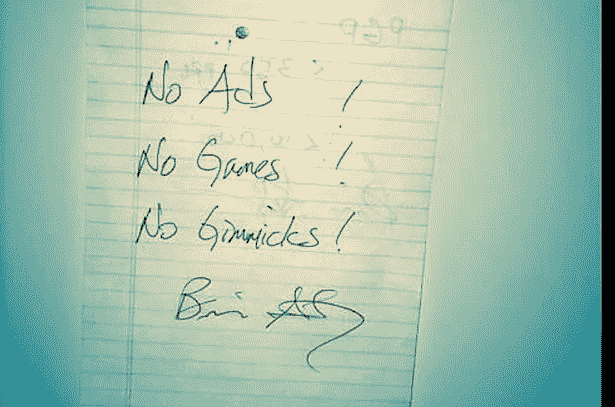

# Whatsapp 商业 API:聊天市场的颠覆者？

> 原文：<https://medium.com/hackernoon/whatsapp-business-api-a-chat-market-disruptor-250476574fed>

是聊天[营销](https://hackernoon.com/tagged/marketing)的新时代吗？

聊天营销现在很流行。那么， [WhatsApp](https://hackernoon.com/tagged/whatsapp) 是这个市场的新成员吗？

不，一点也不。事实上，新的 [API](https://hackernoon.com/tagged/api) 承诺为用户群和用户体验做出贡献。

whatapp 试图进入市场的方式略有不同——无论是在用户互动、反馈还是用户查询方面。whatsapp 什么都有。我认为对于最终用户和企业来说，处理起来都会容易得多。

对于超过 15 亿人来说，WhatsApp 是首选的消息应用。他们用它来保持个人生活中的联系，每天发送超过 600 亿条消息。

去年 9 月，WhatsApp 为选定的合作伙伴推出了最新的业务功能。经过近一年的测试，他们发表了一篇博客文章，宣布将这一功能扩展到更多的供应商。

[阅读此处](https://blog.whatsapp.com/10000648/Growing-our-Tools-for-Business)

一个事实是不可否认的，当谈到一个消息应用程序时，只有一个真正的国王。**那是 WhatsApp** ！拥有多达 180 个国家和大约 40%的市场份额，它无疑是真正的火炬手。

Whatsapp 之所以能够以如此巨大的速度增长，是因为几个重要而理想的组成部分:没有广告和更好的用户体验。换句话说，关注他们服务的实用性、简单性和质量。像 WhatsApp 这样的应用不断让我们相信，在获取用户方面，你所关心的只是你的产品。

如果不是因为它们简单优雅的用户界面，这样的增量数字是不可能实现的。Whatsapp 的整个旅程都专注于忠于他们最初的目标:“只是简单地让人们互相发短信。”

他们试图解决的问题是:当你有一个无限制的数据计划时，为什么发送或接收短信要花钱？实际上，短信是数据。它是几百字节的数据。如果公司告诉他们的客户，即使他们有无限的数据计划，他们也需要为属于数据范围的东西付费，这难道不是错误的吗？这说不通。WhatsApp 成为短信的替代品，提供了一个明智的选择。

然而，他们成功的主要原因是时机。Whatsapp 是在应用商店刚刚获得吸引力时推出的。随着移动应用的普及，WhatsApp 采取了行动。他们不仅仅是把他们的应用放到应用商店里……他们确保 WhatsApp 总是可见的。在为 Y-Combinator 创业学校做讲座时，乔恩·库姆分享了他们过去是如何在应用程序中做一些小的改动，并将其再次推入应用商店的。因为，在那个时候，应用商店里只有很少的应用，WhatsApp 总是排在“最新应用”的首位。

显然，时机对任何初创公司的成功都起着重要作用。比尔·格罗斯在他的 Ted 演讲中对此做了更广泛的解释

Whatsapp 在接下来的几年里实现了几个伟大的里程碑，2014 年初，脸书准备以 190 亿美元的巨额价格购买最受欢迎的信息平台。考虑到 WhatsApp 当时几乎没有盈利，这真是令人震惊。分析师预测，这笔交易将是一场灾难，但事实并非如此。在剑桥分析论战后不久，简·库姆决定退出 facebook，留下了一大笔钱。

[Whatsapp founder writing three things he never wanted in his app](https://media.licdn.com/media-proxy/ext?w=800&h=800&hash=3HHFUJecu24Xgsimtwbxbea5OUc%3D&ora=1%2CaFBCTXdkRmpGL2lvQUFBPQ%2CxAVta5g-0R6nlh8Tw1It6a2FowGz60oISIfYC2G8G2f1spyfNT-tdoDSf7OksgUbfCwGhlI_IfnwEXO5H4a-Xc2vK6F30YLnVtG7SlcHZAUe0F9K-IQ1Ng0ij73jVs-2bzxPj70dPwy8FZvKU2o7ARc67culf4vOGGg3-2a9CIrCAe1zSrY398wK8QhFq9XzLNMm7Ys_nn1anHzrse_PHBw4wZOZP2iOSnQ_GDbRba5Ah5e_wjeMmlXmwhrbt76xPYubNZU48kGvwLTSWiCNhUBflGJD9BAPnuAgFniHrQ)

你一定想知道我为什么要告诉你这些？为什么我不能跳过前戏，直接讨论新 WhatsApp 商业 API 的所有可能性呢？好吧，为了理解这个新工具的意义，你需要的是拥抱它的旅程，理解 WhatsApp 的核心原则，了解导致这个新 API 的事件。

虽然 WhatsApp 的创始人有一个相当简单的想法，即不收集用户数据，让用户数据驻留在服务器上，但母公司有其他计划。脸书明白，说到底，该应用仍是一项业务。

Whatsapp 通过免除用户订阅费来维持自己的运营。到目前为止，我们都很想知道 Whatsapp 的盈利计划。

尽管 WhatsApp 从未打算成为小型企业的公用事业，但他们已经利用它开展业务活动。想想像印度这样一个在线人口超过 4.6 亿的国家。这无疑是 WhatsApp 最大的客户群。仅在印度，就有许多小企业通过非官方的方式利用 WhatsApp 联系他们的客户。通过广播和一杯咖啡可以发生很多事情，不是吗？

因此，在 2017 年，Whatsapp 开始尝试新的工具来帮助人们和企业相互交流。这一功能很少为他们的合作伙伴推出。在收到反馈后，他们决定随着时间的推移，进一步引进更多的业务。

**这有什么关系？**

当你查看手机时，70%的屏幕时间可能会用来给朋友发短信。家人或同事。我们确实生活在信息时代。比起其他任何交流方式，千禧一代更喜欢发短信。发短信比打电话或发电子邮件更快更容易。

## Whatsapp 业务是否类似于 Facebook Messenger 聊天机器人？

不要！Whatsapp 的业务并不像 messenger 聊天机器人那样运作。Messenger 采取了不同的方法——寻求创建营销活动、机器人、自动化和各种其他用例。Messenger 为开发人员创建机器人提供了灵活性。

而 Whatsapp 正试图对其“用例”进行选择。任何不符合客户与企业沟通理念的东西都将被拒绝。

**快速提示——Whatsapp 商务应用的用户数量是传统应用的两倍。**

# WhatsApp 业务用例

WhatsApp 使用其业务 API 的想法可以通过以下三个用例来解释:

用他们自己的话说:

**请求有用的信息**:当你需要托运确认或登机牌时，你可以在商家的网站、应用程序或商店上提供你的手机号码，以便在 WhatsApp 上向你发送信息。

**开始一段对话**:你可能会在网站或脸书广告上看到一个点击聊天按钮来快速发送一个商业信息。

**帮助支持**:一些企业可能会在 WhatsApp 上提供实时支持，以回答有关其产品的问题或帮助您解决问题。

不确定，聊天机器人是否对你的业务有用？

本课程完美地解释了各种业务用例的蓝图— [点击此处](https://skl.sh/2Cx4JUU)

# 使用 Whatsapp 业务的公司

*****Bookmyshow*** :预订电影时在 WhatsApp 上取票**

*****Makemytrip*** :预订旅行时在 WhatsApp 上获取机票**

# **我如何开始？**

**好消息！Whatsapp 已经正式公开发布其 API，这意味着品牌现在有机会像其他企业公司一样使用它。**

** [## API 参考— WhatsApp 商业 API —文档—面向开发者的脸书

### WhatsApp 业务 API 格式的这个例子使用了 contacts 节点:POST/v1/contacts { " blocking ":" wait "…

developers.facebook.com](https://developers.facebook.com/docs/whatsapp/api/reference) 

> 请注意，并非每个用户都可以使用业务功能。他们正逐步推出业务，并缓慢地开展业务。

为了开始使用他们的 API，你必须首先注册成为 WhatsApp 商业 API 客户端。在你的申请通过验证后，你就可以在 [WhatsApp](https://hackernoon.com/tagged/whatsapp) 上开发你的商业案例。

总的来说，Whatsapp 不希望公司利用他们的新平台，并谨慎地批准。

确保你是一个技术渊博的人，因为业务批准后要遵循的步骤需要良好的技术知识。

这些年来，你是否一直在等着利用 whatsapp 的力量来发展你的业务？一定要让我知道！我很容易接触到。

顺便说一句，我们的团队已经在为 whatsapp 开发聊天自动化构建器，当我们完成时，可以从我们这边获得免费邀请- [谷歌表单](https://docs.google.com/forms/d/e/1FAIpQLSc6slYM96u4lU0fRJ1wpp2CL-QANMzcoG6K7ET2SgV32boYZQ/viewform)

如果你想知道做一个 whatsapp 机器人要花多少钱，那么一定要看看这个链接

[**回答简单问题就知道聊天机器人多少钱**](https://bothook.com/cost)**