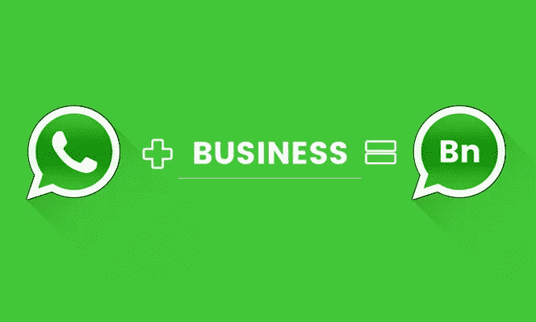

# WhatsApp 商业应用——为商业巨头提供动力的路线图

> 原文：<https://medium.com/hackernoon/whatsapp-business-app-a-road-map-for-powering-business-giants-4dbfc30b8418>

备受关注的“WhatsApp for business application”已经推出了独立的商业应用，以帮助企业与其潜在客户沟通。

虽然，免费的 WhatsApp 有助于 B2C 和全球基础客户的大规模运营。凭借其轻松的使用和直观性，当地中小企业已经适应了 WhatsApp，而无需该公司的任何推动。

2014 年 2 月，脸书以 190 亿美元收购了 WhatsApp，当时有超过 450 家公司使用“脸书办公”。由于***【WhatsApp for a business app】和*** 的受众和结果不同。最近，一项调查显示，Facebook Messenger 已经达到*13 亿全球用户*和 WhatsApp*12 亿用户*，他们的商业前景路线图是不同的。

就参考而言，荷兰皇家航空公司有一个经过验证的 WhatsApp 账户。它通过经过验证的 WhatsApp 商业账户向客户提供航班通知，涉及航班预订确认、办理登机手续、登机牌和航班状态通知等。,

WhatsApp 在其官方博客上提到，

> ***“我们希望将我们所学的帮助人们相互联系的知识应用到帮助人们联系对他们来说重要的业务上”***

从这些话来看，目前 WhatsApp for business 功能可能主要是为了客户支持和客户沟通而启动的，但 WhatsApp business communication**平台有潜力开发用于内部业务沟通。**

**在最近的采访中，这个词由马特·伊德马、 ***WhatsApp、*** 。**

> *****“目前，WhatsApp 不对其企业消费者收费，但未来可能会推出订阅收费”*****

1.  **如果发生这种情况，WhatsApp 商业平台会收取多少费用？**
2.  **有没有类似 WhatsApp 的替代商务聊天解决方案？**

**如果是，企业聊天应用解决方案如何帮助拥有大量全球基础客户(B2B 服务)的大型运营公司保护数据安全和数据隐私？**

**接下来是 [**Contus Fly**](http://www.contus.com/messaging-solutions.php?utm_source=whatsapp-for-business&utm_medium=CTA&utm_campaign=Hackernoon) ，这是一个面向企业的实时聊天应用解决方案，增强了 WhatsApp 等[技术栈的征服品质&，使技术最适合 B2B 业务。](https://blog.contus.com/how-whatsapp-works-technically-and-how-to-build-an-app-similar-to-it/)**