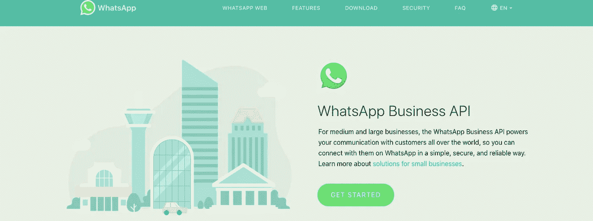

# WhatsApp 已经发布了它的商业应用编程接口……现在呢？

> 原文：<https://medium.com/hackernoon/whatsapp-has-launched-its-business-apis-now-what-8eadc05f9c11>

## 对于电信公司来说，围绕 Google RCS 的策略变得更加不可能

本周 [WhatsApp 终于公布了其商业 API](https://www.whatsapp.com/business/api) 。这并不令人惊讶，至少从两年前开始,[就预计到 WhatsApp 会朝着这个方向发展。但是，正如我之前讨论过的，这个](/@jorge.serna/whatsapp-for-a2p-messaging-39c5a4d7bb8d)[在电信公司试图通过 RCS 倡议](https://hackernoon.com/google-rcs-is-not-trying-to-fight-whatsapp-a35ced0d1871)进入的空间中获得了 WhatsApp。正如我当时所说:

> **谷歌可能不指望与 WhatsApp 在 RCS 上一战，但在这个市场上**他们将不得不与 [**WhatsApp 争夺业务**](https://www.whatsapp.com/business/) **。**

当消息传出时，有人(再次)问我，“*那么*，*电信公司应该对 RCS 做些什么？*”。我认为我过去对此很清楚，但我将通过我看到的两个选项来使它变得更清楚:

1.  什么也不做
2.  尽可能少做

# 什么也不做

电信公司的个人通信空间已经消失了一段时间，在这个阶段，像 RCS 这样试图赶上当前客户通信期望的计划几乎没有机会，所以最好不要在这方面浪费更多的精力。

最近的发展强化了这一点，比如 [Telefonica 将他们的 OpenTok 平台](https://www.zdnet.com/article/vonage-buys-webrtc-player-tokbox-for-35-million/)出售给 Vonage(这是我非常喜欢的东西)，或者[英国的数据显示，主要的电信个人通信服务——纯移动语音的使用在 2016 年达到峰值](https://www.ofcom.org.uk/research-and-data/multi-sector-research/cmr/cmr-2018/interactive)。

不仅传统的电信通信正在被取代，而且行业中使用的传统工具集(标准化、复杂的互操作性、通过合作伙伴部署)也是阻碍以客户如今要求的方式发展产品的障碍。

与此同时，像 WhatsApp 这样的公司已经在客户领域建立了强大的立足点。WhatsApp 拥有超过 15 亿用户，他们将开始利用这些用户赚钱。

大约一年前，我探索了 WhatsApp 战略中需要改进的三个方面:他们需要多设备支持来解决智能手机解体的问题，他们需要在实时通信中改进提议，以及通过商业通信实现盈利。他们现在已经实现了其中的两个，通过他们的业务 API 支持和[群组语音和视频通信](https://www.theverge.com/2018/7/30/17632650/whatsapp-group-video-calling-feature-now-live)。(我不太喜欢最后一种体验，但也许这也是一种精益方法，可以在创建正确的解决方案之前扩展其多流支持:

).

# 尽可能少做

那么，如果最终谷歌对 RCS 的支持使其获得了某种相对的成功，那又会怎样呢？如果一些企业会投资于一些 Android 设备和一些运营商的用户，而不是追求 WhatsApp 带来的几乎全面的覆盖，会怎么样？好吧，也许用低曝光率和最小的投资来支持它并不疯狂。但这里的关键是最小的投资。

如果一家电信公司想要推出 RCS 支持，他们应该使用完整的[谷歌](https://hackernoon.com/tagged/google)云解决方案。不要尝试使用本地 IMS 基础架构，因为:

1.  即使已经有了 IMS 基础设施，支持它、发展它并使它跟上新功能的步伐，最终也将比这一赌注所应得的成本更加昂贵。
2.  保留本地基础设施来应对全球产品的竞争和发展，这与三年前谷歌作为新参与者引入 RCS 的所谓优势背道而驰。

# 放手很难

但即使这样(放手)对一些电信技术部门来说也是复杂的。投资在 IMS 基础设施上的数百万本应支持 RCS，如今基本上用于 VoLTE 服务(那些正在下降的语音分钟数)以及其他方面，推动了这种思维模式。感觉是，为了证明这些过去的投资是合理的，应该利用这种“资产”(现有的 IMS 基础设施)。但是，在现实中，使用这一资产将成为假设的 RCS 成功的另一个障碍，因为它将进一步减缓其发展。

有些人会谈到由于共享控制层，协调语音服务和 RCS 消息传递的机会，或者谈到未来的服务，如承诺的 ViLTE(LTE 视频)。**但事实是这不是未来，WhatsApp 很久以前就推出了这个(至少对市场感知来说是很久以前)，而** [**ViLTE 已经死了一段时间**](https://hackernoon.com/google-duo-puts-the-last-nail-in-viltes-coffin-9a748b7d1bf5) **。**