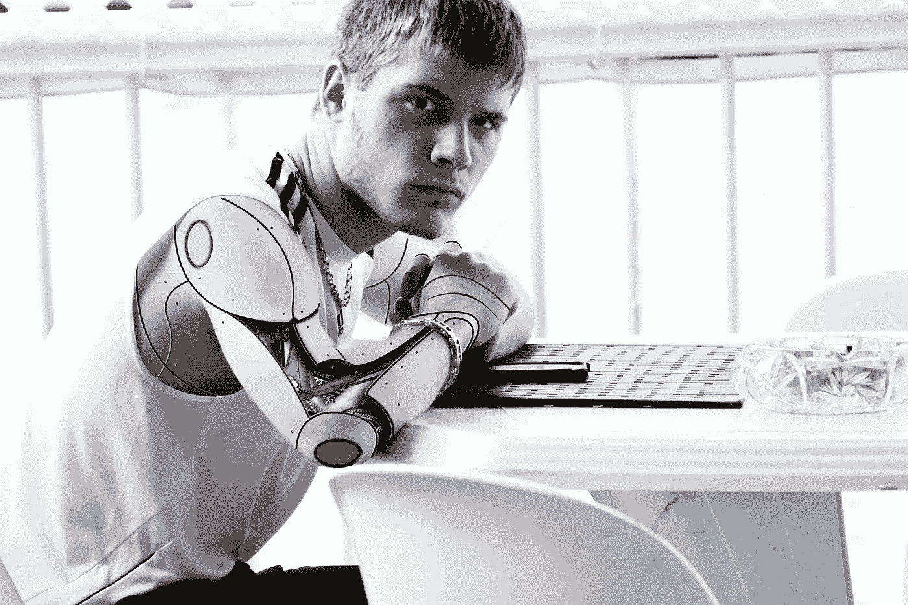

# 当区块链技术遇到机器人顾问

> 原文：<https://medium.com/hackernoon/when-blockchain-tech-meets-robo-advisors-a3a5ca5be403>

image source: [Pexels](https://www.pexels.com/)

自 2008 年全球金融危机以来，由于人工智能、机器学习和区块链等前沿技术的出现，金融业经历了重大破坏。在投资领域，人工智能及其机器学习子集给了我们机器人顾问，而区块链技术是所有加密货币的母亲。

机器人顾问是超级计算机算法，其做出选股等金融决策的能力比任何人都强一百万倍。另一方面，加密货币是一种数字货币，可以在没有中介的情况下透明地用于点对点交易，并可以作为商品进行交易以获取利润。

## 加密货币和机器人顾问之间的相似性。

首先，区块链科技和机器人顾问在 2008 年金融危机后都获得了发展势头。根据 CFP CFA sido Xia 资本管理公司创始人 Wade Slome 的说法，2008 年的金融危机对即将退休的婴儿潮一代造成了沉重打击，使他们对财务顾问失去信心，并开始寻找替代方案。

由于大多数人类财务顾问在基金管理中收取高达 3.0%的佣金，在激励机制中收取 20%的佣金，而且一些最好的机器人顾问收取的咨询费低至 0.00%，投资者不必看得太远。从那时起，机器人顾问工具已经成为财务顾问最重要的工具，机器人顾问的增长已经变得稳定。

就像机器人顾问一样，比特币——第一种加密货币——是在 2009 年由一个名叫中本聪的不知名的人引入的。创始人发表了一篇名为“*比特币:点对点电子现金系统*”的[论文](https://bitcoin.org/bitcoin.pdf)，详细描述了世界金融系统如何去中心化，以消除银行、中央银行和政府等金融中介。中本聪的想法出现在一个动荡的时代，当时人们因为中央集权机构在金融危机中扮演的角色而对其失去了信心。

正如我们所看到的，机器人顾问的想法和加密货币的想法都是由迫切的需求促成的，这解释了为什么它们从那时起一直处于上升趋势。虽然这两家公司仍在不断完善，以适应主流社会，但它们已经走过了漫长的道路，并有着非常光明的未来。

## 将加密货币和机器人顾问结合在一起的解决方案

在最基本的形式中，机器人顾问的权力可以应用于交易加密货币，就像它应用于交易股票一样。选股等投资决策需要对海量数据进行全面快速的分析，以获得交易洞察力。机器人顾问将人工智能和机器学习应用于分析和交易执行。

加密货币交易员可以利用人工智能和机器学习来审查推动加密货币价值的市场数据，并根据从这些数据中得出的见解执行交易。鉴于加密市场主要依赖于投机而非基本基本面，人工智能驱动的算法可以扫描市场以寻找可交易的新闻并执行交易，这可能非常有帮助。

基于以太坊的区块链平台正在致力于一个项目，该项目将使密码交易员有可能在交易中利用人工智能和机器学习的力量。有了 Signals 平台，交易者将只需要选择交易策略，并将大数据分析和决策留给高度精确的计算机算法。

[Robo Advisor Coin](https://roboadvisorcoin.com/) 是人工智能驱动的区块链平台的另一个例子。它于 2014 年首次发布，目前处于最新的开发阶段。一旦发布，它将能够应用人工智能和机器学习来进行加密市场预测，并利用区块链技术来验证这些预测的完整性、准确性和真实性。Robo Advisor Coin 算法已经根据历史数据进行了测试，并证明具有出色的跟踪记录。

[人工智能驱动的对冲基金 numeri](https://numer.ai/)也在利用加密货币奖励为其算法开发做出贡献的数据科学家。数字模型包括与开发者共享加密数据，使他们能够建立能够进行更好交易的模型，并反过来获得平台令牌的回报。

随着机器人技术和区块链的不断发展，很有可能会出现更多结合这两种技术的创新解决方案。当然，考虑到这两种技术的发展速度，它们的结合所带来的重大破坏离我们不远了。因此，可以说这是创新者和投资者利用先发优势的机会。