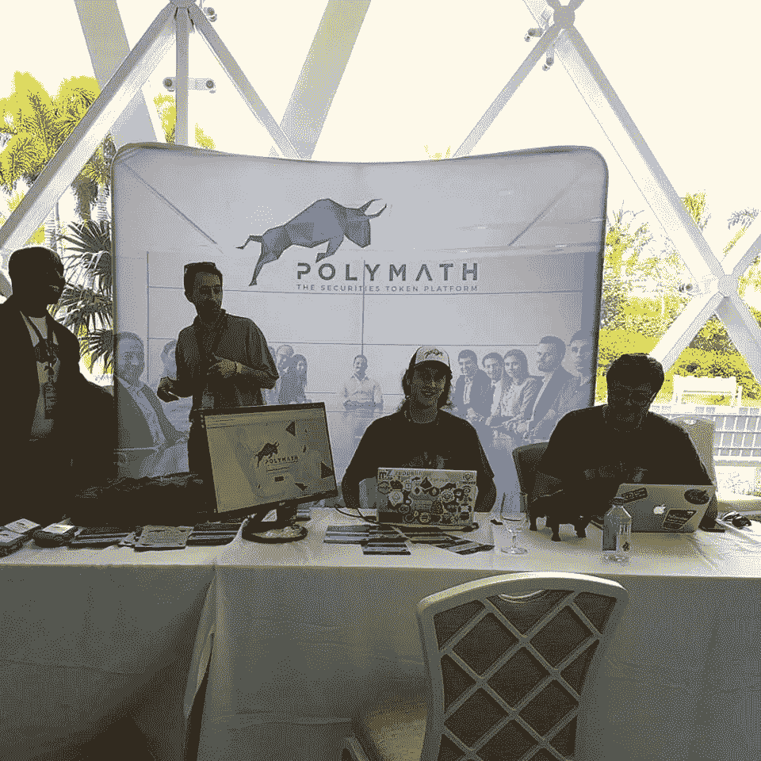

# 我什么时候可以开始提供我的安全令牌？博学的人可能有答案。

> 原文：<https://medium.com/hackernoon/when-can-i-start-offering-my-security-token-polymath-might-have-the-answer-fd7a407e3c75>

1.  由于缺乏关于安全令牌的明确规定，许多公司推出了实用令牌。然而，相对大量的这些令牌没有任何意义，充其量他们的效用函数非常弱。
2.  **公用令牌比安全令牌更容易推出，因为它们不受监管。ICO 公司可以进行在线营销，并向非授权投资者和散户投资者提供代币。他们不必承担通常与法规遵从性相关的高额费用。**
3.  **但现在这一切都在改变。2018 年将是安全令牌年。**

上个月，我去巴哈马参加了一个由博学者举办的关于安全令牌 ST-20 的会议。

因为会议在巴哈马举行，所以决定去那里并不需要太多的说服。

最终，这次旅行证明是非常值得的，奖励很容易补偿我在去机场的路上的红灯罚单和我在拿骚出租车上丢失的冬季夹克。

我想我的潜意识并不认为我需要在一个夏天永远不会结束的地方处理一件不必要的负担，比如一件冬季夹克。

现在让我们言归正传，因为你可能对我的冬季夹克不感兴趣。

**Polycon18 Polymath Expo Booth**

我在会议上遇到的几乎每个人都问“这个 ST-20 安全令牌是什么？”以及“如何让最终在区块链安全合法地提供加密证券变得更加容易？”。

在大会之前，我有机会研究了可以在公共 GitHub 上找到的应用程序，并了解了它的机制。
[https://github.com/PolymathNetwork/polymath-core](https://github.com/PolymathNetwork/polymath-core)

目前，如果一家初创公司想要提供安全令牌，他们必须弄清楚如何在他们管辖范围内的现有法律框架内做到这一点，(主要是向合格的投资者提供令牌)，并通过大量的文书工作，更不用说法律和第三方费用了。此外，今天没有任何加密交易所会列出安全令牌，从而导致完全缺乏流动性。人们可能希望在纽约证券交易所或 TSX 交易所等交易所上市，但这与提供普通证券没有太大区别，然后你将与非加密领域的其他人一样经历同样的障碍。

那么，没有人会交易的代币价值是多少，或者提供代币需要大量时间和前期资本吗？

这位学者接受挑战，通过适当的区块链驱动平台以及与适当的技术合作伙伴和影响者的高级联盟和伙伴关系，促进安全令牌的发行。

Trevor Koverko moderates panel of crypto experts

Polymath 首席执行官 Trevor Koverko 无疑走在了正确的道路上，我必须充分肯定他的远见卓识，这种远见卓识如此辉煌、优雅、显而易见，以至于许多有经验的企业家都在摇头，而以前从未看到过这一点。

现在的问题是，如何说服证交会建立一个法律框架，最终监管区块链的证券销售，并从中获利？

Trevor 和他的团队提出的是一个平台，它将通过软件为运行 ICO T1 的所有相关方创建接口。不，这不仅仅是一个 ICO 午餐代币平台。

这是一个提供 4 类参与者的系统，并确保最终令牌在其被提供的管辖范围内是安全令牌。

你可以在这个[网址看到完整的演示。](https://demo.polymath.network/)

Polymath dashboard

**发行方**——提供代币的一方

**提供方**——提供 KYC 服务的一方

投资者是代币的购买者

**代表—** 能够提供法律服务的法律团队

要获得更多关于内在工作的细节，请访问他们的白皮书

[https://www . polymath . network/resources/white paper](https://www.polymath.network/resources/whitepaper)

现在，你可能会问，这种方法将如何帮助大众加速采用这种平台？

答案是**激励。**

这幅图中的每个人都将赚钱，可能只有投资者偶尔会赔钱，但这不是一个新的故事。

Polymath 概念的主要优势是现有 ICO 平台尚未完全自动化的两个类别。

这些是 **KYC 供应商**和**德尔盖特。**我想强调的是**代表**是这里的关键，因为我们已经有多个 KYC 提供商在提供 API，将他们与令牌提供系统连接起来。

没有人自动完成甚至关闭提供法律咨询的过程，也没有人创建任何司法管辖区的任何法律顾问都可以参与的机制。

现在，法律专业人士将能够以自动化的方式向代币发行者提供服务，并通过 POLY(博学者的母语)获得回报。 *(Btw。保利本身就是一个公用事业令牌)*此外，发行人将有一个以上的法律建议选项，他们将能够从那些在该领域最有名望和知识的人中进行选择。

因此，一旦发行人指定了提供代币的司法管辖区及其参数，法律专业人员就可以提供法律模板并指定其成本。

发行者可能得到多个模板报价，并选择他们认为最适合他们和/或最具成本效益的一个。

如果你仍然不明白这将如何加速大规模采用和加速法律框架创建，让我来帮助你明白这一点。

Polycon18 sponsor banners

**代表**(法律专业人士)是理解在他们执业的司法管辖区发行安全令牌的法律含义的人。

他们现在将突然有机会向被新平台吸引的大量发行商提供服务。他们创建的模板将适用于多个发行商，并且每当有人接受他们的服务时，他们将获得收入。

顺便说一句，几个相同的法律专业人士也经常参与咨询建议，改变他们居住的司法管辖区的法律。

因此，同样的人现在将参与向令牌发行者和立法者提供服务。引导立法者尽快接受新技术符合他们的利益，因为这将对他们有利。

如果平台和技术准备好了，大玩家相信一切就绪，立法者就会跟进。

**简而言之，如果你建造了它，他们就会来。**

这很像矿工被吸引来提供他们的计算机能力来维持区块链共识，所有 4 方将有动力成为这个系统的一部分，并且每一方将养活另一方。任何坏苹果都会很快被发现和避免。

令牌本身只能在通过 KYC 和法律框架发现自己在 ST-20 安全令牌智能合约白名单中的各方之间交易。

Trevor Koverko Polycon18

**以下是发行和提供安全令牌 ST-20 的典型步骤。**

1.  发行者定义其令牌的参数。
2.  代表提出法律框架。
3.  发行人选择法律模板。
4.  KYC 提供商根据 2)中的法律框架制定技术接口和智能合同，并将其提供给发行方。
5.  发行人发行代币。
6.  投资者浏览产品并决定投资该产品。
7.  在购买代币的过程中，投资者需要填写 KYC 问卷。
8.  KYC 提供商将投资者列入白名单或拒绝将其列入白名单。
9.  如果投资者被列入白名单，他/她可以购买代币，并与其他列入白名单的投资者进行交易。

2 月 6 日，美国两大金融监管机构——美国证券交易委员会(SEC)和商品期货交易委员会(CFTC)——举行了一场关于虚拟货币的专门听证会，这证明了法律界关于安全令牌的讨论正在升温。

CFTC 主席 J. Christopher Giancarlo 在为听证会准备的证词中说:

> 我们正在世界金融市场进入一个新的数字时代。正如我们看到的互联网的发展，我们不能把技术精灵放回瓶子里。虚拟货币标志着我们如何看待支付、传统金融流程和参与经济活动的范式转变。忽视这些发展不会让它们消失，也不是负责任的监管回应。

因此，请为今年上市的加密证券做好准备。