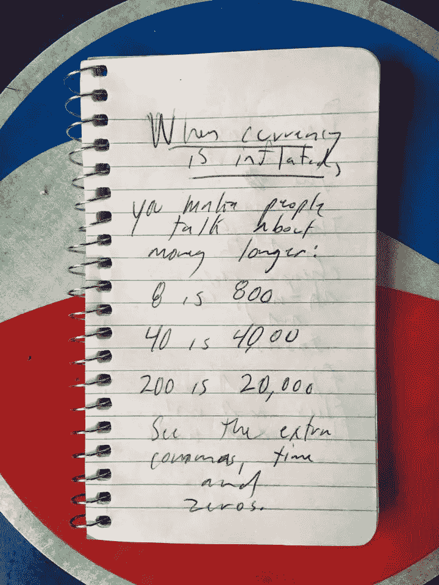

# 当货币膨胀时，

> 原文：<https://medium.com/hackernoon/when-currency-is-inflated-995f1ea7494d>

Written April 2015 in Yerevan’s Vernissage Market.

## 你创造了人

## 讨论

## 钱更长:

## 八是八百

## 40 是 4000

## 200 是 2 万

## 看到多余的了吗

## 逗号，时间

## 和

## 零。