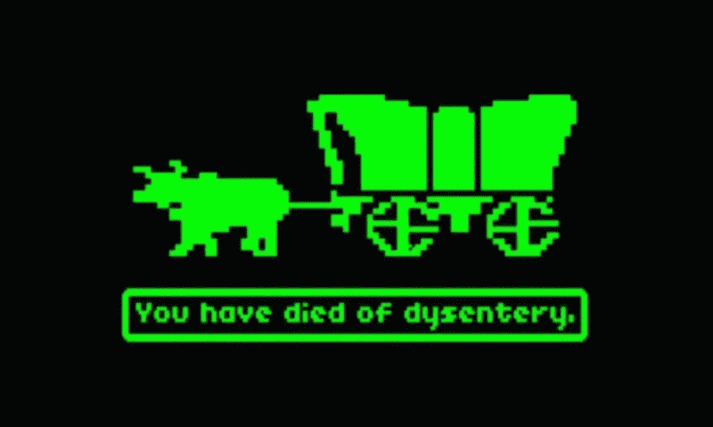

# 你是什么时候开始接触电脑和互联网的？

> 原文：<https://medium.com/hackernoon/when-did-you-start-getting-into-computers-and-the-internet-159cab7660ff>

via [Where There’s Smooke There’s Fire: Interview With David Smooke Founder of Hacker Noon](https://hackernoon.com/where-theres-smooke-there-s-fire-interview-with-david-smooke-founder-of-hacker-noon-ed253e5b3594) by [Pirate Beachbum](https://medium.com/u/d74255c272?source=post_page-----159cab7660ff--------------------------------) on [Hacker Noon](http://hackernoon.com):

> “计算机实验室里的俄勒冈小径是我早期的计算机记忆之一。当第一台电脑搬进我家时，我并不认为这有什么了不起。软盘，咩。突破不是计算机；突破是 T2 互联网 T3。ICQ 是中学社交生活的游戏改变者。即时文本交互的引入。聊了起来。离开消息。将文字的力量搬上银幕。即时消息为“澄清”1:1 通信和 1:公共通信之间的区别奠定了基础。
> 
> 我记得参加了一个“天才”项目，我们在放学后用假钱挑选股票。大概 13 或 14 岁。那是我第一次听说网飞的地方，那时我还不知道它是什么。Matthew Satzer 在网飞身上投入了太多，统治了整个团队。他赚了那么多假钱。尊重。”——[大卫·斯穆克。](http://davidsmooke.net)

# 你是什么时候开始接触电脑和互联网的？