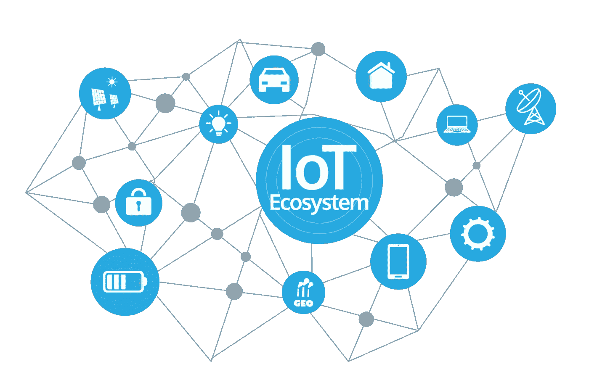
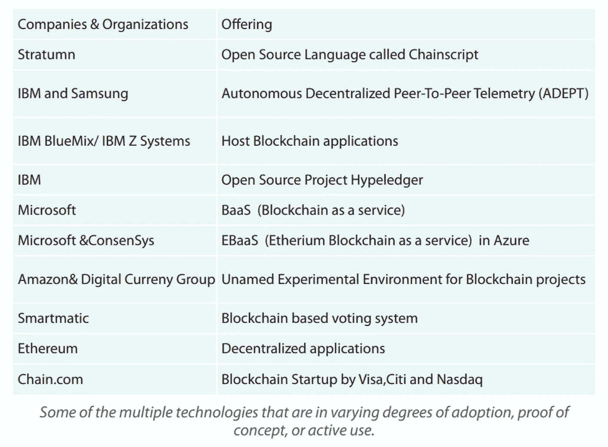
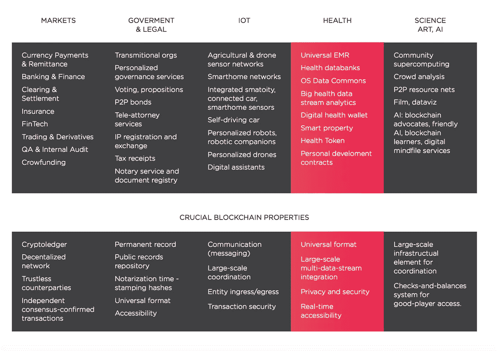

# 当物联网遇上❤️区块链

> 原文：<https://medium.com/hackernoon/when-iot-meets-blockchain-%EF%B8%8F-892fecdaf00c>

物联网(IoT)正在创造新的机会，并为当前和新市场中的企业提供竞争优势。物联网就是通过互联网生成和分析数据**。因此，必须考虑在数据的整个生命周期中保护数据。在所有复杂的级别管理信息变得势在必行，因为数据将跨越许多具有不同策略和意图的管理边界。**

Source: [https://www.sensorsexpo.com/iot-ecosystem](https://www.sensorsexpo.com/iot-ecosystem)

## 当今物联网架构:集中式

它依赖于集中的、代理的通信模型(也称为客户机-服务器模式)。所有设备都通过具有巨大处理和存储能力的云服务器进行识别、认证和连接。设备之间的连接只通过互联网进行，即使它们相距几英尺。此外，机器对机器(M2M)通信很困难，因为没有连接所有设备的单一平台，无法保证不同制造商提供的云服务可以互操作和兼容。

集中式架构给物联网安全部署带来了挑战。处理现有的和预计的海量数据令人望而生畏。管理连接到看似无限的设备列表的不可避免的复杂性是复杂的。由于面临诸多挑战，将海量数据转化为有价值的行动似乎是不可能的。现有的安全技术将在减轻物联网风险方面发挥作用，但这还不够。目标是在正确的时间以正确的格式将数据安全地送到正确的位置；说起来容易做起来难，原因有很多。

当今企业中常见的集中式安全模式将难以扩展以满足物联网(IoT)的需求。

## 也许我们可以分散物联网网络？

采用标准化的点对点通信模式来处理设备之间的数千亿次交易，将显著降低安装和维护大型集中式数据中心的相关成本，并将在构成物联网网络的数十亿台设备之间分配计算和存储需求。这将防止网络中任何单个节点的故障导致整个网络停止崩溃。

**区块链的两种主要类型——**

*   在一个**公共** [**区块链**](https://hackernoon.com/tagged/blockchain) 中，每个人都可以读取或写入数据。一些公共区块链只允许阅读或写作。[例如，比特币](https://hackernoon.com/tagged/bitcoin)使用一种任何人都可以写的方法。
*   在一个**私人** **区块链**中，所有的参与者都是被认识和信任的。当区块链在属于同一法人母公司的公司之间使用时，这很有用。

## 区块链和物联网

区块链技术可以用于跟踪数十亿台联网设备，实现设备之间的交易处理和协调；为物联网行业制造商节省大量成本。这种去中心化的方法将消除单点故障，为设备运行创造一个更具弹性的生态系统。区块链使用的加密算法将使消费者数据更加隐私。

该分类帐是防篡改的，不能被恶意行为者操纵，因为它不存在于任何单个位置，并且中间人攻击不能上演，因为没有单个通信线程可以被拦截。区块链使无信任的点对点消息传递成为可能，并已通过比特币等加密货币证明了其在金融服务领域的价值，提供有保障的点对点支付服务，而无需第三方经纪人。

区块链的分散、自主和无信任能力使其成为物联网解决方案基本要素的理想组件。企业物联网技术迅速成为区块链技术的早期采用者之一，这并不奇怪。

在物联网网络中，区块链可以保持智能设备历史的不变记录。此功能支持智能设备的自主运行，无需集中授权。因此，区块链打开了一系列物联网场景的大门，如果没有它，这些场景将非常困难，甚至不可能实现。

通过利用区块链，物联网解决方案可以在物联网网络中的设备之间实现安全、无信任的消息传递。在这个模型中，区块链将把设备之间的消息交换视为类似于比特币网络中的金融交易。为了实现消息交换，设备将利用智能合同，然后对双方之间的协议进行建模。

区块链最令人兴奋的功能之一是能够维护网络中发生的所有交易的适当分散、可信的分类账。这种能力对于实现工业物联网应用的许多合规性和监管要求至关重要，而无需依赖集中式模型。

**Source:** [**https://www.tcs.com/content/dam/tcs/pdf/technologies/internet-of-things/abstract/Blockchain%20for%20the%20IoT.pdf**](https://www.tcs.com/content/dam/tcs/pdf/technologies/internet-of-things/abstract/Blockchain%20for%20the%20IoT.pdf)

## 供应链用例

随着物联网持续快速增长，传感器和设备正成为更常见的通信场所。

在需要共享位置、温度、振动、湿度等数据的商业网络中，经许可的区块链分类账可以帮助创建防篡改记录。这为自动化业务流程开辟了新的途径，无需建立成本高昂的集中式 IT 基础架构，而且所有参与者都可以访问相同的数据。

当数据通过许可的区块链共享时，供应链如何受益？

支持物联网的数据包在通过多个载体时传输所需的信息，如温度、湿度等。商业合同规定了从工厂到杂货店的运输过程中必须满足的条件，所有各方都必须遵守合同条款。

**结果:顾客对购物车中的食物感到满意和安心。**

## 微支付用例

想象一下，你的冰箱会告诉你还剩多少牛奶，如果你的牛奶不够了，你的冰箱会自动把它添加到你的购物清单上。

要不这样吧！

当你的车出故障时，它会自动预约机械师。

所有这些都有可能通过**智能合约**实现。这个可以用以太坊做平台。某种程度上，以太坊正在改写物联网架构。

## 健康领域的物联网和区块链

**Source:** [**https://lympo.io/wp-content/uploads/2017/12/whitepaper.pdf?v5**](https://lympo.io/wp-content/uploads/2017/12/whitepaper.pdf?v5)

在区块链上注册访问患者生成的数据的权限，用户可以控制谁可以在什么条件下访问他们的数据。这种能力使个人成为其宝贵数据资产的所有者。该数据集可以从源自各种数据源的信息中进行汇编；从医院、诊所和医生提供的电子病历，到移动健康应用和可穿戴设备生成的健身/健康数据。它还可以由疾病和治疗监控应用程序以及用户单独添加的定制信息来补充。

物联网中的区块链代表了自计算和交易处理系统集成以来最大的技术颠覆。由于设备创新和软件的重大进步，现在可以将交易处理和智能带到任何地方的设备。存在与分布式系统相关的关键适应性挑战，以及安全性、协调、知识产权管理、身份和隐私。许多机构和个人都在积极致力于这些问题，并为这项技术的普及建立一个开源的基础。

参考资料:

1.  [https://www . Forbes . com/sites/Dell technologies/2017/06/27/how-区块链-can-revolution-the-internet-of-things/# 637542 CD 6 eab](https://www.forbes.com/sites/delltechnologies/2017/06/27/how-blockchain-could-revolutionize-the-internet-of-things/#637542cd6eab)
2.  [https://lympo.io/wp-content/uploads/2017/12/summary.pdf?v2](https://lympo.io/wp-content/uploads/2017/12/summary.pdf?v2)

鳍。

Source: [https://steemit-production-imageproxy-upload.s3.amazonaws.com/DQmQyEc99217zhkPYECNxn43twDjD4DHLtaS94d5hVseed7](https://steemit-production-imageproxy-upload.s3.amazonaws.com/DQmQyEc99217zhkPYECNxn43twDjD4DHLtaS94d5hVseed7)