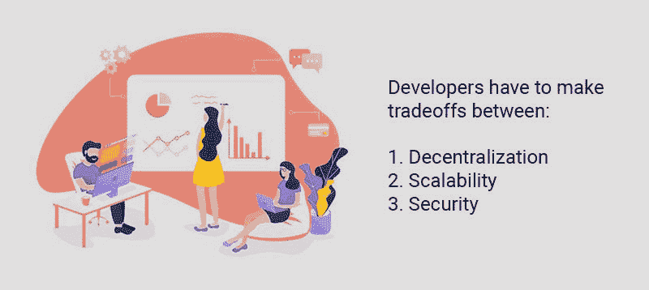

# 什么时候是时候打造自己的区块链了？

> 原文：<https://medium.com/hackernoon/when-is-it-time-to-build-your-own-blockchain-f3be0a30b826>

source: [freecodecamp.org](https://medium.freecodecamp.org/the-authoritative-guide-to-blockchain-development-855ab65b58bc)

分散式应用程序(DApps)真正开始在互联网上站稳脚跟。内置的信任、支付处理、预定义的合同条款和无中心故障点使区块链对许多应用程序开发人员来说是一个有吸引力的提议。

> 感谢[agency.howtotoken.com](http://agency.howtotoken.com/)对创建该主题的支持(第一个拥有成熟 ICO 承包商的平台)

发布 DApps 最流行的方式是在以太坊等成熟的区块链平台上。分布式社交网络、游戏和消息应用都在加入进来。问题是每个区块链都有技术权衡、瓶颈和约束。由于所用区块链的限制而无法运行的 DApp 会发生什么情况？比特币和以太坊区块链已经在努力满足这些应用的流量、交易和成本需求。

构建一个定制的区块链，或者派生一个现有的，可以解决这个问题。但是你必须确保做对。下面是应用程序可能需要自己的区块链的原因，拥有它的优势，以及已经在进行转换的 DApps 的例子。

# 使用区块链平台

现在，以太坊是区块链平台的黄金标准。[ico 募集的数十亿](https://hackernoon.com/2017-a-year-in-review-initial-coin-offerings-91ec1c7367a5)美元和[数百](https://www.stateofthedapps.com/)dapp 使得以太坊远远高于任何其他区块链/智能合约平台。

这是有充分理由的。通过使用以太坊区块链，您可以:

*   构建几乎任何类型应用程序的完整平台
*   一种成熟的本地加密货币(以太)
*   可以直接接入的全球网络
*   良好的分权水平
*   核心代码的定期更新和升级
*   文档和对有经验的开发人员的访问

其他区块链如 Stellar、NEO、Stratis 和 EOS 提供了类似的东西，但在技术和协议上有所不同。

# 平台瓶颈

区块链系统的工作是作为协议构建的，这意味着性能在很大程度上取决于技术决策和权衡。例如，与集中式应用程序相比，区块链应用程序的性能通常很差。目前还没有区块链可以运行脸书那么大的应用程序。这是因为速度是用*去中心化*换来的。脸书是一个完全中央集权的系统，他们完全控制一切。这意味着他们可以快速到达那里，但用户无法控制发生了什么[，因为我们都开始意识到](https://howtotoken.com/explained/why-social-media-users-will-love-decentralization/)。

分散系统允许一个用户网络就事情应该如何工作达成一致，并允许一种机制就哪些行为是有效的达成共识。这种机制计算量很大，并且显著降低了系统速度。但是对于一些应用来说，去掉中间人是值得的。

构建这些机制的确切方式决定了分散式平台的性能。通常，开发人员必须在以下两者之间做出权衡:

*   分散
*   可量测性
*   安全性

# 分散

区块链平台起飞的原因是因为它们的分散性质。我们已经有了像 visa 这样快速安全的全球支付网络。但它们是完全集中的，这意味着只有一个控制、审查和失败的点。

事实上，没有一个系统是完全分散的，但是区块链系统比旧的解决方案好得多。以太坊将去中心化作为其主要特征之一，尽管总有[争论它实际上有多去中心化](https://www.technologyreview.com/s/610018/bitcoin-and-ethereum-have-a-hidden-power-structure-and-its-just-been-revealed/)。某种程度的权力下放对任何区块链体系都至关重要，但实现这一点是有代价的。

# 可量测性

可扩展性是指网络在不降低性能的情况下容纳不断增长的用户数量的难易程度。绩效的主要衡量标准是:

*   确认时间
*   交易量
*   交易成本

*确认时间*是您的交易通过网络所需的时间。向朋友发送比特币平均需要 10 分钟。在以太网上，执行智能合约交易需要 10-20 秒。

*交易量*是网络上每秒钟可以发生的交易数量。比特币和以太坊每秒分别获得 7 到 20 笔交易。与 Visa 可以处理的每秒 65000 T2 相比，这是令人沮丧的。

*交易成本*是一个用户在区块链上做改变的成本。这可能变化很大，随着网络变得更加拥挤，每笔交易的成本可能会飙升。我们在 2017 年 12 月看到了这种情况，比特币交易成本飙升至 20 美元以上，当 Cryptokitties [的流行导致以太坊费用飙升](https://rados.io/cryptokitties-viral-blockchain-game-increased-fees/)。

# 安全性

网络的安全性是指它的加密算法对失败的鲁棒性。一般来说，协议越安全，执行交易所需的时间就越长。

# 权衡取舍

这种必须牺牲一个领域的性能来提高另一个领域的想法就是为什么永远不会有一个区块链的“银弹”平台可以完美地做所有事情。想要一个又快又便宜又安全的平台？那就不会很分散了。需要一个完全去中心化、安全性极高的平台？随着用户的增加，速度会越来越慢，成本也会越来越高。

事实上，区块链网络必须在这些因素之间做出妥协。例如:

*   比特币通过牺牲缓慢的阻塞时间来实现安全性
*   以太坊以可伸缩性为代价实现了去中心化
*   [Ripple](https://ripple.com/) 、 [EOS](https://eos.io/) 和 [NEO](https://neo.org/) 通过牺牲一些分散性来实现可扩展性

当然，这些都有待商榷。毕竟，很容易认为比特币和以太坊集中矿池是一种集权形式。技术突破可以带来多种类别的改进(例如[利害关系证明](https://en.wikipedia.org/wiki/Proof-of-stake)算法)，但通常每个协议都有妥协。

为您的分布式应用程序选择一个区块链平台意味着解决平台所采取的一系列去中心化、可伸缩性和安全性折衷。

# 你的要求不符合怎么办？

以太坊对于一些达普来说是一个很好的平台。但对其他人来说，它甚至还没开始就失败了。如果您的应用程序需要每秒执行 20 个以上的区块链事务，甚至以太坊网络的整个带宽都不够用。然后是交易成本。如果你正在创建一个社交网络，如果他们只需支付 1 美元来更新他们的状态，就很难获得新用户。

还有区块链替代品如[恒星](https://www.stellar.org/)、 [IOTA](https://www.iota.org/) 、[涟漪](https://ripple.com/)、 [EOS](https://eos.io/) 、 [NEM](https://nem.io/) 、 [NEO](https://neo.org/) 等等。但是它们都有各自的利弊。有些是集中式的，有些有特性限制，还有一些尚未证明它们的价值。没有成熟的区块链能满足你的 DApps 需求，原因有很多。

如果是这种情况，可能只有一个解决办法。

# 打造自己的区块链

创建自定义区块链具有极大的灵活性。您将获得:

*   共识算法的选择
*   您自己的安全性、可伸缩性和分散性的平衡，以满足您的需求
*   编程语言的选择
*   代码库的控制
*   随时随地更新的能力
*   终极灵活性

当然，这可能有点让人不知所措。但对区块链建筑商来说，好消息是，你甚至不必从头开始。

# 分叉已建立的区块链

区块链协议代码通常是开源的，这意味着你可以随心所欲地复制和使用它。这就是像[比特币现金](https://www.bitcoincash.org/)和[以太坊经典](https://ethereumclassic.github.io/)这样的替代链是如何产生的。一组开发人员决定改变区块链的代码库，开始使用和挖掘他们自己的项目版本。

当然，创建你自己的区块链也有权衡(如此多的权衡！).编码很难，建立用户网络更难。你的区块链协议可能编码了最分散、最安全的算法，但是如果你的网络上没有矿工，它就不是分散的或安全的。您还必须自己更新和维护代码。

# 构建自己的区块链的示例项目

有几个 DApp 项目已经在尝试建造自己的区块链。

# 你好

Howdoo 是一个分散的社交影响力平台，希望将社交媒体的控制权交还给人们。该平台旨在建立一个完整的社交生态系统，使其成为独一无二的。Howdoo 有一些独特的功能:

*   加密货币支付
*   用户可以控制他们的个人数据
*   用户可以控制他们看到的广告数量，并通过接收广告来赚钱
*   更多的广告收入流向内容创作者
*   基于社区的内容审核

但是运营一个社交网络对 IT 基础设施的要求非常高。潜在的数百万用户希望每天发出几十个请求，而且是免费的。这在以太坊是不可能的。你能想象付费更新你的脸书状态或上传视频吗？Howdoo 的平台将涵盖流媒体、消息、存储等。—他们还计划打造自己的钱包，可以管理多个加密硬币。

Howdoo 最初将在以太坊区块链上运行，但该团队打算构建自己的定制区块链来满足这些需求。

*   它自己的分散流
*   使用 IPFS 的分布式数据存储平台
*   它有自己的区块链和自己的 Howdoo token

目的是建立一个生态系统，合作伙伴可以推出自己的 DApps 并发行自己的令牌，从而利用其社交层。它将通过支持大规模和零费用的低延迟来解决以太坊的问题。该项目已经与 Drophead Games 签署了首个 DApp。

# 家族

Kin 是 Kik 的加密货币，Kik 是一款专注于隐私的社交通讯应用，深受年轻人和青少年的欢迎。自 2014 年以来，Kik 一直在通过他们的“Kik Points”实验来尝试数字货币。进展如此顺利，以至于现在他们正在构建自己的分散式加密货币，以便在移动应用内外使用。

该项目于 2017 年 9 月作为 ERC-20 以太坊令牌 ICO 开始(和大多数人一样)。它没有达到他们的目标，但仍然是一个巨大的成功，筹集了超过 5000 万美元。

Kik 积分实验的交易量约为[每天 300，000 笔交易](/kinfoundation/kik-points-key-learnings-from-a-centralized-economy-b99739cf5b69)；远远超过以太坊现在所能处理的。为了解决这个问题，Kin 的大部分跑腿工作最初是在区块链进行的。

现在 Kik 正在为他们的货币寻找一个更优雅的解决方案。首先，[恒星区块链与以太坊一起被集成](/kin-contributors/faq-what-adding-stellar-means-for-kin-336a5b7d58ab),这样两者可以协同工作，并帮助扩展 k in。然而，恒星区块链上的交易仍然有一个必须以恒星流明支付的小成本。为了将成本降低到零， [Kik 正在分叉恒星区块链](https://www.coindesk.com/chain-mobile-app-kik-fork-stellar-fee-free-blockchain/)运行他们自己的，几乎相同版本的代码。

[Kik 首席执行官 Ted Livingston](https://www.coindesk.com/chain-mobile-app-kik-fork-stellar-fee-free-blockchain/) 表示，这一变化将赋予他们更强的打击垃圾邮件的能力，以及提供免费交易的选择权。

# 结论

分散式应用程序越来越受欢迎。像以太坊这样的老牌区块链提供了一个完整的经过实战检验的平台来构建去中心化的应用。但是，虽然它们提供了大量现成的功能，并节省了编码和测试的大量时间和精力，但流行的区块链应用程序有自己的一套权衡，并不一定满足每个人的需求。

一些 DApps 的需求是任何现有平台都无法满足的。最明显的例子就是像 Kin 和 Howdoo 这样的社交应用。在这些情况下，构建一个定制的区块链或派生一个当前的可能是正确的方法。

## 关于作者:

基里尔·希洛夫——geek forge . io 和 Howtotoken.com 的创始人。采访全球 10，000 名顶尖专家，他们揭示了通往技术奇点的道路上最大的问题。加入我的**# 10k QA challenge:**[geek forge 公式](https://formula.geekforge.io/)。