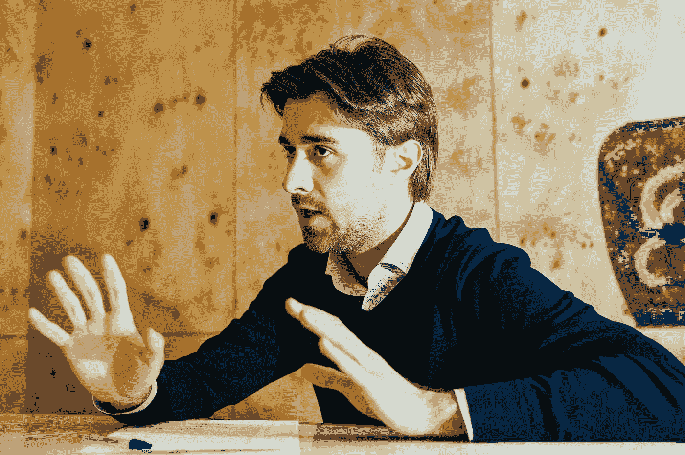
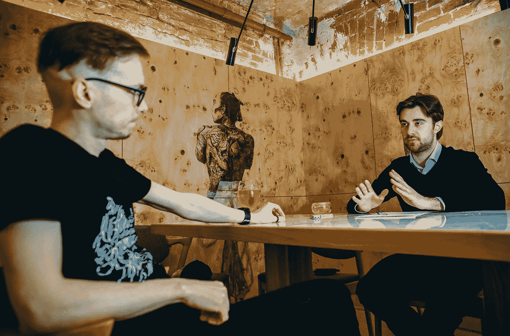

# “在炒作的时候，社区团队每班工作 16 个小时”——西蒙·谢尔盖耶夫

> 原文：<https://medium.com/hackernoon/when-it-was-hype-time-the-community-team-had-been-working-for-16-hours-per-shift-simon-sergeev-201061e3ad4e>

Simon Sergeev expressing his view on community building

与社区的持续合作对于 ICO 的成功至关重要。支持团队发挥着重要作用，充当初创企业发起人和潜在客户之间的桥梁，防止潜在投资者的资金外流，并吸引新的投资者。如何与社区建立有效的关系，西蒙·谢尔盖耶夫解释道，他是 Community Crypterium 的前负责人，他在 1 月份设法通过 ICO 筹集了 5160 万美元，超过了 10%的硬上限(即目标上限)。采访由 [FinPR](http://finpr.ru/) 博客的作者 Kirill Bezverhi 进行。

**在你进入这个行业之前，你一直从事数字营销。你认为经典营销和 ICO 营销有什么不同？**

事实上，相似之处多于不同之处。就销售而言，ICO 是由一件商品组成的网上商店，没有仓储和配送。该商店接受传统货币和前五种加密货币中至少一种的支付。

有两个主要区别:

1.大多数情况下，ICO 提供的产品尚不存在。

2.产品从几个国家采购，销售漏斗合适。

缺乏有形的产品和语言障碍导致了摩擦:更多的索赔管理，对团队更多的不信任。进一步说，你的时间很紧；没有 A/B 测试是可行的。你的观众根本不理解任何业内普遍接受的定义，更不用说你的项目了，由于这个原因，你必须每天用加密的术语来启发大众。

Simon Sergeev trying to find the right words for the answer

你是如何进入区块链这个行业的？

2017 年 9 月，我对当时的项目感到厌倦:那时，我已经在一家旅游公司担任数字营销主管一年半了。我找到了替代品，然后我来到 Crypterium ICO，接受了 Gleb Markov 的采访。

他们在寻找能成为他们支持团队一员的人。我建议他们不要再一个一个地找人，而是由我来承担整个工作范围。与 Gleb 一起，我们建立了一个由 5 名成员组成的团队。巅峰上，流量汹涌，牛逼炒作爆发的时候，我们 12 个人一起干。

我们全天候报道 Telegram 中的俄语和英语聊天、脸书、Twitter 等社交媒体、YouTube 上的评论、我们网站上的内部聊天以及脸书页面上的私人消息。顺便说一句，我们收到的大多数问题都来自英语电报和内部通话。

最重要的是，我们在一定程度上帮助了我们的公关团队。假设有一个想法应该被介绍给社区。公关部撰写和发表文章，我们在聊天中推广这些出版物。或者反过来，聊天中的人开始说文档/项目有出入。我们把这件事告诉了公关人员，他们通过张贴所需的材料结束了这个问题。

当你在聊天中未能缓和任何不愉快的讨论时，你做了什么？

如果我们屏蔽或禁止某人，人们会不高兴的。我们通过让他/她处于一种完全不适当的状态来努力中和任何这样的人，或者带他/她去和解。有趣的是，俄罗斯的聊天者一般都很安静。他们对这一点提出问题，实际上很轻松。对于所有说英语的人来说，有更多的恐惧和不足。

与社区一起工作有时就像成为一名心理学家，但同时与十几个活跃的客户一起工作。每天作文都在变，但有些会一直陪着你。实际上，这里有很多心理学的东西。例如，众所周知，在任何从众情况下——包括炒作条件——人们都会寻找一种行为来模仿。你可以让过程运行，或者向人们展示正确的行为和正确的事实处理。简单的话，好像不同账号的不同人说对了话。

Kirill Bezverhi questioning on how to develop community on Telegram

这种方法在 SMM 相当普遍。甚至 Reddit 也承认，在他们推出的时候，他们雇佣了一个由 50 名作家组成的团队来创作内容和维护适当的交流过程。

**你推广聊天的目的是什么？**

不断加热观众很重要。人们自己会相当谨慎，不愿意放弃他们的现金。但是，如果我们想突破硬帽，我们需要鲁莽，情绪紧张。因此，我们需要阴谋诡计。

我们在 Crypterium 故意将 ICO 分成许多阶段，并提供各种奖金。奖金从 30%开始，每个阶段都在下降。当用户访问网站时，他/她看到的是阶段结束前的剩余时间，而不是 ICO 结束前的天数。这是一个很大的区别，它的效果真的很酷。

在这个项目被生动讨论的网站上，应该有一些戏剧性的，紧张的气氛每小时都在升温。一般来说，这些都是电报聊天，不一定归公司所有。Ian Balina 的聊天和一些俄语聊天都有认真的听众。

**社区建设问题对一个 ICO 的成功有多重要？**

它必不可少，至关重要，没有炒作不行。没有炒作，没有筹款。如果底片没有处理好，会有很多退款。人们兑现他们最后的 1000 美元，随后，当情绪结束时，他们流下苦涩的眼泪，要求要回他们的钱。我们已经不止一次地阻止了该项目的大规模套现。市场惯例是，首先，人们会存入现金，只有在此之后，人们才能用现金购买代币。如果一个人还没有购买代币，ICO 项目将有义务根据要求退款，扣除汇款费。

曾经有一个人存了 46 K 美元，因为他在某处读到过一些东西，然后他写道，他不再喜欢这个项目，想拿回他的钱。你开始作为一名心理学家和他一起工作，你关注他，处理他的异议，他把钱留下。当然，如果这不是他最后的钱。

如果我们放弃这个社区，一些鲸鱼和基金将是唯一的代币持有者。这些都不是最好的投资者，因为你必须给他们更大的奖金，一旦 ICO 结束，就很难控制代币利率。

此外，有两种方式与社区合作:第一种，当你通过聊天和渠道处理群众时，另一种是主动工作。

Simon Sergeev explains the meaning of ‘proactive work’

你所说的“主动工作”是什么意思？

首先，大众主动工作，我已经告诉过你了——这是目标行为和适度沟通的示范。第二，个人主动工作，这意味着纯粹的直销。你必须将一个[区块链](https://hackernoon.com/tagged/blockchain)聊天的成员解析成一个 Excel 电子表格。写一份销售脚本，分发给团队成员，然后他们开始对员工进行 PM。如果团队成员知道他/她的社交方式，这个工具是非常有效的。在这种情况下，避免在第一条私人信息中给投资者提供链接——否则，你会立刻收到垃圾邮件。

我们有两个脚本——一个长一些，需要几天时间，一个短一些，需要更快的处理。剧本大概是这样的:“嗨！我在 XXX 聊天看到你了。我的名字是 YY。说说你自己吧，你都投到了哪里？”。然后，你询问他/她对几个 ico 的看法，其中一个是你的。这里，重点是避免任何“销售”压力。然后你一点一点地把对话引向你给出正确 ICO 链接的地方。

回答你的 PM 的人转化为销售的比率约为 10%。有一个故事讲的是一个人用这种方法在一个工作日内筹集了 4 万美元。

**告诉我你通常是如何建立社区的？**

我给营销团队定了一个业绩任务:要有 100 个人来参加我们的电报聊天。不是机器人！正常人。这是通过广告来实现的，尤其是在 YouTube 上。你找来 30 个视频博主，让他们每个人都参与进来。不一定是最大的。在这里，概述和采访项目创始人和开发人员是非常好的。在其他与密码相关的电报渠道购买广告也很有效。

再进一步，你招人。从客户那里拿一份白皮书、代币销售条款或者其他文件。把它们交给男生，在他们阅读的时候，你为他们准备一个测试和销售漏斗的常见问题。开发人员需要通过测试来发现弱点，覆盖这些弱点，并开始测试。

然后，您为团队成员编写工作指南。例如，在 1 分钟内你必须写这个和这个。10 分钟后，你要说这个和这个，以此类推。我一直遵循的规则是:聊天沉默了，就说点什么。这说起来容易，理解起来也容易，但做起来并不容易。特别是，这就是为什么我们需要指南。

更进一步。全天候支持。没有人想在周末或晚上工作，你必须设法做到这一点。从地理上来说，所有的地下墓室工作人员最初都在莫斯科；后来，我们在华沙、马其顿、印度和美国雇佣员工。

Simon Sergeev (left), Kirill Bezverhi (right)

当您无法管理请求流时，您是否经历过一次大的高峰？

是的，我们炒作的时候。交通高峰发生在新年假期。团队中的许多成员不想工作；我和我的伙伴，每班要工作 16 个小时。很明显，这样的工作时间表可能会导致一些失败，我们不能每次都快速回答。但是我们已经熬过来了。

**如果时光倒流，你会做些什么来建设这个社区？**

我会改变奖金制度。在大多数 ico 中，任何员工的工资都包括两部分:一个“菲亚特”和一个代币奖金。菲亚特是以卢布或美元计算的工资。一个普通支持者的工资约为 75，000 卢布，而一个社区负责人的工资是这个数字的两倍。就象征性奖金而言，它们必须是平衡的。

一定不能给太大的奖金。如果我能改变过去，我会向地下墓室的管理层保证，他们不应该在雇佣员工时直接向他们承诺工资的 300%作为奖励。因为许多人甚至不相信它。他们猜测这是一个骗局，因为他们以前从未赚过这么多钱。我会承诺他们工资的 100 %- 150%的奖金，我会把剩余的钱汇集成一个奖金基金，在关键时刻，比如新年、假期、周末、晚上，激励最优秀的团队成员。

但奖金不得低于工资的 100%，因为工人可能会认为他/她工资过低，并可能决定诈骗。我指的是有人向投资者发出类似“你想得到 50%的奖金吗？往这个钱包里寄钱”。非常悲哀的是，他们真的发了。不要虐待支持团队。我听说在一个 ICO 中，社区经理通过这种方式攫取了大约 100 万美元的 2M。

密码行业变化很快，你甚至不知道是变好还是变坏。作为一名 ICO 通信支持专家，您经历了哪些变化？

对我来说，专业要求越来越难了。半年前，我喜欢上了 Crypterium 的网站，我来到了 Gleb。Crypterium 被证明是一个成功的项目。现在，一方面，skeezy 项目学会了制作好网站和写有趣的论文。另一方面，市场对所谓的“非色情”项目的要求越来越严格。

Simon Sergeev on ‘index tokens’

尽管如此，毫无疑问，市场将会增长，将会出现更多的各种硬币和代币。公众的兴趣也将继续增长。这不像大数据:有很多噪音，它似乎被遗忘了。对于普通大众来说，情况变得具有挑战性:即使是现在，也很难在各种各样的代币和硬币中找到一种方法。但是，他们还是想试试。这是指数代币需求上升的原因之一。

**你说的‘指数代币’是什么意思？**

这就是，你买 1 个代币，一下子形成一个多元化的投资组合，由指数代币发行者的算法来管理。也就是说，不是徒劳地试图形成一个由 20 到 30 个可疑硬币和代币组成的加密投资组合，你只需购买 1 个代币，就可以获得一个由前 100 个项目组成的投资组合，由数学家/交易员管理，他们不断致力于算法的重新平衡和增强。

这是一种新的市场趋势，已经在将于 5 月推出的 [CryptoIndex](http://cryptoindex.ai) 令牌中实现。我们已经开始准备国际奥委会的支持团队，所以对我来说，在工作方面没有任何变化。在营销和公关方面，市场变化是意料之中的。

**您对 ICO 市场的发展有何预测？**

在最极端的监管情况下，ico 根本不需要支持服务。一切都将被简化为与“持牌投资者”的大规模谈判，不管这意味着什么。这样会更像是直接卖给几个人；然而，对于所有者来说，有更多的投资者总是更有利的。如果我错了，请在评论中纠正我。

*接受采访的是《T1》*的作者基里尔·贝兹韦尔希**