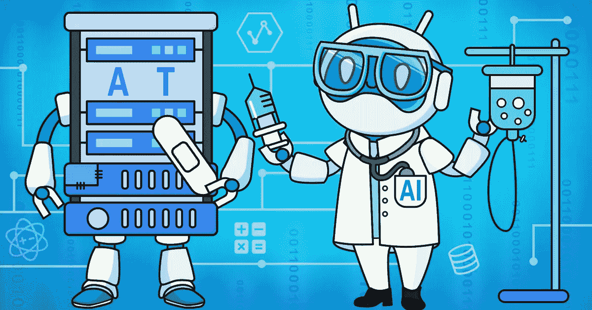
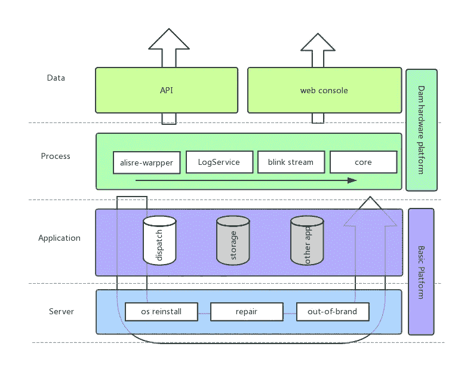
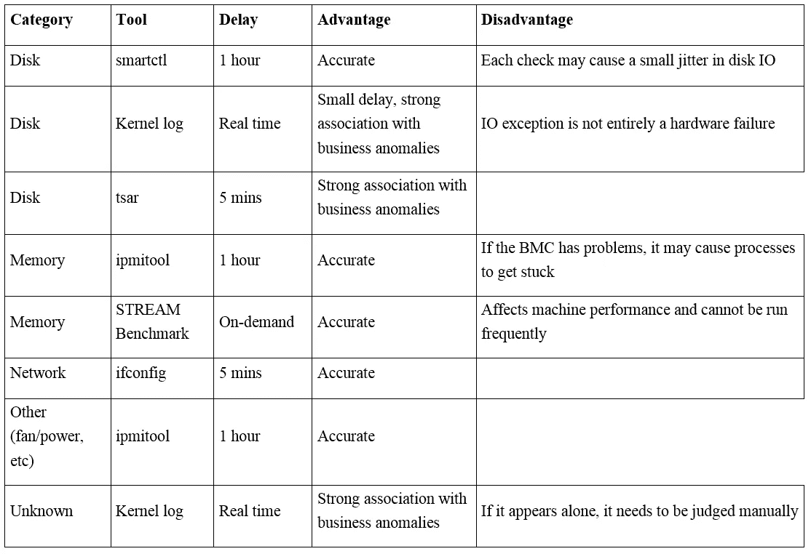
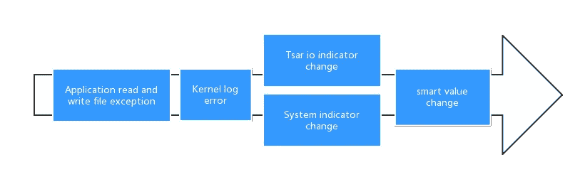
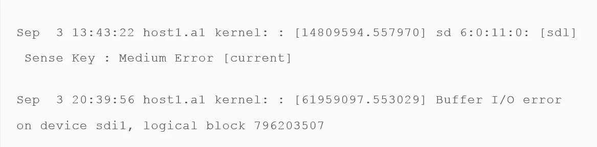
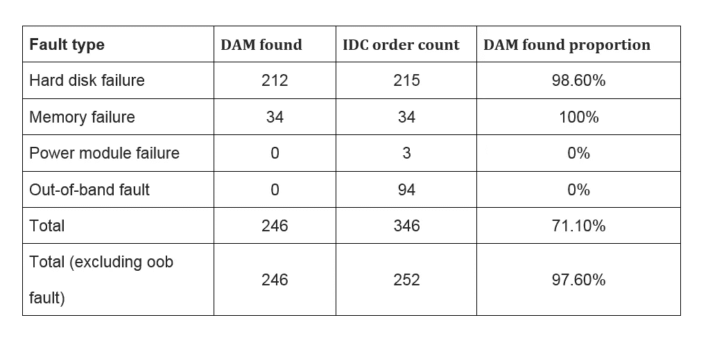
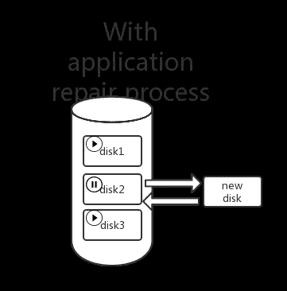
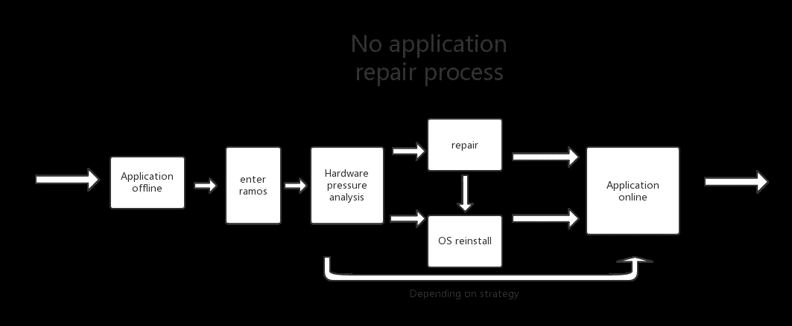
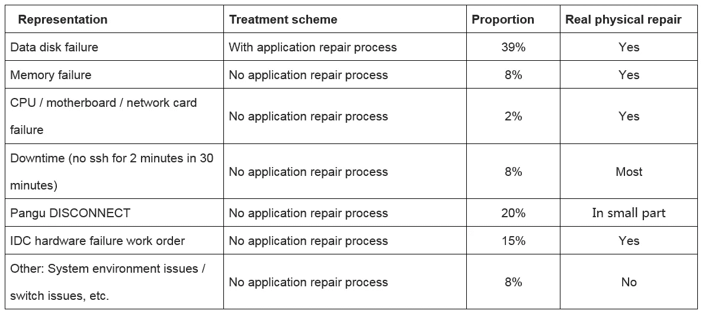
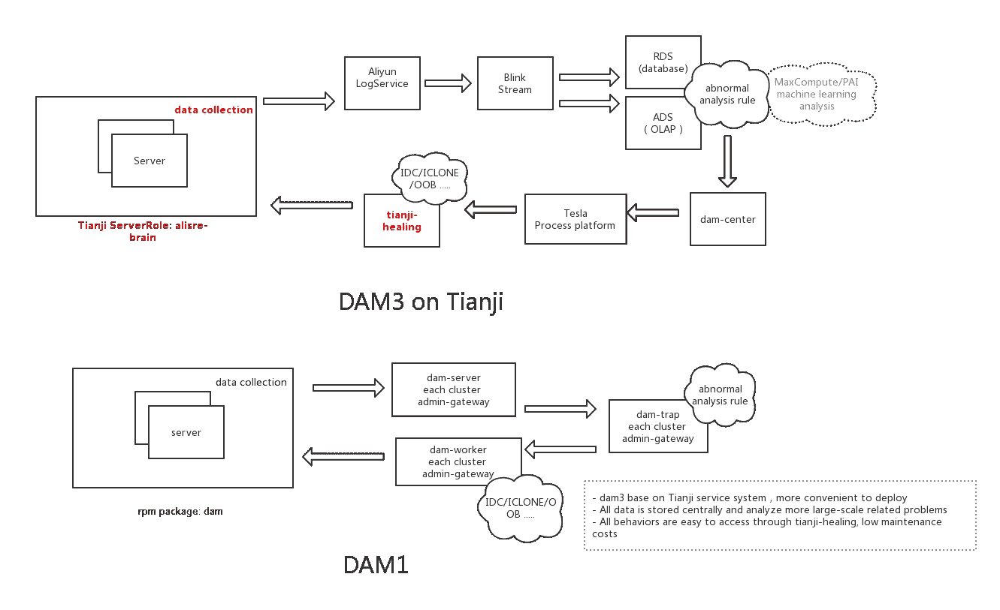

# 当机器自我修复:阿里巴巴的自我修复硬件解决方案

> 原文：<https://medium.com/hackernoon/when-machines-fix-themselves-alibabas-self-healing-hardware-solution-d1337faa0d8a>

## *阿里巴巴正在实现自动解决故障的闭环自愈硬件战略。*

在大数据系统中，运维工作在确保硬件和软件故障导致的服务中断不会威胁到平台的整体稳定性方面发挥着至关重要的作用。鉴于在大规模数据环境中这样做的挑战，阿里巴巴等集团越来越多地寻求自动化解决方案，以简化其负责人员的响应工作，最近的一项努力是自我修复硬件系统。

对于阿里巴巴来说，离线计算平台 MaxCompute 处理了所有数据存储和计算需求的 95 %,随着阿里巴巴业务规模的不断增长，它已经包含了数十万台服务器。在这些单元中，由于它们离线操作，硬件故障很难在软件级别检测到。与此同时，阿里巴巴的硬件故障报警统一阈值经常会遗漏影响应用程序的硬件故障，每次这样的故障都对集群的稳定性构成重大威胁。

处理这些问题首先需要及时发现硬件故障，然后对故障机器进行有效的服务迁移。本文探讨了阿里巴巴如何让机器独立执行这些任务，首先探索了阿里巴巴 Aspara 操作系统中的天极应用管理系统，然后介绍了阿里巴巴的自动化自修复硬件平台 DAM。

# 天脊的应用管理

MaxCompute 平台建立在阿里巴巴数据中心的 Apsara 操作系统之上，在该操作系统内，所有应用均由天机管理；作为一个自动化的数据中心管理系统，Tianji 管理数据中心中各种类型的静态资源的硬件生命周期，包括程序、配置、操作系统映像和数据等。

阿里巴巴的自愈硬件系统与天机紧密结合，利用天机的自愈机制，构建一个面向检测硬件故障、对复杂服务进行自动修复的闭环系统。

天极使得从系统中的物理机器发出重启、重装和修复指令成为可能。天极为物理机上的每个应用程序翻译这些指令，允许应用程序根据自己的业务特征和自我修复场景决定如何响应这些指令。

# 发现硬件故障

要检测的最重要的硬件故障是那些与硬盘、内存、CPU 和网卡电源问题有关的故障。下面的列表详细介绍了一些可用于处理这些常见问题的工具和方法。

硬盘故障占所有硬件故障的一半以上。其中，最常见的类型是硬盘介质故障，这通常是由于文件读/写功能失败、卡住或运行缓慢。但是，这并不意味着读/写问题是介质故障的原因，介质故障的出现首先需要在每一层进行解释，如以下部分所述。

## 内核日志

内核日志错误是指检测错误的能力，例如/var/log/messages 中的错误:

## 沙皇伊俄

tsar io 指示符变化是指 rs/ws/await/svctm/util 等指示符的任何变化或突变。由于读/写操作会在错误报警期间暂停，暂停通常会反映在 iostat 中，然后收集到 tsar 中。

在 tsar io 指示器中，有一个规则允许区分硬盘是否正常工作，表示为 qps=ws+rs <100 & util> 90。如果不存在大规模内核问题，这通常表明硬盘出现故障。

## 系统指示器

系统指示器的变化通常是由 io 变化引起的。例如，进程的不间断睡眠会导致负载增加。

## 智能价值跳跃

智能值跳变具体指 197(Current _ Pending _ Sector)/5(Reallocated _ Sector _ Ct)的跳变。这两个值和读/写异常之间的关系是双重的。第一，发生介质读写异常后，在 smart 上可以观察到 197 (pending) +1，表示有扇区需要确认。第二，当硬盘空闲时，它会确认 197(待定)中的各个待定扇区。如果读/写通过，那么 197(待定)-1 将被确认；如果读/写失败，那么 197(挂起)-1 和 5(重新分配)+1 将被确认。

## 一般发现结论

在整个错误报警环节中，仅仅孤立地观察一个阶段是不够的，因为需要对多个阶段进行综合分析才能最终证明硬件问题。由于可以严格地证明介质故障，因此可以反向推导，以便在出现未知问题时快速区分软件和硬件问题。

上面讨论的工具基于运行和维护经验以及从故障场景中吸取的教训。与此同时，单一的发现来源远远不够，因此阿里巴巴引入了其他硬件故障检测来源，并结合了各种检查方法。

# 集中在硬件问题上

由于上一节中讨论的工具和途径适用于发现硬件故障，因此不必报告每个发现。阿里巴巴集团在硬件问题上遵循两条关键原则。

第一，指标尽可能被视为与应用和服务无关。一些与硬件故障高度相关的应用程序指示器被监视，但没有被视为发现的实际来源。例如，当 io util 上升到 90%以上时，这表明硬盘特别忙，但不一定意味着它有问题，例如这是由读写热点引起的。权衡实际问题当硬盘处于“io util>90”状态时，iops < 30” for more than 10 minutes.

Second, Alibaba observes a practice of being sensitive in collection and cautious in convergence. While all possible attributes of a hardware fault should be collected, most should only serve for reference and not as a basis for repair in the final automatic convergence analysis. To continue with the previous example, if io util > 90 和 iops < 30 是唯一存在的条件，硬盘不会自动修复，因为内核问题也可能导致这种情况。只有当出现与指示器相关的明确故障时，如 smartctl 超时/故障扇区，硬盘才能被诊断为故障。缺少这些条件，硬盘会被隔离但不会修复。

## 覆盖率

以给定年份 20xx 年 x 月某生产集群的 IDC 工单为例，可以看到以下硬件故障和工单的统计数据:

排除带外(oob)故障，本月硬件故障的发现率为 97.6%。

# 硬件故障的自我修复

对于每一台出现硬件问题的机器，阿里巴巴都会开启自动轮换工单进行跟进。

目前，阿里巴巴使用两套自我修复流程:有应用修复流程和无应用修复流程；前者用于热插拔硬盘驱动器故障，而后者用于机器其余部分的所有硬件故障。

阿里巴巴的自动化流程有几个巧妙有效的设计。

首先，该过程是为无盘诊断设计的。对于停机的机器，不能进入 ramos 打开“无原因停机”维护工作单。这种设计可以大大减少误报，进而减少服务台工作人员的工作量。此外，无盘压力测试可以完全消除当前版本内核或软件的影响，从而真正确定硬件是否存在性能问题。

第二，该流程是为确定问题的影响范围和影响升级而设计的。对于应用程序修复，该方法确定进程是否停止。如果停机时间超过 10 分钟，则可以推断硬盘故障的影响已经扩展到了整个机器，这就需要重新启动机器。如果发生这种情况时计算机无法重新启动，仍然不需要手动干预，因为影响升级将直接执行。也就是说，有应用的修复流程将直接升级为无应用的修复流程。

第三，该过程的特点是对未知问题的自动备份。在某些机器的操作过程中，在机器已经停机后，可以进行无盘诊断，而压力测试将无法检测到任何硬件问题。在这种情况下，唯一的解决办法是重新安装机器。在某些情况下，硬件问题将在重新安装机器时被检测并修复。

最后，该流程旨在支持在处理硬件故障期间进行硬件停机时间分析。应该注意的是，整个过程主要面向解决问题，停机时间分析只是系统的副产品。同时，阿里巴巴还自动引入停机诊断结果进行分析，实现了“1+1>2”的效果。

## 过程的统计分析

当单个硬件问题反复触发自愈流程时，那么流程工单的统计就成了发现问题的手段。例如，在联想 RD640 机器的虚拟串行端口问题的情况下，通过统计发现，自修复在相同类型的机器上重复发生，并且即使在机器被重新安装之后，相同的问题也会再次出现。因此，阿里巴巴隔离了这些机器，以确保集群的稳定性，同时努力适应对问题的调查。

## 关于服务关联的误解

借助阿里巴巴完整的自我修复系统，可以使用“未知问题”类别来处理影响某些服务、内核和软件的问题。然而，使用硬件自我修复方法来解决服务问题往往会长期依赖这种方法，将其作为解决仍然不清楚的问题的备用解决方案。

目前，阿里巴巴正在逐步消除对非硬件问题的处理，并将其方向转向硬件的自我修复。虽然通用的自我修复软件也可以在一些系统上运行，但这种场景和服务的强耦合性使其不适合在整个阿里巴巴集团范围内推广；这种方式更有利于软硬件问题的分类和未知问题的发现。

# 不断发展的架构

阿里巴巴集团的自我修复架构在其发展过程中经历了广泛的变化。它的原始版本是在每个集群的控制机上实现的，因为当时的操作和维护人员要处理控制机上出现的各种问题。随着自动化程度的不断加深，该架构被证明是开放数据的严重障碍，导致阿里巴巴在更集中的基础上重建它；这反过来又带来了处理海量数据的挑战，在这种情况下，少量的服务器被证明是不够的。

## 云化

为了应对上述挑战，阿里巴巴进一步以支持大规模业务场景的分布式、面向服务的方式重构了系统，拆解了组成架构的各个模块，并引入了三个关键构件:阿里云日志服务(sls)、阿里云流计算(blink)和阿里云分析数据库(ads)。在这种安排中，各种收集和分析任务由云产品共享，服务器只保留硬件分析和决策的最核心功能。

下图比较了自修复平台版本 DAM1 和 DAM3 的体系结构:

## 面向数据的架构

随着对其自我修复系统的持续探索，阿里巴巴发现每个阶段的数据都会产生稳定的输出，而对这些数据进行更高维度的分析会揭示出清晰、有价值的信息。同时，该小组还降低了这些高维分析结果的维度，并对每台机器的健康状况进行了评分。有了这个运行状况评分，操作和维护人员可以快速确定单台计算机或整个机柜或集群的硬件状况。

## 面向服务的架构

基于对全链路数据的控制，阿里巴巴能够提供完整的故障自愈系统，作为不同产品线的硬件生命周期标准化服务。该系统基于决策的完全抽象，提供具体的感知门槛，支持不同产品线的定制，形成适合个性化的全生命周期服务。

# 故障闭环自愈系统

AIOps 闭环感知、决策和执行系统中最常见的应用场景是自愈硬件和软件。在行业范围内，实现故障的自动解决方案是 AIOps 的第一个实现点。对于阿里巴巴来说，提供一个通用的自愈闭环系统是其与 AIOps 和 NoOps(无人运维)合作的基石。这种系统对于处理大规模系统中的操作和维护需求尤其重要。

在复杂的分布式系统中，由于不同体系结构之间的信息不对称，它们之间的操作冲突是不可避免的。信息不对称的原因是每种类型的分布式软件体系结构都被设计成闭环运行。这些问题可以通过战略性地使用各种机制以及操作和维护工具来解决。然而，这些方法类似于打补丁，在持续的架构升级中，对此类补丁的需求持续增长。因此，该过程必须被抽象为在自我修复的基础上工作，并且必须在架构级别被显式地声明，以便软件可以参与到自我修复的整个过程中，并且将最初的冲突转换成协同的形式。

目前，阿里巴巴正致力于解决运营和维护场景中的最大问题，以及硬件和软件冲突、架构建设和产品设计，以及通过自我修复提高复杂分布式系统的整体健壮性。

阿里巴巴在大量机器上使用自修复硬件的关键发现包括，由于自修复系统中集成的操作和维护工具的稳步改进，它们的副作用会逐渐减少。此外，系统中包含的人工操作和维护活动已逐渐自动化。每个 O&M 操作都有一个稳定的 SLA 承诺时间，不再是一个随时可能出错的操作和维护脚本。

总之，DAM 自愈系统的功能是在复杂分布式系统的基础上，通过充分抽象操作和维护自动化来实现通用性。然后通过为此目的构建闭环架构，其架构生态在整体上变得更加充分协调。

*(Original article by Zhong Jiong’en 钟炯恩)*

# 阿里巴巴科技

关于阿里巴巴最新技术的第一手深度资料→脸书: [**“阿里巴巴科技”**](http://www.facebook.com/AlibabaTechnology) 。推特: [**【阿里巴巴技术】**](https://twitter.com/AliTech2017) 。