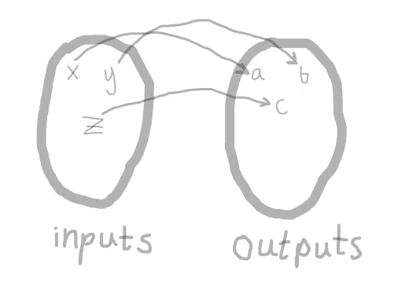

# 当过程式编程优于声明式编程时

> 原文：<https://medium.com/hackernoon/when-procedural-is-better-than-declarative-51b24aaaf227>

## 过程化编程允许您通过复杂的过程进行推理，这可以帮助您解决无法解决的问题，即使需要做更多的工作。

最近，我开始关注 youtube 上的一个魔术师/解谜频道。该频道作者是克里斯拉姆齐，他的视频令人惊讶地令人满意。如果你想知道这与程序性和声明性的[编程](https://hackernoon.com/tagged/programming)有什么关系，我向你保证我们会谈到这一点，如果你能耐心一分钟的话。

克里斯在他的频道上解决了几个不同的难题:

# 谜题 1:不可能的瓶子

The Impossible Bottle Puzzle

# 谜题 2:雷神之锤

Only those worthy can wield the hammer of Thor

# 那么有什么区别呢？

我认为谜题是编程的伟大隐喻，它可以帮助非程序员理解编程的困难。通常，我们不知道一件事要花多长时间，或者最好的方法是什么，直到我们做出努力。两个不同的程序员可以用非常不同的方式处理和解决同样的挑战。

这两个谜题都被贴上了“不可能”的标签，但实际上它们所涉及的挑战有着非常明显的区别。不可能的瓶子让你清楚地看到发生了什么，但操纵零件和零件的过程很难执行。要不是瓶子挡住通路，解决起来也是小事一桩。

在“雷神之锤”的谜题中，情况正好相反。每个部分都可以触摸和操作，但是它们之间的关系隐藏在内部，程序员看不到。。。我是说，解谜者。

# 声明式编程隐藏了过程，揭示了关系

声明式编程有许多不同的形式。最广为人知的声明式编程形式之一是函数式编程。函数式编程简单地描述了输入和输出之间的数学关系。它很大程度上依赖于像递归和组合这样的想法。



functions are simply mathematical maps between inputs and outputs

为了突出函数式编程和命令式编程的优缺点，最常见的例子之一是计算斐波那契数列。

以下是在 Haskell 中计算斐波那契数列的几种不同方法:

```
-- zip
fibs = 0 : 1 : zipWith (+) fibs (tail fibs)-- recursive
fib :: Int -> Int
fib 0 = 0
fib 1 = 1
fib n = fib (n-1) + fib (n-2)n = 37
main = do
    print "zip lists"
    print (fibs !! n)
    print (fibs !! (n+1))
    print (fibs !! (n+2))
    print (fibs !! 2000) print ""
    print "recursive"
    print (fib n)
    print (fib (n + 1))
    print (fib (n + 2))-- edited Nov 2018
```

这段代码改编自[这个堆栈溢出问题](https://stackoverflow.com/questions/1105765/generating-fibonacci-numbers-in-haskell#1105840)。以下是解释带有“zip”的版本如何工作的描述:

> 因此，斐波纳契数列的无限列表可以通过将元素 1 和`1`加到使用`+`运算符压缩斐波纳契数列的无限列表的尾部的结果上来计算。

尽管使用“zip”实现斐波那契数列非常简洁，但正如这个答案所展示的，还有很多工作要做。

在递归 Haskell 版本中，我们描述了有关数学关系的非常具体的事情。类型签名告诉我们这个函数接受一个整数并返回另一个整数。然后我们使用一个叫做[模式匹配](http://learnyouahaskell.com/syntax-in-functions#pattern-matching)的特殊 haskell 技巧来描述函数的初始值。根据这些值，我们递归地描述如何计算进一步的值。

将这些实现与我用 C 写的这个版本进行比较:

```
#include <stdio.h>
int fibonacci(n){
    int a = 1;
    int b = 1;
    int i;
    int tmp;
    for(i = 0; i < n - 1; ++i){
        // swap a and b
        tmp = a;
        a = b;
        b = tmp;
        // add a and b
        a = b + a;
   }
   return a;
}int main(){
    printf("\nfibonacci(0) = %d", fibonacci(0));
    printf("\nfibonacci(1) = %d", fibonacci(1));
    printf("\nfibonacci(2) = %d", fibonacci(2));
    printf("\nfibonacci(3) = %d", fibonacci(3));
    printf("\nfibonacci(4) = %d", fibonacci(4));
    printf("\nfibonacci(5) = %d", fibonacci(5));
    printf("\nfibonacci(6) = %d", fibonacci(6));
    printf("\nfibonacci(10) = %d", fibonacci(10));
    printf("\nfibonacci(20) = %d", fibonacci(20));
    printf("\nfibonacci(40) = %d", fibonacci(40));
    printf("\nfibonacci(50) = %d", fibonacci(50));
    printf("\nfibonacci(100) = %d", fibonacci(100));
    printf("\ndone");
    printf("\n");
    return 0;
}
```

这段代码需要明确存储什么值，循环中涉及多少步，等等。这可能会令人困惑，因为经常会有一些小的调整来处理边缘情况，或者正确的初始化。在这种情况下，我们必须循环 *n -1* 次，可能不清楚为什么。此外，如果你运行代码，你会发现最终它给出了错误的答案，因为在过程化编程中，程序员要对溢出之类的事情负责，而在这种情况下我们不处理它。在 haskell 中，语言会帮我们解决这个问题。

# 声明式编程非常适合需要细节帮助的常见任务

有些人可能认为过程式编程和声明式编程是互斥的，但通常我们会混合使用这两种方法。一个很好的例子是，即使在过程语言中，使用声明性语句进行内存管理[已经成为规范。](https://hackernoon.com/tagged/management)

想想**新的**关键词。这个关键字存在于几种语言中，包括 Java、C++和 Javascript，实际上在每一种语言中它几乎都是可比较的。

[这里的](https://docs.oracle.com/javase/tutorial/java/javaOO/objectcreation.html)是来自在线 Java 文档的一个例子:

```
**Point originOne** = new Point(23, 94);
**Rectangle rectOne** = new Rectangle(originOne, 100, 200);
**Rectangle rectTwo** = new Rectangle(50, 100);
```

在 C #中，malloc 和 free 用于手动分配和取消分配堆上的内存。在这些其他语言中，new 关键字为我们自动处理了很多这样的事情。首先，它决定了我们将要创建什么对象，以及所需的内存大小。此外，在表达式的上下文中，new 关键字指示应该使用提供的参数调用对象构造函数。最后，带有 **new** 的表达式解析为一个可以根据其对象类型使用的值。在上面的语句中，它被用在赋值的右边，但是我们也可以匿名调用它的一个方法，或者把它传递给另一个对象的方法。

就像不可能的瓶子难题一样，声明性编程使细节变得不可访问，但使看到相关的关系变得容易。

# 当你关心步骤时，程序性更好

最近，我试图为一个 web 开发任务编写一些复杂的 MySQL 查询。SQL 是一个很好的例子，说明声明式编程不仅仅包括函数式编程。

对于这个特殊的问题，我需要执行计算来转换我的数据，使用数据库中不同表的数据。SQL 非常适合查询和选择数据集，但它并不总是用这些数据进行计算的最佳选择。

最初，我在 django 的服务器上使用命令式方法处理我的数据。但是这对于我来说太慢了，因为当 python 解释器试图执行计算时，查询会超时。

然后我决定将计算转移到 MySQL 中，以加快查询时间。虽然看起来这已经足够快了，但是很快就很难对查询、步骤和涉及的关系进行推理。我发现自己在 MySQL 中使用循环和过程，MySQL 支持循环和过程，但这不是该语言的理想用例。

相反，我将使用 SQL 查询来选择适当的数据集，然后用 javascript 在客户机上执行计算。我以前对需要从数据库计算的其他统计数据也是这样做的，我真的很喜欢这种方法，因为计算被卸载到客户端，所以这是对资源的有效利用，页面呈现也很快。此外，javascript 是一种以灵活方式处理数据集的优秀语言，因为它支持 JSON，即使浏览器不是支持数学或会计计算的最佳环境。

# 最后的想法:过程化编程给了你更多的控制，但是值得吗？

我们勇敢无畏的 youtube 解谜者克里斯·拉姆齐(Chris Ramsey)决定烧掉雷神之锤，而不是试图把它重新组装起来，因为这项任务充满了挫折和挑战。但是如果他记录了拆卸的步骤，他可以简单地颠倒步骤重新组装。我认为这是一个很好的例子，说明了过程化编程的优点和缺点。跟踪所有涉及的步骤，可以让您执行更复杂的挑战，更好地控制细节，但是否值得取决于任务，以及是否可以用库或不同的方法解决。