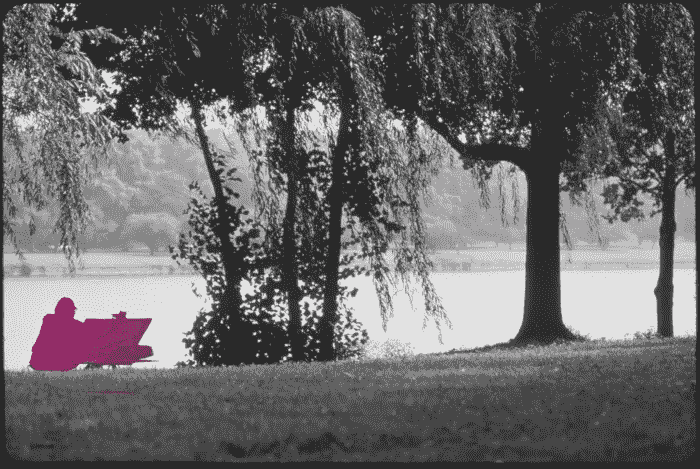

# 当媒介是艺术时，媒介中的艺术如何分化自己？

> 原文：<https://medium.com/hackernoon/when-the-medium-is-art-how-does-art-in-the-medium-differentiate-itself-a8c8ce72fcf3>

视觉媒介天生具有艺术性。无论是爆米花[大片](https://hackernoon.com/tagged/blockbuster)电影还是你最喜欢的乐队的现场演唱会，艺术意图渗透在每一次视觉体验中。

在虚拟现实中尤其如此，每一片草叶，每一粒灰尘，都必须由艺术家精心渲染。像电子游戏和动画一样，虚拟现实的世界是一个艺术的世界。

那么，艺术家如何将自己与大众区分开来呢？

我可以带上耳机，冒险进入艺术家[利兹·爱德华兹](https://lizedwards.artstation.com)创造的虚拟世界。她使用倾斜画笔创作出真正令人惊叹的艺术作品[，就像这幅宇宙飞船场景](https://skfb.ly/VHEL)。不可否认，她正在做的事情是强大而美丽的——但如果我想在虚拟现实中度过五分钟，为什么不去看《亲爱的安吉丽卡》，它也(从字面上)描绘了我周围的一个华丽的世界，同时也用文字和音乐讲述了一个故事？

爱德华兹在育碧公司工作，将她的艺术才华带到了游戏中——这是虚拟现实领域的另一个竞争。我可以去一个虚拟画廊，凝视梵高的《星夜》——或者我可以进入这幅画本身，凝视角落，在星光下漫步。如果有人创造了那种体验的互动版本，在那里我可以用手指在画中滑动并微妙地改变它？或者在星空下躲避怪物？你可以毫不费力地打赌，这将战胜静态体验。

在 VR 中“仅仅”成为一名艺术家甚至比成为一名非虚拟媒体的艺术家更难，因为艺术被烘焙到整个虚拟体验中。当你创作一个雕塑时，你并不是真的在和其他真实世界的例子竞争。雕像和电子游戏没有提供同样的审美吸引力。古典艺术和摇滚音乐会给你非常不同的视觉刺激。但是戴上耳机*就是*媒介，一旦你进入其中，竞争就会非常激烈。

那么虚拟艺术家将如何把自己与其他体验分开呢？也许他们不会。也许那种艺术美会成为 VR 中每一个瞬间的一部分。

那会很酷。

*由雷恩·汉德曼为*[*www.hammerandtusk.com*](http://www.hammerandtusk.com/blog/article/when-the-medium-is-art-how-does-art-in-the-medium-differentiate-itself)*所写。*