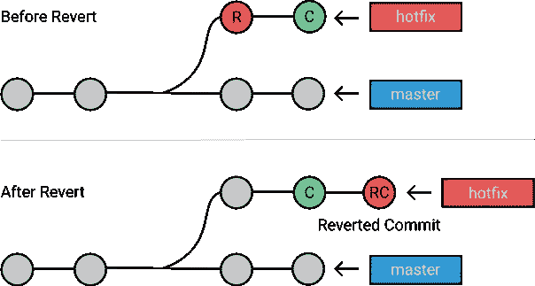
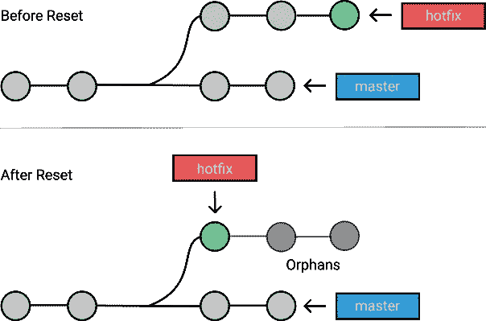

# 何时使用 Git 重置、Git 恢复和 Git 检验

> 原文：<https://medium.com/hackernoon/when-to-use-git-reset-git-revert-git-checkout-dc4824795d9>

Git 工具箱提供了多种独特的工具来修复开发过程中的错误。像`git reset`、`git checkout`和`git revert`这样的命令允许您**撤销存储库中的**错误变更。

因为它们执行相似的操作，所以很容易混淆。对于何时应该使用和不应该使用每个命令，有一些指导原则和规则。我们来看看吧！

> *小心！您不能总是在一个* [*撤销*](https://git-scm.com/book/en/v2/Git-Basics-Undoing-Things) *后重做。这是 Git 中少数几个如果做错了可能会丢失一些工作的领域之一。*

# 使用 Git 命令撤销

让我们首先阐明这三个命令之间的主要区别。

# 结账:

*   用这个来移动[头指针](https://kolosek.com/git-branches/)到一个特定的提交或者**分支之间的切换**。
*   它**回滚**任何特定提交的内容更改。
*   这将**而不是**对提交历史进行更改。
*   有可能**覆盖工作目录中的**文件。

# 还原:

*   回滚您已提交的更改。
*   通过反转指定的提交来创建一个新的提交。因此，会将新的提交历史记录添加到项目中，但不会修改现有的提交历史记录。
*   有可能覆盖工作目录中的文件。

# 重置:

*   用这个来**返回**整个*工作树到最后提交的状态。这将丢弃私有分支中的提交或丢弃未提交的更改！*
*   提交分支头当前指向的更改。它改变了现有的提交历史。
*   可用于**卸载**一个文件。

[每个命令](https://kolosek.com/git-commands-tutorial-part1/)都让你**撤销**你的存储库中的某种改变，只有签出和重置可以用来操作提交或单个文件。

# 使用命令

有很多不同的方法可以**撤销你的更改**，这完全取决于当前的场景。选择适当的方法取决于您是否错误地提交了变更，如果您提交了变更，则取决于您是否共享了变更。

# 撤消公共更改

*场景:*您在 hotfix 分支中为您还不想执行的提交所做的`[git push](https://kolosek.com/git-commands-tutorial-part2/)`映像。

*解决方案:*解决这个问题最安全的方法是通过**恢复**您的更改，因为它不会重写提交历史。

```
git checkout
hotfix git revert HEAD~1
```

*结果:*您已成功撤消已提交的更改！旧提交中更改的所有内容都将被新提交还原。Git 强制您提交或[隐藏](https://kolosek.com/git-stash/)工作目录中的任何更改，这些更改将在签出过程中丢失。



> *你可以把* `*git revert*` *想象成一个撤销* ***已提交*** *变更的工具，而* `*git reset HEAD*` *则是用来撤销* ***未提交*** *变更的。*

# 撤消本地更改

*场景:*你开始着手一个特性，但是你不喜欢最终的结果。这些变化还没有**与其他任何人**分享。

*解决方案:*你想要**撤销文件中所有**到之前的状态，就像上次[提交](https://kolosek.com/git-commands-tutorial-part2/)时的样子。

```
git checkout file_name.rb
```

*结果:*文件`file_name.rb`已被**恢复到**Git 先前已知的状态。请注意，这将删除文件的所有后续更改！

> *您可以使用* `*git checkout branch_name*` *在分支之间切换。Git 强制您提交或隐藏工作目录中的任何更改，这些更改将在签出操作中丢失。*

# 撤消私有更改

*场景:*你已经在[热修复分支](https://kolosek.com/git-branches/)本地提交了一些东西，但是一切都很糟糕！您希望从当前分支中删除最后两次提交。

*解决方案:* **重置**修复分支向后两次提交，就好像这些提交从未发生过一样。

```
git checkout hotfix
git reset HEAD~2
```

*结果:*我们的 git 存储库已经被**倒回**指定的提交。那些被遗漏的提交现在是孤立的，将在下次 Git 执行垃圾收集时被移除。现在，它们的内容仍然在磁盘上。



当执行`[git reset](https://kolosek.com/git-commands-tutorial-part2/)` [](https://kolosek.com/git-commands-tutorial-part2/)时，您可以使用其中一个参数告诉 Git 如何处理您的**索引**(将成为下一次提交的文件集)和**工作目录**:

*   `--soft`:告诉 Git 将 HEAD 重置为另一个提交，这样索引和工作目录将不会以任何方式被改变。在原始文件头和提交之间更改的所有文件都将被转移。
*   `--mixed`:就像软键一样，这个会重置 HEAD 到另一个提交。它还会重置**索引**与之匹配，而工作目录不会被触动。所有的**变更**将保留在工作目录中，并显示为已修改，但不是暂存的。

> *`*--mixed*`*和* `*--soft*` *的主要区别在于你的指数是否也修改。查看更多关于*[*git-reset-guide*](https://gist.github.com/tnguyen14/0827ae6eefdff39e452b)*。**

*   *`--hard`:这将重置一切——它将 HEAD 重置回另一个提交，重置索引以匹配它，并重置工作目录以匹配它。*

# *提示和技巧*

*我将介绍另外两个在您的 Git 冒险中可以派上用场的东西。*

# *修复以前的提交消息*

**场景:*每个人在写提交时都会犯打字错误，这完全没问题！在你做一个`git push`之前，它可以很容易地被修复。*

**解决方法:*运行`git commit --amend`或`git commit --amend -m 'The new message'`即可。这将更新并用新的提交替换最近的提交。*

# *撤消后重做*

**场景:*你对一些不想要的改变做了一个`git reset --hard`，但是后来你意识到你其实需要它们。*

**解决:* `git reflog`来救你了！这是一个恢复项目历史的惊人命令，它可以恢复*几乎*任何东西。*

**希望这三个工具能在你需要撤销最近的更改时帮到你。**

**原载于 2018 年 5 月 21 日*[*kolosek.com*](https://kolosek.com/git-reset-revert-and-checkout/?utm_source=me)*。**