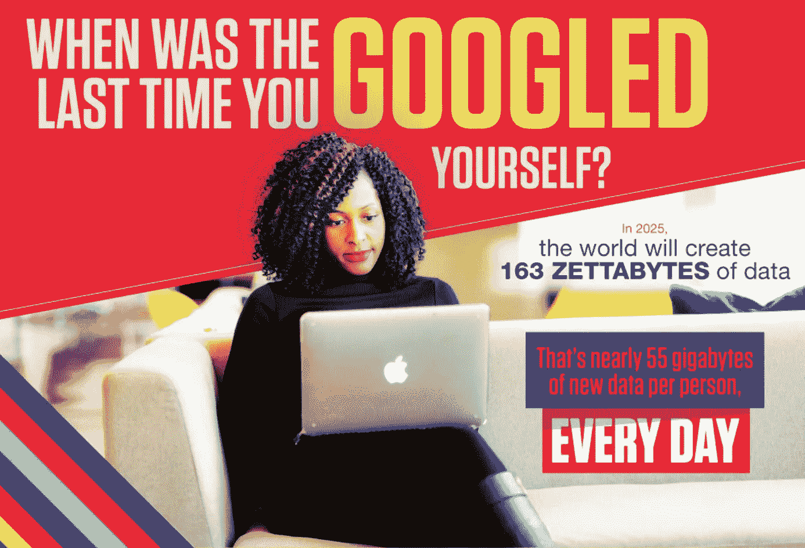
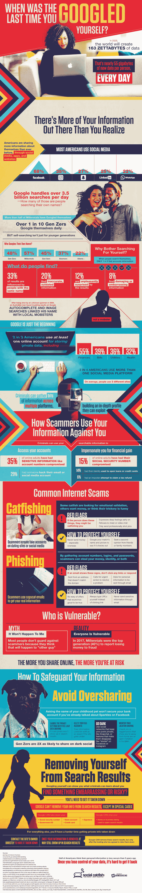

# 你上次谷歌自己是什么时候？

> 原文：<https://medium.com/hackernoon/when-was-the-las-time-you-googled-yourself-828f024f0a55>

到 2025 年，世界将会产生 163 的数据——每人每天将近 55gb 的新数据。在不到十年的时间里，这种信息爆炸可能比我们意识到的更加个人化。今天，谷歌每天已经处理超过 35 亿次搜索，这可能会令人惊讶，这些数据中有多少是我们自己的信息。

一半的美国人认为他们的网上个人信息不如五年前安全——然而我们分享的关于自己的信息比以往任何时候都多。像脸书和 Instagram 这样的社交媒体网站让过度分享变得很容易，这是我们大多数人都至少有过一次的坏习惯。除了 TMI 因素，过度分享会导致更坏的结果；也就是说，聪明的骗子知道如何把两个和两个放在一起，为潜在的受害者建立一个多平台的档案。一旦这些部分到位，骗子就可以攻击我们的痛处，从网络钓鱼到钓鱼攻击我们脆弱和幼稚的地方。

你知道什么样的关于你自己的信息在外面流传吗？其中很大一部分可能只是谷歌搜索的结果。请看这张信息图，了解更多关于在线数据管理、如何保护您的信息安全以及防止信息落入他人之手的信息。

