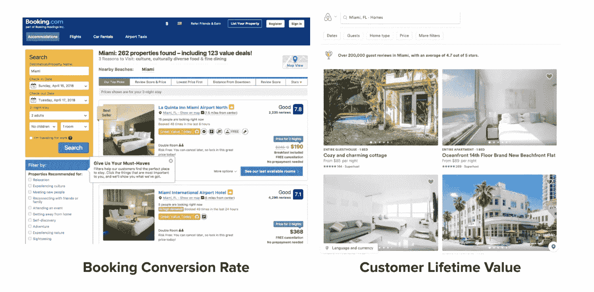
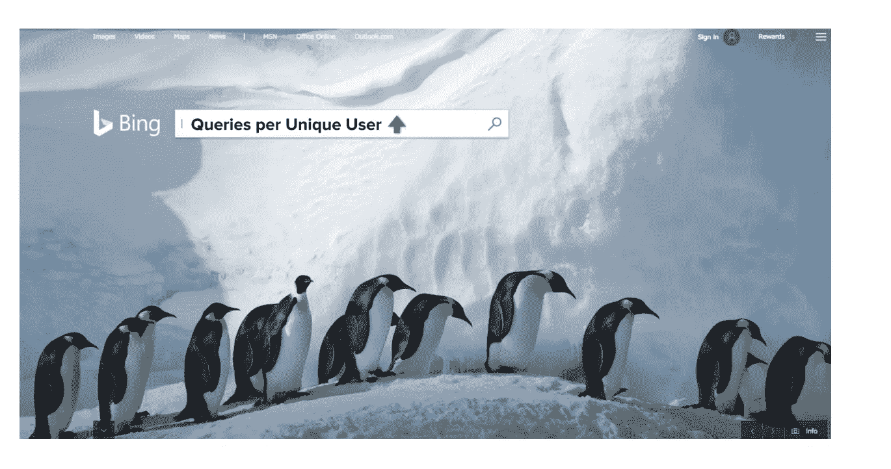
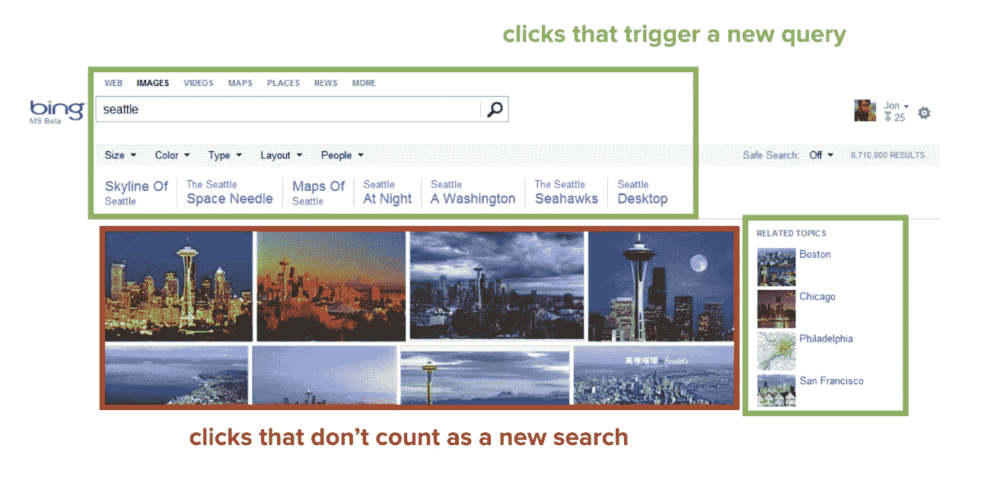
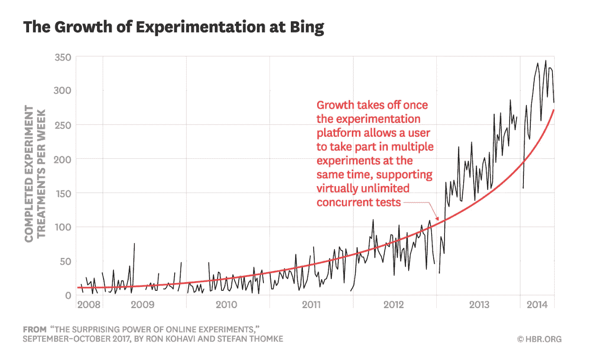

# 当你尝试错误的度量标准时…

> 原文：<https://medium.com/hackernoon/when-you-experiment-with-the-wrong-metrics-85c51cc594ee>

## 产品管理总监 Jon Noronha

> 这篇文章最初出现在[优化博客](http://bit.ly/2m4RCRq)上。 [Optimizely](http://bit.ly/2zrY2Ui) ，Hacker Noon 的每周赞助商，是数字体验优化领域的全球领导者，允许企业通过其一流的实验软件平台大幅提升其数字产品、商业和活动的价值。优化使产品开发团队能够加速创新，降低新功能的风险，并将 digital 的投资回报率提高 10 倍。
> 
> 这是我们产品实验陷阱博客系列的第一篇文章，作者是 Optimizely 的产品管理总监 Jon Noronha。查看[此处](http://bit.ly/2NCv9b1)了解更多关于这个 5 部分系列的信息。

## 亮点:

*   当你朝着一个简单的目标(比如转化)前进时，测量实验结果相对简单。
*   当产品团队为长期或不太明确的目标进行优化时，如长期保留或提供良好的体验，可能很难找到映射到模糊目标的具体指标。
*   解决办法？选择与业务成功相关的指标，重复你的指标，不要害怕改变方向。

实验是让数字上升的强大技术。只要你选择正确的数字，你就会看到变革性的成功。但是如果你选择了错误的产品，你就会把你的产品引向错误的方向。尝试错误的度量标准就像用一把威力巨大的枪打自己的脚。

当你有一个单一的、非常简单的转换时，A/B 测试是容易的，就像从一个登陆页面获得更多的线索。当你为一个更微妙的目标优化时，就变得更加困难了，比如*推动长期保留*或*提供最佳用户体验*。根据你选择的目标，你可以把你的产品推向完全不同的方向。例如，Airbnb 和 Booking.com 都有很强的实验文化，但是对不同指标的测试导致了非常不同的用户体验:

团队经常遇到的困难是将一个模糊的目标与一个具体的、可测量的指标联系起来。我在微软看到了 Bing 的第一手工作，我们团队的高层次目标是建立一个伟大的搜索引擎，可以可信地与谷歌竞争。这是一个优秀的公司目标，但它本身不是一个可量化的指标。然而，我们不顾一切地想要建立一种与谷歌相当的测试文化，所以我们为*抓住了一些可测量的东西*,我们可以用它来捕捉“搜索引擎的优点”和在 A/B 测试中的市场份额。

我们的第一次尝试在理论上很有意义。为了衡量我们作为搜索引擎的质量，我们决定衡量 Bing 上的搜索查询总数。当然，如果这个数字上升，我们会做一些正确的事情，因为我们会有更多的用户更频繁地使用我们的产品。因此，我们有了一个[北极星指标](https://growthhackers.com/articles/north-star-metric):我们会在测试变量中随机挑选用户，然后通过测量每个唯一用户的总查询量来选择获胜者。

从目标开始往回走，这个链条中的每一步听起来都合乎逻辑且无害。但实际上，它导致了一场慢动作灾难。

事情是这样的:因为团队是根据每个用户的查询量来衡量的，我们开始倾向于让你做*更多的搜索*来找到相同的结果，并惩罚那些让你在更少的跳转中得到相同答案的改变。多年来，我的团队努力测试我们的拥挤的用户界面，将“相关搜索”和“改为尝试这个”放在前面和中心，以实际结果为代价。每次我们把实际的搜索结果推得更远，我们都看到我们的实验取得了胜利，并进行了一次盛大的庆祝。效果是真实的:数字确实上升了。

只有一个障碍:一直以来，我们并没有真正解决核心问题。当人们使用搜索引擎时，是因为他们想快速找到答案。我记得有一天听到谷歌的某人吹嘘说“我们是地球上唯一一个试图尽快摆脱你的网站！”与此同时，在 Bing，我们优化了*搜索*，而不是*搜索*。这是由定性研究证实的。尽管我们的指标在上升，我们的用户不再告诉我们他们喜欢我们的搜索引擎。如果说有什么不同的话，那就是他们感到更加沮丧，仍然选择了谷歌。

最终，经过深思熟虑，这个反馈让我们重新调整了整个实验项目。经过进一步分析，我们意识到我们选择了错误的度量标准，所以我们改变了策略。展望未来，我们设定的目标是*减少每个会话的*个查询，而不是针对每个用户的会话进行优化。

作为微软实验平台的领导者，Ronny Kohavi 在《哈佛商业评论》的一篇文章中解释道:

必应的经历表明，得出一个 OEC(总体评估标准)并不容易。其关键的长期目标是增加搜索引擎查询的份额和广告收入。有趣的是，降低搜索结果的相关性会导致用户发出更多的查询(从而增加查询份额)，点击更多的广告(从而增加收入)。显然，这样的收益只是短暂的，因为人们最终会转向其他搜索引擎。那么，哪些短期指标可以预测查询份额和收入的长期改善呢？在对 OEC 的讨论中，Bing 的高管和数据分析师决定，他们希望最大限度地减少每个任务或会话的用户查询数量，最大限度地增加用户执行的任务或会话数量。

当用户喜欢你的搜索引擎时，他们会经常访问并尽快离开，因为他们总能找到他们想要的东西。虽然第一个指标听起来不错，但只有第二个版本抓住了真正重要的影响。并非巧合的是，必应现在有着蓬勃发展的实验文化，并于 2015 年底报告了其在[的第一个季度利润。](https://techcrunch.com/2015/10/22/bing-is-profitable/)

解决方案

当你设计你的产品实验时，仔细考虑你使用的度量标准。当你有疑问时，问自己一个问题:如果这个指标上升，而其他一切保持不变，你会开心吗？这可以帮助你选择一个与业务成功相关的指标，而不仅仅是一个容易移动的指标。另一种表述方式是:这个指标会激励什么样的不良行为？或者:如果我的用户发现这是我试图推动他们的行为，他们会有什么反应？

不要害怕定期重新评估这些指标，因为你永远不会第一次就完全正确。虽然这听起来像是数据驱动行业的异端邪说，但请相信你的直觉！如果感觉度量标准把你引向了错误的方向，重新思考度量标准，花时间选择正确的目标。否则，实验会把你带下悬崖。

关键要点

为了避免试验错误的指标:

*   选择与业务成功相关的指标，而不仅仅是易于移动的指标。
*   不要害怕频繁地重新评估度量标准，并迭代为您的团队工作的度量标准。
*   当感觉度量标准将你引入歧途时，相信你的直觉，重新思考你的度量标准策略。从长远来看，花更多的时间选择正确的目标会节省时间。

关于 Bing 实验之旅的更多信息，我推荐该团队关于运行在线实验时要避免的七个陷阱的论文。它充满了像这样的坦率的经验，有助于建立一种成功的实验文化。您还可以从 Optimizely 的[中找到更多关于改善重要指标的技巧](https://help.optimizely.com/Ideate_and_Hypothesize/Improve_metrics_that_matter_with_your_optimization_program)。

看看这个系列的第二篇文章:[在没有足够流量的情况下进行实验](http://bit.ly/2zmH7lH)

> 这篇文章最初出现在 Optimizely 博客上。Hacker Noon 的每周赞助商 Optimizely 是数字体验优化领域的全球领导者，允许企业通过其一流的实验软件平台大幅提升其数字产品、商业和活动的价值。优化使产品开发团队能够加速创新，降低新功能的风险，并将 digital 的投资回报率提高 10 倍。