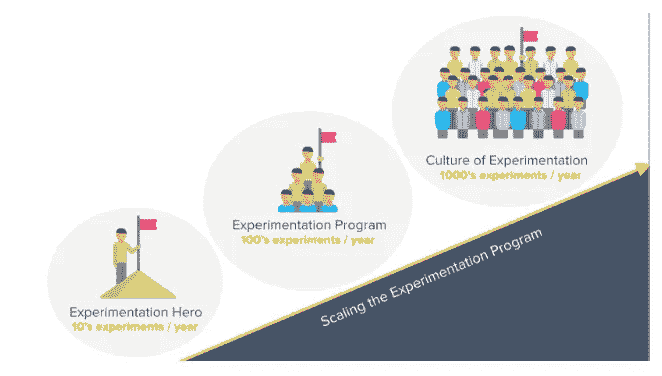
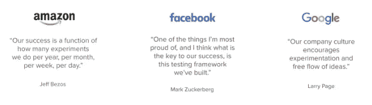

# 当您无法跨团队扩展时…

> 原文：<https://medium.com/hackernoon/when-you-fail-to-scale-across-teams-9b2a6bea3356>

## 产品管理总监 Jon Noronha

Photo by [rawpixel](https://unsplash.com/photos/tpLz5aKdQmM?utm_source=unsplash&utm_medium=referral&utm_content=creditCopyText) on [Unsplash](https://unsplash.com/search/photos/across-team?utm_source=unsplash&utm_medium=referral&utm_content=creditCopyText)

> 这篇文章最初出现在[优化博客](http://bit.ly/2u79EXE)上。 [Optimizely](http://bit.ly/2zrY2Ui) ，Hacker Noon 的每周赞助商，是数字体验优化领域的全球领导者，允许企业通过其一流的实验软件平台大幅提升其数字产品、商业和活动的价值。优化使产品开发团队能够加速创新，降低新功能的风险，并将 digital 的投资回报率提高 10 倍。
> 
> 这是我们产品实验陷阱博客系列的最后一篇文章，由 Optimizely 的产品管理总监 Jon Noronha 撰写。查看[此处](http://bit.ly/2NCv9b1)了解更多关于这个 5 部分系列的信息。

到目前为止，在这个系列的[中，我已经强调了产品实验过程中的几个陷阱。我们已经看到了一些常见的错误如何](http://bit.ly/2NCv9b1)[减缓您的测试](https://blog.optimizely.com/2018/05/09/experimenting-without-enough-traffic/)，[拖延您的速度](https://blog.optimizely.com/2018/05/25/measuring-driving-experiment-velocity/)，[让您的团队兜圈子](https://blog.optimizely.com/2018/05/17/tricked-by-statistics/)，或者[将您引入完全错误的道路](https://blog.optimizely.com/2018/05/03/experimenting-with-wrong-metrics/)。但是如果你已经有了一个萌芽的实验文化，并且你看到了一系列稳定的成功测试，那该怎么办呢？

恭喜你！你将经历一场激动人心的旅程。伟大的实验开启了一个良性循环:它们激发他人质疑自己的假设，这反过来锁定了一种在整个组织中传播的假设思维文化。我经常惊讶于一个公司从一个月一个实验，到 10 个，再到 100 个实验的速度。

不幸的是，这一进程从来都不是完美的。随着您运行更多的测试，收集更多的数据，并在过程中包括更多的人，一系列全新的挑战开始出现。这最后一篇文章就是关于这些陷阱的——那些阻碍测试文化发展的挑战。为了说明这一点，我将分享两个测试界巨头的例子:Booking.com 和 Airbnb。

# 在更多地方进行实验

Booking 是一家以围绕不断实验设计整个开发文化而闻名的公司。但是像所有的测试项目一样，他们都是从卑微的起点开始的。他们的实验平台的第一个版本只支持一次运行少量的实验，当他们十年前开始时，团队无法想象他们最终达到的规模。现在快进到现在。

> *总的来说，我们部门的所有成员每天都要运行和分析一千多个同时进行的实验，以快速验证新想法。这些实验贯穿于我们所有的产品，从酒店经营者使用的移动应用和工具到客户服务电话线路和内部系统。实验已经在 Booking.com 文化中根深蒂固，从整个重新设计和基础设施的变化到错误修复，每一个变化都包含在一个实验中…只有在运行实验足够便宜、安全和容易，任何人都可以继续测试新想法的情况下，这种民主化才有可能，这反过来意味着实验基础设施必须足够通用、灵活和可扩展，以支持所有当前和未来的用例。*

通过所有这些指数级的增长，Booking 不得不不断改进其测试基础设施以支持新的实验类型。在成长的每个阶段，新团队都会带来新的接触点和新的挑战。从网站转换优化，他们扩展到原生移动测试，并从那里深入到后端技术栈的实验。今天，Booking 有一个由 40 多名开发人员和统计人员组成的团队，他们一直致力于改进他们的测试平台。

在 Optimizely，我们已经采取了我们自己版本的旅程。像 Booking 一样，我们在 R&D 投入了 8 年多的时间和数千万美元来扩大我们的“实验足迹”从简单的网站测试开始，我们跟随最精明团队的领导，添加了跨越 [10 种不同语言](https://developers.optimizely.com/x/solutions/sdks/reference/index.html?language=node)的[本地移动实验](https://www.optimizely.com/products/mobile/)和[服务器端测试](https://www.optimizely.com/anz/products/full-stack/)。一路上，我们不得不解决令人抓狂的微妙问题。实验在任何地方都是可行的，但它们也必须是严格的、可靠的、可靠的。如果这些事情中的任何一件出了问题，在堆栈的任何一个部分，它可以立即破坏在测试文化中建立起来的多年信任。

如果说我能从这段经历中总结出什么教训的话，那就是:不要根据你想运行的第一个实验，甚至第十个实验来选择你的测试平台。想想你的第一百次或第一千次测试可能会在哪里运行——并确保你正在构建或购买的技术能够远远超越它。

# 收集更多数据

扩展实验不仅仅意味着支持新的用例:还意味着收集更多的数据。更多数据。足以让你巧妙设计的分析管道一次又一次地爆炸。我已经经历了三四次这种特殊的挑战，所以以一种奇怪的方式，读到 Airbnb 关于[扩展他们的实验报告框架(ERF)的长篇故事时，我感到很欣慰](/airbnb-engineering/https-medium-com-jonathan-parks-scaling-erf-23fd17c91166)

> *在 ERF 中运行的并发实验数量已经从几十个(2014 年)增长到大约 500 个…更令人印象深刻的是，每天计算的指标数量呈指数级增长…今天我们每天计算大约 2500 个不同的指标和大约 50000 个不同的实验/指标组合。*

这篇文章列出了一系列挑战:

1.  早期，所有的实验分析都是通过一个每天运行一次的简单脚本进行的。这一切都很好，直到有一天，它开始需要超过 24 小时运行。突然间，他们开始处理“一个淹没的 Hadoop 集群和不满意的终端用户”(“不满意”可能是轻描淡写。当同样的事情发生在我们微软时，我们会在周一开始测试，直到周四才能看到数据。所有人都暴跳如雷。)
2.  为了疏通管道，他们意识到必须重建整个后端。所以他们开发了一种全新的技术叫做气流——现在是一个欣欣向荣的开源项目。这很有效:分析时间从超过 24 小时减少到不到 45 分钟。问题解决了！
3.  开个玩笑:“领养立刻开始兴旺起来。这导致了更多的实验和新度量标准的大量涌入。一些实验采用了 100 或更多的指标，事情很快就失控了。”很快，一切又变得缓慢起来，除此之外，UI 变得拥挤不堪。
4.  所以他们转而使用一个新的系统来预计算更多的数据。问题…解决了？不完全是。“它取得了巨大的成功，但让用户希望更深入地研究指标。为了满足这一需求，我们推出了……”—好的，我想我们都明白了。

我喜欢这个故事，因为在每个阶段，Airbnb 的平台都是自身成功的受害者。随着实验变得越来越容易，用户对它的期望也越来越高！随着数据对业务运营变得越来越重要，分析师希望获得更深入的见解，并以前所未有的速度生成这些见解。

在 Optimizely，我们确实感受到了这种压力。我们的工程师度过了许多不眠之夜，帮助纽约时报和 Gap 等网站在选举日和黑色星期五等流量高峰期间维持实验。通过这一切，我们了解到，构建能够处理数十亿个传入事件的基础设施至关重要，同时还通过[细分](https://help.optimizely.com/Analyze_Results/Segment_your_results_in_Optimizely_X_Web)、[高级指标](https://blog.optimizely.com/2017/09/13/optimizely-measurement-capabilities/)和[其他交互](https://help.optimizely.com/Analyze_Results/The_Experiment_Results_page_for_Optimizely_X)支持开放式探索。而且必须要快，这也是我们一直坚持实时结果的原因。如果周一出现问题，你不能等到周二才发现。或者如 Booking 所说:

有时实验会引入非常严重的错误，例如取消某些客户的预订能力，从而立即影响整体业务。因此，必须能够实时(在我们当前的系统中，这意味着不到一分钟)确定每个实验对整体业务和系统健康的影响。

# 增加更多的实验者

当我与 Booking 和 Airbnb 的工程师交谈时，他们有理由对自己克服这些技术障碍的方式感到自豪。但当我问他们还在哪里挣扎时，我听到的是同样的答案:“这不是技术的问题，而是教人们使用它。”不管代码有多可靠，仍然很容易[选择错误的指标](https://blog.optimizely.com/2018/05/03/experimenting-with-wrong-metrics/)和[被统计数据](https://blog.optimizely.com/2018/05/17/tricked-by-statistics/)欺骗。在 Airbnb，“实验的一致性和避免错误是一个大问题。”从帮助团队*运行*测试到帮助团队*计划*和*记录*测试，Booking 已经将很大一部分精力投入其中:

> 让每个人都能提出新的假设是实验民主化的关键，也是摆脱只有产品经理才能决定下一步测试什么特性的产品组织的关键。因此，Booking.com 的实验平台就像一个可搜索的储存库，储存了所有以前的成功和失败，可以追溯到第一次实验，每个人都可以查阅和审核。

我们在 Optimizely 看到了同样的挑战，这就是为什么我们去年非常兴奋地与[实验引擎](https://blog.optimizely.com/2017/04/19/optimizely-acquires-experiment-engine/)合作。一月份，我们发布了 [Optimizely 项目管理](https://www.optimizely.com/products/program-management/)，为我们的客户提供他们自己版本的预订想法库。我们已经看到像[、BBC](https://vimeo.com/242625158) 和 IBM 这样的团队通过允许组织中的每个人[提交想法](https://help.optimizely.com/Ideate_and_Hypothesize/Collaborate_on_ideas_with_Program_Management)、[根据影响和努力给想法](https://help.optimizely.com/Ideate_and_Hypothesize/Collaborate_on_ideas_with_Program_Management#Score_an_idea)打分(以及[热爱](https://help.optimizely.com/Ideate_and_Hypothesize/Collaborate_on_ideas_with_Program_Management#Score_an_idea))来加速他们的文化！)，[记录以往实验的教训](https://help.optimizely.com/Ideate_and_Hypothesize/Link_experiments_in_Optimizely_Program_Management#Record_results)，测量[程序速度](https://help.optimizely.com/Ideate_and_Hypothesize/View_reports_in_Optimizely_Program_Management)。

更广泛地说，我一次又一次地被可用性和可重用性对于维持实验文化的重要性所震惊。在进行优化之前，我会通过编写自己的随机分组代码，并通过查询原始数据筛选结果，来拼凑 A/B 测试。这种方法适用于知道自己在做什么的小而精明的团队。但是当你想要扩展到多个团队在不同的地方进行测试时，它马上就崩溃了。

如果你是一名开发人员，挑战通常不是构建你自己的实验，而是构建一个可重复的过程让其他人运行实验。这不仅意味着构建测试的简单代码界面，还意味着在构建一个好的测试的每个步骤中引导实验的有用用户界面。作为一名产品经理，当用户告诉我，“我最喜欢你的产品的是[文档](https://help.optimizely.com/)”时，我总是感到谦卑

# 结论

当我通读这些像 Airbnb 和 Booking 的故事时，我不禁问自己——“真的值得这么麻烦吗？”感觉就像在读早期探险家或宇航员的故事，去未知的地方，迎接一个又一个挑战。在每一点上，他们一定考虑过停止实验，回到猜测阶段。这当然更容易。

然而，值得注意的是，他们没有一个人放弃。恰恰相反:在每一个阶段，他们都发现了一种让实验变得非常简单的方法，这样做的时候，他们为一个全新的商业分支开启了科学方法。实验陷阱变成了创新的机会。最终，这些创新积累起来，通过实验形成了可持续的竞争优势。

不久前，这条令人望而生畏的道路只对最成功的科技公司开放。在 Optimizely，我们将改变这种状况作为我们的使命——一次消除一个缺陷。如果你还没有进行大规模实验，我们可以帮你。

第一个优化博客系列到此结束。寻找更多关于产品实验的信息？检查:

*   [优化全栈产品页面](https://www.optimizely.com/products/full-stack/)
*   [改变游戏网上研讨会系列](http://pages.optimizely.com/change-the-game-series.html)
*   [产品实验白皮书](https://www.optimizely.com/resources/getting-started-product-experimentation/)
*   [Jon no ronha 举办的产品实验陷阱在线研讨会](https://www.optimizely.com/resources/product-experimentation-pitfalls/)

> 这篇文章最初出现在 Optimizely 博客上。Hacker Noon 的每周赞助商 Optimizely 是数字体验优化领域的全球领导者，它允许企业通过其一流的实验软件平台大幅提升其数字产品、商业和活动的价值。优化使产品开发团队能够加速创新，降低新功能的风险，并将 digital 的投资回报率提高 10 倍。