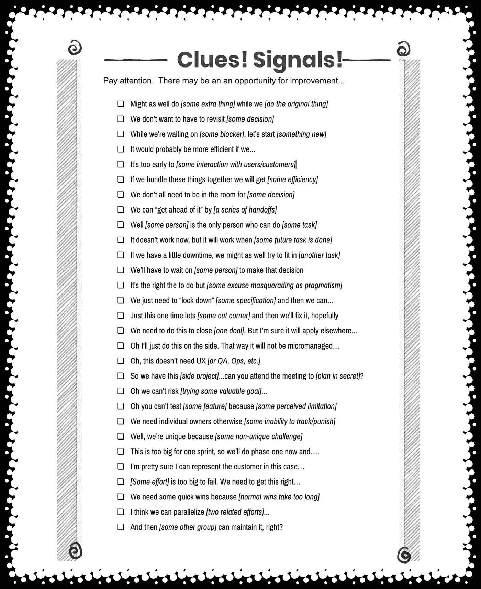

# 当你听到 _ _ _ _ _ _ _ _ _ 时，请注意

> 原文：<https://medium.com/hackernoon/when-you-hear-pay-attention-41a27a9b2767>

注意:有了爸爸的身份，我可以做更多的清单。在学习照顾这个放屁/打嗝/便便/微笑的可怕的小人类时，他们更容易写作。抱歉，如果你是长文的粉丝。我最终/偶尔会回复他们。

## 快速列出可能有改进机会(和/或你即将落入陷阱，需要注意)的提示:

*   在我们[做原来的事情]的时候，不妨做一些额外的事情
*   我们不想重新考虑[某项决定]
*   当我们在等待某个阻断时，让我们开始一些新的东西
*   如果我们……可能会更有效率
*   [与用户/客户进行一些互动]还为时过早
*   如果我们把这些东西捆绑在一起，我们会得到[一些效率]
*   我们不需要都呆在房间里做(某个决定)
*   我们可以通过[一系列移交]来“领先一步”
*   嗯,[某个人]是唯一能做[某项任务]的人
*   它现在不起作用，但当[某个未来任务完成后]它会起作用
*   我们将不得不等某人来做决定
*   这是正确的做法，但(一些借口伪装成实用主义)
*   我们只需要“锁定”[一些规格]，然后我们就可以……
*   就这一次，让我们(偷工减料)，然后我们将修复它，希望如此
*   我们需要这样做来完成[一笔交易]。但是我确信它将适用于其他地方……
*   哦，这不需要 UX[或 QA，Ops 等。]
*   所以我们有这个[副业]…你能参加会议[秘密计划]吗？
*   哦，我们不能冒险[尝试一些有价值的目标]…
*   哦，你不能测试[一些特性]，因为[一些感知的限制]
*   我们需要个体所有者，否则(无法追踪/惩罚)
*   嗯，我们是独特的，因为[一些非独特的挑战]
*   这对于一个 sprint 来说太大了，所以我们现在就做第一阶段…
*   我非常确定在这种情况下我可以代表客户…
*   【有些努力】大到不能倒。我们需要把这件事做好…
*   我们需要一些快速的胜利，因为(正常的胜利需要太长时间)
*   我认为我们可以并行[两个相关的努力]…
*   然后[某个其他组]可以维护它，对吗？

我的朋友乔恩·奎格利和我正在写一个后续的帖子，有更多的解释，但希望这是有帮助的原始形式…

