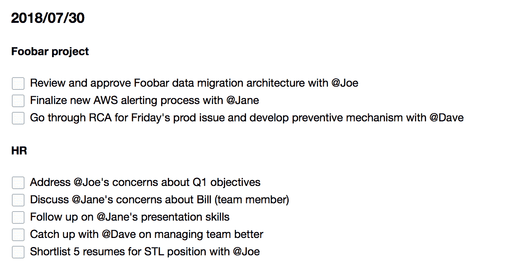
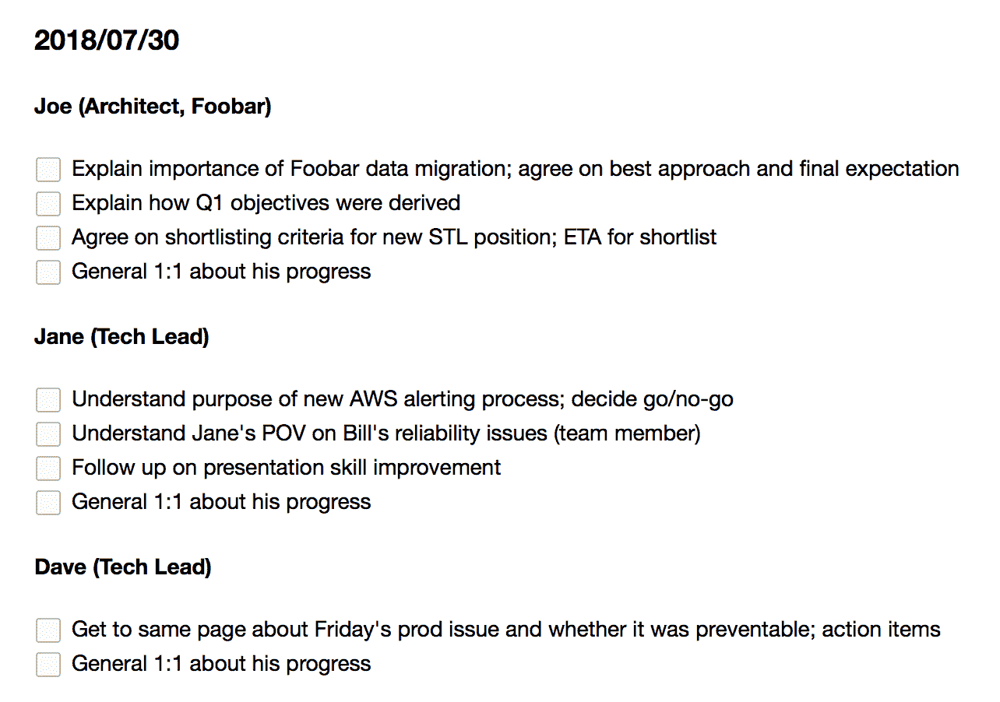

# 当你是经理时，人就变成了项目

> 原文：<https://medium.com/hackernoon/when-youre-a-manager-people-become-projects-720474ede7b0>

Image: pixabay.com

在很长一段时间里，我习惯按项目来组织我的待办事项列表。但是在过去的几年里，随着我的职责的增长和变化，我注意到一些有趣的事情:*人*已经成为我的项目。

当你被期望领导一个团队(尤其是一个大型团队)时，你再也负担不起构建产品，甚至过程。**你必须培养生产产品的人**。这是随着你的范围变大而扩展的唯一方法。

三年前，我下周一的(假设的)待办事项清单应该是这样的:

下面是它现在的样子:

它完全以人为中心。它不仅能让你在逻辑上将与人的互动分组为一对一的会议，而且每次这样的会议都是帮助他人实现微小增长的一种方式。

尽管听起来有些空洞，但更多的是将你的想法传递给其他人(这样他/她会做得和你一样好或者比你更好)，而不是直接指导别人，或者更糟的是，替他/她做事。与简单地告诉他去做相比，在前面要做更多的工作来获得对一项任务的报告，但是在后面，在跟进和未满足的期望方面要少得多。

随着每个报告变得更加独立，你应该能够将他/她作为一个新的销售线索，并开始建立更多的销售线索。对于一个感到如此不知所措以至于希望自己能克隆自己的经理来说，我怀疑这可能是退而求其次的好事情…