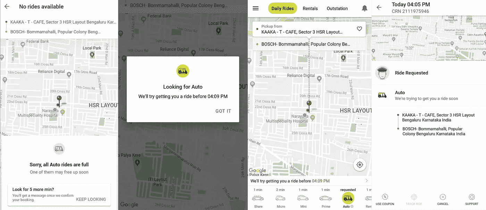

# Ola 需要电梯按钮吗？

> 原文：<https://medium.com/hackernoon/whenever-i-am-rushing-for-an-office-meeting-and-have-to-take-an-elevator-i-press-the-elevator-222286ed846b>

每当我赶着去参加办公室会议，不得不乘坐[电梯](https://hackernoon.com/tagged/elevator)时，我会多次按下电梯按钮，即使看到电梯已经开了。这是我缓解压力的一种方式。我的行为不理智，尽管我知道我不能加快事情的进展。在日常生活中，我们所有人都会遇到这种情况，尤其是当我们很匆忙，不能等待事情自己发生的时候。

[印度的打车服务 Ola](https://hackernoon.com/tagged/ola) 最近在他们的应用程序中引入了一个很酷的功能，要求用户让他们(Ola)继续寻找五分钟以上的车程，以防用户第一次没有叫到车，试图让用户更容易。

虽然我认为这是一个很好的解决问题，实际上可以帮助用户不必多次尝试预订一个旅程，但我觉得它可以以稍微更好的方式实现。让我解释一下为什么我会有这种感觉。

无论是去剧院看电影，还是去火车站赶火车回家，无论是什么情况，我总是在关键时刻做好准备，然后设法找到一辆出租车。有时候，我第一次试的时候没打到车，但是我一直在试。我不耐烦地盯着进度条，数着每一秒钟，希望能尽快找到一辆车，每当我觉得需要更长时间时，我就取消乘坐，并尝试再次预订。这样做并不是让我的出租车更快，但我觉得我这样做是在控制事情。我通过这样做来减少我的焦虑。这就是为什么我觉得这个特性可以用更好的方式实现。

正如你在下面的截图中看到的，每当我选择让 Ola 再找一个搭车的选项五分钟，我就再也看不到进度条了。我看不到任何向前移动的东西。当然，我被通知应用程序将在五分钟内搜索搭车。当然，我可以选择取消这次尝试，并再次提出请求。但是，由于没有显示进度，这个应用程序没有让我觉得我在控制。显示耗时较长的动作的进度是用户界面设计的一个基本原则。

Ola- Look for five more minutes feature

参考资料:

*   正如 https://www.nngroup.com/articles/progress-indicators/[的文章](https://www.nngroup.com/articles/progress-indicators/)中所解释的，进度指标让一个缓慢的系统变得难以忍受，并减少了不确定性。
*   这是《纽约时报》的另一篇文章。[https://www . nytimes . com/2016/10/28/us/placebo-buttons-elevators-cross walks . html](https://www.nytimes.com/2016/10/28/us/placebo-buttons-elevators-crosswalks.html)