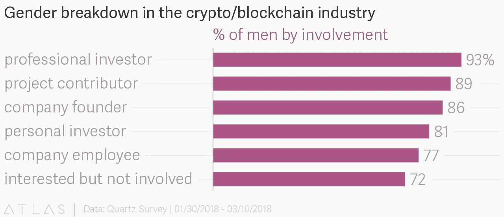
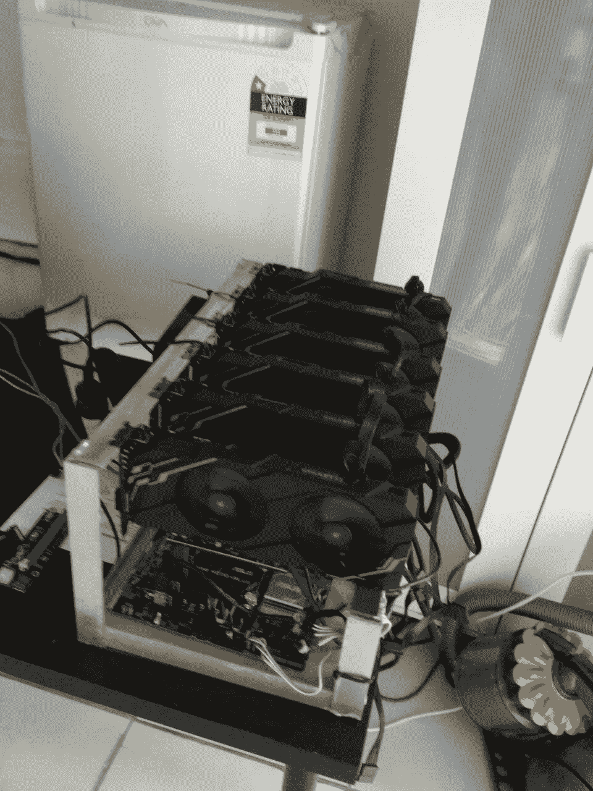

# 所有的女人都在哪里？为什么区块链需要女性，作为女性，我们应该如何以及为什么挖掘加密货币。

> 原文：<https://medium.com/hackernoon/where-are-all-the-women-6334fdfd80b1>

首先，让我先说——当然——在[加密货币](https://hackernoon.com/tagged/cryptocurrency)中有令人惊叹的女性。 [**见*酒馆***](https://hackernoon.com/a-look-at-the-women-of-crypto-ede46f14e4f0) 。[斯塔克](https://twitter.com/starkness?lang=en)、[德米罗斯](https://twitter.com/Melt_Dem)、[阿雷菲瓦](https://icobench.com/u/daria)等等，这些都是在这个行业工作过的女性，她们是这个行业全球化进程、商业发展和技术发展的内在因素。他们中的大多数人不希望自己的性别被牵扯进来，这很好，也正是他们应该做的。在理想的世界里。

但是我们还没有到那一步。我们仍然生活在一个被父权制腐蚀的系统中，加密货币的世界也没有——还没有——免受它的压迫。加密货币领域的女性忙于在行业内争取性别平等，为什么她们要既是开拓者又是自由战士？它来自大众，普通的普通人，所以我们这些人——像我自己一样——在幕后默默挖掘和交易，他们需要站出来，开始在这个行业、这个社区占据一席之地。我相信它有潜力在教育、科技和金融之外的领域为我们充当实践(变革)的媒介。我们必须让我们的朋友、姐妹、女朋友、同事和其他女性知道，这是一个领域、一个社区、一个机会，不仅可以赚钱，还可以做出一些合理的、意义深远的改变，让生活变得更好。

什么是性别不平等，特别是薪酬差距？

现在，我不知道如何克服性别不平等。我知道我们从教育开始，但对我来说，要开始解决如此巨大的结构性不平等，我们必须拆除或绕过其他系统，这些系统也是为了创造从中获利的价值等级——如新自由主义市场。自 1944 年布雷顿森林协定和 1960 年石油输出国组织形成以来，结构性不平等一直受到美帝国主义及其资源垄断的支配，在这样的全球背景下很难解决这一问题。

我真的不想在这里深入讨论，因为这太累人了，但是石油输出国组织是一群民族国家/家族，他们实际上控制着对世界的石油销售。它是在亨利·基辛格(美国总统)的帮助下成立的。)它让其成员国/家族变得异常富有，但也让美国变得异常富有和强大。为什么？基本上，因为协议的一部分包括了石油只能以美元出售的条款。在一个正在耗尽石油和石油收入的星球上，美国确保了自己是每个人都需要继续运转的一个重要齿轮。这使他们更加富有，更加强大。只要世界需要石油，世界就需要购买美元。

但是现在，你要么无聊，要么困惑，要么迷失。公平。从本质上来说，作为一个“人民”群体(不是政治家、首席执行官等)，当我们对自己的生活几乎没有控制权时，我们真的无法做太多事情来改变大局问题。政治家和公司做决定，制定政策并获取利润，他们是控制者。它们在很大程度上受制于相当隐秘的木偶剧院，即国际货币基金组织、美联储和控制它们的政府。加密货币有可能改变权力交换。为什么？因为它的本质。它是去中心化的，因此资源(区块链上的石块和对它们有价值的硬币)不能由一个国家或组织控制，因为它以数字格式存在，任何人都可以拥有、控制和交易。这意味着，如果我们所有人，作为个人，决定开始使用一种特定的硬币，而不是政府给我们的货币，我们将能够彻底改变我们、政府和企业之间的权力交换。

那么，这与女性或加密货币有什么关系呢？

你不可能马上做出巨大的改变。你必须从个人行动和深思熟虑开始。加密货币仍然存在于我们的系统中，因此它仍然是该系统不平等的受害者。也就是说，它在很大程度上是由人控制的，并且是为了利润和男人的命令而运行的。

[https://qz.com/1262167/the-first-rule-of-being-a-woman-in-crypto-is-you-do-not-talk-about-being-a-woman-in-crypto/](https://qz.com/1262167/the-first-rule-of-being-a-woman-in-crypto-is-you-do-not-talk-about-being-a-woman-in-crypto/)

这糟透了。但这种情况无处不在，在大多数行业，尤其是在私营部门。那么，加密货币有什么不同呢？正如我之前所说，它的交易很大程度上是匿名的，网络和关系的建立是由我们的计算机(或 GPU 或其他任何东西)及其软件完成的，而不是由我们完成的。那么，使这一过程去人性化实际上是如何让我们在人类之间创造更多平等的呢？它去掉了造成不平等的变量——我们的社会身份。让我解释一下。因此，当我们进行商业交易、达成交易、被雇佣、获取利润时，有一件事是我们必须做的——我们建立关系。你和面试官建立了融洽的关系，你和老板在喝酒的时候交了朋友，你进入了你喜欢的某个人的白皮书的 dms 系统，等等——你建立关系是为了去你想去的地方，为了实现你的目标。不幸的是，没有人会有清白的过去。我们知道有一个男孩俱乐部。我们知道，妇女在工作场所各个层面都受到歧视。但是让我们把它分解一下。下面我列出了澳大利亚性别薪酬差距的一些原因(目前为 15.3%)。)然后，我提出了我的推理，即 crypto 如何有潜力更好地改变这种情况。

**男女薪酬差距的原因**

摘自(https://www . wgea . gov . au/addressing-pay-equity/what-gender-pay-gap 或阅读更多[https://www . wgea . gov . au/sites/default/files/International-gender-reporting . pdf](https://www.wgea.gov.au/sites/default/files/International-gender-reporting.pdf))

因此，性别薪酬差距受到许多因素的影响，包括:

1.雇佣和薪酬决策中的歧视和偏见。

加密货币交易、交易、奖励、利润和关系(正如我前面所说的)依赖于计算机之间建立的连接，这些连接通过复杂的数学算法检查其可信度、技能和价值。人类交易、交易、回报、利润和关系依赖于人们之间建立的联系，这些联系基于一套复杂且通常令人反感和压抑的态度、价值观和信仰(也称为性别歧视/种族主义/能力主义/恐同)来评估他们的性格和价值，这些态度、价值观和信仰通常是无意识的，因此是相当不可预测的，因此是不可靠的。这就是我之前所说的去人性化——你的性别无关紧要，因为你的系统为你建立了网络。只要你的样张通过检查，就没人关心你的粉色/黑色/etc 位，也没人知道这些，所以他们不能基于过时和荒谬的理想无意识地让你无效。这似乎是消除歧视的一种有效方式——通过改变我们评估和建立社区信任的方式来消除歧视的能力。是的，首先你必须活跃在加密世界，但是采矿和交易的网络是在一个匿名平台上进行的，所以没人知道。这意味着利润——因此硬币奖励、采矿、套利、硬币升值利润，这些都是在不需要建立人际关系的情况下发生的——因此没有性别偏见。

还有什么？

2.从事不同行业和不同工作的妇女和男子，女性占主导地位的行业和工作工资较低

3.妇女过多地承担无报酬的照料和家务工作

4.工作场所缺乏灵活性，无法兼顾照顾和其他责任，尤其是高级职位

5.女性离开职场的时间更长，这影响了职业发展和机会。

加密货币挖掘不是一项工作。你不需要学位、工作地点、资格和执照。你不需要社交，不需要擦肩而过，总是有一些机智的话要说，穿着精心熨烫的衬衫，有“正确的”生殖器(性别不平等是如此怪异。)你甚至不需要能够离开你的房子。你只需要互联网和基本的计算机技能。特别是加密挖掘，非常容易忘记。你把你的装备指向你想让它们去的地方，你打开它们…你就可以走了。是的，如果你想尝试更小的硬币，你需要了解硬币，观察市场，阅读白皮书，但如果你有兴趣稳妥行事，你可以通过挖掘比特币和 Eth 赚到可观的钱。或者只是找到一个矿池，并相信社区的知识——在加密挖掘中，只有当每个人都赚钱时，你才能赚钱——并让他们为你做决定。它有你想要的深度。这意味着，在无偿护理和家务工作的情况下，你可以有一台机器，实际上是在你的客厅里(见下面我的机器在我的客厅里的照片——我刚刚攒够了足够的钱来投资我自己的 GPU 装备，所以我现在在这！)在你忙碌的时候为你赚钱。你甚至不必有钻机，如果你想，你可以在你的手机上采矿。

I decided not to crop it so you can all marvel at my luxurious interior.

这是一个灵活的系统——同样，你可以在你的手机上做——允许它的用户(以及从中获利的人)随心所欲地安排他们的时间。你可以坐着看积木滚进来，或者去工作，或者去躺一会儿，或者换尿布，或者和你的孩子一起玩。这并不取决于你去关注它或为之努力，你可以按照自己的方式生活。

不，这不一定是一个涵盖所有的解决方案，我不会告诉你你可以在你的手机上谋生(我赚的足够支付我的汽油和电费，这实际上是很好的，因为我住在那里)，但我们(作为一种全球文化)只是在我们加密货币之旅的开始，这项技术让你有可能平衡你的个人竞技场。这是母亲可以做的事，全职或兼职工作者可以做的事，任何人都可以做的事。虽然进入这个领域可能会令人生畏，但谷歌确实是你最好的朋友。有一些令人惊讶的和易于使用的资源，用真正用户友好的语言解释了如何和什么，学习过程是你想要的时间密集。除了基本的 office (excel 等)技能之外，我真的没有任何计算机知识，我的背景是文学和语言，但对我来说，进入交易和采矿并不是一个漫长或困难的旅程。最恼人的部分是诚实地让你的钱包成立，这只是需要耐心，和谷歌。

嗯，至少你有谷歌，对不对？