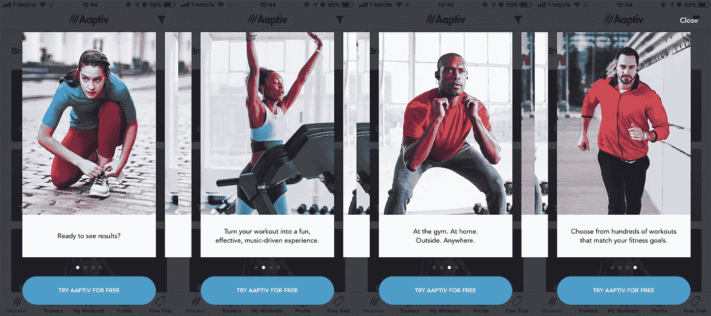

# 产品创意从何而来？

> 原文：<https://medium.com/hackernoon/where-do-product-ideas-come-from-d035c8d6b2e4>

## 产品构思指南

区分初级[产品经理](https://hackernoon.com/tagged/product-manager)和高级项目经理(或者专业*项目*经理和专业*管道*经理)的最重要技能之一是产生好的[产品](https://hackernoon.com/tagged/product)创意的能力。好的项目经理可能擅长管理 sprints 和发布特性，但是知道什么时候构建什么更难掌握。

这并不意味着你应该立即起草一封意识流电子邮件给你的经理，其中包含 500 个随机想法，标题为“我们可以构建的东西”。相反，提出一套正确的高影响力产品创意取决于你的团队/角色、你的公司目标和你的业务性质。

概括来说，有三种类型的产品创意:

1.  ***优化&测试*** :针对一个或多个关键指标，对产品进行小的改进，以获得更好的性能。
2.  ***用户问题解决方案*** :解决您当前用户显性或潜在需求的功能特性。
3.  *有远见的战略行动:旨在将业务扩展到新市场或转向新方向的新产品扩展。*

## *优化和测试*

*顾名思义，这些产品理念涉及到对用户界面和体验的小变化进行试验的持续过程，从而对转换率和保留率等关键指标进行适度的改进。例子包括:*

*   *从入职流程中删除和合并屏幕*
*   *单页结账流程与多个连续屏幕*
*   *修改登录页面上的文本和可视元素*

***何时关注它**:许多公司觉得他们*应该*进行变体测试，因为其他人都在做。在实践中，如果你的流量或平均客户生命周期价值足够大，10%的相对转换率提高会带来收入的大幅增长，你应该只关注测试。换句话说，除非你是亚马逊，否则如果结帐选项#2 将转换率从 0.21%提高到 0.22%，这可能没有多大关系。*

*如何提出这类想法:从一两个你想要提高的关键绩效指标开始，无论是转化率、参与度还是保留率。然后，确定用户在漏斗中采取的每一步的完成率。将这些屏幕打印出来，标明从一个屏幕到下一个屏幕的下降率，并将它们并排放置，以促进利益相关者之间的头脑风暴式对话，这通常会有所帮助。*

*优化想法的其他潜在来源包括二级市场研究。在 2018 年的这一点上，提高转换或入职完成率的 A/B 测试在网上的各种文章和公司案例研究中有据可查。例如，[这篇关于多灵](http://firstround.com/review/the-tenets-of-a-b-testing-from-duolingos-master-growth-hacker/) o 的文章强调了一些基本原则，这些原则绝对值得在消费者应用程序中进行测试。*

**

*Changing the copy on the button from “Try Aaptiv Now” to “Try Aaptiv for Free” led to a double-digit increase in our subscribe rate — but that only made a difference because our traffic numbers were high to begin with.*

## *当前用户问题的解决方案*

*这些类型的产品创意分为三类:*

*   ****Tablestakes 特点***:2018 年，用户对数码产品的期望值比十年甚至五年前高了很多。像无缝结账、关键字搜索和社交媒体集成这样的功能不仅仅是常见的，它们是意料之中的。没有表格功能会损害用户的信任，并让人怀疑你是否在经营一家合法的企业。*
*   ****显性需求*** :显性需求是用户已经确定的解决方案的问题。Spotify 是围绕解决明确的用户需求而建立的最成功的公司之一。在流媒体出现之前的黑暗时代，用户必须将歌曲下载到电脑上，插入手机传输文件，并定期清理旧歌曲以释放空间。Spotify 经历了一个漫长、数小时的过程，创建了一个简单的解决方案，只需要在手机上点击几下。*
*   ****潜在需求*** :另一方面，用户可能没有意识到潜在的需求，并且头脑中肯定没有解决这些需求的方案。例如，在全球定位系统出现之前，人们在离开家之前会研究方向。如果他们写错了，他们会四处询问，直到一个善良的灵魂给他们指出正确的方向。虽然很不方便，但大多数人并没有为此失眠，当然也很少有人会要求一个有趣的小口袋电脑，它可以实时告诉你去哪里。*

***何时关注:**全天 erryday。作为一个产品经理，你的工作是找出你的用户想要什么，然后去做那些东西。然而，根据你所在的公司所处的阶段以及公司的经营状况，表的构成从特征到显性需求到潜在需求会有所不同。*

*如何想出这种点子:想出用户问题的解决方案似乎很容易(“让我们问问我们的客户他们想看到什么功能！”)但是要注意:过于依赖入站用户的特性请求会让你产生自我选择的偏见。你最终会为一小群活跃的用户开发功能，而忽略那些沉默的用户或者那些你无法捕捉到的用户。从长远来看，你的产品变得越来越小众，最终会疏远你核心粉丝群之外的所有人。*

*We asked our users what they wanted, and this is what they said.*

*相反，使用定量和定性反馈的组合来确保你从一个有代表性的样本中获得产品反馈。具体来说:*

1.  ****执行数据分析*** 算出你需要瞄准哪些用户。这些细分市场可能包括那些打开应用程序几次后就翻看的用户，或者他们创建了一个帐户但从未购买过。通常来说，赢得流失的用户比纠结于优化最积极的用户(他们会继续使用你的产品)的体验更有影响力。*
2.  ****对这些参与度较低的用户进行行为访谈*** ，了解他们对你的产品的最初体验，以及他们尝试的动机。避免问他们哪些功能可以让它变得更好，因为这可能会过早地让你偏向某个解决方案。如果你没有专门的用户研究功能，看看这些关于如何进行一次好的用户访谈的伟大文章: [*永远不要问他们想要什么*](/user-research/never-ask-what-they-want-3-better-questions-to-ask-in-user-interviews-aeddd2a2101e) 和[*问正确的问题*](https://uxdesign.cc/asking-the-right-questions-on-user-research-interviews-and-testing-427261742a67) *。**
3.  ****找出用户反馈中的共同主题*** 。是否有多个用户表达的某些观点？这些情绪的强度是多少？突出这些问题，并与你的设计师、工程师和利益相关者团队讨论——这些将决定你的下一组产品功能想法。*

## *有远见的战略游戏*

*有时，你的公司可能需要转向或向不同的方向扩张才能成功。在这种情况下，你必须超越现有用户，提出更具创造性和远见的新产品想法——也许是为目前驱动你的消费应用程序的技术找到一个企业应用程序，或者也许是将你的触角进一步延伸到供应链。*

***何时专注于 it** :除非你是一家拥有近乎无限资源的大公司，否则你无法专注于为你的主要用户打造优秀产品，同时探索新的业务线。对于大多数初创公司来说，优先考虑一个往往会以牺牲另一个为代价，因此了解何时开始探索新的战略产品方向至关重要:*

*   ****如果没有产品-市场契合度*** :没有衡量产品-市场契合度的神奇公式。但是，如果不管你推出什么功能，你的转化率、用户参与度和口碑分享率仍然很低，用户可能不会重视你的产品。在这种情况下，您可能希望将重点放在核心技术的新应用程序上，或者针对底层用户问题的截然不同的解决方案上。*

*   ****如果你目前的产品不盈利*** :或者，用户可能喜欢你的产品，你在可靠地增长，但没有赚到足够的钱来实现收支平衡。假设你不能简单地提高价格，探索产品功能，让你为更高级版本的功能收取更多费用，或者为不同的客户群重新包装你的核心产品。*

***如何想出这些想法**:创造性的、有远见的产品想法可能看起来完全来自专家的想法，但它们实际上遵循一些熟悉的模式。其中包括:*

*   ****消费者对企业*** :确定私人公司是否对你的用户、你的产品或你的底层技术感兴趣，然后弄清楚你需要构建什么样的功能才能卖给这些公司。这种策略对以消费者为中心的公司很有效，但反之则很少。例如，脸书和 Snapchat 建立了庞大的参与用户群，然后向希望根据人口统计和行为数据锁定特定细分市场的企业出售广告。*
*   **:进行调研，确定用户最看重哪些功能；然后创建一个高级会员层，用户支付额外费用来获得这些功能。这种策略的成功例子包括从 Tinder Premium 到 Invision 的 Pro、Team 和 Enterprise 层，从 Tinder Premium 到 Invision 的 Pro、Team 和 Enterprise 层提供越来越多的原型和用户帐户。**
*   *****邻近用户旅程*** :最后，采访用户，找出他们在你的产品之外通常采取的其他行动，并设计功能，让他们在一个地方完成整个工作流程。例如，Atlassian 从吉拉开始，允许团队合作分配工作和跟踪项目进展；此后不久，他们推出了 Confluence 来帮助团队更好地记录他们的集体知识。**

## **最后**

**想出好的产品创意通常看起来令人望而生畏，但事实是，大多数创意都属于几种常见模式中的一种。事实上，想出更多的想法往往比知道正确的方法来优先考虑这些想法更容易。最终，产品经理必须掌握这两种技能，才能“升级”成为有战略眼光的领导者。**