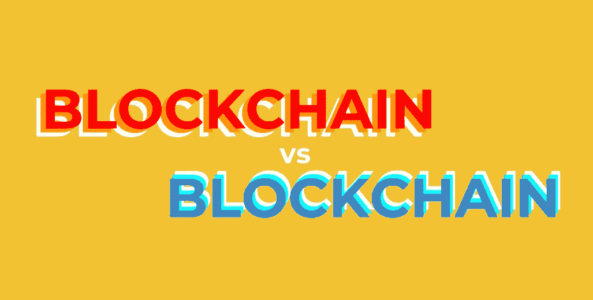

# 在关于区块链的辩论中，你站在哪一边？

> 原文：<https://medium.com/hackernoon/where-do-you-stand-in-the-debate-about-blockchain-75aaf0bc8fe>

> 我对区块链很感兴趣，但同时也很害怕。我真的是。

这是几年前的我，当时围绕比特币的所有讨论都在加剧，辩论也非常两极分化。这主要是关于加密货币，而不是技术本身。这场辩论仍然非常两极化，仍然有太多关于加密货币的内容。但今天我比以往任何时候都更清楚自己的立场。

我是一个信徒，我认为区块链将对社会和技术产生巨大的影响。

在过去的几年里，我见过一些区块链的创始人和开发者。我参加过关于区块链和政府交集的会议和圆桌会议。我探索了在许多领域支持区块链技术的平台和公司，包括[Civil:Self-sustain Journalism](https://medium.com/u/af0892caae93?source=post_page-----75aaf0bc8fe--------------------------------)，这是一个有潜力真正改变新闻业的平台。

区块链的来龙去脉很难把握，即使我认为自己是一个科技极客…一个书呆子！要完全理解它需要一个博士学位，询问定义总是会导致无数的解释，很少有解释是所有人都容易理解的。

我不打算在这里列举不同的定义。最好的方法是谷歌一下。

但是有一个定义引起了我的注意！

几个月前，在一次关于“区块链为政府和外交服务”的小组讨论中，有人问[咨询公司](https://medium.com/u/6c7078bf7b01?source=post_page-----75aaf0bc8fe--------------------------------)的 Tori Adams，对于一个昏迷 20 年后醒来的人，如何定义区块链。

> 别担心。

“我想了很多，因为我试图向我的父亲解释，”托里说，解释了她如何看待这个问题的两种方式。“一种是对人们说‘别担心’。你知道你的手机是怎么工作的吗？我一点也不知道我的电话是如何工作的。我们谈论的不是电话如何工作，而是 TCP/IP 和互联网如何工作。我们不需要知道它是如何工作的才能知道它是如何工作的。因此，一方面，不要担心它，看看基于它的应用程序和它提供的服务。你不需要了解互联网是如何工作的，就能在网上预订机票。你只需要知道它是有效的。”

然而，托里对区块链的定义更进了一步，称其为“真理保存机器”她解释道:“如果某件事在某一点上是真的，那么在另一点上也会是真的。如果你不信任别人，那么保持真相的活动是非常重要的事情。从概念上来说，这确实是它所做的:它允许你在你不信任的人之间分享你担心的信息。那是一件相当好的事情！”

对我来说，这是超越加密货币的思考方式。这是将区块链介绍给更多主流公众的好方法。