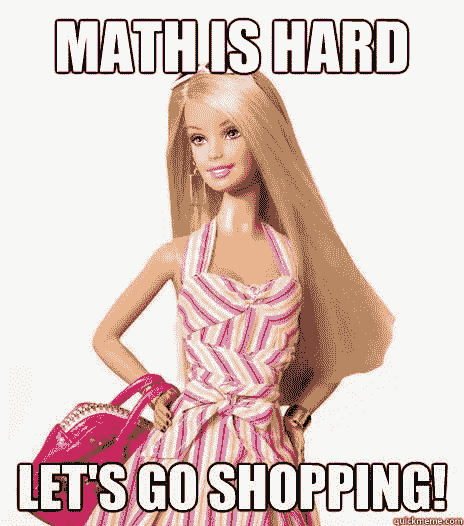

# 数学冒名顶替综合症从何而来？

> 原文：<https://medium.com/hackernoon/where-does-math-impostor-syndrome-come-from-73db0440ad26>

如果你曾经坐在一堂方程式密集的课上，觉得自己很愚蠢，我想和你分享一个秘密:其他学生可能是装的。原来人类的大脑无法处理一堂典型的数学课。

这适用于大多数 [STEM](https://en.wikipedia.org/wiki/Science,_technology,_engineering,_and_mathematics) 学科，而不仅仅是数学，所以当你继续阅读时，请随意查看你最喜欢的技术细节来代替单词*方程式*。

## 数学骗子综合症从何而来

我遇到过一些教授，他们只是读了课本，然后把它写在黑板上。在那种设定下，学生不能回头参考(按照自己的步调！)的符号和方程式代表什么，所以他们必须将这些想法加载到工作记忆中。不幸的是，负载经常超过容量，这意味着观众跟不上，完全停止收听。这一课的其余部分听起来像鸟鸣。

在这样的课堂上，你会看到四种主要的学生:

1.  白日梦者坐在教室里，目光呆滞，对自己以后从课本上学到的东西充满信心。上课对他们来说是浪费时间，但他们还是去上课，以防有关于考试的通知。
2.  **卖弄**，上课前学过的材料。他们没有使用工作记忆，因为它存在于他们的长期记忆中；他们并不是第一次全部学会。在参加之前，他们已经能流利地使用所有的新术语和符号*。他们是终极巨魔，因为他们让这看起来很容易，并给教授关于课程质量的虚假反馈。*
3.  **记笔记者**，他们在那里记下它。他们主要想的是写作，所以他们不担心他们吸收的东西有多少。像白日梦者一样，他们相信他们以后会明白的。主要的区别是他们很快乐；写作活动分散了他们的注意力，使他们不去注意他们浪费了多少时间。(为什么教授不直接提供笔记的复印件？为什么学生们不直接拍黑板呢？)
4.  自我诊断的冒名顶替者，他们担心自己因为愚蠢而什么都不懂。他们听到“天才”问一些聪明的问题，并认为这证明他们不属于这个群体。与白日梦者不同，他们认为自己不懂是因为自己的学习能力，而不是老师的教学能力。他们害怕在课堂上发言，以防有人发现他们不属于那里。

真是一场闹剧！原来我们无法摆脱点头微笑。在技术研讨会上，我经常让坐在我旁边的微笑者分享他们学到的东西，以此自娱。典型反应？第一张幻灯片的信息/最后一张幻灯片的信息/关于最闪光的插图所传达的观点的一些事情/“哎呀，对不起，我在想其他的事情。”

When a presentation isn’t designed to engage the audience, it loses them. It sounds like birdsong to them and is just as boring. They might think it’s their fault for learning nothing, when it’s the presenter’s.

在成长过程中，我很幸运地被社会化为极度自信的人，所以我通常居住在前两个群体中。(我记得有两节紧张的课让我认真思考我可能是个白痴的可能性，所以我也知道那是什么感觉。)自信心较低的朋友发现自己在最后一组，最终螺旋式下降，脱离数学。我见过那些留下来的人在辉煌的职业生涯中淹没在[冒名顶替综合症](https://en.wikipedia.org/wiki/Impostor_syndrome)中。

## 无聊还是困难？

我的父母(物理学家，都是博士)让我相信数学很容易。他们认为像“数学很难”或“我不擅长数学”这样的句子是荒谬的:数学就像烹饪，没有更多也没有更少的荣誉。方程式就像食谱，你只有在真正烹饪的时候才需要它们。在你开始烹饪之前，你需要一个概念性的理解，并且知道在哪里可以找到合适的烹饪书。如果你甚至不确定你是否想做这道菜，关于烤箱温度的繁琐细节很无聊，你应该感到无聊。我的父母会说类似于*“崇拜数字是愚蠢的。我非常了解数学，所以我不再尊重它。”使用数学就像知道如何阅读——谈论它是神奇的或者只有聪明/有天赋的人才会被笑出我的客厅。*

> 我对数学的理解如此深刻，以至于我不再尊重它。

我在期望中长大，我属于我的数学课，如果我感到无聊，那是我老师的错。当这种情况发生时，我的父母鼓励我溜出教室，去学习我自己的课本。(当然，我回来的时候会很害怕——对下学期的符号和定理了如指掌——我已经玩过了。当其他人把时间花在糟糕的教训上时，我把时间花在学习上。这意味着我会成为那些把别人的一天变得如此简单而毁掉的孩子中的一员。)

Huxley thinks this textbook is boring. I thought so too, so I bought a different one. When things get boring, seek the same knowledge elsewhere. If it’s worth learning, it can be made exciting!

在数学很难的神话中长大的人(从某种意义上来说，除了偶尔的无聊)认为他们不能跟上课程是他们自己的错。这让他们更容易患上冒名顶替综合症。

## 这对多样性意味着什么

差异——多样性！—应该受到欢迎和庆祝。不幸的是，这整个设置不是很受欢迎。

我大胆猜测一下，如果你觉得自己与你所认为的标准数学呆子不同，你更有可能认为不理解发生了什么是你的错，而不是老师的错。如果你一开始觉得自己是个骗子，你就不太可能问你的同学他们是否也在受苦。每当那些“天才”中的一个把一个赶出公园，你就更深地退缩到自己的壳里，让你更难得出正确的结论:“这些人类就像我一样，他们可能感受到我的感受。如果我不跟上，其他人也会迷失方向。”

Stereotypes don’t help! Math isn’t any tougher than cooking, but if everyone (even this [actual Barbie doll](https://en.wikipedia.org/wiki/Teen_Talk_Barbie)) tells you to expect to struggle, you might blame yourself when you should blame a bad teacher.

当你怀疑自己的时候，因为你感觉自己是唯一一个不明白的人，记住:其他人要么已经学会了大部分，要么是假装的。你不是一个人，所以善待自己。

就数学而言，你和教室里的其他人是一样的；你已经学习了作为这门课先决条件的概念，所以你属于这门课。就这么简单。

让我提醒大家，造就伟大数学家的技能并不是让某人成为有趣的演讲者或有效的老师的技能。这需要一个不可思议的(不仅仅是体面的，*不可思议的*)老师来抛弃几代人“把食谱写在黑板上”作为教育下一批学习者的手段。大多数人只会按照一贯的方式去做。

## 这对学生来说意味着什么？

代表各地数学老师教授:“不是你，是我。”

如果你很难理解，那可能是因为教学质量差和/或演讲者不了解他们的听众。[他们一次扔给你太多新的符号，你不能指望在工作记忆中记住它们。](http://bit.ly/quaesita_noeqns)善待自己。你不会完全理解，这没关系。

如果整个会议对你来说听起来像鸟鸣，那是演讲者的错，而不是你的。上课提问没多大帮助:太少太晚了。问题不在于一两个事实，而在于演讲者的整个教学理念。如果你够勇敢，课后和他们谈谈他们的演讲风格(或者让他们[在这里](/@kozyrkov/why-i-avoid-equations-in-my-talks-f7b6f7aac23a))。如果没有，找其他资源(YouTube？书籍？导师？谜题？博客？朋友？)以不同的方式教授相同的概念，然后按照你自己的速度进行。就我个人而言，直接解决问题，甚至不读这一章，我会学得更好。相反，我把它作为一种资源，当我(不可避免地)陷入困境时，我可以挖掘它。

对我来说，数学和编程感觉很像乐高。一节课或教科书中的一章会给你一些新的乐高积木，你可以把它们放入你的桶中，用你的收藏构建一个坚固的解决方案。我一直觉得很神奇，有人愿意付钱让我整天玩乐高。(然而他们有！)

## 这对演讲者和老师来说意味着什么？

“这是一直以来的做法”对任何事情来说都是一个可怕的理由，包括你选择沟通方式的方式。

如果你对自己诚实，你会发现对你来说看起来如此美好的细节实际上很少能帮助你的观众。不要把时间浪费在他们现在无法理解的方程式上。相反，告诉他们*如何*在他们拿着纸和笔弯腰驼背的时候使用那个等式。告诉他们为什么应该对此感到兴奋，以及它如何融入更大的图景。告诉他们为什么难以获得/发现，以及推动发现的关键洞察力是什么。告诉你的听众他们以后需要的方程，告诉他们在哪里可以找到，他们想用这个方程做什么。告诉他们为什么应该关心。

毕竟这就像做饭一样。你不会通过给你的观众读食谱来说服他们做[抓饭](https://food52.com/recipes/37618-mansaf)，尤其是如果他们从未听说过的话。他们不在乎放多少洋葱进去。你的工作是告诉他们通过阅读食谱他们不会学到什么。哪一个作为《曼萨夫》的介绍更有用，是[本质方程式](https://food52.com/recipes/37618-mansaf)还是[概念概述](https://migrationology.com/mansaf-jordan/)？你应该只在你说服他们想自己做之后，在你的学生面前做这道菜。让他们兴奋起来，否则他们会认为烹饪很无聊，或者更糟，他们不擅长烹饪。

如果你有兴趣了解更多，我在这里为演讲者和老师写了一些建议。

# 感谢阅读！人工智能课程怎么样？

如果你在这里很开心，并且你很想尝试一个类比驱动(而不是等式驱动)的人工智能课程，这个课程旨在为初学者和专家提供乐趣，这里有一个我为你制作的娱乐课程:

Enjoy the entire course playlist here: [bit.ly/machinefriend](http://bit.ly/machinefriend)

# 喜欢作者？与凯西·科兹尔科夫联系

让我们做朋友吧！你可以在 [Twitter](https://twitter.com/quaesita) 、 [YouTube](https://www.youtube.com/channel/UCbOX--VOebPe-MMRkatFRxw) 、 [Substack](http://decision.substack.com) 和 [LinkedIn](https://www.linkedin.com/in/kozyrkov/) 上找到我。有兴趣让我在你的活动上发言吗？使用[表格](http://bit.ly/makecassietalk)取得联系。