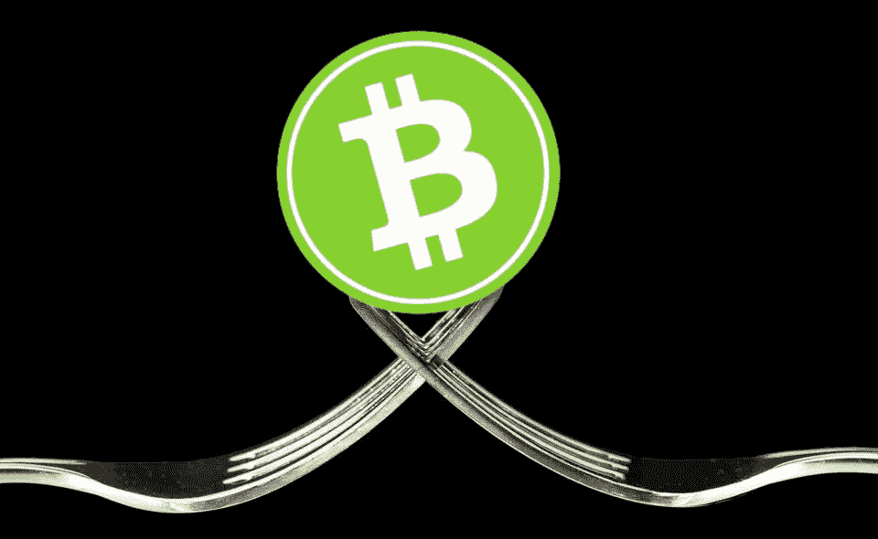
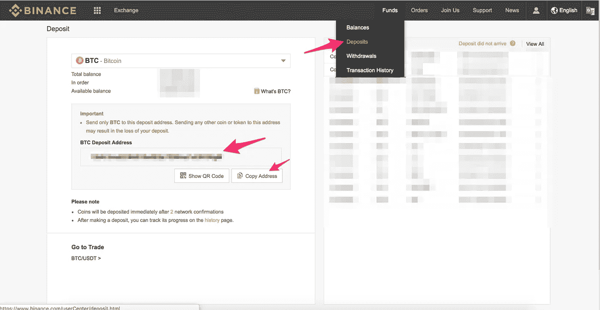
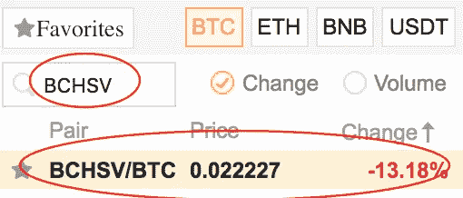
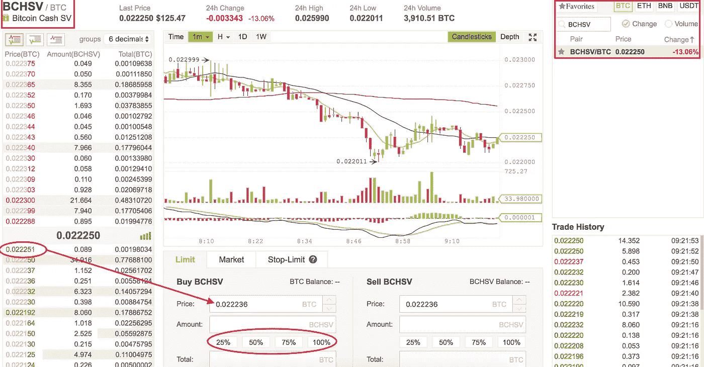

# 在哪里&如何购买 BCH SV

> 原文：<https://medium.com/hackernoon/where-how-to-buy-bch-sv-bitcoincash-satoshi-vision-e1bb6bddbef8>

## 一个全面的指导，了解什么是 BCH SV，如何从币安购买 BCH SV。

## BCH SV 简介

众所周知，**比特币现金(BCH)** 经历了一场有争议的硬分叉，产生了两个不同支持的新链 **BCH ABC** 和 **BCH SV。**

现在这两种硬币都被开采出来了(具有不同的支持和不同的散列能力)，它们中的每一种都有不同的美元价值，并且现在都在主要的交易所交易。

在这里，我想提供一个详细的指南，告诉你在哪里以及如何购买 BCH ABC 和 BCH SV。

 [## 在哪里以及如何购买 BCH ABC(比特币现金 ABC)

### 一个全面的指南，了解什么是 BCH ABC，它的目的和如何从币安购买 BCH ABC。

hackernoon.com](https://hackernoon.com/where-how-to-buy-bch-abc-bitcoincash-abc-f30314797a73) 

这篇文章将聚焦于 **BCH SV。**

## 我们开始吧

首先，我们需要使用法定货币购买比特币，以便在其他交易所购买任何加密货币(或者您可以使用您之前购买的比特币)。因此，按照链接在[比特币基地](https://www.coinbase.com/join/5940a7b706041a01971db0ec)购买比特币，然后按照下面的步骤在[币安](https://www.binance.com/?ref=27693113)购买 **BCH SV** 。如果你已经有了比特币，你可以跳过这一步，直接去币安注册。

## 在币安注册

[币安](https://www.binance.com/?ref=27693113)是一家交易费用相对较低的加密货币交易所，到目前为止表现良好，没有任何问题，支持反应良好。[币安](https://www.binance.com/?ref=27693113)上的交易平台有两种选择:**基础和高级**。在这篇文章中，我将主要介绍基本的交易选项，但是你可以查看下面的高级视图。除了能够在高级视图中进行更详细的技术分析之外，这两种视图之间没有太多的区别。

## 将您的比特币存入币安

一旦你在[币安](https://www.binance.com/?ref=27693113)上注册并登录，你可以在右上角看到几个菜单项。其中一个是“**基金**，有一个子菜单项名为“**存款**”。在这里你可以看到你所有的存款(从其他地址存入[币安](https://www.binance.com/?ref=27693113))。

因此，为了将我们在[比特币基地](https://www.coinbase.com/join/5940a7b706041a01971db0ec)或[双子星](https://gemini.com)购买的比特币发送到[币安](https://www.binance.com/?ref=27693113)，我们需要一个比特币地址——我们可以在这个页面上找到。

查看以下截图，了解如何从[比特币基地](https://www.coinbase.com/join/5940a7b706041a01971db0ec)向[币安](https://www.binance.com/?ref=27693113)存入比特币

复制地址，把你的 BTC 从[比特币基地](https://www.coinbase.com/join/5940a7b706041a01971db0ec) / [双子座](https://gemini.com)寄到这个地址。

一旦你在[币安](https://www.binance.com/?ref=27693113)上收到比特币，点击左上角 ***兑换*** 下的 ***基本*** 子菜单项。

现在我们需要在货币列表中找到带有比特币交易对的 **BCH SV** 币。看看下面的截图和说明。

*   选择右上角的 BTC 盒子。这意味着你在寻找可以用比特币交易的硬币。
*   在硬币列表上方的搜索框中输入 **BCH SV** ，它会如下所示过滤你。现在你可以看到 **BCH SV** 的现价。你几乎接近投资 **BCH SV** 。现在只需点击 **BCH SV** 即可。
*   点击 **BCH SV** ，左侧显示烛台和订单日线图，如下所示。

点击左侧所需的绿色价格，填写您在 BTC 的 **BCH SV** 的价格(在上面的屏幕截图中当前显示为 0.022236)。单击后，它会变为 0.022251。现在你需要选择你想在 **BCH SV** 投资多少 BTC。点击 25|50|75|100%,填写以该价格可以购买的 **BCH SV** 的金额。

> 你可以从那些绿色数字中自由选择价格——它们基本上是其他人的不同报价——这也叫限购。

既然你是新手，你也可以点击*旁边的 ***行情*** 标签，选择 BTC 金额，点击 ***买入 BCH SV***——这基本上是以市场价买入。*

*一旦显示成功，您可以从右上角菜单进入 ***资金- >余额*** ，搜索 **BCH SV。***

*祝贺您购买了 BCH ABC。*

> *"使用 [BearTax](https://bear.tax) 提交你的加密货币税！"*

* [## BearTax —您的加密税务助手

### 易于使用的平台，密码交易员进口交易，计算收益和文件税。

熊税](https://bear.tax/) 

> **免责声明** : **我正在使用我的推荐链接进行各自的交流。如果你使用它们，它有助于我的账单和提前写更多的信息文章。提前感谢。** *🙏*

***如果你喜欢这篇文章并继续获得更新，请关注我的***[***Twitter***](http://twitter.com/confusedcoin)***和***[***medium***](/@deepthivazrala)***。****