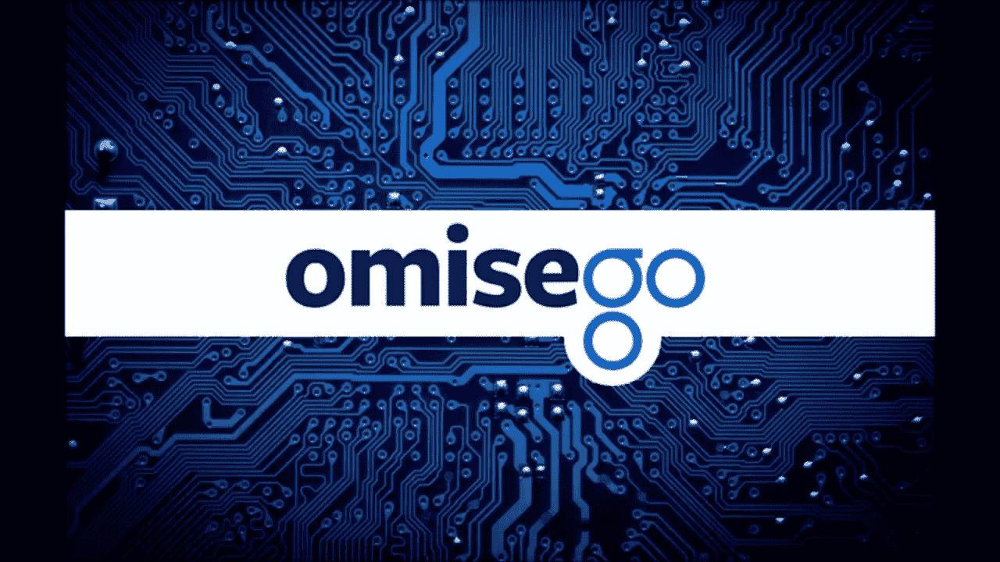
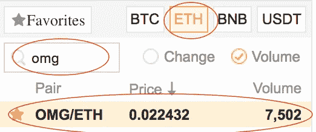
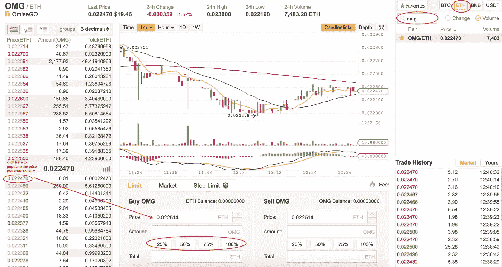

# 在哪里以及如何购买 OMG (OmiseGO)

> 原文：<https://medium.com/hackernoon/where-how-to-buy-omg-omisego-8389dcee694b>

## 综合指南了解什么是 OmiseGO，它的令牌，目的以及如何从币安购买 OMG 令牌。

## 奥米塞戈简介

我认为至少了解你要购买的东西的最基本的东西是很重要的，所以这篇文章和以后所有的文章都将包括一个简短的介绍来帮助你开始。

OmiseGO 解决了支付处理器、网关和金融机构之间的基本协调问题。通过在公共区块链上实现高容量、低成本的分散交易，OmiseGO 提供了跨货币和资产类型的下一代价值转移服务。

**让我们开始吧**

首先，我们需要购买比特币或[以太坊](https://hackernoon.com/a-beginners-guide-to-buying-ethereum-e11c73b5e5ed)才能在交易所购买任何加密货币。因此，按照下面的链接在[比特币基地](https://www.coinbase.com/join/5940a7b706041a01971db0ec)购买以太坊，然后按照下面的步骤在[币安](https://www.binance.com/?ref=27693113)购买 OMG。如果你已经有以太坊——你可以跳过这一步，直接去[币安](https://www.binance.com/?ref=27693113)注册。

[按照这个循序渐进的指南购买以太坊
以太坊，一个革命性的平台，超过 70%的硬币都建立在这个平台上。我们在这里解释如何购买 Ethereum…hackernoon.com](https://hackernoon.com/a-beginners-guide-to-buying-ethereum-e11c73b5e5ed)

> OMG 也可以用比特币购买——只是转移到另一个交易所需要更多时间，我建议用以太坊，因为只需要几分钟。

## 在[币安](https://www.binance.com/?ref=27693113)上注册

[币安](https://www.binance.com/?ref=27693113)是一家交易费用相对较低的加密货币交易所，迄今为止表现良好，没有任何问题，并获得了良好的支持响应。在[币安](https://www.binance.com/?ref=27693113)上的交易平台有两种选择:**基础和高级**。在这篇文章中，我将主要介绍基本的交易选项，但是你可以查看下面的高级视图。除了能够在高级视图中进行更详细的技术分析之外，这两种视图之间没有太多的区别。

## 将您的以太坊存款到[币安](https://www.binance.com/?ref=27693113)

一旦你在[币安](https://www.binance.com/?ref=27693113)上注册并登录，你可以在右上角看到几个菜单项。其中一个是“**基金**”，它有一个名为“**存款取款**”的子菜单项。在这里你可以看到你所有的硬币(在[币安](https://www.binance.com/?ref=27693113)购买的和从其他地址收到的)。

因此，为了将我们在比特币基地[或双子座](https://www.coinbase.com/join/5940a7b706041a01971db0ec)[购买的以太坊](https://gemini.com)发送到币安[和](https://www.binance.com/?ref=27693113)，我们需要一个以太坊地址——我们可以在这个页面上找到。

查看以下截图，了解如何从[比特币基地](https://www.coinbase.com/join/5940a7b706041a01971db0ec)向[币安](https://www.binance.com/?ref=27693113)存款以太坊

抄下地址，把你的乙醚从[比特币基地](https://www.coinbase.com/join/5940a7b706041a01971db0ec) / [双子座](https://gemini.com)送到这个地址。

在[币安](https://www.binance.com/?ref=27693113)上收到以太坊后，点击左上角 ***兑换*** 下的 ***基本*** 子菜单项。

现在我们需要在货币列表中找到带有以太坊交易对的 OMG 币。看看下面的截图和说明。

*   选择右上角的 ETH 框。这意味着你在寻找可以用以太坊交易的硬币。
*   在硬币列表上方的搜索框中输入 OMG，它会如下所示过滤你。现在可以看到 OMG/ETH 的现价了。你现在差不多接近投资 OMG 了。现在只需点击 OMG/ETH。
*   点击 OMG，弹出每日图表，左侧是烛台和订单，如下所示。

点击左侧所需的绿色价格，填写您在 ETH 中的 OMG 价格(在上面的屏幕截图中当前显示为 0.022514)。单击后，它会变为 0.022470。现在你需要选择你愿意在 OMG 上投资多少。点击 25|50|75|100%,填写以该价格可以购买的 OMG 数量。

> 你可以从那些绿色数字中自由选择价格——它们基本上是其他人的不同报价——这也叫限购。

既然你是新手，你也可以点击*旁边的 ***行情*** 标签，选择 ETH 金额，点击 ***买入 OMG***——这基本上就是以市场价买入。*

*一旦显示成功，可以从右上方菜单进入 ***资金- >存款&取款*** 搜索 OMG。*

*祝贺购买 OMG。*

> *"使用 [BearTax](https://bear.tax) 提交您的加密货币税！"*

* [## BearTax —您的加密税务助手

### 易于使用的平台，密码交易员进口交易，计算收益和文件税。

熊税](https://bear.tax) 

> **免责声明** : **我正在使用我的推荐链接进行各自的交流。如果你使用它们，它有助于我的账单和提前写更多的信息文章。提前感谢。** *🙏*

***如果你喜欢这篇文章并继续获得更新，请关注我的*** [***推特***](http://twitter.com/confusedcoin) ***和*** [***中***](/@deepthivazrala) ***。****