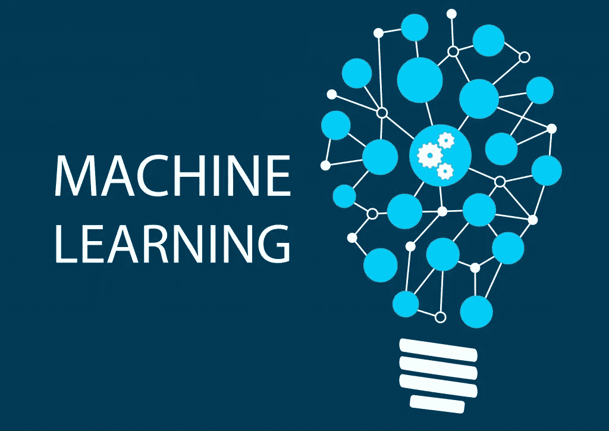
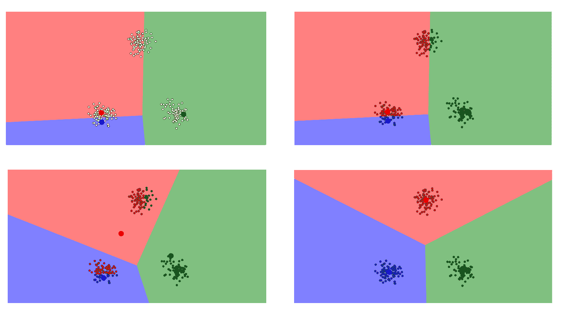
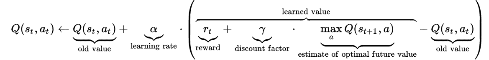

# 接下来去哪里？在支持向量机、CNN 和单词嵌入之后

> 原文：<https://medium.com/hackernoon/where-next-after-svms-cnns-and-word-embeddings-2becb8576cba>



机器学习所涉及的大量知识是这门学科最精彩的地方。理论和编码的平衡需要一个稳定的和有纪律的方法。在这五个系列教程中，我们看到了 CNN，其中我们看到了不同场景的各种方法，然后研究了词嵌入，这是我们自然语言处理的门户，最后以支持向量机(SVMs)结束，在支持向量机诞生之初，它与人工神经网络一样强大。

这就是机器学习的全部内容吗？

如果我们有这个问题，那么我们完全有理由这么想！上面提到的主题只是对适用于各种领域的监督学习模型的一瞥。CNN 捕获深度学习，嵌入捕获 NLP 和 SVMs 捕获监督 ML 算法，但广义地说，所有这些都适合监督学习方法。因此，我们还应该意识到，最初，当我们谈论机器学习时，我们被告知有三种类型的机器学习。

1.  监督学习
2.  无监督学习
3.  强化学习

**无监督学习:**

这是监督学习的重新审视，但这一次没有地面真实数据。数据集没有关于数据正确性的信息，因此，算法需要找到数据中的模式。有各种类型的无监督学习算法，从聚类到深度学习中的自动编码器。

**k 均值聚类**

聚类的目标是创建数据点组，使得不同聚类中的点不相似，而一个聚类中的点相似，k 是类的数量。在 k-means 中，定义这些组的方法是为每个组创建一个质心。



**层次聚类:**

这里的挑战是独特的，因为我们打算建立一个集群的层次结构，也就是说，在各种类中获得粒度感。算法是这样的…

1.  从最初的 k 个簇开始
2.  合并彼此最接近的两个聚类以获得 k-1 个聚类
3.  重新计算聚类之间的距离
4.  重复直到获得 k 个数据点的单个集群。

# **降维:**

## 主成分分析

首先，稍微复习一下线性代数——我们来谈谈**空间**和**基**。

你熟悉原点为 O(0，0)的坐标平面，并且**基向量**将是 i(1，0)和 j(0，1)。基向量告诉我们它所覆盖的坐标平面的跨度。因此，我们可以让多个向量覆盖同一个空间。

这意味着我们可以改变空间的基础。现在想象一下更高维度的空间。大概 50K 的尺寸。您可以为该空间选择一个基，然后只选择该基的 200 个最重要的向量。这些基向量被称为**主成分**，你选择的子集构成了一个新的空间，它的维度比原始空间更小，但尽可能保持了数据的复杂性。

对此的另一种思考方式是，PCA 重新映射我们的数据所在的空间，使其更具可压缩性。转换后的尺寸小于原始尺寸。

# 奇异向量分解；

奇异值分解是一种稳健有效的矩阵分解技术。与特征值分解技术等其他技术不同，它也适用于矩形矩阵。伪逆是将方阵的矩阵逆推广到行数和列数不相等的矩形矩阵，也称为 Moore-Penrose 逆。

```
from numpy import array
from scipy.linalg import svd
# define a matrix
A = array([[1, 2], [3, 4], [5, 6]])
U, s, VT = svd(A)
```

NumPy 提供了函数 pinv()来计算矩形矩阵的伪逆。

```
from numpy import array
from numpy.linalg import pinv
A = array([[0.1, 0.2],[0.3, 0.4],[0.5, 0.6],[0.7, 0.8]])
# calculate pseudoinverse
B = pinv(A)
```

**在降维中的应用**

具有大量特征的数据，例如比观察值(行)更多的特征，可以被减少到与预测问题最相关的特征的较小子集。结果是一个具有较低秩的矩阵，据说该矩阵近似于原始矩阵。为此，我们可以对原始数据执行 SVD 操作，并选择适马中前 k 个最大的奇异值。这些列可以从西格玛中选择，而行可以从 V^T.中选择

**下一步是什么？**

在无监督学习方法下有基于能量的模型，这很有趣，因为，这些概率模型正与物理学中粒子的能量分布平行…我们当然要探索这些领域！受限玻尔兹曼机器、深度信念网络和自动编码器。

# **强化学习:**

这种类型的 ML 是最有趣的一种，因为它代表了我们采取行动的方式。多巴胺是我们成功完成一项行动后得到的奖励。在技术术语中，强化学习代理决定如何执行给定的任务，无论是玩游戏，还是在两点之间寻找最佳路径，或者学习如何驾驶无人机和做后空翻。试错是最好的说法。

对于对深入研究 RL 及其背后的数学感兴趣的读者，我建议你去看看大卫·西尔弗的讲座和理查德·萨顿关于 RL 的书。一些惊人的数学支持机器学习的这个美丽的子域。

**术语:**

**马尔可夫决策过程(MDPs):** 受有限状态机的启发，这些是有限状态的模型。对该过程进行概率建模，使得在每个状态下，基于概率预测未来状态。有道理对吗？在代理培训期间，奖励与发生的每次转变相关联。MDP 的定义是当前状态独立于先前的状态。因此，它是无记忆的。

**Q-Learning:** 我们有一个函数 Q，它将一个状态和一个动作作为输入，并返回该动作在当前状态下的回报。在我们探索环境之前，Q 给出相同的(任意的)固定值。但是，随着我们对环境探索的深入，Q 给了我们一个在状态 *s* 下动作 *a* 越来越好的近似值。我们不断更新我们的函数 Q。



折扣因子有助于决定重要的状态和奖励，也是一个超参数。

**编码时间:**

让我们看看 Andrej Karpathy 的 130 行代码，它仅使用 numpy 从零开始实现强化学习，建立在 OpenAI gym 的 ATARI 2600 Pong 上。我建议你在这里阅读他的博客，以获得对 RL 的见解。

Source: [http://karpathy.github.io/2016/05/31/rl/](http://karpathy.github.io/2016/05/31/rl/)

好吧，OpenAI 的成立是为了加快 RL 的进程，让它与监督学习并驾齐驱。我们将在另一个博客中讨论如何使用开放式健身房。他们的文档也很容易理解。我建议你去看看 Andrej Karpathy 的博客，这是让你开始学习 RL 的最好文章。这是 5 部分系列中的教程 5。

如有任何疑问、建议或反馈，请通过 lalith@dataturks.com 联系我。