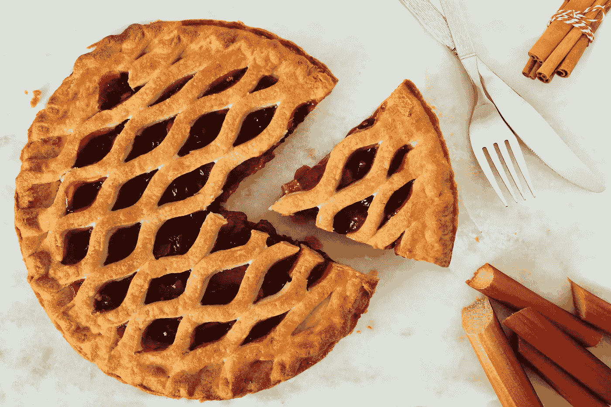

# 下一个十亿消费者品牌将从哪里产生

> 原文：<https://medium.com/hackernoon/where-the-next-billion-consumer-brand-will-emerge-from-94fe4193d1de>

## 你每年在同样的东西上花多少钱？

这可能是你最喜欢的软饮料、牙膏或你生活中不可或缺的造型必需品。

# **你的忠诚会得到什么回报？**

## **众筹*获*牛逼**

它让你拥有你所信仰的东西的一部分，让你为你喜爱的产品或服务的成功做出贡献，或者支持你认为可以改变世界的想法。它实际上引发了一场消费者革命。

BrewDog 在这方面做得比任何人都好——他们围绕一个品牌创造了一种生活方式，并与帮助其成倍增长的福音传道者结盟。出现了一种产品，它不仅由它制造的啤酒来定义，而且由热情地与朋友和家人分享它的支持者来定义。

# **接下来是什么？**

在许多方面，众筹只是阶梯上的下一级。这是一场已经存在于股票市场的演变，但以一种更具影响力的方式延伸开来。它通过允许消费者在业务形成阶段支持项目的出现，使消费者成为指导项目成功的参与者。他们帮助推动了公司的发展方向。

**下一步是通过消费者购买获得产品的所有权** 为什么每次购买时不应该拥有一小部分呢？想想看，你知道你一年要购买多少次这些东西。你的行为是完全可预测的，它很少改变，但是你从你的行为中得到什么好处呢？

## **这是什么意思？**

在实践中，这意味着一个消费品牌将创建一个为消费者保留的“期权池”——一部分股权。你不需要通过股份购买公司的所有权，而是简单地购买产品，并作为你喜欢的副产品获得公司的所有权。一个应用程序将允许你扫描一个独特的条形码，这将表明你在该公司的股权。

不管产品是衣服、食物、汽车、化妆品还是报纸，模型都适用。想象一下，不仅仅是购买可口可乐，而是知道你的选择给了你最喜欢的品牌的所有权。每件产品都是购买时赎回的所有权的象征。

想象一下，每一罐可乐都是生产它的公司的所有权象征。每一笔交易都给了你公司的股份。你为什么不改变你的行为去购买你自己的产品，与你对世界的看法保持一致。这可能是更具社会责任感的有机产品。

消费者购买变成了一种“挖掘”协议。分发的代币减少意味着更早购买你的产品的消费者将获得更多奖励。

你最大的支持者拥有品牌的大部分，这是一件伟大的事情。

那些买得多的人拥有得更多，那些与朋友和家人分享品牌的人从品牌价值的增长中获益最多。

购买决策成为拥有未来最重要公司的一种方式。我们可以继续盲目地购买剥削品牌，或者我们可以选择让自己受益。它拿走现有的东西，把利润放进消费者而不是股东的口袋里。那是你。

## **我保证在接下来的 5 年里，a B 会从这里成长起来**

# **如果你对建筑感兴趣，请联系我们！**

我可以给你介绍一位传奇企业家，他会帮你实现这一目标。