# 无风不起浪——访《黑客正午》创始人大卫·斯穆克

> 原文：<https://medium.com/hackernoon/where-theres-smooke-there-s-fire-interview-with-david-smooke-founder-of-hacker-noon-ed253e5b3594>

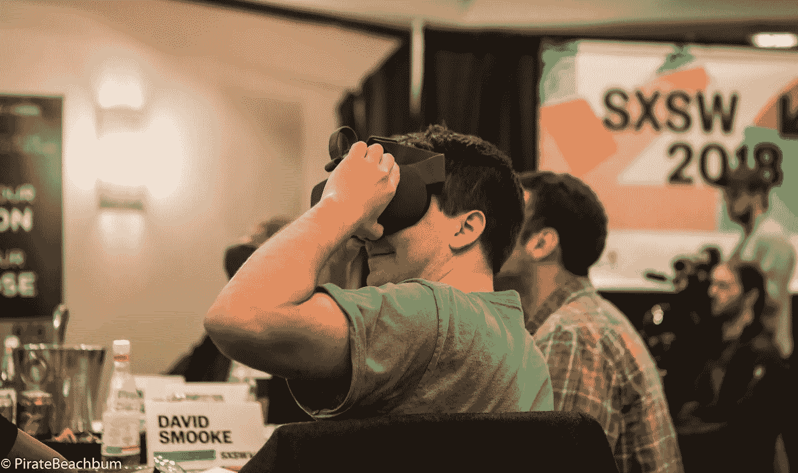

David Smooke testing out a virtual reality app while judging the 2018 SXSW Hackathon in Austin, Texas

去年，我随机联系了大卫·斯穆克，看他是否有兴趣发表我的一些文章。什么样的人会把一个叫海盗海滩流浪汉的匿名作家当回事？谢天谢地，大卫做到了，从那以后，他激励我贡献更多的文章。

我终于在奥斯丁的 [2018 SXSW 黑客马拉松](https://hackernoon.com/tagged/sxsw)上见到了他本人。那天晚餐时，我们在许多层面上建立了联系，他对出版和新闻业的热情以及他对家庭和篮球的热爱引起了我的共鸣。当我了解到他如何创建 HackerNoon 和其他几个网站的历史时，我知道我必须讲述他的故事。

在这个世界上，你会遇到一些非常特别的人。他们的专业才能是相交道路的催化剂，但一旦你了解他们，你就会意识到他们远不止如此。

大卫是个谦逊的人，不在乎聚光灯。我花了数不清的时间才最终让他同意接受采访。我真的相信他的故事既鼓舞人心又激励人心。在科技领域创立一家公司从来都不容易。在这方面取得成功更难。我希望你喜欢了解大卫·斯穆克。

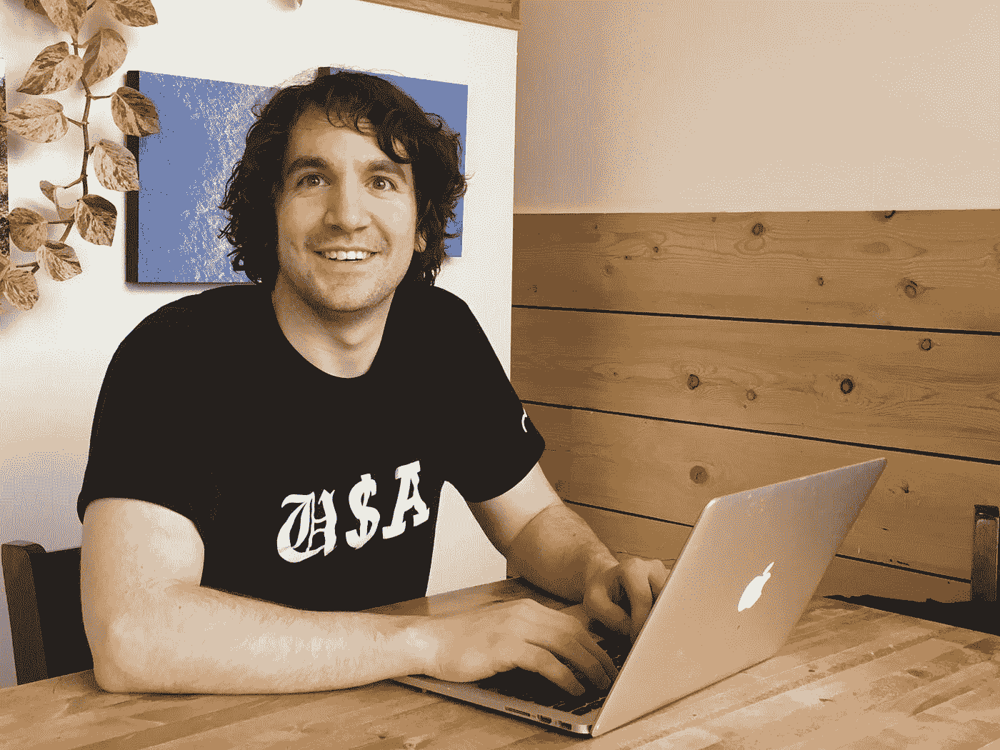

David Smooke startup life in a Colorado coffee shop. Hair longer.

**姓名:**大卫·斯莫克

地点:科罗拉多州爱德华兹。坐在我的后门廊。

**真正的工作？**

出现了。我真正的工作是为斯穆克的新领袖服务，我的女儿。她要求很高，到目前为止只会说 5 个词。按出场顺序:妈妈(“妈妈”)、爸爸(“达达”)、水(“巴巴”)、狗(“咄”)和泡泡(“卜卜”)。显然，她在画水彩画时还对保姆说了一些“黄色”的说法，但我没听到，因为我在工作。

我大部分时间都花在[黑客中午](https://hackernoon.com/)上。我们每天有 20 多万读者，我努力使它成为一个值得信赖的独立科技阅读网站。我们发表了一些故事，比如[通过建造一个](https://hackernoon.com/learn-blockchains-by-building-one-117428612f46)了解区块链、[无人驾驶酒店房间:优步、Airbnb 和人类房东的末日](https://hackernoon.com/driverless-hotel-rooms-the-end-of-uber-airbnb-and-human-landlords-e39f92cf16e1)以及[从史诗般的失败中复苏](https://hackernoon.com/on-the-rebound-from-epic-failure-88e77d2b39af)。

每天早上我都会检查提交的故事。《黑客正午》的故事能和只是在网上看科技故事一样好吗？我做事的目标是让我的晨读更好。

人们是如何认识你的？

互联网主要是从制作[黑客中午](https://hackernoon.com/)开始认识我的——黑客们是如何开始他们的下午的。

我也因在艺术+营销方面与[创意人员合作](http://artplusmarketing.com)而闻名，在 Extra Newsfeed 上以讽刺的方式拥抱[真相](https://extranewsfeed.com/archive)(现在由政治讽刺作家运营)，在 PS I Love You 上推广[数字文学](https://psiloveyou.xyz/)(现在由作家/编辑丹·摩尔(Dan Moore)或 [@dmowriter](https://twitter.com/@dmowriter) 运营)，互联网招聘行业可能还记得我将[智能招聘者](https://www.smartrecruiters.com/)推向市场。SmartRecruiters 博客是我的第一个社区驱动出版物的试验场，但我真的不明白人们如何能在他们阅读的地方写作，直到我完全进入我自己的网站。

真正了解我的人是我身边的人。

**你是什么背景？**

我 20 多岁的时候大部分时间都在从事早期创业。先是别人的，然后是我自己的。在学校，我获得了经济学和创造性写作的学位。

你在哪里长大？

上大学之前，我一直住在宾夕法尼亚州的乡下。大多在刘易斯镇，还有默瑟斯堡。两个都是非常小的城镇，现在我又住在科罗拉多州爱德华兹的一个小镇上。在大学和二十几岁的时候，我一直住在加利福尼亚。主要在旧金山的北海滩附近，还有雷德兰兹。我想念莫利纳里三明治。人行道的声音。但是当我在这个国家的时候,“黑客正午”已经有了巨大的发展。自从不到两年前搬到科罗拉多以来，我们的博客网络已经从不到 100 万的月浏览量增长到超过 1000 万。

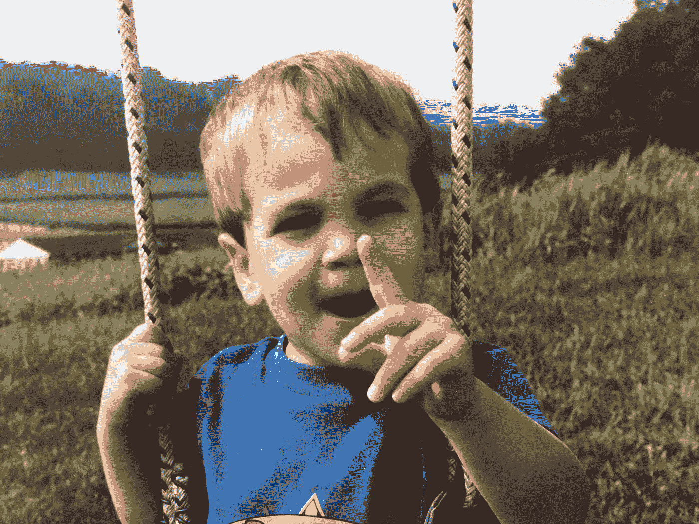

David Smooke, Age 2.

在成长过程中，你是怎样的一个孩子？

擅长数学。能够长时间阅读漫画和玩动作玩偶。我妈妈至今还记得我在公共场合发过几次脾气。一次是在 JC Penny 的走廊里。人们盯着看。我妈妈只是坐着等它结束。真是个女人。我通常是个善良的孩子。吃了太多的喷油井。喜欢散步。对体育数据非常感兴趣。笑着熬过了童年。

你想给 16 岁的年轻自己什么建议？

昨天开始另一个网站。好的东西需要时间来构建——大多数人会在事情变好之前放弃。投资比特币。创造更好的身心习惯。晚一点结婚(16 岁的孩子不应该和 14 岁的孩子结婚)，但是当时机成熟的时候，年轻人(这就是你所谓的年轻版的自己吗？)变得更擅长销售、阅读、写作、移情、也许编码、也许不编码和上网。多喝水。联系你在网上感兴趣的人。要知道每个人都在打自己的仗。

你有什么秘密天赋吗？

我会做美味的烤排骨。Gochujang 是秘密配料。所以，猫已经从袋子里出来了。成功在于慢煮，在增加美味的同时保持甜味和辣味，然后确保外面的薯片恰到好处。还有，我[偶尔说唱](http://www.letslipthedogsofwar.com/)。排骨比说唱好吃。

How many of you remember Oregon Trail?

**你什么时候开始接触电脑和互联网的？**

计算机实验室里的俄勒冈小径是我早期的计算机记忆之一。当第一台电脑搬进我家时，我并不认为这有什么了不起。软盘，咩。突破不是计算机；突破是互联网。AIM 和 ICQ 是中学社交生活的游戏改变者。即时文本交互的引入。聊了起来。离开消息。将文字的力量搬上银幕。即时消息为“澄清”1:1 通信和 1:公共通信之间的区别奠定了基础。

我记得参加了一个“天才”项目，我们在放学后用假钱挑选股票。大概 13 或 14 岁。那是我第一次听说网飞的地方，那时我还不知道它是什么。Matthew Satzer 在网飞身上投入了太多，统治了整个团队。他赚了那么多假钱。尊重。

你是个超级篮球迷。你还玩吗？

在我 5 月份从楼梯上摔下来，得了脑震荡，弄伤了膝盖之前，我每周练两到三次吊环。所以现在，没有那么多。很多物理治疗。最近下了拐杖！我最喜欢的游戏是星期天早上 8 点。当你早上锻炼的时候，一天中剩下的时间会变得更好。肌肉酸痛。看到球穿过篮筐的多巴胺。空中的球让我明白了为什么院子里的狗如此兴奋。上午 8 点的游戏在维尔山谷已经持续了 20 多年。我无权透露比赛在哪里进行，但如果你来看我，并且我的身体恢复了，我可以带你去看比赛。

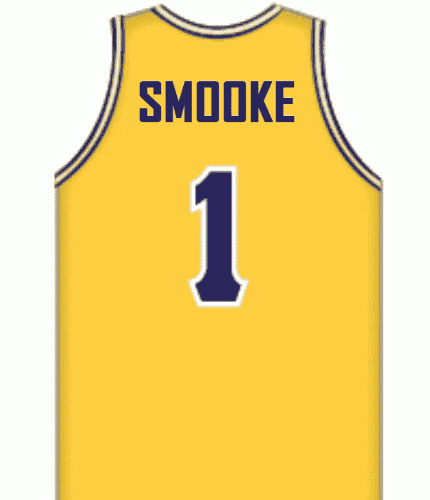

你真的认为你会在 NBA 打球吗？如果是的话，是哪个队？

我只相信当我有效地扭曲了现实。生活中许多最宏伟的愿景只有在真实的现实扭曲的状态下才会出现。如果某样东西现在不存在，你就是看清楚了现实，也根本看不到。但是在 NBA 打球是一种短暂的现实扭曲。

当我被我的中学队除名的时候，我非常明确地知道职业比赛是不可能的。也许有一天我会和勇士或者掘金合作——做一些内容创作，球童，或者总经理之类的工作。

谁会是你的梦之队成员？

不幸的是，我不够好，不能加入我的梦之队。我认为最好的先发 5 人是斯蒂芬·库里、迈克尔·乔丹、勒布朗·詹姆斯、拉里·伯德和比尔·拉塞尔。

Steph 可能在他的职业生涯中还没有足够的努力进入前 5 名，但就实际比赛而言，你不能高估射击场对球队其他人的积极进攻影响。MJ 就是那只山羊。勒布朗不是山羊，但在大多数主要的统计类别中，他比山羊更好。拉里·伯德是最终的竞争者，他也会出现在大型比赛中(加上[他曾经用左手 47 次投篮](https://www.youtube.com/watch?v=R76nMD8buR8))。比尔·拉塞尔是最伟大的防守主播(中锋的主要工作)，冠军(13 年内 11 次夺冠)，也是 NBA 历史上美国民权运动最重要的球员。

在板凳上，我会去魔术师约翰逊(表演时间)，朱利叶斯·欧文(J 博士)，杰里·韦斯特(标志)，科比布莱恩特(杀手-他和乔丹在实践中竞争会把每个人推向极限，所以这支球队有机会自我燃烧)，斯科蒂·皮蓬(有史以来最坚定的边锋防守者)，蒂姆邓肯(大基本面-有史以来最稳定的队友)，和沙克(只是比任何人都更大，更强大)。在他的职业生涯结束之前，凯文·杜兰特可能会把这些家伙中的一个踢出球队——总会有下一个最佳人选准备好接管这个世界。

12 名玩家是游戏日活跃玩家的上限。在 NBA，你也可以有 3 个不活跃的球员以防受伤——我会选择史蒂夫·科尔、罗伯特·霍里和卡里姆。让联盟有史以来的头号得分手出现在替补名单上是很痛苦的，但是按照现在比赛的方式，最好的阵容只有一个传统的大个子。史蒂夫·科尔和罗伯特·霍里就是那些经典的事后诸葛亮——哦，妈的——他们是——开放的——哦，妈的——他们创造了——哦，妈的——他们是——庆祝——另一个冠军的家伙，我希望他们在我的球队里。

**你一直是个作家还是喜欢写作？**

即使当我对数字理解得更好的时候，我也认为文字会产生更大的影响。

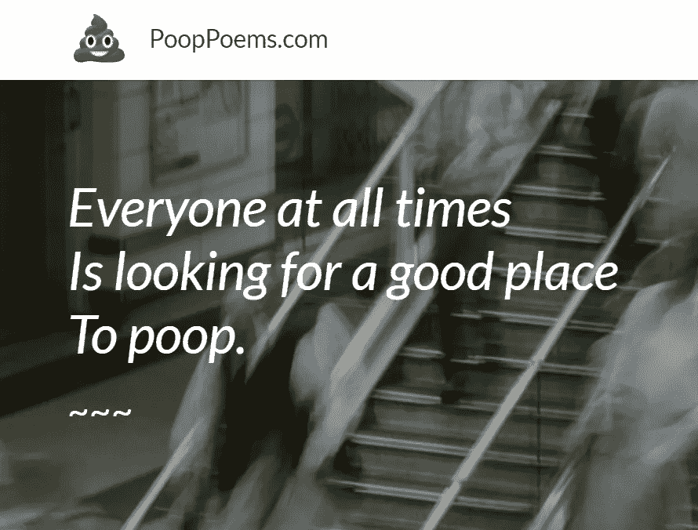

**你制作的第一个内容是什么？**

可能是便便。的确，大多数早期作品都很糟糕。反复钻研这个过程需要时间。我 28 岁的时候在河内创造了 pooppoems.com。“内容”这个词随着互联网的兴起发生了如此大的变化。在我看来，它真的包含了太多。就好像什么都是贴吧内容，没有什么是优质内容。比起“内容”，我更喜欢“故事”这个词它更少的是交易，更多的是关于人类如何思考。当我们阅读时，我们不是把一大块内容放入大脑，而是理解故事。

**你是如何进入出版业的？**

偶然。互联网改变了现在的出版业，这是一种疯狂的生活。在我看来，我们都是出版商。脸书、Twitter、个人网站、LinkedIn、Medium、企业博客等。更多的公司将会存在，以增强独立出版商的能力。

**什么是阿美族？你是怎么开始的？**

AMI 代表 ArtMap Inc .当我还在另一家创业公司工作时，我就开始了我的公司，我们的第一个应用程序叫做 [MapShot](/@DavidSmooke/review-of-mapshot-ios-app-e883e0510177) (2014)。我致力于我的产品管理技能……如果做得好，每一次缩放都会很快创建一个地点最佳图片的美丽混搭；如果做得好，每一次缩放都会很快创造出一件新的众包艺术品。但我并没有把它做好。事实证明，创造艺术和满足用户的技术是独角兽式的…我的自筹资金资源更像是安全通道外的机械公牛。所以那个应用没有成功，但我还是辞掉了工作，因为我的薪水还不错，觉得自己做的工作比拥有的多，所以为什么不赌自己呢？我试图把想全职雇佣我的人变成合同。我与 4-6 个客户建立了为期 6 个月的合同，以现金和股票为基础。我们扩展了他们的叙述。讲故事，写作，营销，社区发展。以下是我们在 2015 年的一些早期客户。向我的朋友[约翰·马歇尔](https://twitter.com/marshallvariety?lang=en)大声欢呼，因为他是第一个愿意在 ArtMap Inc .工作的人。这就像是，我认为这家公司正在做的事情很酷，但当其他人也认为这是真的——并且愿意投入他们的时间和职业生涯——这个业务就更真实了。

但是我们需要自己的博客。也就是我开始[美术+营销](https://artplusmarketing.com/)的时候。我发现故事比营销更有趣。在杰伊·扎罗威茨(Jay Zalowitz)的帮助下，我在 2016 年转向将故事变成生意。详见[阿美族起源故事](https://hackernoon.com/the-ami-origin-story-f386ef84c79c)。到 2017 年，客户为我们的出版物付费。时事通讯、网站接管等。上[附:我爱你](https://psiloveyou.xyz/)，[美术+营销](http://artplusmarketing.com)，当然还有[黑客正午](http://hackernoon.com)。2018 年上半年的利润甚至更高。

我决定“去公司化”，获得一个 3 个字母的 twitter 账号来存放我们所有的数字出版成果。可以在推特上找到， [@ami。](https://twitter.com/ami?lang=en)我们也从中获得了一些乐趣，写出了[ami 可以代表的](https://artplusmarketing.com/101-brand-names-ami-could-stand-for-bc743484b893)101 个品牌名称。

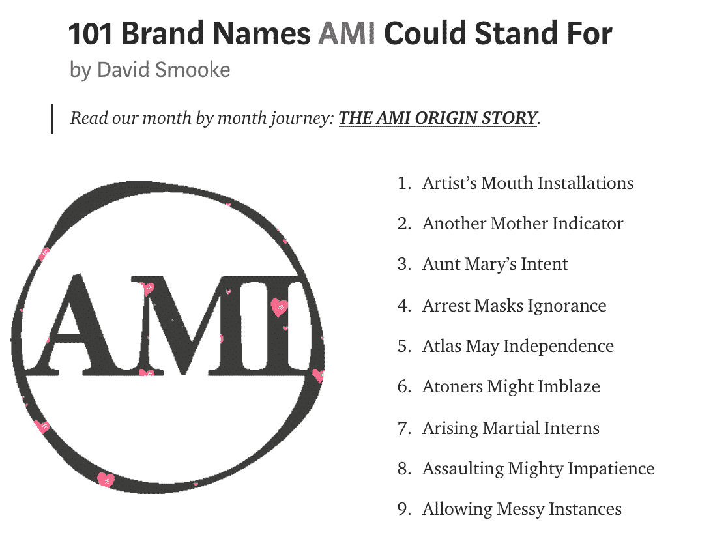

**还有哪些网站属于 AMI 家族？**

我们的投资组合旨在创造利基和高质量的阅读目的地，并增加投稿作家的机会。我们还有很长的路要走，但以下是我们的概况:

我们的阅读目的地是:

*   [HackerNoon.com](https://hackernoon.com/)
*   [ARTplusMarketing.com](https://artplusmarketing.com/)
*   [ExtraNewsfeed.com](https://extranewsfeed.com/)
*   未来旅行。今日
*   适合你自己。俱乐部
*   [SmallBusinessForum.com](http://smallbusinessforum.com/)
*   [MyStudentVoices.com](https://mystudentvoices.com/)
*   [42Hire.com](https://42hire.com/)
*   [ResponsibleBusiness.co](https://responsiblebusiness.co/)
*   [TheLacesOut.com](https://thelacesout.com/)
*   [FestivalPeak.com](https://festivalpeak.com/)
*   [电影时间。咕噜](https://movietime.guru/)
*   [美国健康保险](https://healthcareinamerica.us/)
*   [KeepingStock.net](http://keepingstock.net)
*   [AMI 出版物](http://www.amipublications.com/)
*   [PSiLoveYou.xyz](https://psiloveyou.xyz/)

如果有兴趣写一篇报道，请发邮件给[Stories@AMiPublications.com。](mailto:Stories@AMiPublications.com)

我们还建立了一些定制的数字出版网站:

*   [PaidStory.com](http://paidstory.com/)是一个品牌内容市场——我们已经暂停了建设。
*   StoryLicensing.com 是一个重新发布高质量博客文章的市场。
*   AMIpolls.com 是我们美味推特投票的网站。
*   AMI.network 是 AMI 图书馆的搜索引擎。

哪一个是最广泛阅读的？

《黑客正午》的日阅读量超过 20 万。总的来说，我们在 2018 年平均每天有 26 万以上的读者。

下面这张图解释了 Hacker Noon 的成长:

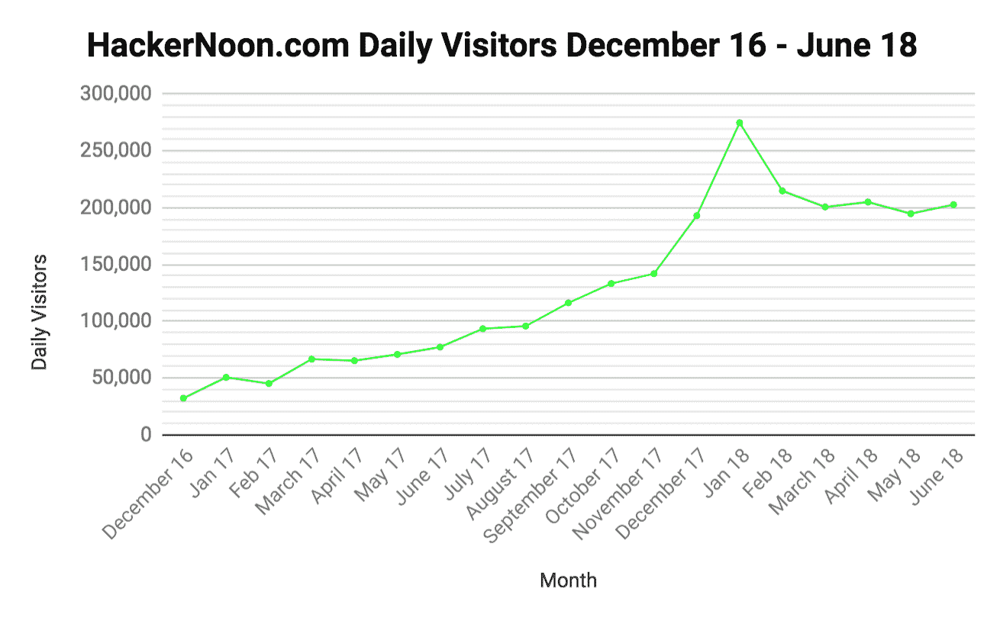

**你老婆**[**Linh**](https://www.instagram.com/darlingnorah/)**是 AMI 业务的很大一部分。告诉我们一起工作，建立 AMI 是什么感觉？**

她理解我。好的和坏的。我的组织方法是增长第一，故事第二，金钱第三。她实际上填补了所有的空白。让我的混乱显得更有条理。她管理作家、合伙人和赞助商。没有她，这家公司早就没钱了。

我有很高的期望，她也是。最终，和我妻子一起工作是一种奢侈。我真的不想和很多人说话。

做父亲如何改变了你对事业的看法？

与家庭相比，所有这些生意上的破事都是次要的。另外，我有时一边看女儿一边工作。但是她越长大，我就越不能同时工作和照顾她。但幸运的是，我有更多的家人。

[Linh and Norah](https://www.instagram.com/norah.and.mama/) are the powerful driving force behind David Smooke the man!

还有谁帮助你建立了 AMI，你对此表示感谢？

最重要的是，感谢撰稿人。他们信任我们，给了我们 50，000 个故事。没有故事，我们就不能做所有的事情来创造读者群，在未来，我们将有更多的方式来为撰稿人服务。当然，非常感谢我们的核心团队和我们的客户。与 PubNub、Mixpanel、元宝币、Segment、Odem、Manifold、Fullstack Academy 等赞助商合作非常愉快。

**辞去固定工作去做自己的事情是什么感觉？**

赋权。解脱。压力。解脱。压力。赋权。当你开始创业时，你会有几个月赚不到多少钱。而你的其他开销并不会随之波动。房东不会接受这个月的租金(如果他们接受，也许你应该搬家)。你是在实时计算利润率，而不是在电子表格上。延迟付款是有压力的，也是常见的。房间里的小家伙是房间里的小家伙。但最终，像我这样的人更容易接受我的商业决策是我的事。对大多数人来说，他们用商业决策和专业知识来换取薪水。我了解这个行业，对许多人来说，这是一笔好交易。很大程度上是时机问题。我认为，如果你相信自己的优点，并且能够自信地找到你的早期客户，你应该做自己的生意。

**你有多少次想过放弃？**

很多次。现在也是。没有永远的生意。一生，当然，但不是永远。巴塔哥尼亚有一个 100 年的商业计划。这座教堂已经存在了几千年。生意很艰难。想想美元的走势就知道了。我是一个写了一本关于一美元钞票“责任”的儿童书的人。我思考我所创造的东西的死亡和消失。工作是否为生活提供了资金，生活是否满足了工作，这是任何一个制造东西的人现在都在思考的问题。创业有很大的局限性。你挣的每一块钱在挣出来之前都已经有了花掉的计划。

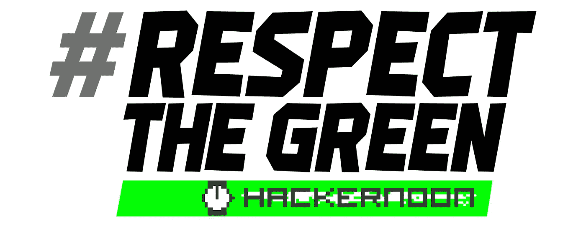

**黑客午绿怎么了？**

当我们在 Medium 上开始出版《黑客日报》时， [Jay Zalowitz](https://medium.com/u/26404b72aeb4?source=post_page-----ed253e5b3594--------------------------------) 认为这会让我们看起来像一个旧的学校终端——让我们脱颖而出。绿不绿不绿。但是由于 Hacker Noon 的 RGB 是(0，255，0)，所以它有零红色、最大绿色和零蓝色。这是最绿色的了。此外，这种特殊的绿色阴影不能印刷，只能在屏幕上保持真实。我们是数码的，我们的绿色是数码的。有人说它绿得刺眼。有趣的是，黑客 Noon green 在不同的显示器、设备和手机上看起来都不一样。如果这不是一个透视的教训，那是什么？黑客正午绿色的功能是让访问者知道他们在黑客正午。人们总是低估色彩对屏幕的心理影响。我们在辩论的时候，黑客正午 app 应该是什么？我们从一个应用程序开始，它每天中午都会有一个推送通知，宣布现在是中午，当你点击通知时，你的整个屏幕都会变成黑客中午绿色。不用说，我们已经把我们的开发资源投入到不同的想法中(像[故事授权](http://storylicensing.com))。

**黑客正午是如何诞生的？你是怎么想到黑客正午这个名字的？**

在黑客中午之前，媒体上是黑客日报。我想在自己的领域发表文章。我搜了保留黑客核心的名字，也打成了时间。在搜索了很多很多可用的域名后，我想到了 HackerNoon.com。我写了标语“黑客如何开始他们的下午”，然后是[互联网货币](https://www.youtube.com/watch?v=RcU2QH7-Jj0)。就这么简单，你也可以做到；-)

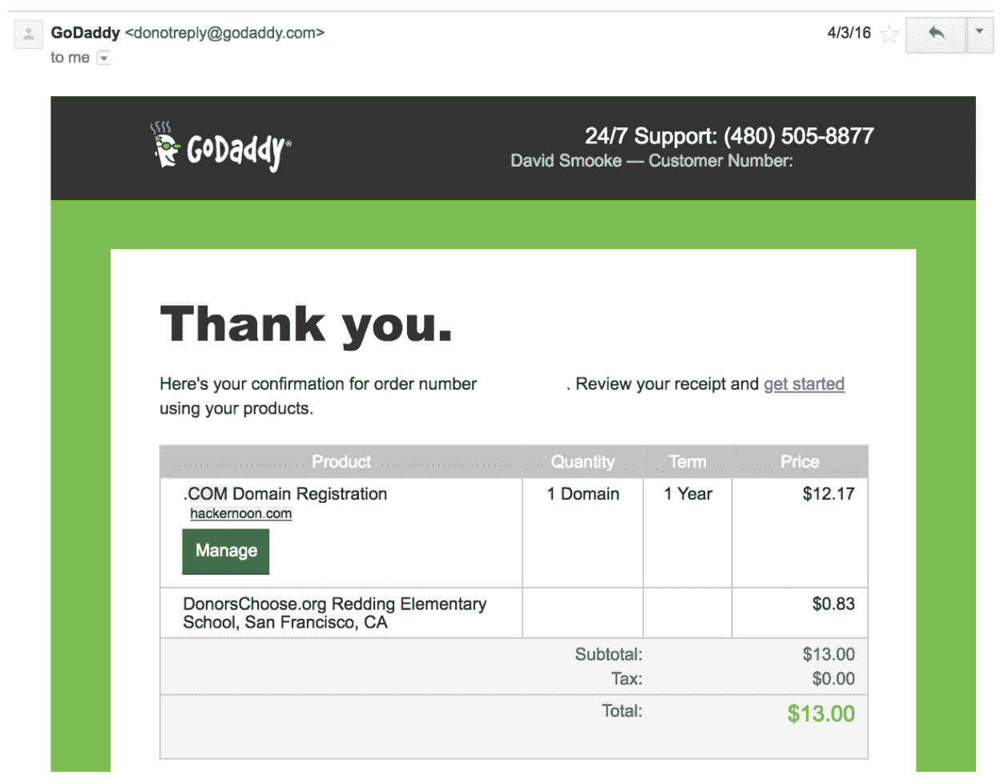

The receipt for purchasing HackerNoon.com (4/3/16)

我试了很多网站，这个网站发展壮大是因为它显示出了希望，然后我们培育了它。它表现出希望，然后我们喂它更多。然后我们学习是什么让它成长，并帮助它成熟。一个网站的扩张有很多阶段和周期——杰伊和我学到了很多关于如何成为一个目的地的知识。搜索引擎流量超过 45%，我们的直接流量超过 20%。让很多人输入 HackerNoon.com 需要做很多工作。技术专业人士想知道黑客们下午读些什么。在我看来，这是一个非常契合的品牌。

而我在考虑从《黑客日报》更名为《黑客正午》时咨询过人们，他们普遍不喜欢，充其量也就是无动于衷。但这就是拥有自己公司的好处——你的成长或死亡由你自己决定。我知道我做了很多错误的决定，但把它命名为黑客正午不是其中之一。

我在 GoDaddy 上打了这么多字。是强迫症。经过数百次搜索才找到 HackerNoon.com。

这里有一个[当前我的待售域名列表](http://www.davidsmooke.net/for-sale)——每个域名都有一个附带的网站创意，比如:

*   360smh.com——360°视频拍摄的搞笑事故手机应用
*   Ownerful.com——中小企业的下一扇门
*   EthosTag.com——关于街头艺术文化和标签如何与遗产有更深的联系的纪录片

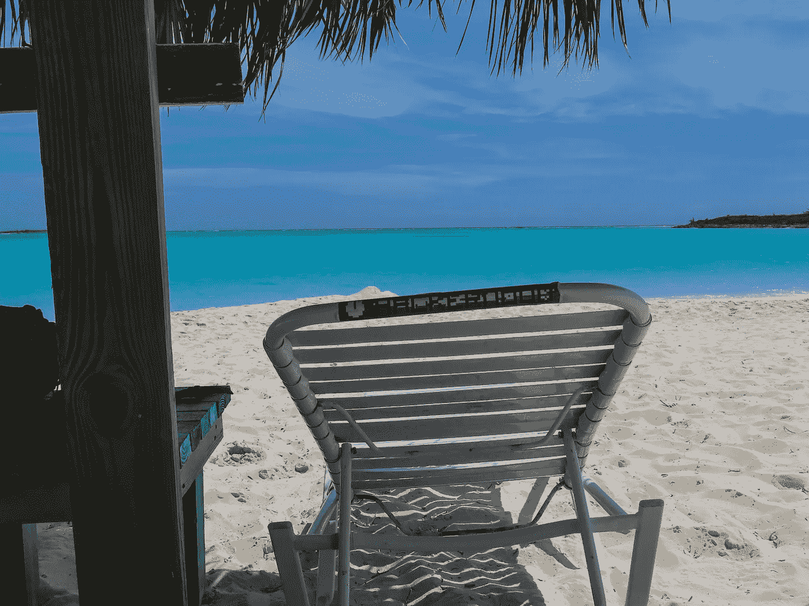

This is where hackers spend their afternoon…well some!

**你想看《黑客正午》去哪里？**

Hacker Noon 可能会成为最后一个真正意义上的分散编辑的独立科技网站。现在，我正在努力灌输我的观点，但同时让它成为一个不再需要我的时间的行业。就像他们说的，如果不是在你睡觉的时候赚钱，那就不是生意。我们已经把它引导到了一个很好的点上，但是我们将不得不投入更多的东西来使它变得成熟。

我去过许多技术办公室，工程师们通常认为他们是房间里最聪明的人，但当谈到代表公司发言时，通常来自非技术人员的声音。出版工程师和产品制造商对我们的成功至关重要。我想在这方面做得更好——授权给那些真正创造下一个技术的人。

科技媒体是科技产业的反映。我们已经报道了区块链和加密货币的兴起——这一运动仍处于早期阶段。Hacker Noon 将更深入地介绍和实现加密货币。

作为一家公司，我们正处于转折点。我们必须发展我们的业务，我们即将迎来一些很酷的变化。这是一个有趣的挑战，但绝对是一个挑战。如果你想听更多关于我如何看待黑客正午的未来——以及你如何参与其中——[DM me](https://twitter.com/davidsmooke?lang=en)。

**人们给你投稿的最好方式是什么？**

邮件[Stories@AMiPublications.com](mailto:Stories@AMiPublications.com)。也可以在[AMIpublications.com](http://www.amipublications.com/)上投稿。

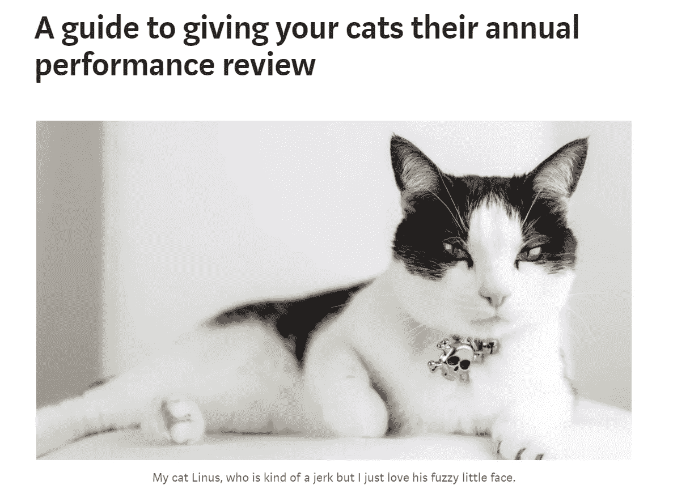

**黑客正午什么类型的故事做得最好？**

在[黑客午间档案](https://hackernoon.com/archive)中，你可以钻取页面上时间最多的故事，按所有时间、年、月、日排序。在右边一栏，你也可以通过标签浏览页面的大部分时间。有史以来我们的十大标签是[区块链](https://hackernoon.com/tagged/blockchain)、[比特币](https://hackernoon.com/tagged/bitcoin)、[加密货币](https://hackernoon.com/tagged/cryptocurrency)、[以太坊](https://hackernoon.com/tagged/ethereum)、 [JavaScript](https://hackernoon.com/tagged/javascript) 、[未来](https://hackernoon.com/tagged/future)、[编程](https://hackernoon.com/tagged/programming)、 [Web 开发](https://hackernoon.com/tagged/web-development)、[软件开发](https://hackernoon.com/tagged/software-development)和[经济学](https://hackernoon.com/tagged/economics)

以下是我推荐阅读的十个黑客午间故事，以了解该社区的情况:

*   [Thryn](https://hackernoon.com/a-guide-to-giving-your-cats-their-annual-performance-review-fbf14610305)给你的猫做年度绩效评估的指南
*   [区块链不秤。至少今天没有。但是还有希望。](https://hackernoon.com/blockchains-dont-scale-not-today-at-least-but-there-s-hope-2cb43946551a)作者[普瑞蒂·卡西雷迪](https://medium.com/u/d446dafbe292?source=post_page-----ed253e5b3594--------------------------------)
*   [学习 Jose Aguinaga](https://hackernoon.com/how-it-feels-to-learn-javascript-in-2016-d3a717dd577f)[的 Javascript](https://medium.com/u/4eb81b32b99a?source=post_page-----ed253e5b3594--------------------------------) 的感受
*   你会读到的关于机器学习的最简单的解释是[的](https://medium.com/u/2fccb851bb5e?source=post_page-----ed253e5b3594--------------------------------)凯西·科兹尔科夫的
*   [WTF 是区块链？](https://hackernoon.com/wtf-is-the-blockchain-1da89ba19348)作者[莫希特·马莫里亚](https://medium.com/u/24f7fbc09357?source=post_page-----ed253e5b3594--------------------------------)
*   我学到的 10 件事打造世界上最快的网站我正在从你的网站上收集信用卡号码和密码。以下是方法。作者[大卫·吉尔伯森](https://medium.com/u/f735d3b0f2f3?source=post_page-----ed253e5b3594--------------------------------)
*   [为什么大家都错过了最近 500 年最重要的发明](https://hackernoon.com/why-everyone-missed-the-most-important-invention-in-the-last-500-years-c90b0151c169) & [比特币二十年后会是什么样子？丹尼尔·杰弗里斯](https://hackernoon.com/what-will-bitcoin-look-like-in-twenty-years-7e75481a798c)
*   你在一家特色工厂工作的 12 个迹象作者:约翰·卡特勒
*   [我 10 岁的孩子是如何学会 Javascript 的](https://hackernoon.com/how-my-10-year-old-learned-javascript-d8782b586db7)

**什么样的人给黑客正午写东西？**

像你和我这样的人。用科技制造东西的人。我坚信人们应该在他们想看的地方写作。在[黑客正午关于页面](https://hackernoon.com/about)上，你可以看到 1000 名最近的贡献者，但我们有一个很好的倍数。希望在未来做更多的工作来突出贡献者作为专家。在《黑客正午》上写作的人通常也是在科技界做大事的人。我们的读者中有超过 40%的人以前创立过公司。写自己的经历总是比较容易。

**你有没有像这样，“神圣的狗屎…XYZ 刚刚提交了一篇文章？”**

Craiglist 的克雷格是个大人物。最近，[阿波罗·小野](https://hackernoon.com/@AAO888)——这位奥林匹克速滑运动员现在经营着一家区块链公司，因为现在是 2018 年。宽容不是道德准则对我来说，这是一个开创性的故事。这就是数字出版中正确时间的正确文章。当 [JK 罗琳](https://twitter.com/jk_rowling/status/832348410879553536)和[塞思·麦克法兰](https://twitter.com/SethMacFarlane/status/832398124509392896)在推特上发布我们的一个故事([为什么自由主义者误解了川普](https://extranewsfeed.com/why-liberals-are-wrong-about-trump-c865b12c72a7))——我有种该死的感觉，看看谁在这里阅读。我用@ami 的 likes 部分收藏了其中的 279 个瞬间。与我喜欢阅读的网站建立伙伴关系也非常令人兴奋，比如 [The Next Web](https://hackernoon.com/the-next-web-hacker-noon-partnership-433f8d6fd5ab) 和 [Quora](https://hackernoon.com/quora-hacker-noon-partnership-d45f198ea526) 。

对于那些渴望出版的有抱负的作家，你有什么建议吗？

在你喜欢阅读的地方发表。

找出你故事风格和这个地方风格之间的最佳平衡点。

去他妈的，只要你今天写得比昨天好，你想什么时候写就什么时候写。

Pawnee Mayor Gunderson RIP

你对创业者有什么建议？

波尼市长冈德森在他的讣告视频中，将技术平台解释为*“哪里有功劳，我就欣然接受，哪里有过错……都是你的错。”请记住这一点。*

生意发生得很快，会消耗你的注意力，记得四处看看，微笑和学习。外部视角将帮助你发展业务。

像我这样的人说的话不会让你做决定或做工作。最后，做好经受风暴的准备。依我看，毅力比智慧更重要。

**你认为为什么黑客正午关于比特币和加密货币的文章如此受欢迎？**

权力下放是一个强有力的想法。一个让现任者害怕的想法。这个想法让那些支付当前强制性机构费用的人(大多数人)感到兴奋。然而——它也有如此多的骗局、错误信息和丑闻。区块链、比特币和加密货币利用了驱动读者群的经典内部/外部冲突。不是一般的读者，而是好奇、聪明和未来思想家的读者。我们认为我们理解了密码，或者至少理解了硬币是如何工作的，或者为什么代币会存在——但是没有人知道这将会有多大。还记得互联网的早期吗？你永远不会相信在任何网站上输入你的信用卡信息，即使你在同一天把它交给了一家餐馆的服务员。技术如何打破和创造信任的社会规范——这将是区块链效应。点对点网络可能带来的实际业务增长是不可低估的。媒体是它所覆盖内容的反映。我们报道科技，延伸开来，我们发表了很多关于区块链的文章。

**你持有比特币或其他加密货币吗？**

我们唯一需要的加密货币是客户支付给我们的货币。我希望我的生意赚得更多，这让我有机会投资于我看到未来的地方——但同时，我的生意是发布社区的想法。将我们有限的资金/资源投入到出版系统中比成为一名密码交易员更理性。这就是创业的现实。你只是没有太多的钱，你所拥有的钱应该再投资到成长中(大多数时候)。

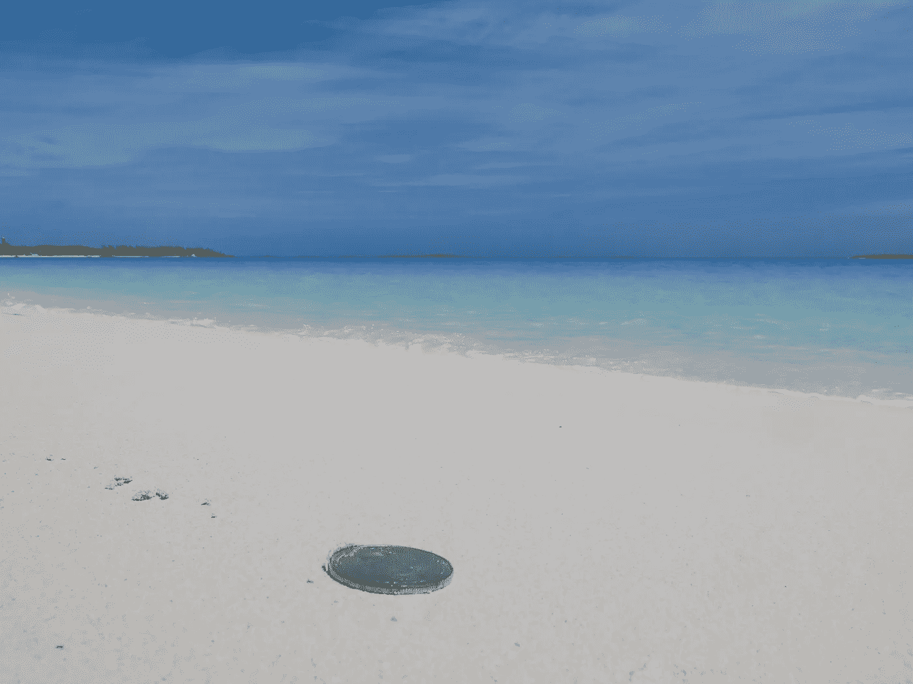

All that glitters is not always gold.

**您遇到过任何加密故障吗？**

我努力想卖斧子而不是金子。在某种程度上，这让我的生意有了更高的底线和更低的上限。我想我们可以把出版错误算作加密失败。寻找秘密推广和秘密故事之间的界限是一场战斗——特别是当由制作者自己发布时——因为整个互联网上的每个故事都在推广一些东西。

你听什么播客？

老实说，现在我的很多播客都是体育广播。它让我忘记了工作。大呼小叫到[与本·戈利弗和安德鲁·夏普的开放式播客](https://www.si.com/si-nba-open-floor-podcast)，[林格 NBA 秀](https://www.theringer.com/the-nba-show)和[洛·波斯特播客](http://www.espn.com/espnradio/podcast/archive/_/id/10528553)。没有什么比安德鲁·夏普自言自语为什么奇才队应该为签下德怀特·霍华德而兴奋更能说明问题了。这是不需要动脑筋的。我最近在电脑上听的是弗兰克·阿贝盖尔的 Google Talk。他看起来不像老莱昂纳多·迪卡普里奥，这没关系。今天，他对信用卡的信念接近于赞助内容——但他的教训之美是值得学习的——总是让别人先付钱。在工作生活方面，我的妻子 Linh 告诉我如何与 Guy Raz 一起建造这个[，我很快就学会了。史蒂夫·马登本周非常诚实。我喜欢他谈论任何企业——即使是像他这样大的企业——随时都会死亡。他有一个弱点，大多数创始人都不愿公开讨论。旁注:我最近发现了我是如何建立这个广告费率的——NPR 正在进行相当有利可图的业务——也许是时候开始黑客正午播客了…](https://www.npr.org/podcasts/510313/how-i-built-this)

**你有什么书推荐给任何一个创业的创业者？**

老实说，书籍不会决定你的创业成功与否。除非你找到一个关键的学习点。一个关键的知识，一个真正的竞争优势或对其运作方式的理解，绝对足以成为建立一家公司的资本。大多数公司从简单的前提开始。如果你正在创办一家公司，你应该读一读是什么塑造了你需要的心态。不是说在亚马逊上搜索创业书籍。

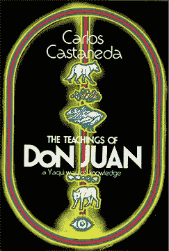

一些书籍推荐…如果你认为你需要一个导师，读读卡洛斯·卡斯塔尼达的《唐璜的教导:雅基族的知识之路》。然后在网上阅读关于它可能是真实的或想象的。如果你想分散你网络生活的注意力，看看更黑暗的网络生活，读读戴维·福斯特·华莱士的《大红人》。

**你最擅长的创意思维在哪里？(即办公室内、厕所、滑雪、公园)**

[走路好](http://davidwalks.com)。我刚醒来的时候还不错。在创造了有价值的东西后，我可以更有创造性地观察、行动和思考。

要相信这个过程会产生新的想法。

**目前什么技术让你最兴奋？**

报纸上的这个 [ARkit 很好玩](https://twitter.com/nathangitter/status/1010599486303981570)。任何用加密货币降低交易费用的东西都超级实用，影响深远。我将密切关注区块链及其提供的透明度如何渗透到金融以外的行业。中国的[社会信用评分](https://hackernoon.com/singularitarianism-vs-totalitarism-b2bce9fcbb2)吓得我屁滚尿流——但这意味着它可能有重大影响——就像大多数成为黑镜剧集主题的技术一样。蜜蜂那集，伙计。说一个[物联网的吓人应用。](https://hackernoon.com/tagged/iot)

技术背后的人——以及使用技术的人——将永远比技术本身更有趣。我们发表了许多合格的观点，我相信这让我们更接近真相。我对 [UX](http://hackernoon.com/tagged/ux) 、[界面](https://hackernoon.com/search?q=interfaces)和[设计](http://hackernoon.com/tagged/design)也有浓厚的兴趣，因为可访问性对技术采用非常重要。

未来的主流技术通常会消除一个小烦恼(和成本)，或者完全改变我们的想法。在我死之前，我能直接从我的大脑写下我的想法吗(没有铅笔或键盘或口语)？什么时候[自动驾驶汽车](https://hackernoon.com/self-driving-cars/home)会成为新的规范？社会对屏幕的迷恋会如何演变？希望人际交往不是领养的代价。

为许多人打开大门的技术——以及它们是如何建造的——将永远在黑客正午占有一席之地。如果你想给 Hacker Noon 写一篇技术报道，请发电子邮件给我们。

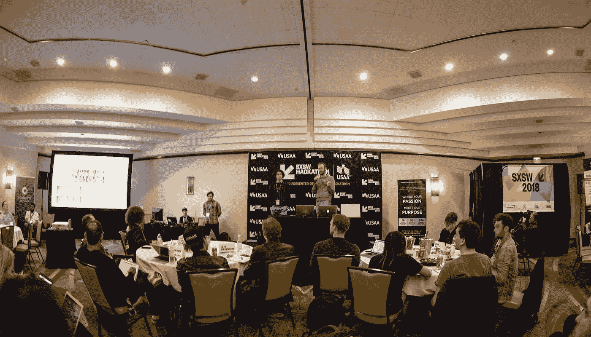

2018 SXSW Hackathon was filled with creative presentations from aspiring hackers from around the world.

**今年在奥斯汀的 2018 SXSW 黑客马拉松上做评委是什么感觉？**

非常荣幸。我住在一个 3000 人的小镇，几乎没有人阅读我的网站。但事实是，许多人都在阅读网站，我只是没有看到他们。去 SXSW 真是大开眼界。它不仅是一个与地球上任何地方都不一样的时间/地点——而且那里的人们也阅读《黑客正午》。一个陌生人想和我自拍。在优步游泳池，我旁边的那个人已经阅读了我那天早上发的时事通讯。这不像我的家乡！

见过这么多喜欢你网站的人后，你有什么感觉？

我仍在思考“我如何获得下一个读者？”住在没人在乎你的网站的地方，然后去很多人在乎你的网站的地方，这很疯狂。这绝对是互联网最美好的事情之一。兴趣如何胜过地理位置。

**哪些人给了你灵感？**

乔治·奥威尔。《动物庄园》和《1984》改变了我对 8/9 年级的看法，随着年龄的增长，我越来越欣赏他写的东西【T4 何时】和*他写的地方*。

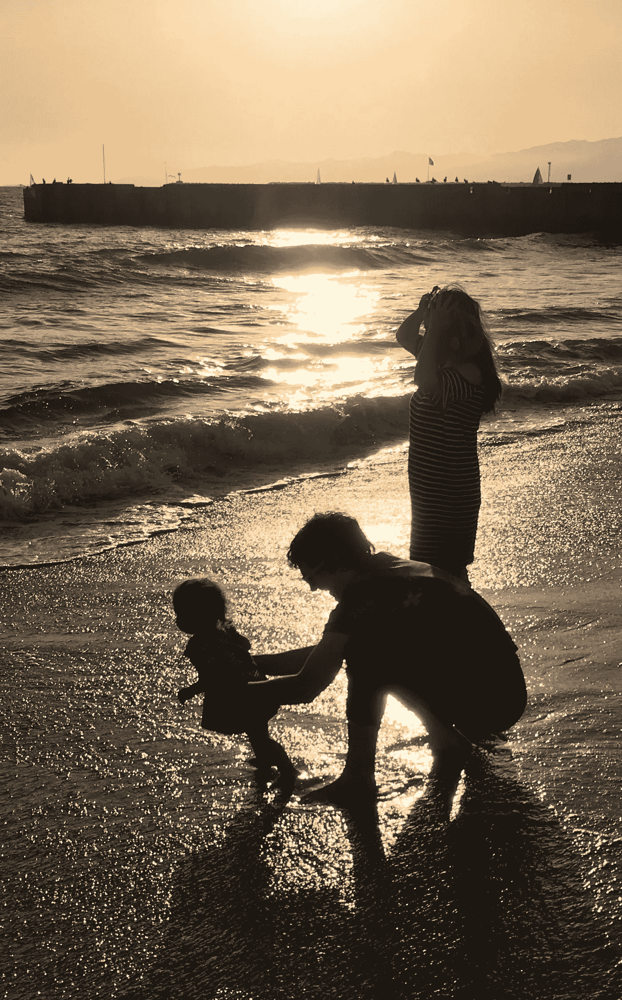

我妈妈。她是最棒的。我爸爸。一剂现实的良药。我妹妹。已经并将永远为我指引一条好的道路。我妻子。我爱林！我女儿。她用新的眼光看世界！

勒布朗·詹姆斯。他是世界上和我同龄的最伟大的篮球运动员。啊我稍微年轻一点儿。他打球的方式——场内场外——在他之前无人可比。不要做证明，要有主人翁精神。

杰夫·贝索斯。我真的不明白他是怎么做的，但不知何故，每个人都想从他那里买东西。

巴拉克&米歇尔·奥巴马。我非常想念他们两个，并且想说许多其他人也想念你。请继续致力于公共事务。

甘地！

唐·德里罗。我知道这不是你最受好评的一本书——但是《T8》结尾部分中人物动机的某些东西总是会引起我的共鸣。

最近，杰辛达·阿德恩。她关于母亲的视频让我非常感动。

人们在网上哪里可以找到你？

这是我的网站:[DavidSmooke.net](http://www.davidsmooke.net/)。你也可以在[推特](https://twitter.com/davidsmooke?lang=en) & [LinkedIn](https://www.linkedin.com/in/clarkkent) 上找到我，在[黑客正午](https://hackernoon.com/@DavidSmooke)、[媒介](/@DavidSmooke)、[艺术+营销](https://twitter.com/davidsmooke?lang=en)、[附:我爱你。](https://psiloveyou.xyz/@davidsmooke)

有什么至理名言吗？

有一段时间是理想主义者。有时间成为一个现实主义者。意识到你现在是谁。

*特别感谢* [*大卫·斯莫克*](https://medium.com/u/7f91547ce9c9?source=post_page-----ed253e5b3594--------------------------------) *接受这次采访，以及他美妙的妻子* [*林·道·斯莫克*](https://medium.com/u/79c48b7e8fe7?source=post_page-----ed253e5b3594--------------------------------) *。丹·摩尔* *确保我们的拼写&语法准确无误。*

*在 twitter 上找我*[*@ piratebachbum*](https://twitter.com/piratebeachbum)*或*[*hacker noon/@ piratebachbum*](https://hackernoon.com/@piratebeachbum)[*@ coin _ strategy*](https://twitter.com/coin_strategy)*或*[*coin strategy . io*](https://www.coinstrategy.io/)