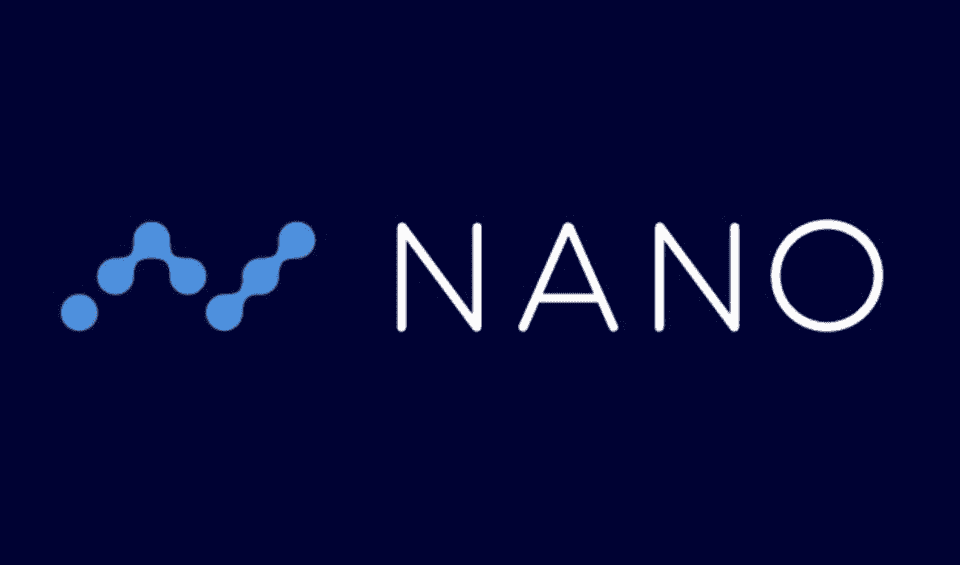
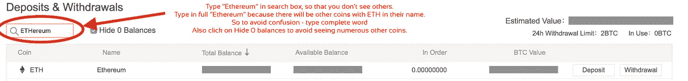
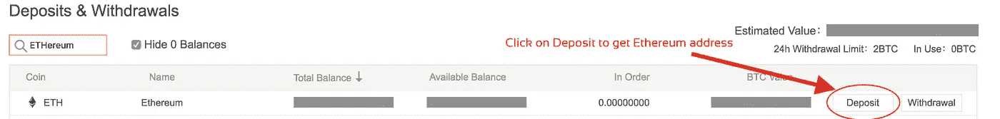
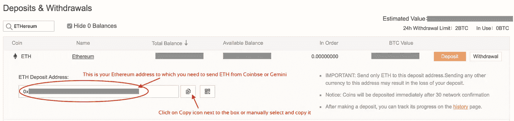
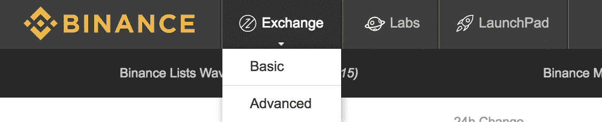
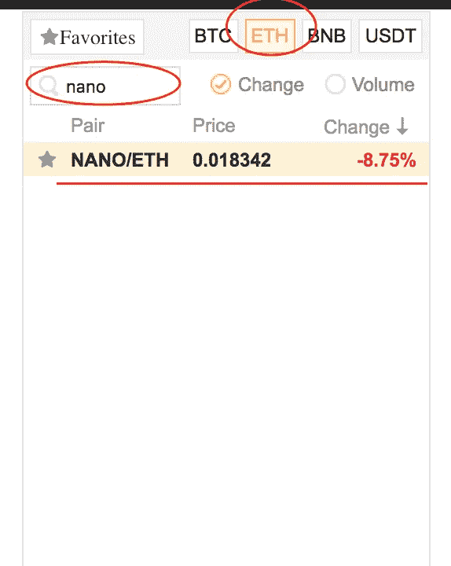
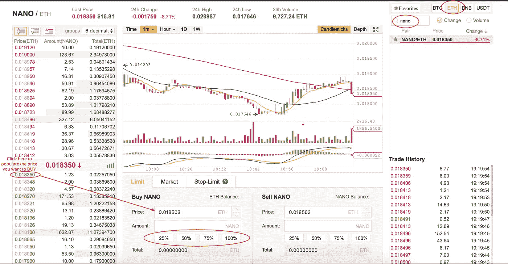

# 哪里和如何购买纳米(纳米或 XRB)

> 原文：<https://medium.com/hackernoon/where-to-buy-nano-raiblocks-xrb-binance-kucoin-6a9a64672bf4>

## 综合指南了解什么是纳米货币(以前称为 RaiBlocks)，它的令牌，目的以及如何从币安购买 XRB 令牌。

## RaiBlocks 的介绍现在更名为纳米货币

我认为至少了解你要购买的东西的最基本的东西是很重要的，所以这篇文章和以后所有的文章都将包括一个简短的介绍来帮助你开始。

 [## Nano 更名公告

### 对我们宝贵的社区，

medium.com](/@nanocurrency/nano-rebrand-announcement-9101528a7b76) 

RaiBlocks 旨在成为一种全新的货币，就像比特币一样，但它与现有的区块链技术相比有几个不同之处和优势。如果你想了解更多关于 Nano 或 Raiblocks 的工作原理，点击[这里](https://hackernoon.com/how-to-buy-raiblocks-aka-xrb-8bfaac294364)查看我的另一篇文章。

## 我们开始吧

首先，我们需要购买比特币或[以太坊](https://hackernoon.com/a-beginners-guide-to-buying-ethereum-e11c73b5e5ed)才能在交易所购买任何加密货币。因此，按照下面的链接在[比特币基地](https://www.coinbase.com/join/5922da0103b62e7e9e6b9df8)购买以太坊，然后按照下面的步骤在[币安](https://www.binance.com/?ref=11705133)购买 NANO。如果你已经有以太坊——你可以跳过这一步，直接去[币安](https://www.binance.com/?ref=11705133)注册

 [## 按照这一步一步的指南购买以太坊

### 以太坊(Ethereum)，一个革命性的平台，超过 70%的硬币都建立在这个平台上。我们在这里说明如何购买以太坊…

hackernoon.com](https://hackernoon.com/a-beginners-guide-to-buying-ethereum-e11c73b5e5ed) 

> 纳米也可以用比特币购买——只是转移到另一个交易所需要更多时间，我建议用以太坊，因为只需要几分钟。

## 在[币安](https://www.binance.com/?ref=11705133)上注册

[币安](https://www.binance.com/?ref=11705133)是一家交易费用相对较低的加密货币交易所，到目前为止表现良好，没有任何问题，支持反应良好。[币安](https://www.binance.com/?ref=11705133)上的交易平台有两种选择:**基础和高级**。在这篇文章中，我将主要介绍基本的交易选项，但是你可以查看下面的高级视图。除了能够在高级视图中进行更详细的技术分析之外，这两种视图之间没有太多的区别。

## 将您的以太坊存入币安

一旦你在[币安](https://www.binance.com/?ref=11705133)上注册并登录，你可以在右上角看到几个菜单项。其中一个是“**基金**”，它有一个名为“**存款取款**”的子菜单项。在这里你可以看到你所有的硬币(在币安上购买的和从其他地址收到的)。

因此，为了将我们在[比特币基地](https://www.coinbase.com/join/5922da0103b62e7e9e6b9df8)或[双子座](https://gemini.com)购买的以太坊发送到[币安](https://www.binance.com/?ref=11705133)，我们需要一个以太坊地址——我们可以在这个页面上找到。

查看以下截图，了解如何从[比特币基地](https://www.coinbase.com/join/5922da0103b62e7e9e6b9df8)向[币安](https://www.binance.com/?ref=11705133)存款以太币

抄下地址，把你的乙醚从[比特币基地](https://www.coinbase.com/join/5922da0103b62e7e9e6b9df8) / [双子](https://gemini.com)送到这个地址。

一旦你在[币安](https://www.binance.com/?ref=11705133)上收到以太坊，点击左上角 ***交换*** 下的 ***基本*** 子菜单项。

现在我们需要在货币列表中找到带有以太坊交易对的纳米硬币。看看下面的截图和旁边的说明。

*   选择右上角的 ETH 框。这意味着你在寻找可以用以太坊交易的硬币。
*   在硬币列表上方的搜索框中输入 NANO，它会如下所示过滤你。现在可以看到当前价格的 NANO/ETH。你现在差不多要投资 NANO 了。现在只需点击纳米/ETH。
*   点击 NANO，弹出每日图表，左侧是烛台和订单，如下所示。

点击左侧所需的绿色价格，填写您在 ETH 中的 NANO 价格(在上面的屏幕截图中当前显示为 0.00032018)。单击后，它会变为 0.00031555。现在你需要选择你愿意在 NANO 上投资多少。点击 25|50|75|100%,填写以该价格可以购买的 NANO 数量。

> 你可以从那些绿色数字中自由选择价格——它们基本上是其他人的不同报价——这也叫限购。

既然你是新手，你也可以点击*旁边的 ***行情*** 标签，选择 ETH 金额，点击 ***买入纳米***——这基本上是以市场价买入。*

*一旦显示成功，您可以从右上角菜单进入 ***资金- >存款&取款*** 并搜索 NANO。*

*恭喜你买了 NANO。这里有更多的指南帮助你购买其他加密货币*

* [## 在哪里以及如何购买 Cardano (ADA)

### 随着新的加密货币的兴起，ADA 似乎是一个很有前途的项目，有很好的潜力。本指南将有助于…

hackernoon.com](https://hackernoon.com/how-to-invest-in-cardanos-ada-b84ba1be9a27)  [## 在哪里&如何购买 IOTA？

### 随着 IOTA 的飞速发展，对于比特币基地的许多人来说，一个大问题是，他们只能看到 3 个选项

hackernoon.com](https://hackernoon.com/where-how-to-buy-iota-6a84dcadb470)  [## 每个密码交易员都应该遵守的 10 条规则——困惑的硬币

### 当在如此不稳定的加密交易空间交易时，有这么多坏人试图窃取你的资产，你…

confusedcoin.com](http://confusedcoin.com/10-rules-follow-crypto-trading/)  [## 错过了比特币？以下是如何购买莱特币

### 这是一个一步一步的指导，让你了解如何购买莱特币或如何使用银行账户投资莱特币

hackernoon.com](https://hackernoon.com/a-beginners-guide-to-buying-litecoin-236fa79d2f86) 

如果你喜欢这篇文章并继续获得更新，请在 twitter 和 medium 上[关注我](http://twitter.com/confusedcoin)*