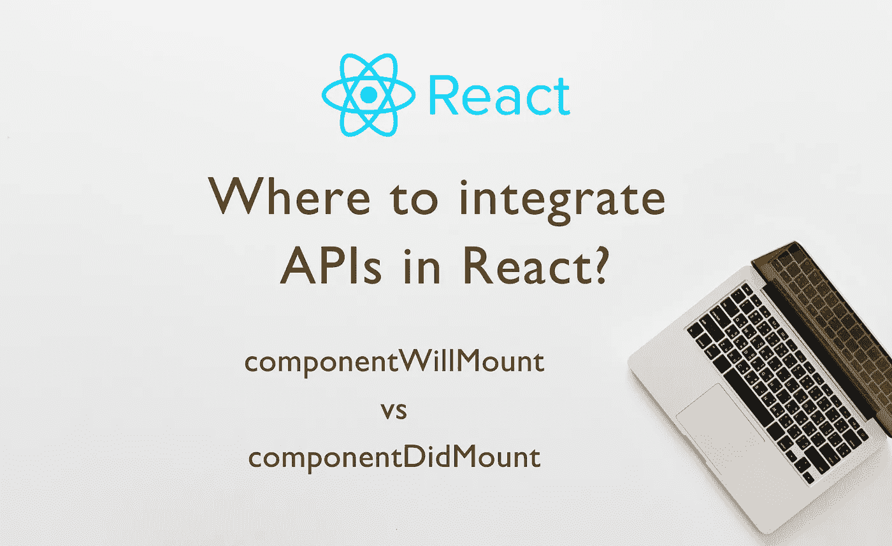

# ReactJs 中哪里集成 API 调用？— componentWillMount 与 componentDidMount

> 原文：<https://medium.com/hackernoon/where-to-integrate-api-calls-in-reactjs-componentwillmount-vs-componentdidmount-710085dc05c3>

每个想要获取数据或向服务器发送数据的 React 应用程序都需要集成 API。

有各种各样的生命周期方法，如果一个组件想要集成 API，那么什么是正确的位置呢？

React 中有各种生命周期方法，了解生命周期方法将有助于您成为更好的 React 开发人员。

如果你对生命周期方法有任何疑问，你真的应该去看看这篇博文。

 [## ReactJs 组件生命周期方法——深入探讨

### “ReactJs 是一个用于构建用户界面的 javascript 库”是关于 ReactJs 的官方介绍。

hackernoon.com](https://hackernoon.com/reactjs-component-lifecycle-methods-a-deep-dive-38275d9d13c0) 

通常，在任何客户端应用程序中有两种 API 调用集成:

1.  **当用户要求** 这种 API 调用是用户在点击、滚动、拖放&等各种事件上要求的。例如提交表格和加载更多选项。这种 API 调用有专门的事件函数，API 就是从那里调用的。
2.  **组件加载** 在很多场景下，都要求我们希望组件一加载就获取一些数据。例如，考虑显示项目列表的组件，在这种情况下，一旦组件加载到浏览器上，您就需要自动调用 GET API。另一个例子是集成 API 来分析组件的加载。

在这篇博文中，我们将讨论在组件加载后，React app 中 API 的集成。

> 我们不应该在 render 方法中获取任何数据，因为 render 是一个纯函数，在这里调用 API 可能会产生副作用。

我知道，这是大家都知道的。我只是想*提醒*😉

在定义了属性和状态之后，生命周期方法的领域就开始了。因此，这两种方法是最合适的候选方法，其中 API 可以被调用:

1.  component will mount/UNSAFE _ component will mount
2.  组件安装

## 1)component will mount/UNSAFE _ component will mount

如果你是第一次看到`**UNSAFE_**` ，让我告诉你在几天前发布的 React v16.3.0 中，已经宣布`componentWillMount`**将只工作到版本 17**`**UNSAFE_**`将作为前缀允许逐步迁移。
这是一个非常**强有力的**不使用这种方法的理由，但是让我们仍然为使用 react 版本低于 17 的应用程序找到答案，因为这些方法将始终保留在较旧的 React 版本中，甚至在接下来的几个版本中。

过去，在 React 社区中有一场大辩论和讨论，反对使用`componentWillMount`而使用构造函数，因此已经完成了。

*请点击以下链接查看讨论内容。*

 [## 可能会安装不推荐的组件？问题#7671 facebook/react

### 让我们利用这个主题来讨论组件安装的用例以及这些问题的替代解决方案…

github.com](https://github.com/facebook/react/issues/7671) 

如果你计划升级你的 React 版本，你可以使用[自动化脚本](https://github.com/reactjs/react-codemod#rename-unsafe-lifecycles)来重命名名字。

这是 React 开发人员在社区中非常普遍的误解，他们认为我们应该在`componentWillMount`中调用 API，这样就可以避免额外的渲染。但是，我的朋友，事实是 render 方法总是在`componentWillMount`之后被立即调用，没有办法要求 render 等待 API 调用完成。

> 必须正确设置组件的默认状态和属性，以呈现具有空状态值的组件。

如果您正在进行 React 组件的服务器端渲染，那么`componentWillMount`将在服务器端被调用，并在客户端再次被调用，从而导致调用 fetch 两次。因此，这绝对不是我们应该集成 API 的地方。

## 2)组件安装

这个方法是集成 API 的合适位置，因为此时 render 方法已经被调用过一次**。**

如果我们的组件呈现在服务器上，API 不会被调用两次，一次是因为在服务器端组件 **DidMount** 不会被调用。因此，该 API 在客户端只被调用一次。

这就是这篇博文的内容，我希望你能从这篇博文中获得一些有价值的信息。请鼓掌，评论，让我知道你的想法，并在 twitter 上分享🙂不断学习和分享😊

如果这篇文章对你有帮助，那么你可以[给我买杯咖啡](http://paypal.me/MaheshHaldar)😊