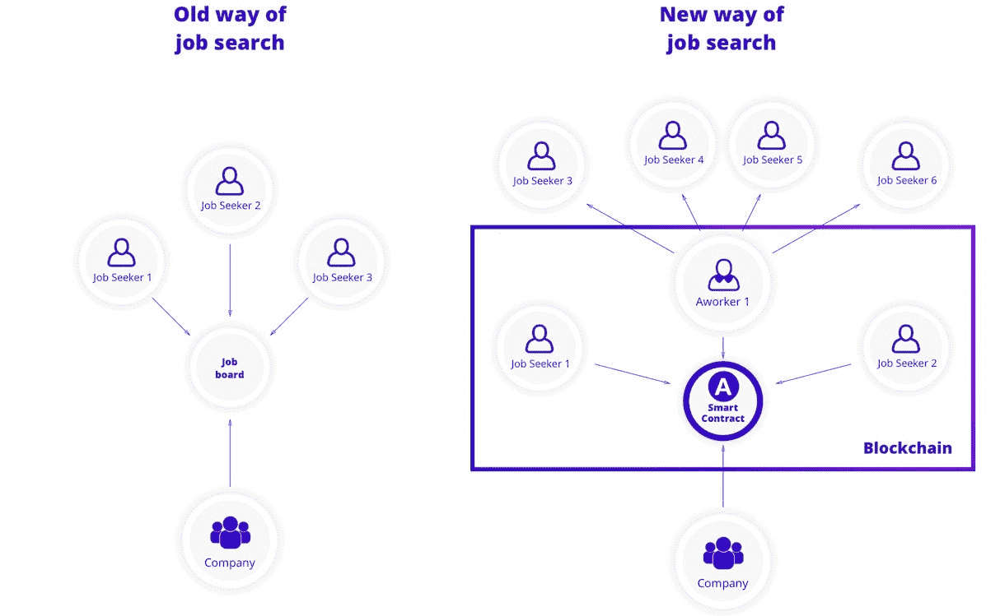

# 想在亚洲找工作从哪里入手？

> 原文：<https://medium.com/hackernoon/where-to-start-if-you-want-to-find-a-job-in-asia-932177ff7665>

随着越来越多的人关注自我发展，他们中的许多人不想在一家公司呆上 10-15 年，而是想周游世界，找到一份让他们兴奋的工作。做更多的工作也提供了结识新朋友的机会。如果你梦想的工作在亚洲，该如何开始寻找呢？

根据 CareerBuilder 的调查，雇主们希望他们新雇佣的大学毕业生中有 45%会在公司呆不到两年。该研究还显示，到 35 岁时，大约 25%的年轻员工会从事五份工作。雇主们意识到，他们雇佣的是那些在职业发展中找到自己立足点的人，他们学会做出健康的选择，而不是停留在一份对员工和雇主都没有好处的工作中，没有动力。

对于那些渴望在亚洲找到一份完美工作的人，我们整理了一份网站列表，开始寻找新的工作场所。

1.  MySaudiJobs —沙乌地阿拉伯【https://www.mysaudijobs.com/ T2
2.  http://www.naukri.com
3.  KoreaJobLink —韩国[http://www.koreajoblink.com](http://www.koreajoblink.com/)
4.  job 马尔代夫—马尔代夫[http://www.job-maldives.com](http://www.job-maldives.com/)
5.  香港新兵—香港[http://hongkong.recruit.net](http://hongkong.recruit.net/)
6.  阿贾恩——泰国[http://www.ajarn.com](http://www.ajarn.com/)
7.  JobStreet —马拉西亚[http://my.jobstreet.com](http://my.jobstreet.com/)
8.  RightJobs —巴基斯坦[http://rightjobs.pk/](http://rightjobs.pk/)
9.  新加坡——新加坡[http://www.singaporejobsonline.com](http://www.singaporejobsonline.com/)
10.  http://www.gaijinpot.com

# 不够？那也行！

求职公告板不再那么有效了，因为有了社交媒体平台，比如 LinkedIn、[、脸书、甚至 Twitter，你可以在那里建立一个强大的网络，让你找到一份完美的工作。事实是，求职公告板有 2-4%的有效率，而人际关系网有超过 50%的有效率。作为一名拥有技能和专业知识的专业人士，当你建立关系网时，你应该确定联系人，以建立互惠互利的关系，并跟进他们，以培养持续参与和互动的潜力。](https://hackernoon.com/tagged/facebook)

然而，将脸书完全变成一个求职平台可能会进一步模糊人们私人生活和公共生活之间的界限。对于那些无法抗拒发布雇主不应该看到的东西的诱惑的人来说，隐私设置仍然是最可靠的保护。此外，考虑到[目前与脸书](https://www.vox.com/2018/4/10/17207394/cambridge-analytica-facebook-zuckerberg-trump-privacy-scandal)的丑闻，换一种方式找工作可能会有帮助。

在这里，区块链的力量可以得到充分展示。

> 如果你想要**一个账号，它将从求职公告板和社交媒体平台**中获益，并有机会找到一份完美的工作(即使是在另一个国家)？

了解下一代解决方案——工作人员。Aworker 是一个根据你的心理类型、专业技能和工作成就，帮助你找到最合适的公司和职位的平台。没有必要害怕区块链技术，因为去中心化为创造新的专业生态系统提供了最好的机会。借助智能合同的力量，为熟人推荐或自己来参加工作面试付费是自动的。此外，所有信息都被安全存储，所有操作都是透明的，这排除了陷入昂贵但不必要的义务的可能性。Aworker 通过将区块链驱动的技术置于 Work 2.0 的核心来开发颠覆性的解决方案。现在每个人都会因为他的工作相关的推荐而获得奖励。

你可以在 [HackerNoon](https://hackernoon.com/the-future-came-early-decentralized-job-search-bce71fa0f627) 上阅读关于 Aworker 算法的案例研究。