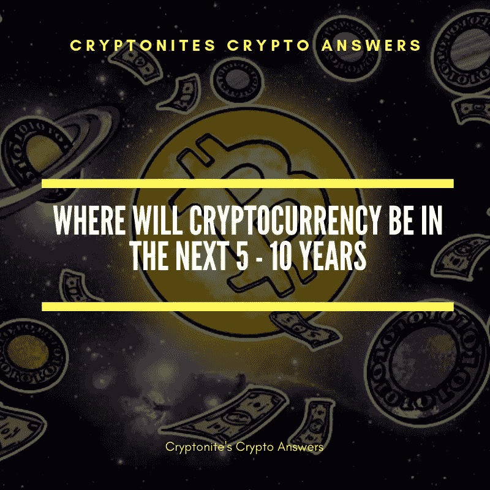

# 未来 5-10 年，加密货币会在哪里？

> 原文：<https://medium.com/hackernoon/where-will-cryptocurrency-be-in-the-next-5-10-years-49bb7faf4fb5>

## 加密货币不仅仅是 lambos 和飞船迷因，还有一些改变世界的技术在这里发挥作用。

在未来的 5-10 年里，我可以看到加密货币将成为我们日常生活的一部分，就像互联网和移动通信等当前技术一样。

以下是如何看待加密货币的未来:

**一切都会很快**

你想给住在世界另一端的奶奶寄钱回家吗？没问题，你只需给她汇 5000 美元，只需 4 秒钟，花费不到 1 美分。

你在迪拜的商业伙伴正在帮助你开始一项酒店特许经营，他需要加盟费，而且他需要尽快拿到。没问题，多亏了 Ripple，您刚刚从您的企业帐户中向合作伙伴的企业帐户发送了 150，000 美元。

你甚至不用等 3 天，它在 3 秒钟内就到了，而且花费你不到 1 美分。

由于钱不是唯一可以通过区块链传送的东西，我们可以预期“下载”或文件传输时间将减少到只有几分钟或几秒钟。基于区块链的游戏、音乐、视频或书籍的拷贝将以一定的速度发送到你的“钱包”中，这将使今天的文件传输服务看起来很原始。

我们已经可以使用 Mega 等服务在不到 10 分钟的时间内下载 1GB 的文件，现在想象一下区块链的网络可以实现近乎即时的数据传输。人们将为游戏付费，并在几分钟内玩游戏。

**每个人都会使用加密货币，不管他们是否意识到这一点**

汇款不是加密货币的用途，它们还被用作交易费用和支付智能合同等服务。未来，企业将像以太坊和 Stellar 一样使用区块链在其组织中部署自动执行的智能合同。

智能合约是简单的自动化合约，一旦满足某些条件就会执行，例如，当你向 ICO 捐款时，是智能合约而不是创始人向你提供新令牌。

随着智能合同技术的改进，我们可以期待看到企业从各种流程中去除中间人，从而降低成本，使最终用户的服务更便宜。

所有这些都将在后台发生，消费者甚至不会察觉。

**银行将接受并整合加密货币**

适者生存实际上适用于能够适应变化的环境。

银行最终将接受加密货币，甚至围绕它们创造出整套方案。

*   人们将开设加密银行账户。
*   你将能够从标准的自动取款机上购买比特币和其他加密货币。
*   加密借记卡将成为一种常态
*   加密货币贷款甚至加密货币信用卡都将发放给合适的候选人。

**最终想法**

我们甚至还没有触及加密货币的表面功能，这个答案中提到的所有东西都只是加密货币用途的一小部分。

有趣的事实:GPS 技术和互联网是由军方发明的，当时它们的用途非常有限，但现在我们有像优步这样的公司。

这是一些值得思考的问题

## 我的“Cryptonites Crypto Answers”系列的一部分，摘自我在 Quora 上回答的问题。

## 我希望你喜欢我的故事，请随意查看下面这些有用的资源:

你可以用一个 [**账本 Nano S 硬件钱包**](https://www.ledgerwallet.com/r/4c54) **来保证你的加密货币安全无虞。**

您可以在世界任何地方使用 [**CEX**](https://cex.io/r/0/up106280379/0/) 购买比特币、以太坊、Ripple、比特币现金、Dash、比特币黄金、恒星流明等等

您可以使用 [**BitPanda**](https://www.bitpanda.com/?ref=3127933809251797450) 在欧洲任何地方购买比特币、以太坊、IOTA、OmiseGo、EOS、比特币现金、莱特币等。

也可以在 [**推特**](https://twitter.com/CryptoniteTweet) **上关注我。**