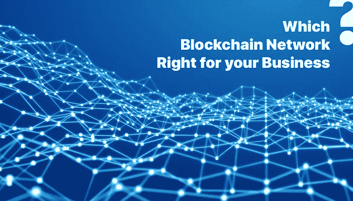

# 你的企业应该选择哪个区块链网络？

> 原文：<https://medium.com/hackernoon/which-blockchain-network-should-you-choose-for-your-business-d20042ab6057>

区块链正在为数字和经济领域提供动力。

首先，区块链技术是经济交易的共享和可信的公共分类账，这些交易被分组到块中。这个分布式数据库维护着一个不断增长的交易和数据记录列表，这些交易和数据记录都是加密安全的。

区块链是一个不可破解的数据存储系统。数据不是保存在一个安全的地方，而是保存在一个分散的分类帐中。所以，公司依靠 [**区块链发展**](https://www.goodfirms.co/directory/services/list-blockchain-technology-companies) 来满足他们所有的业务需求。

现在，除了加密货币，区块链的大多数可能性都采取智能合约的形式。智能合同听起来可能类似于数字合同，但它们完全是两码事。

智能合同是自动执行的合同，其中双方之间的协议条款以代码的形式直接写入。而这些代码和协议存在于一个 [**基于区块链的平台**](https://topcompaniesreview.wordpress.com/2018/06/07/3-major-platforms-for-blockchain-development/) 。

但是，当我们谈论数字合同时，双方只需要指定两件事——交易的条件和违反的条款。即使某些条件没有得到满足，合同仍然有效，交易仍然可以进行。

而在智能合约中，除非每个条款和条件都得到满足，否则交易本身是不可能的。它们被设计成这样一种方式，如果任何一方决定干预，将被视为违约。而一旦违约，契约又会重新优化。这将确保不违反任何条款和条件。由于它们提供透明度和抗欺诈性，智能合同开发是必需的。

现在，您已经了解了智能合约，让我们继续了解不同类型的区块链网络。区块链网络主要分为三类。

正在使用的三种主要类型的 [**区块链技术**](https://e27.co/4-ways-blockchain-will-disrupt-traditional-adtech-ecosystem-20180131/) 是:

## **1。公共区块链网络**

公共区块链是完全分散的。

在公共区块链中，世界各地的任何用户都可以读取、写入和审计区块链。在一个公开的区块链，交易是公开透明的。任何用户都可以运行一个完整节点，并在公共区块链中开始挖掘。用户还可以进行交易，审查和审计区块链。

访问公共区块链不需要任何许可，世界上的任何人都可以参与交易。没有任何个人或公司负责区块链的公共网络。

那么，如果没有人负责，谁来核实交易呢？

在公共区块链中，交易由各种分散的机制控制，如 POW(工作证明)和 POS(股权证明)。

*   POW(工作证明)-在 POW 算法中，挖掘一个块的概率取决于挖掘者完成的计算工作量。
*   POS(股份证明)—在 POS 算法中，验证新区块的概率取决于个人拥有的股份大小。

公共区块链主要用于两件事:消息的无信任时间戳和值路由。但是，公共区块链的一个主要缺点是速度慢、效率低。

因此，公共区块链是世界上大多数用户的首选，因为他们不必像其他网络那样信任第三方。

区块链的例子——比特币、莱特币

## **2。财团区块链网络**

联合体是区块链，其中共识由一组预先选择的节点控制。

有一群公司聚集在一起，为整个网络做出决策。这些团体被称为财团。因此，这种类型的区块链被称为区块链财团或区块链联邦。

区块链财团不同于公共区块链，因为在公共区块链，任何有互联网连接的人都可以成为区块链的一部分。而在区块链财团中，访问是受限制的，只有属于该财团的公司才能访问网络。

区块链网络联盟还取消了授予区块链私有网络中单个实体的自治权。

因此，作为这个区块链网络成员的公司有权运行一个完整的节点并开始开采。他们也可以在委托的区块链上进行交易。

让我们看看区块链财团是如何运作的。假设在一个区块链财团中有 20 家公司。因此，公司可以在智能合同中事先决定，如果必须在区块链中添加一些内容，或者如果任何交易需要验证，则必须由至少 15 家公司投票决定。

因此，区块链联盟允许这些公司以安全和无缝的方式在网络中共享选定的数据。因此，它节省了时间，降低了成本，并增加了成员公司之间的信任。

区块链财团的例子——Quorum、Hyperledger、Corda

## **3。私有区块链网络**

这种类型的区块链属于个人或公司，他们完全控制网络。他们有权恢复交易、修改余额和添加新的区块。

在专用区块链网络中，写权限集中在一家公司。但是，读取权限可以是公共的，也可以有一定的限制。由于访问受到限制，与其他网络相比，它提供了最高级别的隐私保护。此外，在专用区块链网络中，并非每个用户都可以运行完整节点或开始挖掘。

私有区块链的主要优势在于它降低了交易成本并替换了遗留系统。

由于与其他网络相比，私人区块链开发相对昂贵且耗时，请确保只雇佣最好的私人区块链开发公司**。**

**私人区块链是安全的，并有效地解决欺诈问题。在所有三种类型的区块链网络中，它们是最安全的。**

**私营区块链银行链的例子**

## ****尾注:****

**每个区块链网络都有自己的优势和劣势。根据行业类型，您可以选择最适合您业务的网络。**

**如果您的企业要求隐私和控制，私人或财团区块链网络是最好的选择。但是，如果你需要开放和审查阻力，公共区块链是最好的。**

**做出最佳选择，充分利用区块链网络为您的企业带来的优势！**