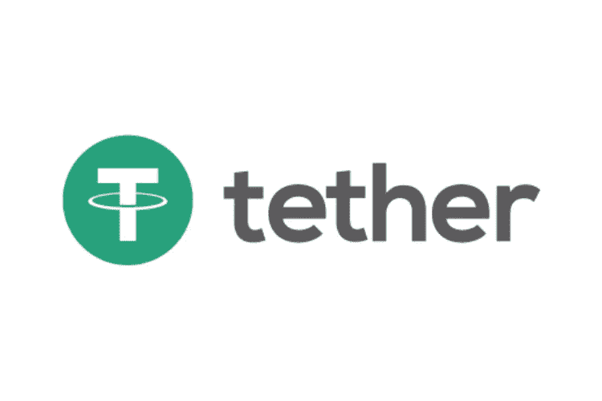
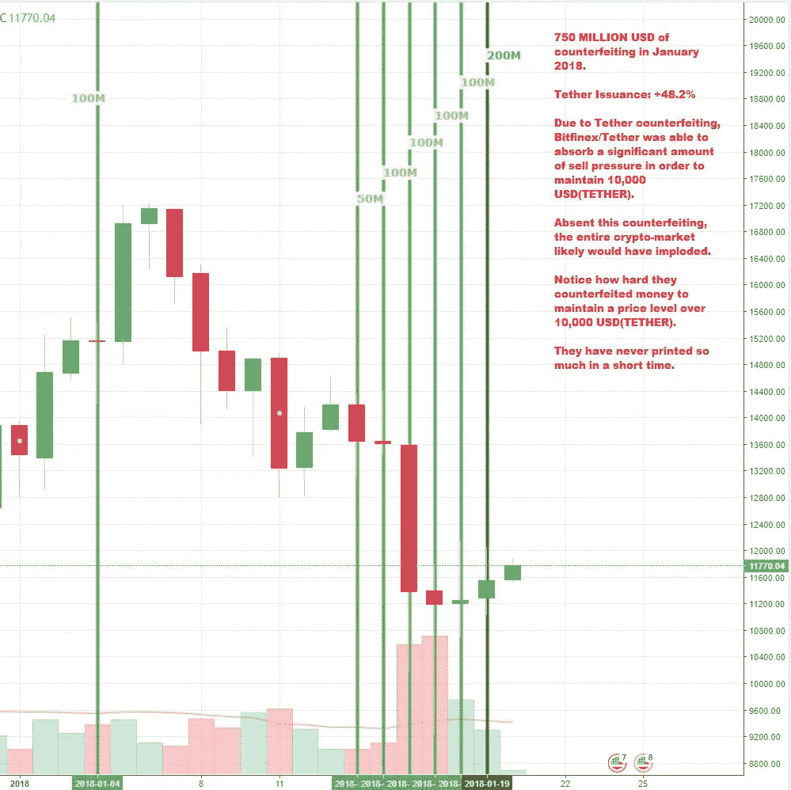

# 哪些加密货币最有可能被骗子操纵？

> 原文：<https://medium.com/hackernoon/which-cryptocurrencies-are-most-likely-being-manipulated-by-scammers-faa49fc7cc66>

> 这个答案最初发布在 Quora 上。[可以在这里查看答案](https://www.quora.com/Which-cryptocurrencies-are-most-likely-being-manipulated-by-scammers/answer/Brian-Schuster-5)。更多来自 [Quora](https://medium.com/u/3853f85f7d5e?source=post_page-----faa49fc7cc66--------------------------------) 的趋势科技答案，请访问【HackerNoon.com/quora】的。

很可能是所有人，但主要是 BTC。如果结果证明系绳是欺诈性添加的，那就是这种情况。 (Tether 是与美元挂钩的加密货币，符号为‘USDT’。)

如果你不知道的话，有一个名为“Bitfinex”ed 的匿名账户(在 [twitter](https://twitter.com/bitfinexed) 和 [medium](/@bitfinexed) 上)已经与 Tether 进行了数月的战争。起初，他的理论看起来像一个阴谋论，但最终你会发现一些事情，让她/他的说法具有合法性:

1.  **运行和发布 Tether 的组织也是运行 Bitfinex 的组织。**这是最近才发现的，并通过[链接两个组织的股东文件](/@bitfinexed/spoiler-alert-the-institution-buying-tethers-is-bitfinex-themselves-f56af29ce60c)得到了证实。
2.  **运行 Tether 和 Bitfinex 的组织从未进行过全面的审计，以证明每个 USDT 都由等值的美元支持。这一点尚未被证实，但 USDT 仍以 1 美元的价格交易，这一事实令人惊讶。**
3.  **我们不知道锁定资金生产 USDT 的“投资者”是谁。**当资金不足 1 亿美元时，这些投资者可能是拥有大量资本的无名小卒。现在我们已经发行了超过 10 亿 USDT(编辑:截至今天 20 亿 USDT ),但这些投资者是谁还不清楚。

这些情况为滥用打开了方便之门。但在本周之前，我会认为 USDT 被发现欺诈就像 Bitconnect 或一家主要交易所倒闭一样:有点影响，但不足以对市场造成长期损害。我现在认为，USDT 被用来人为抬高 BTC 和市场的价格。

上周二(1 月 16 日)，市场暴跌。BTC 和瑞士联邦理工学院的股价暴跌 30%，其他加密货币的跌幅高达 50%。大约在同一时间，泰瑟开始每天发行至少价值 5000 万美元的泰瑟。

这是 2018 年 1 月 BTC 的价格，包括新系绳加入生态系统的天数(归功于 Bitfinex'ed)。

这条线立即被用来购买比特币和其他数字资产。

这意味着两件事之一:

1.  要么是一群不知名的投资者发行了价值 750，000，000 美元的美元作为担保(约占总发行供应量的 42%),以在价格回升前买入下跌，要么是
2.  生产的系绳是欺诈性的，以阻止价格下跌。

如果是第一种情况，审计将能够证明资金能够支持美元与 USDT 的一对一联系。然而，情景 2 的含义相当可怕:我们实际上并没有在周二看到真正的崩盘。如果系绳是假的，那么真正的底部可能远低于它实际着陆的位置。

我不想这么说，但我相信由于这一活动，加密货币的价格正在被全面操纵。为了大家好，我希望这不是真的，但这是系绳证明这是不正确的。

> 最初发表于 www.quora.com 的[。](https://www.quora.com/Which-cryptocurrencies-are-most-likely-being-manipulated-by-scammers/answer/Brian-Schuster-5)
> 
> 更多来自 Quora 的趋势科技答案，请访问 HackerNoon.com/quora[网站](https://hackernoon.com/quora/home)。