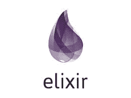

# 我应该使用哪种数据结构？灵丹妙药秘籍

> 原文：<https://medium.com/hackernoon/which-data-structure-should-i-use-an-elixir-cheat-sheet-80b662185e5b>



作为一个 Elixir 新手，我认为开始使用
Elixir 最困难的事情之一是弄清楚使用哪种数据结构。我的团队最近开始全力以赴研究长生不老药，所以我一直在认真温习。然而，我经常会阅读我团队的一些代码，甚至很难理解我在看什么。语法看起来非常类似于 Ruby(我对此非常了解)，但是模式、约定和数据结构只是略有不同。在我看来，这是有意义的，因为它是一种函数式语言，而不是面向对象的语言:在 Ruby 中使用对象，而在 Elixir 中可能正在生成进程。

但是不管怎样，既然我现在正在学习 Elixir，我认为提供一个备忘单或者我作为一个探索 Elixir 的 ruby 专家所注意到的数据结构差异的概述是有用的。

## 数据类型

如果您来自 Ruby(或大多数其他编程语言)，那么整数、
浮点数、范围和正则表达式可能对您来说都很熟悉
。幸运的是，这些都存在于长生不老药中。有几个
区别，但是我还没有过多处理。

原子就像红宝石中的符号。它们以冒号开头，它们的名字就是它们的值。例如，`:hello`是酏剂中的有效原子。它们通常被用来标记值。

仙丹里也有字符串。字符串总是有双引号，而查理斯是单引号。字符串是二进制的，charlists 实际上只是代码点的列表。到目前为止我很少用查理斯。

以下是这些类型的快速浏览

```
iex> 2         # integer
iex> 2.0       # floating point
iex> false     # boolean
iex> 1..4      # range
iex> ~r/hello/ # regular expression
iex> :hello    # atom
iex> “world”   # string
iex> ‘world’   # charlist
```

Elixir 有额外的数据类型，`Port`和`PID`，它们在进程通信中使用
。它们是通过 Erlang VM 可用的实体。

## 港口

一个`Port`用于与
应用程序外部的资源进行通信(读/写)。它们非常适合启动操作系统进程并与它们通信。例如，你可能想打开一个端口来运行一个操作系统命令，比如`echo.`

您可以打开一个端口并向它发送一条消息，就像这样:

```
iex> port = Port.open({:spawn, “echo sup”}, [:binary])
#Port<0.1305>
```

然后，您可以使用`flush()` IEx 助手打印来自
端口的消息。

```
iex> port = Port.open({:spawn, “echo sup”}, [:binary])
#Port<0.1305>
iex> flush()
iex> {#Port<0.1305>, {:data, “sup\n”}}
iex> :ok
```

您可以向端口发送您想要执行的二进制文件的任何名称。比如从我的 jekyll 博客的目录下
打开一个`iex`会话，打开一个
端口，然后发送`bundle install`命令，安装了所有的
Ruby gem 依赖项。下面是输出的一个片段。

```
iex> port = Port.open({:spawn, “bundle install”}, [:binary])
#Port<0.1306>
iex> flush()
{#Port<0.1306>, {:data, “Using concurrent-ruby 1.0.5\n”}}
{#Port<0.1306>, {:data, “Using i18n 0.9.5\n”}}
{#Port<0.1306>, {:data, “Using minitest 5.11.3\n”}}
{#Port<0.1306>, {:data, “Using thread_safe 0.3.6\n”}}
{#Port<0.1306>, {:data, “Using tzinfo 1.2.5\n”}}
{#Port<0.1306>, {:data, “Using activesupport 4.2.10\n”}}
{#Port<0.1306>, {:data, “Using public_suffix 2.0.5\n”}}
{#Port<0.1306>, {:data, “Using addressable 2.5.2\n”}}
{#Port<0.1306>, {:data, “Using bundler 1.16.2\n”}}
{#Port<0.1306>, {:data, “Using coffee-script-source 1.11.1\n”}}
{#Port<0.1306>, {:data, “Using execjs 2.7.0\n”}}
{#Port<0.1306>,
 {:data,
 “Bundle complete! 4 Gemfile dependencies, 85 gems now installed.\nUse `bundle info [gemname]` to see where a bundled gem is installed.\n”}}
:ok
```

## PID

一个`PID`是对一个进程的引用。每当你产生一个新的进程，你就会得到一个新的 PID。预计会谈论很多关于 PID 的内容。您可能需要将
放在 PID 上，这样您就可以发送不同的进程消息。

这是一个生成进程并取回 PID 的例子。

```
iex> pid = spawn fn -> IO.puts(“hello world”) end
iex> hello world
iex> #PID<0.123.0>
```

该进程在完成其工作后终止。PID 和端口保证它们自己独立的 post，但是现在，我认为只要知道它们的存在就足够了。

现在我们已经添加了新的类型，这是我们的基本备忘单。

# Elixir 数据类型备忘单

```
iex> 2         # integer
iex> 2.0       # floating point
iex> false     # boolean
iex> 1..4      # range
iex> ~r/hello/ # regular expression
iex> :hello    # atom
iex> “world”   # string
iex> ‘world’   # charlist
iex> #Port<0.1306> # port
iex> #PID<0.123.0> # pid
```

不过，在我看来，使用 Elixir 的真正挑战是弄清楚如何
将这些基本数据类型组织成您可以使用的结构。所以让我们来看一看
不同的集合类型以及为什么你会使用每一种。

# 集合类型

以下是您可能会遇到的集合类型:
-元组
-列表
-关键字列表
-映射
-结构

你可能以前听过这些词，至少是顺便听过，但是如果你习惯了 Ruby，你可能会想为什么你需要所有这些额外类型的集合。我们来调查一下。

## 元组

元组是值的有序集合。它们看起来像这样:

```
iex> {:hello, “world”}
iex> {1, 2}
iex> {:ok, “this is amazing!”, 2}# You can check if it’s really a tuple
iex> tuple = { “hello”, “world”}
iex> is_tuple tuple
iex> true# and then you can get an element from a tuple by index
iex> elem(tuple, 1)
iex> “world”
```

我觉得元组有点野。我的意思是，它们看起来应该是散列，但它们的行为有点像 Ruby 数组。然后就叫元组！当我第一百次感到困惑的时候，我一直告诉自己，熟悉他们会有回报的。

元组在长生不老药里到处出现。函数的返回值通常是可以进行模式匹配的元组，所以通过元组来看世界是有意义的。元组通常有两到四个元素，在这一点上，它们是我的首选数据结构。当您处理具有四个以上元素的数据结构时，这可能是使用 map 或 struct 的好例子。

## 列表

列表是链接的数据结构。它们看起来像这样:

```
iex> [1, 2, 3, 4]
iex> [“hello”, “world”]
```

在 Ruby 中，你会认为那是一个数组，但是在 Elixir 中，它是一个列表！因为列表是作为链接数据结构实现的，所以它们适合递归，但是不适合随机检索元素或者计算长度，因为您需要遍历整个列表来计算大小。迄今为止，我大多使用元组而不是列表。如果您必须在它们之间做出选择，我想您需要考虑集合的预期大小以及您将对其执行何种操作。

## 关键词列表

让事情变得更复杂的是，在 Elixir 中还有关键字列表这样的东西。本质上，这是一个二值元组列表。

```
# keyword list
iex> [ phrase: “oh hello”, name: “tracy” ]# is actually two-value tuples
iex> [ {:phrase, “oh hello”}, {:name, “tracy”} ]
```

这继续困扰着我，尽管我意识到它的普遍存在。关键字列表的酷之处在于，在一个关键字列表中可以有两个相同的关键字。

```
iex> keyword_list = [food: “peanut butter”, food: “ice cream”, flavor: “chocolate”] # a valid keyword list
```

关键字列表适用于命令行参数和选项。

## 地图

接下来是地图。如果你想要一个真正的键值存储，而不是键值列表，这就是你要找的。它们看起来有点像 Ruby 中的散列。

```
iex> %{“greeting” => “hello”, “noun” => “world”}
iex> %{:greeting => “hello”, :noun => “world”}
iex> %{greeting: “hello”, noun: “world”} # if the keys are atoms, you can skip the hash rockets.iex> greeting = %{spanish: “hola”, chinese: “ni hao”, english: “hello”}
iex> greeting[:spanish]
iex> “hola”
iex> greeting.chinese
iex> “ni hao”
```

映射有利于传递关联数据，以及几乎所有大于元组大小的数据。

## 结构

结构就像增强的映射。它们只允许某些键，而且这些键必须是原子。需要用合理的默认值在模块中定义结构。它们是有规则的地图。

```
iex> defmodule IceCream do
…. defstruct flavor: “”, quantity: 0
…. endiex> chocolate = %IceCream{flavor: “chocolate”}
iex> chocolate.flavor
iex> “chocolate”
```

您将看到该结构是用与 map 相同的`%`百分号定义的，但是它后面是模块的名称。这就是我如何提醒自己，他们只是更严格的地图。

旧版本的 Elixir 曾经也包含了用于处理超过几百个值的地图的`HashDict`，但是这个模块已经被弃用，取而代之的是老式的`Map`。

这就把我们带到了您将在 Elixir 中看到的常见数据类型和集合类型的末尾。虽然这两种语言有许多不同之处，但也有一些相似之处。当然，关于长生不老药、约定以及您可以做的很酷的事情，还有很多需要学习，但是这(我认为)是熟悉这门语言的良好开端。希望这将作为一个体面的指导，破译任何你可能很快遇到的灵丹妙药！

# 长生不老药收藏备忘单

```
iex> {:ok, “this is amazing!”, 2} # tuple
iex> [“hello”, “world”]           # list
iex> [ phrase: “oh hello”, name: “tracy” ] # keyword list
iex> greeting = %{spanish: “hola”, chinese: “ni hao”, english: “hello”} # map
iex> chocolate = %IceCream{flavor: “chocolate”} # struct
```

## 资源

- [基础类型](https://elixir-lang.org/getting-started/basic-types.html)上仙丹
-[-*编程仙丹*-](https://pragprog.com/book/elixir16/programming-elixir-1-6)下迪夫·托马斯
- [十六进制文档](https://hexdocs.pm/elixir/)