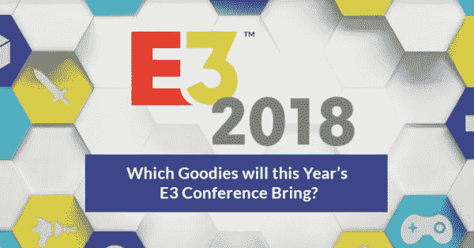

# 今年的 E3 会议会带来哪些好东西？

> 原文：<https://medium.com/hackernoon/which-goodies-will-this-years-e3-conference-bring-8140d3f7d3a3>

每年，来自世界各地的游戏开发商都期待着电子娱乐博览会(E3)。今年，它将于 6 月 12 日至 6 月 14 日在洛杉矶会议中心举行。

该活动是世界上最大的游戏大会，它为生产商、开发商和出版商提供了展示其最新产品的机会，从即将推出的游戏到最新的游戏配件。

那么，我们可以从今年的版本中期待哪些好东西呢？

# 强化游戏趋势

就像以前的其他 E3 活动一样，2018 年 E3 奥运会将在真正的大会开始前几天由几家公司举行新闻发布会；给出他们打算生产的新游戏和其他相关产品的细节。

已经有几家公司举行了新闻发布会，包括微软、育碧、贝塞斯达和电子艺界。

例如，Bethesda 宣布了一款名为《上古卷轴:刀锋》的开创性新手机游戏。你可以随时随地和你的同龄人玩这个游戏。它将在多个互联设备和系统上推出——手机、PC、游戏机，甚至 VR 头盔。

这是贝塞斯达·E3 新闻发布会的视频:

这是另一个展示育碧 E3 2018 新闻发布会的视频:

当真正的活动开始时，游戏开发商将设立展台，展示他们的新游戏如何运作。记者、公众、零售代表和其他游戏爱好者将与创作者互动，并获得对他们问题的一对一回答。

此外，其他附带活动也将在邻近的场地举行，如私人采访和电子游戏比赛。

因此，E3 2018 将有助于塑造今年剩余时间甚至未来几年的游戏行业趋势。

# 增加在 E3 的参与

自 1995 年 E3 事件开始以来，他们只限于视频游戏行业的成员和记者。然而，在 2017 年，组织这些活动的公司娱乐软件协会(ESA)改变了规则，允许公众访问。

因此，E3 2017 年奥运会的出席人数高达 68，400 人。今年的博览会预计会有更多的人参加。

参与 E3 2018 的人数增加对于游戏行业的发展至关重要，因为非行业成员可以获得兴趣并开始玩游戏。

已经有几家著名的开发商和发行商确认将参加 E3 2018，他们来自游戏行业的几乎所有流派。

例如，Epic Games 将展示堡垒之夜皇室之战，育碧将展示其即将推出的游戏，任天堂将在不久的将来推出几款新游戏。

# 包扎

预计 2018 年 E3 奥运会将展示突破性的技术、前所未见的游戏以及游戏行业其他令人兴奋的发展。

如果你想学习如何使用游戏行业的最新趋势技术制作令人兴奋的游戏，那么 [LiveEdu](https://www.liveedu.tv/guides/game-development/) 应该是你的首选。该平台有实际的项目，将帮助你把你的游戏开发技能提高到一个新的水平。

你可以在 [E3Expo 网站](https://www.e3expo.com/)上了解 E3 发生的事情。

你对世界上最大的游戏博览会有什么期待？请在下面分享你的评论。