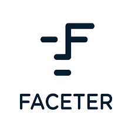
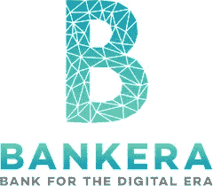
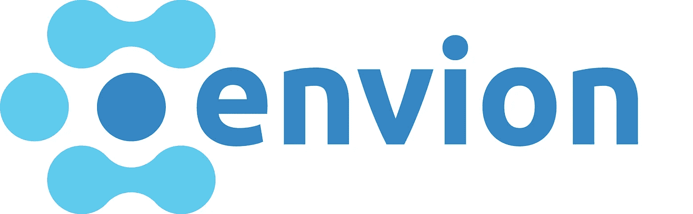
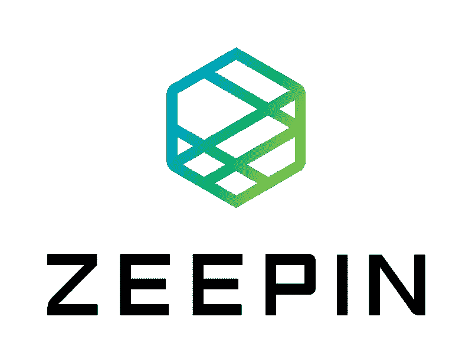
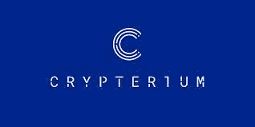

# 哪些 ico 筹得最多？

> 原文：<https://medium.com/hackernoon/which-icos-are-the-most-successful-590eabf15fe2>

如今很难找到一个从未听说过 ICO 的人。从银行交易事件到医疗保健医药，创业公司在所有行业都采用代币。许多项目失败了(实际上，*大部分*失败了)，但是其他的变得非常受欢迎，在他们的代币销售中收集了数百万美元。有些人在 ico 阶段前期的 *20 秒*内创造了*1000 万美元+* 美元！

根据目前的研究，在 2018 年 Q1 发布的所有 ico 中，只有一半筹集到了超过 10 万美元的资金。其他人几乎立刻就失败了。这引出了三个问题:

ICO 成功的关键是什么？

2018 年投资人最感兴趣的*项目有哪些*？

你如何在 ICO 取得成功？

以下是已经完成代币销售的 2018 年成功 ico 的简短列表:

**螺丝起子**

[Faceter](https://tokensale.faceter.io/ru/) 为监控创造创新产品，例如通过增强的面部识别、物体检测和实时视频分析，为摄像机采用“大脑”接口。这使用户能够了解情况并做出反应，从而为所有客户提供最大限度的安全保障。Faceter 的技术核心是他们对隐私的绝对尊重。他们利用卷积神经网络的特性来分割任务，强化了这种承诺。

该项目在 ICO 募集了近 2900 万美元，其中*前*20 秒*募集了 1000 万美元。*

**班凯拉**

[Bankera](https://bankera.com) 总部设在维尔纽斯，[立陶宛](https://icobench.com/icos?filterCountry=Lithuania)。其目的是创建区块链最大的[产业银行。他们的象征性销售从 80，000 多名捐助者那里筹集了超过 1 亿欧元，从而使 Bankera 的 ICO 成为业内最大的 ICO 之一。](https://hackernoon.com/tagged/blockchain)

Bankera 成功的最重要原因是这家初创公司已经有了一个可用的产品。此外，SpectroCoin 是 Bankera 的副总裁。通过 SpectroCoin，投资者已经可以看到结果，并从他们所投资的技术中获益。

**环境**

2018 年 1 月，Envion ICO 荣登市场历史上十大 ICO 和众筹活动榜单。该公司在他们的 ICO 期间筹集了超过 1 亿美元。

Envion 的目标是加密货币采矿业的颠覆和民主化。利用最先进的移动采矿设备，以及聘请专家团队，这个瑞士运营的项目似乎注定要取得伟大的成就。据报道，Envion 已经与 IBM 达成了交易。

不幸的是，这个“成功”故事的结局并不乐观。该团队声称，交易失败了，其投资者概述的目标远未完成，也不清楚他们是否会实现。

许多媒体报道了围绕该公司的巨大丑闻，包括创始人和首席执行官互相指责欺诈。Envion，T2 应该已经向投资者支付股息，已经完全停止工作，而他们的投资者继续要求他们的钱回来。

**泽平**

这家初创公司将自己描述为一家专注于建立基于区块链的创造性分散经济的公司。其巧妙的生态系统整合了各种工具，包括版权保护、可交易的数字资产、远程合作、人才招聘和项目众筹。

Zeepin 是一个去中心化的区块链，为全球创意产业和去中心化共享经济社区的追随者而开发。这应该在几个方面帮助全球创意内容生产者和创新者:资产数字化和权利确认，实现高效交易，创意资产众筹，以及提高组织和个人的创新效率。该项目的硬性上限——在 ICO 的第一天*筹集到的资金是 62，000，000 美元。印象深刻！*

**隐窝**

到去年年底，Crypteriumproject 项目已经通过 ICO 筹集了 5200 万美元。

该项目代表了一个数字移动加密银行，旨在提供全面的垂直综合服务。这些服务将促进与其他加密货币解决方案和区块链爱好者团队的合作。

加密货币银行 Crypterium 聘请 VISA 前首席执行官马克·奥布莱恩(Marc O'Brien)担任他们公司的类似职位。

这些 ico 只是 2018 年上半年成功项目的部分清单。如果你想探索最有趣的即将到来的 ico，请查看 [https://forico.io](https://forico.io/)

祝你投资好运！