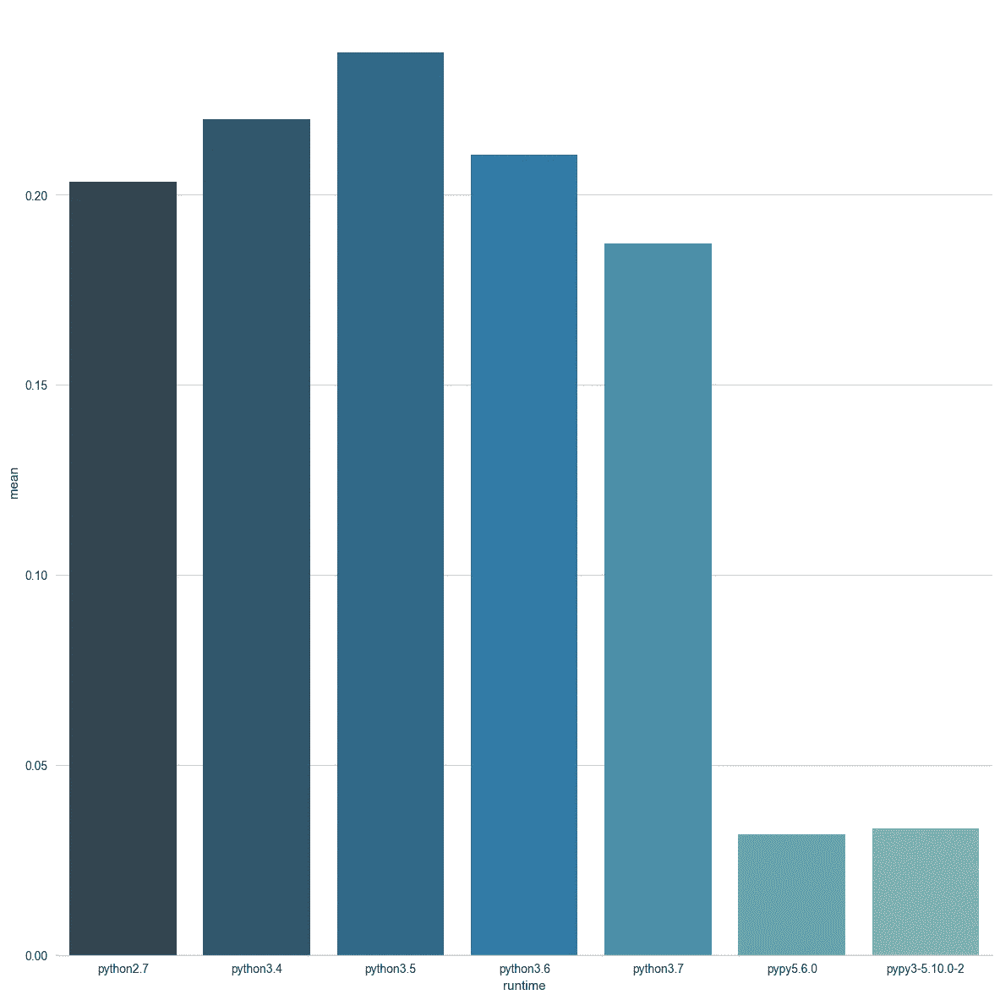

# Python 最快的版本是哪个？

> 原文：<https://medium.com/hackernoon/which-is-the-fastest-version-of-python-2ae7c61a6b2b>

当然，“视情况而定”，但是它取决于什么，您如何评估哪个版本的 Python 对您的应用程序来说是最快的？

> Python 3 比 Python 2 慢吗？Python 3 的哪个版本最快，你对速度还有什么其他选择？

# 使用性能套件实用程序

核心 Python 团队非常关心性能，我在 speed.python.org 网站之前已经提到过，这是将“官方”基准与 CPython 版本进行比较的好方法。

但是有几个问题:

1.  结果很难解读
2.  他们不包括 PyPy

你可以通过运行`pip install performance`下载运行这个网站的工具箱，然后你就可以运行了

`pyperformance run --python={chosen_python_runtime} -o my_results.json`

这将针对 Python 的目标版本多次运行一系列有文档记录的“真实世界”应用程序，并记录平均值、中间值和

这就是我在本文中针对 Python 的官方安装所做的工作:

*   2.7.10,
*   3.4.4,
*   3.5.4,
*   3.6.1 和
*   3.7(我有 beta 2)。

同样，这也包括 PyPy(5.6。)和 PyPy3 (5.4.10)。

# 结果呢

我已经根据用例对结果进行了分解，所以看一看，运行你自己的测试，并且可能编写你自己的测试。

我还创建了一个简单的脚本来获取 perf 数据文件的列表，并为每个测试创建图表。[代码在 GitHub 上](https://gist.github.com/tonybaloney/4e8e45f9128e9eb6e4f36c73ba5e5574)。

> 在所有图表中，结果以秒为单位，越低越好。

完整的结果和图表可以在这里找到:[https://github . com/tonybaloney/performance _ testing/tree/master/png](https://github.com/tonybaloney/performance_testing/tree/master/png)

我已经包括了我认为有意义的测试。*其余的测试显示了非常相似的模式，这在结论中。*

## 呈现 HTML 模板

`django_html`测试将使用 Django 模板渲染引擎来构建一个 150x150 单元格的 HTML 表格。它利用了 Django 引擎的内容和模板类。

Python 3.7 比 Python 2.7 快了**1.19 倍，但却是我运行的唯一一个击败 Python 2.7 基准测试的 Python 3.x 版本。speed.python.org 基准显示了类似的结果。**

PyPy 粉碎任何 CPython 结果，但是 PyPy3 比 PyPy 慢一倍。值得注意的是 Django 最近决定在 Django 2.0 和更高版本中放弃 Python 2 支持，这意味着 PyPy 也不再与 Django 2 兼容。

## 启动时间

这个测试只是测试解释器启动所花费的时间。如果你通过运行多个进程来绕过 Python 的“GIL”约束，那么这将是非常重要的。

请注意这里关于 PyPy 的跳转，尤其是 PyPy3，我将在本文结尾解释原因。

> 但这其中的症结在于 Python 2.7 启动时间依然不败。

## 加密:crypto_paes

在这个测试中，您将看到 Python 2 和 3 之间的速度明显下降。为什么？Crypto 需要大量的数字运算，Python 3 不再有 32 位整数类型，只有一个(非常)长的整数。

PyPy 用户——你会注意到 PyPy3 比 PyPy**几乎慢 5 倍**！

## n 皇后:算法测试

这个实现不是特别优雅，很抱歉给那些不得不耐着性子听完关于这个主题的算法讲座的人带来了不好的回忆。这个难题很简单，就是把(n)个皇后放在棋盘上，这样他们就不能互相吃掉对方。

在 CPython 系列中，3.7 再次*拔得头筹*，但值得注意的是 PyPy 和 PyPy3 的结果非常相似。

## 浮点运算

“float”基准测试是一个人工的浮点运算密集型应用程序，它将创建 100，000 个点对象来计算`math.cos()`、`math.sin()`和`math.sqrt()`。

这是一种非常适合 PyPy 的应用程序，有大量的数字运算、可预测的类型和方法以及循环。Python 3.7 具有新的快速方法调用操作码，该操作码正在这个测试中使用。

## 正则表达式

在 regex 测试中，“web 上 50 个最流行的页面，并记录所有执行的 regexp 操作。每个操作都被赋予一个权重，这个权重是根据它出现的页面的受欢迎程度以及在加载每个页面时它被执行的次数来计算的。最后，数据中的文字字母使用 ROT13 进行编码，编码方式不会影响正则表达式与输入的匹配程度。

我不知道 PyPy 在这里发生了什么，我很想知道其他人是否有同样的结果！

> **更新**:PyPy 团队看到了这篇文章，并在几个小时内修复了这个问题

# 那么 Python 3 比 Python 2 快吗？

是啊！在**几乎所有的测试**中。值得注意的例外是`crypto_paes`测试，Python 3 慢了 1.35 倍(因为整数类型)，python_startup 慢了 1.39 倍。

Python 3 启动缓慢是核心 CPython 团队正在为 3.8、3.9 版本解决的问题之一。

除了这两个测试之外，Python 3 在这些基准测试中大约快了 1.2-1.3 倍。当 Python 3.7 在今年晚些时候上市时，您应该会看到它的改进。

# 为什么 PyPy 要快得多，为什么每个人都不用它呢？

PyPy 比 CPython 快，因为它有一个即时编译器。JIT 编译器有一个很大的好处，那就是它们在执行可预测的、重复的任务时非常高效。基准测试的一个本质是，你试图多次运行同一段代码，以使其准确，推动应用程序并减少误差。因此 PyPy 在这些测试中大放异彩。

JIT 编译器，尤其是 PyPy 编译器的缺点是启动成本高。另一个缺点是许多 C 扩展缺乏兼容性。因为“Python”(CPython，官方 PSF Python)是用 C 写的，PyPi 上的许多第三方扩展利用了这一点。Numpy 就是一个很好的例子，Numpy 的大部分都是用优化的 C 代码编写的。当您`pip install numpy`它使用您的本地 C 编译器并构建一个二进制库供您的 Python 运行时使用。

因为 PyPy 是用 Python 编写的，所以许多模块根本无法在 PyPy 中工作。所以你应该经常检查。

此外，PyPy 面临着与 CPython 相同的挑战——从该语言的版本 2 到版本 3 的转变。我发现 PyPy3 直到最近都不稳定，在基准测试中你仍然可以看到 PyPy 奇怪的不一致性。我也遇到过软件包(例如 PyTest)在解决问题时放弃对 PyPy3 的支持的问题。

# 结论

Python 3.7 是“官方”Python 中最快的，PyPy 是我测试过的最快的实现。

随着 Python 2 越来越少被使用，我希望看到 PyPy3 在未来表现得一样好，如果不是比 PyPy 更好的话。

## 还卡在 Python 2 上？

[查看我在 Pluralsight 上关于从 Python 2 迁移到 3 的新课程。](https://www.pluralsight.com/courses/python-2-to-python-3)