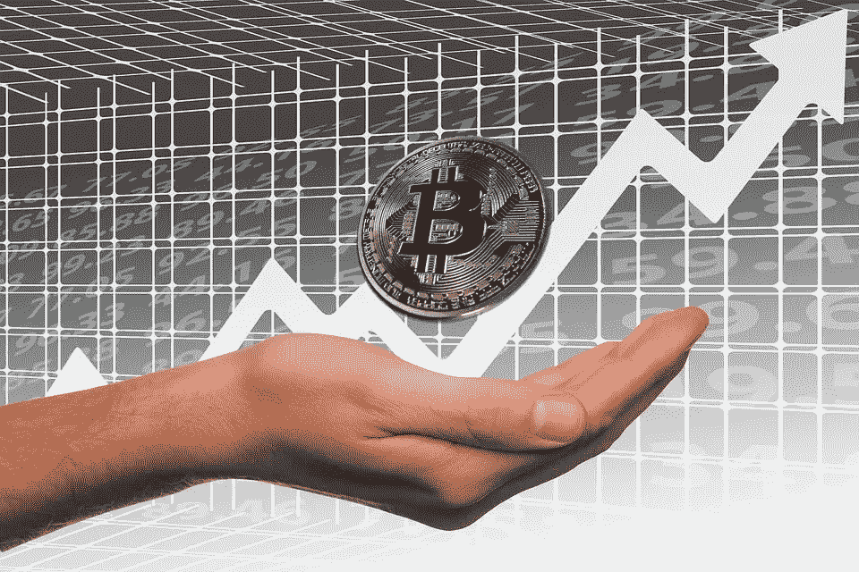

# 加密货币交易所评论:Coinsquare 和 Kucoin

> 原文：<https://medium.com/hackernoon/which-is-the-right-cryptocurrency-exchange-for-you-ecf0cc8f9477>

有很多加密货币交易所，在过去的一两年里有了名副其实的爆发。如何知道哪些适合自己？本文回顾了两个交易所:Coinsquare 交易所和 Kucoin 交易所。两者都很容易使用，并且有合理的交易费用和提现限额。然而，每一个都适合不同类型的交易者。接下来，我会帮你决定哪一个适合你。

With so many new digital exchanges out there how do you know which exchange to use?**Kucoin: The People’s Exchange**

[Kucoin](https://bit.ly/2uhEX0V) 最初总部设在中国。随着政府[对大陆所有交易所的打击](https://www.forbes.com/sites/kenrapoza/2017/11/02/cryptocurrency-exchanges-officially-dead-in-china/)，它迁移到了香港，并一直稳步增长。Kucoin 的做法是在新代币发布后不久就上市(包括空投和赏金代币)。这意味着它目前列出了数百个令牌。其中大多数是 ERC20，但它也有许多其他成熟的替代硬币(Ripple，Litecoin，EOS，NEO，Monero，OMG)。Kucoin 的一个很大的优点是它非常容易使用。界面相当简单，用户不必验证他们的身份提取 2 BTC 或更少。

Kucoin 是一个捡便宜 altcoins 的好地方。交易所上市的许多代币价值 5 美分或更少(你应该在购买任何东西之前做好研究，因为并非所有这些都必然具有巨大的未来潜力)。这意味着新手和那些没有多少密码的人仍然可以进入游戏。

可以说，库币也是出售空投和赏金代币的最佳交易场所。它列出它们的速度很快，但也是有选择性的。Kucoin 很好地审查项目，并列出那些具有坚实潜力的项目(这并不是说它们最终都会增值)。

Kucoin 还定期开展促销活动，任何人都可以从中受益。其中一些是简单的转发/空投式促销。仅仅通过转发 Kucoin 账户上的剩余时间，我就赚了 100-150 美元。库币也定期举办交易比赛。如果你喜欢日内交易或者想尝试一下，这是一个好的开始。对于那些持有空投代币的人来说，这些比赛是赢得更多的好机会。这些特点使库币成为新交易者、空投和赏金猎人的好选择。

**Coinsquare:加拿大的数字货币之家**

在某些方面， [Coinsquare](https://bit.ly/2oh7EZf) 是 Kucoin 的反义词。Coinsquare 面向两个群体:1)新交易者 2)拥有大量资产和投资资本的加密交易者。Coinsquare 并不是一个全新的交易所(它已经存在了几年)，它的独特之处在于用户可以使用法定加拿大货币为自己的账户提供资金。其他供资选择有 BTC、瑞士联邦理工学院、长期合作学院、DOGE、DASH、BCH 和 XRP。像 Kucoin 一样，Coinsquare 对于初学者来说是一个很好的交换，因为它简单易用。界面直观，相对较少的上市硬币使其非常容易上手。Coinsquare 也有一个不错的推荐程序。如果你通过[这个链接](https://bit.ly/2oh7EZf)注册并资助一个账户，你将免费获得 20 美元。

Coinsquare 不同于 Kucoin，它为大投资者提供服务和专门的选择。它最近启动了一项“财富”计划，包括降低费用、快速取款、场外交易和个性化客户服务。“Coinsquare Capital Markets”是一个机构门户网站，提供专有交易技术以及内部设计和构建的订单管理系统。“硬币资本投资管理公司”提供其他类型的投资产品，专注于技术，包括区块链、数字货币、人工智能和机器人。

大型投资者会喜欢 Coinsquare 有 95%冷藏政策这一事实。其系统已经过压力测试和 DDoS 测试。它的分类账每天被管理约 2346 次，以随时跟踪每枚硬币的位置。这一切使得[硬币广场](https://bit.ly/2oh7EZf)成为存放和交易大量数字资产的一个非常安全的地方。对于想用加拿大货币开户的加拿大人来说，这也是一个好地方。

**利润分享**

Coinsquare 和 Kucoin 都有自己的内部令牌。Kucoin 向持有至少 6 KCS 的人支付 KCS，作为平台收取的日常交易费用的一部分。Coinsquare Coin (CSC)是平台上交易的奖励。每笔交易你都会收到一定数量的 CSC，也可以持有或出售。

**总结思路**

Coinsquare 和 Kucoin 都是很好用的优秀交易所。然而，每个都适合不同类型的交易者。Coinsquare 列出的项目比 Kucoin 少，但它列出的硬币却非常可靠。这也是一个伟大的选择，为那些谁想要的资金与加拿大菲亚特帐户。机构投资者、大股东和那些对新兴技术感兴趣的投资产品也会喜欢 Coinsquare。

对于那些不打算使用菲亚特为其账户提供资金和/或不想发送身份证复印件进行验证的人来说，KuCoin 是一个不错的选择。这是出售空投和赏金代币的绝佳场所。它也很容易使用，这使得它比一些分散的选项更有吸引力。那些没有多少数字货币的人也会喜欢 Kucoin，因为它列出了许多廉价的代币，所以你不需要很多资金就可以开始交易。

***免责声明:*** *交易数字货币是有风险的，所以在购买之前一定要做好研究，不要拿你无法承受损失的资金冒险。如果你使用我的链接注册 Coinsquare 或 Kucoin，我将获得一笔小额推荐奖金。*

如果你喜欢我的文章并想了解区块链和加密货币项目，请订阅我的频道 [Medium](/@minadown) 和 [Twitter](https://twitter.com/minad21) 。

如果您对本文有任何疑问，请在下方评论区评论。
谢谢！