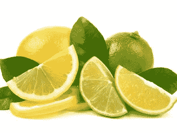
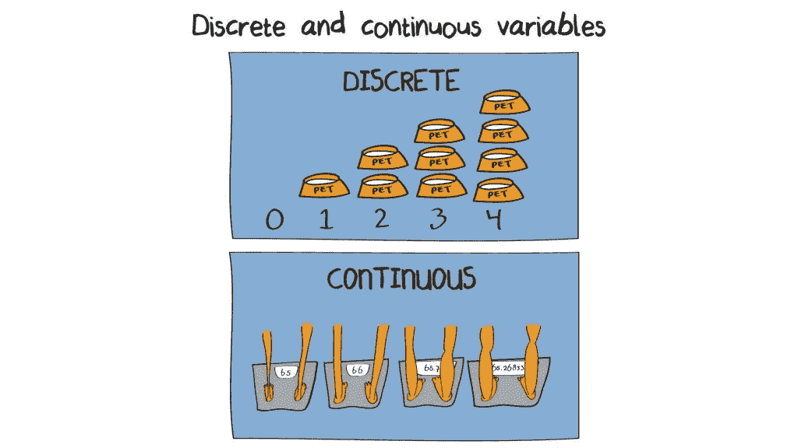
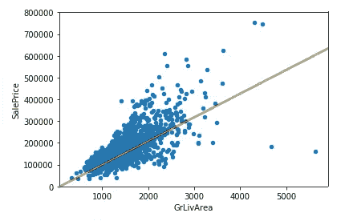
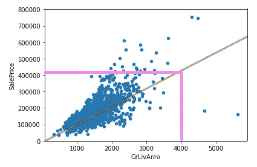
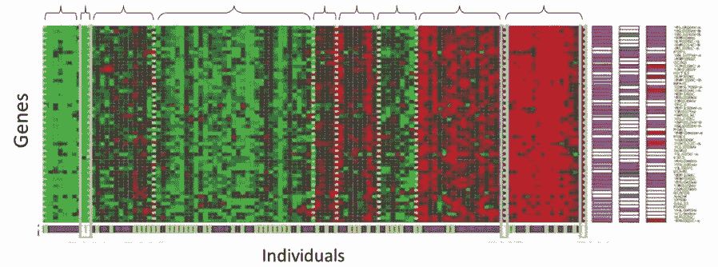

# 学习机器学习，弄清楚为什么尿布和啤酒经常一起卖

> 原文：<https://medium.com/hackernoon/which-type-of-ml-tell-us-diapers-and-beer-often-sale-together-e2be563d7790>

> 这是从最开始介绍机器学习的“机器学习”系列的一部分。更多文章来了！
> 
> [<上一篇文章](https://hackernoon.com/brief-machine-learning-introduction-using-dogs-and-a-tennis-ball-f01d24498350)

已经在会议、聚会或我的第一篇文章中听到过关于机器学习的讨论，并想了解更多？

你在正确的地方，你的第二步将是发现不同类型的机器学习。我会通过很多实际的例子介绍给你。

# 读完之后你会知道什么

人工智能有两种风格:**监督式**和**非监督式**学习。不要以名取人，没有相反的学习方法。

你会选择哪一个取决于你的目的。当您希望模型产生一个公式，从您的数据中预测一个值时，您使用的是监督学习。

否则，如果你的目标不是预测一个值，而是在数据中寻找模式，你将使用无监督的机器学习。

这里有一个图表，它总结了我想在本文中教给你的概念和词汇。

不要担心分类和回归对你来说是陌生的词。后面我会举例介绍。

无论如何，试着猜测这个问题的答案:

> 哪种 ML 可以帮助发现一些物品是否经常一起出售？
> 
> 监督学习还是非监督学习？

# #1 我的水果尝起来是甜的还是酸的？

我知道，使用机器学习来预测你要吃的苹果是甜的还是酸的听起来像:

> 你想要一个香蕉，但你得到的是一只大猩猩拿着香蕉和整个丛林。
> 
> —乔·阿姆斯特朗(工作中的编码员)

尽管如此，这个例子的目的是预测你将要吃的水果是甜的还是酸的。这个目标是非常精确的，你给你的 ML 模型一个水果，它会回答你水果的味道是甜还是酸。

**带分类的监督学习**就是你要找的。

我来解释一下，它是被监督的，因为你想预测一个特定的值。因为这个值不是一个数字，它只能得到一组定义好的值。

Training dataset for our supervised ML

这是我们将给予模型的训练集，以开始它的训练。这看起来像是同一问题的历史，已经用不同的结果问过了，但答案却来了。这就是为什么它被称为训练集，你给出问题和答案进行训练。

你的 ML 模型会在每个问题和它的答案之间寻找任何类型的逻辑。这个环节实际上是函数，它是**假设**函数。

这个训练集的假设如下:

> 这种水果甜吗=这种水果甜的总和/这种水果的总和
> 柠檬:0/2 = 0%是甜的，100%是酸的
> 苹果:3/4 = 75%是甜的，25%是酸的

让我们假设你是一个吃柠檬的人。即使你是柠檬口味的专家，你也会问你的 ML 模型来知道你手里的这个柠檬是不是甜的。感谢它用训练数据编造的假设，它知道 0%是甜的，100%是酸的，所以它的答案将是**酸**。事实上，正如我之前解释的，答案是一个值，而不是一个概率。我的问题不对，一个更好的问题是:“这个柠檬味道怎么样？”

手里拿着一个苹果，答案会是甜的，因为它知道 75%的苹果都有甜味。

I only consider riped lemons, not limes!

我们用来训练分类算法的训练数据集很简单。它还可以包括其他信息，如当前季节和水果颜色。

随着更多的信息和训练集，该模型将能够提高其准确性。

# #2 这栋房子值多少钱？

对于这个例子，你可以忘记水果。你现在进化到一个全新的水平，将尝试估计房价。

目的很明确，你想卖或买房子，但你不知道它值多少钱。你有很多关于房产的详细信息的房产广告。这些将是你的 ML 模型的训练数据。

总结一下，你有一套房子，有它的居住面积，你想让你的模型给你它的价格。目标很明确，你要的是一个值，这个值是一个数字，它可以是一个范围内的任何价格。

你必须使用**监督学习和回归**。

因此，*分类*和*回归*之间的区别仅仅在于你所寻找的值可以得到的值的范围。您需要对离散值进行分类，对连续值进行回归。

Discrete values are counted whereas continious value are measured — Image from [Luis Fok](https://www.quora.com/profile/Luis-Fok) on Quora

现在，让我们用我从 Kaggle 得到的[训练数据集](https://www.kaggle.com/c/house-prices-advanced-regression-techniques/data)来填充我们的模型。

顺便说一下，如果你不知道 Kaggle 网站，我强烈建议你去看看。你会发现很多有真实数据集的 ML 竞赛。竞争者也写文章分享他们处理 ML 竞争问题的方法和技术。

Plots sell price with living area

> *销售价格:以美元为单位的销售价格*
> 
> *GrLivArea:居住面积平方英尺*

第一种方法是在图表上所有点的中间画一条直线。数学告诉我们，图上的直线只不过是一个公式，它给出了 y 和 x: `y = f(x) = a * x + b`。

它代表了前一个例子中的**假设**。用房屋居住面积`x`得出房屋价格`y`是一个公式。

Thank’s to the hypothesis you can get either x from y or y from x

假设今天早上你看到一个房产广告，是一个居住面积为 4000 平方英尺的大房产。你想检查它的价格，看看业主没有高估它的房子。

不需要从假设计算`a`和`b`，查图。它估计一套 4000 平方英尺的房产价格约为 40 万美元。

用不同的方法得到假设，可以更精确，回答出截然不同的价格。现在一套 4000 平方英尺的房产，估计价格在 48 万美元左右。

A more accurate hypothesis for this example

ML 模型中使用的从训练数据中学习并创建假设的方法非常重要，它被称为**学习算法**。这个算法选得越好，答案就越准确。

# **#3 扔掉垃圾邮件**

你是否已经问过自己，一些邮件是如何神奇地移动到收件箱的垃圾邮件文件夹中的？神奇的部分实际上是使用机器学习来找出什么使一封电子邮件成为垃圾邮件。

在这种情况下，目标是明确的。我们想知道一封邮件是否是垃圾邮件。这是另一个分类的例子，就像水果的例子一样，只有两种可能的结果*垃圾邮件*或者*非垃圾邮件*。这是一个只使用两个类(或类别)的特殊分类场景。此外，还存在两个以上类别的其他变体。

尽管如此，这还是**有分类的监督学习**。

让我们来概述一下监督机器学习模型是如何工作的:

第一步是**训练步骤**。正如我之前解释的，你必须找到一个包含问题及其答案的训练集。在我们的例子中，它是一个带有电子邮件及其分类的训练集(*垃圾邮件*或*非垃圾邮件*)。

在其训练期间，ML 算法将构建一个名为**假设**的函数，以便能够对任何电子邮件进行分类。

这个训练的目的是最后用一封模型不知道的邮件回答同一个问题。

假设函数将提供给定电子邮件是垃圾邮件的概率。如果这个概率小于 50%，答案将是*不是垃圾邮件*，否则，它就是垃圾邮件，并且它将被移动到垃圾邮件文件夹。

# **#4 什么人用什么买纸尿裤？**

这是机器学习领域最著名的历史之一。这是关于沃尔玛如何利用其客户数据获得一些商业见解。

以下是这个项目的回顾(包括尿布的事情):

> 一段时间以前，沃尔玛决定将来自其积分卡系统的数据与来自其销售点系统的数据结合起来。前者向沃尔玛提供顾客的人口统计数据，后者告诉它那些顾客在哪里、什么时候买了什么。一旦结合，数据被广泛挖掘，许多相关性出现。其中一些是显而易见的；买杜松子酒的人也很可能买滋补品。他们也经常买柠檬。然而，有一个相关性非常突出，因为它太出乎意料了。
> 
> 周五下午，购买尿布的年轻美国男性也有购买啤酒的倾向。没有人预测到这个结果，所以一开始就没有人会问这个问题。因此，这是数据挖掘和查询之间差异的一个很好的例子。

The answer is beer

有趣的故事，不是吗？这里的目标是不明确的，你没有试图找出一些价值。实际上，你甚至没有问题，你关心的只是在数据中找到相关性。

这是**无监督学习**最擅长的。

抱歉让你失望了，但我必须告诉你[这个故事不是真的](https://www.theregister.co.uk/2006/08/15/beer_diapers/)。即使这个故事在大学和演讲中被大量使用。

# **#5 探索你的 DNA**

机器学习不仅用于预测销售额。科学家也在各个领域大量使用它。在这个例子中，我们对许多人进行了 DNA 分析，我们的目标是将人们分成不同的群体。

对于每个个体，你将测量特定基因的表达量。

不要让这张图表难倒你，我们已经快完成了。每个小块都是一个基因。绿色表示这个人有这种基因，红色表示他有这种基因的可能性很低。

这些颜色显示了不同个体拥有或不拥有特定基因的程度。

我们的 ML 模型的目的是从包含每个人的基因程度的数据中按类别收集个体。现在是提问的时候了:

> 在这个例子中使用哪种 ML？
> 
> 监督学习还是非监督学习？

小心，答案可能不是你所期待的。还有，我会继续写另一句话，把答案藏在一段话中间。如果你的答案是监督学习对不起，这是一个陷阱，你掉进去了。别担心，我会给你解释为什么不是正确答案。

实际上，该模型会将个人按类别分组，但这些类别不是在训练数据中预先定义的。

我们的问题不是要知道我们选择的人属于哪一类。目的是找到相似的个体，将他们聚集成群体。

# 在你走之前

你还记得我一开始给你看的这个图表吗？也许不是，但你现在也许能理解上面的所有文字。试试看！

最后总结一下。机器学习的第一步是用**训练集**训练你的模型。感谢这些例子，模型将建立一个**假设函数**来回答我们的问题。

答案的准确性将与训练集的质量和大小密切相关。此外，用于构建假设的学习算法也非常重要。

如果你的训练集充满了有答案的问题，你就做**监督学习**。当答案值连续时，则为**回归**，否则为**分类**。

如果你不知道要问的问题，所以你的训练集不包含问题/答案集，那么你就进行**无监督学习**。

就这样，你对不同种类的机器学习有了一个概述。记住，它可以帮助你解决人类解决不了的问题(或者速度不够快)。

下一篇关于不同类型的 ML 的文章再见。如果你对它感兴趣，请让我知道，别忘了给这篇文章一些👏鼓掌支持我。

> 这是从最开始介绍机器学习的“机器学习”系列的一部分。
> 
> [<上一篇文章](https://hackernoon.com/brief-machine-learning-introduction-using-dogs-and-a-tennis-ball-f01d24498350)

祝你今天开心！玩的开心！