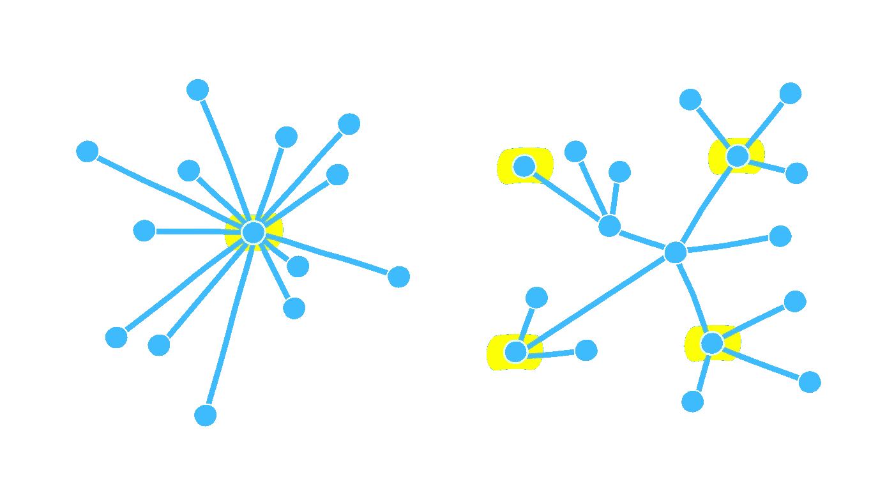

# 四分钟白皮书— Ripple

> 原文：<https://medium.com/hackernoon/whitepaper-in-four-minutes-ripple-a27103e4d265>

*本文是名为*[*info urminds*](http://infourminutes.co/)*的每周系列的一部分。他们每周都会发布一份密码摘要或区块链白皮书。请在此* *订阅* [*。*](https://infourminutes.us14.list-manage.com/subscribe/post?u=94a41e60921ac2e7b1bd1945e&id=c8ed5bd2de)

# 简介:

Ripple 是一种加密货币，旨在通过其实时支付结算系统(RTGS)、货币兑换和汇款网络实现**“快速、可扩展和稳定”**以及几乎免费的任何规模的跨境支付，而没有退款。

Ripple 于 2012 年首次发布，与比特币有着本质的不同。

后者依赖于一个由“矿工”组成的网络，这些矿工运行验证交易并保持网络安全的代码。该网络通过奖励比特币来激励矿工。

但在 Ripple 的情况下，“挖矿”并不会产生新的硬币。所有的**1000 亿枚硬币(XRP)** 都是在 2012 年由网络发行的。XRP 硬币的创造者保留了 200 亿英镑，其余的交给了公司。

从那以后，Ripple 一直在有条不紊地向客户分发代币，但它仍在一个托管账户中持有近 500 亿英镑。

# 这些客户是谁？

本质上，银行和受监管的金融机构。Ripple 的**分布式开源互联网协议共识账本**帮助其客户将 Ripple 整合到他们自己的系统中。

# Ripple 如何工作的一个简单而真实的例子

2018 年 1 月，Ripple 与 MoneyGram(一家跨境汇款公司)合作，money gram 现在使用 XRP，通过使用 **Ripple 的 xRapid 支付网络**来加快和降低汇款成本。

银行间的涟漪转移。

**现状**就是当你送钱(以一种货币；例如，美元)转换为另一种货币(比如说印度卢比)，这种转换需要几个工作日，并涉及多个利益相关方，他们从中获利。

Ripple 通过充当核心货币 XRP 改变了这一局面。

所以现在如果你给你在印度的朋友汇美元，美国银行会用美元换 XRP，然后用 XRP 换印度卢比。

Ripple 是一种核心货币。

相反的过程会发生在印度银行收到美元的时候。

# Ripple 与比特币或以太坊有何不同？

Ripple 的协议共识算法不同于比特币的全节点和以太坊的智能合约。

Ripple 对交易进行验证，并建议其客户使用一系列经过确认的可信参与者来验证他们的交易。也被称为**唯一节点列表(UNL)**；每台服务器都维护一个唯一的节点列表，即一组其他受信任的节点。在确定共识时，只考虑 UNL 的其他成员的投票(与比特币情况下网络上的每个节点相反)。

因此，UNL 代表网络的一个子集，当作为一个整体时，该子集被信任不会共谋来试图欺骗网络。

因此，这让瑞波对 XRP 的内部运作有了更大的控制权。

# 那是真正的去中心化了吗？

加密货币始于反对目前控制着全球金融业大部分的中央监管机构的理念。涟漪被认为是集权的另一种形式，因为大多数硬币由所有者持有，共识由一组固定的节点决定。

集中/分散

但 XRP 绝不是另一个比特币。

Ripple 的大赌注是，XRP 将成为一种“过渡货币”，金融机构用它来结算跨境支付，比现在使用收费较高、流程较慢的全球支付网络更快、更便宜。

比特币也可以做跨境支付，但是每秒只能结算 7 笔交易。以太坊每秒可以结算大约 150 份智能合约。另一方面，Ripple 声称它可以**每秒处理 1500 笔交易:一天 24 小时**，一周 7 天，一年 52 周。

# 很高兴了解波纹共识算法(RPCA):

Ripple Consensus Ledger(Ripple 的所有客户都在使用的东西)旨在允许不同货币之间的价值转移，在不同的做市商之间跳跃。

这种情况的发生没有任何 XRP 的效用。XRP 代币被设计成许多做市商讨价还价的一种方式——因此允许许多交易仅通过一个跳跃点发生:货币 1 → XRP →货币 2。

# 结论:

与比特币、以太坊、Dash 和其他另类硬币不同，Ripple 被多个政府认定为**法定货币**，这使其通过金融机构获得即时流动性，以及对物质商品的购买力。

# 参考资料:

*   [纹波的基波](https://ripple.com/insights/fundamentals-of-xrp/)
*   [Ripple 共识白皮书](https://ripple.com/files/ripple_consensus_whitepaper.pdf)
*   [纹波解决方案](https://ripple.com/files/ripple_solutions_guide.pdf)

*这个故事是 Ankurman Shrestha 写的，最初发表在*[*infour minutes*](https://infourminutes.co/whitepaper/ethereum)*上。*

*要阅读白皮书的每周摘要，请订阅* [*邮件列表*](http://eepurl.com/dkTrvz) *。*

你在推特上吗？请 [*关注我们*](https://twitter.com/infourminutesco) *保持更新。*