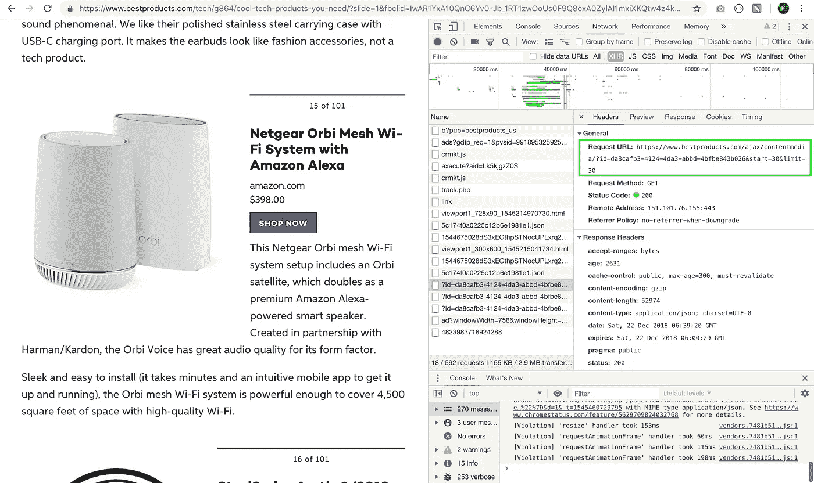
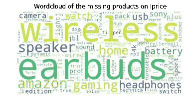
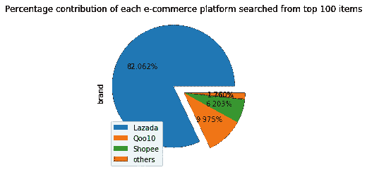
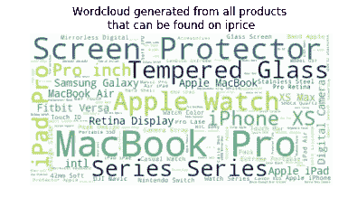
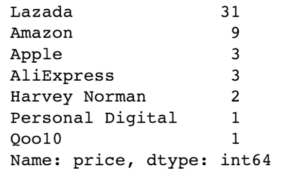

# 谁拥有 Tech 年度 100 强产品？机器学习分析。

> 原文：<https://medium.com/hackernoon/who-carries-techs-top-100-products-of-the-year-a-machine-learning-analysis-11415d4cd746>


# 背景

作为一名初级数据科学家，大多数时候训练数据已经为我训练模型做好了准备(通过访问数据库/提供的外部 csv 文件)。然而，数据集并不总是对我们可用的，我们需要抓取技能来使我们的生活更容易。

# **一日挑战**

我和我的朋友决定开始这个迷你项目，它包含了从搜集到探索的整个过程，最后在 1 天内使用各种机器学习模型进行一些简单的预测，作为对我们自己的一个小挑战。

我们迫不及待地想分享我们的发现，希望你能喜欢阅读它。此外，如果您发现任何不清楚的地方/发现我们遗漏的一些要点，请随时通过下面的评论联系我们！:)

# **目标**

1.  哪个平台提供的最便宜的电子小玩意最多？
2.  iprice 搜索引擎的性能。

# 简介

我们将从 bestproducts.com 的中拆解[**2018**](https://www.bestproducts.com/tech/g864/cool-tech-products-you-need/?slide=1&fbclid=IwAR1YxA10QnC6Yv0-Jb_1RT1zwOoUs0F9Q8cxA0ZylAI1mxiXKQtw4z4k8b4)**100 款最酷的科技产品，并保存到 csv 文件中。这些产品名称将在 iprice.sg 上进行搜索，搜索结果将按照相关顺序进行排序。最后，iprice 在第一页中返回的每个结果的产品名称及其对应的原始价格、折扣百分比、提供的平台和当前价格将被废弃，以供稍后分析和建模。**

**清楚了吗？开始刮吧！**

# **废弃**

**我们将使用 [**Scrapy**](https://doc.scrapy.org/en/latest/) 来抓取数据，我对 Scrapy 很陌生，因为我以前一直使用一个更容易但更重的(在进程运行时消耗内存，更多细节可以参考这个关于 [stackoverflow](https://stackoverflow.com/questions/48535346/why-does-selenium-uses-a-lot-of-memory) 框架的帖子——Selenium。如果你想知道更多关于这两个框架比较的细节，请随意查看我朋友的帖子[这里](/@lowweihong/scrapy-or-selenium-c3efa9df2c06)。**

****我将只关注如何使用项目管道(items.py)** 清理废弃的数据。所以，对于新手来说，先看看这个[帖子【T23:)](/@lowweihong/step-by-step-to-crawl-a-comics-website-using-scrapy-in-5-minutes-b4ccb6ffeed9)**

**-bestproducts.com**

**对于这个网页，点击检查按钮后，所有的产品将被展平，产品名称可以访问。在检查了网络> XHR 之后，我们设法获得了访问 JSON 格式的服务器响应数据的 url！**

****

**A snapshot on where to find the inspected url for the server response data**

**我们使用一个简单的请求 python 脚本来获取 JSON 数据，对其进行处理并存储到一个 csv 文件中，如下所示:**

**-iprice.sg**

**对于 iprice.sg，我们将尝试 Scrapy 框架。我们首先注意到产品的每个容器都存储在 xpath: `//div[@class=' pu product relative no-underline w-50 w-33-m w-25-ol w-20-xl white']`中，因此，我们将使用一个 for 循环来搜索这个容器，并提取以下字段:**

```
loader = ItemLoader(item=IpriceScraperItem(), selector=row, response=response)
loader.add_value('url', response.url)
loader.add_xpath('name', ".//a/figure/figcaption/div[1]")
loader.add_xpath('price', ".//a/figure/figcaption/div[2]/span[[@class](http://twitter.com/class)='accent']/text()")
loader.add_xpath('ori_price', ".//a/figure/figcaption/div[2]/span[[@class](http://twitter.com/class)='f11 lh-11 original strike db mb3']/text()")
loader.add_xpath('brand', ".//a/figure/figcaption/div[3]/div/div/div[[@class](http://twitter.com/class)='s-n gray-dark overflow-hidden f13']/strong/text()")
loader.add_xpath('discount', ".//a/figure/div/span[2]/text()")
```

**注意，我们使用 **ItemLoader** 以指定的格式存储每个废弃的数据，因此它不同于 parse 函数中正常的 yield 用法。**

**要使用 ItemLoader，我们需要在可以在 items.py 中找到的`[Spidername]ScaperItem`类中指定我们想要的格式，如下所示:**

**(* items . py 的目录可以在`projectname_scrapper > spiders > items.py`上找到。)**

**以名字为例:**

```
name = scrapy.Field(
        input_processor = MapCompose(remove_tags, str.strip, clean_name),
        output_processor = TakeFirst() 
        )
```

**`MapCompose:` **将报废值映射到您想要执行的功能**。注意，MapCompose 的输入是**函数**。**

**函数示例:**

*   **`remove_tags`:从废弃值中移除所有 html 标签。**
*   **`str.strip`:去除报废值前后的空格。**
*   **`clean_name`:对报废值执行的自定义功能。**

**`output_processor=TakeFirst()`:告诉 Scrapy 只提取与指定 xpath 匹配的**第一个结果**。**

**是的，我们现在可以通过下面的命令运行 scrapy，并将输出生成一个 csv 文件:**

```
scrapy crawl iprice -o data.csv
```

# **探索性数据分析**

**现在，我们已经收集了所有的数据。清理之后，我们对比了 iprice.sg 和 bestproducts.com 上的报废数据。我们注意到以下见解:**

****搜索结果****

1.  ***IP rice 上缺失的产品***

**来自 bestproducts.com 的 100 种 T21 产品中，只有 63 种能在 iprice 上找到。缺失的产品可以使用 wordscloud 进行总结。我们注意到很多都是音频设备，比如耳塞、耳机和扬声器。**

****

***2。不同电子商务平台的最大贡献***

****Lazada** 是电子产品上从 iprice 搜索最多的平台( **82%** )，其次是 **Qoo10** ( **10%** )和 **Shopee** ( **6.2%** )。**

****

***3。Iprice 上最常见的产品***

**参考下面的 worldcloud，我们可以看到在 Iprice 上可以找到大量的**苹果产品**。这可能是因为苹果产品在新加坡非常普遍。**

****

****IP rice 搜索引擎的性能****

**现在，让我们过滤掉 Iprice 返回的错误结果，例如，搜索“Apple Ipad Pro”将会得到 Apple Ipad Pro 的案例。让我们抛开那些案例，看看更多的见解:**

1.  ***精确匹配结果的百分比***

**我们发现 Iprice 在首页返回的搜索结果的准确率只有**36.21%**——在 1193 个搜索结果中，只有 432 个正是我们感兴趣的商品！(什么？).然而，由于我们手动标记数据以确定一个结果是否正确，我们的标记可能包含人为错误。**

****

**[source](https://me.me/i/it-is-really-confusing-no-three-four-10440248)**

***2。提供大多数最便宜的电子产品的平台***

**最后但同样重要的是，哪个平台总是卖最便宜的电子产品？这实际上是我们这个项目的主要目标。哈哈！**

****答案是= > Lazada！****

**在过滤掉虚假搜索结果后，我们按照*refer _ name*(best products . com 的原产品名称)对所有数据进行分组，然后统计每个平台为每个产品提供最低价格的频率。如下图所示:**

****

> **50 个产品中有 31 个( **62%** )可以在 Lazada 上找到最低价！**

# **结论**

**总之，如果你想买电子产品，Lazada 似乎是最好的选择，因为与新加坡的其他平台相比，你有更高的机会获得最便宜的价格。**

**然而，正如我们意识到的那样，从我们从 bestproducts.com 废弃的前 100 种产品中，大多数都是**苹果产品**，再加上大多数苹果产品都可以在 iprice 上搜索的事实。**

**此外，还有 37 个`refer_name`是我们在 iprice 上找不到的。可能有两个原因。**

1.  **Iprice 搜索引擎不够好。**
2.  **我们的产品名称不够清晰。**

****

**[source](https://www.lynda.com/Business-tutorials/Unconscious-Bias/515183-2.html)**

**感谢通读完，这个项目的 github 资源库可以在这里找到[](https://github.com/KeXin95/top100gadget)**。和..希望你喜欢我的第一篇文章。😊****

****记得我提到过这是我和我朋友一起做的一个合作项目吗？****

****在第二部分中，我们将讨论使用 Jaro-winkle 距离来测试 Iprice 返回的结果，有兴趣吗？[请把这里的**转到我朋友的帖子。**](https://hackernoon.com/analysis-and-machine-learning-prediction-on-top-100-coolest-products-in-2018-part-2-885d9dd9400a)****

******[](https://hackernoon.com/analysis-and-machine-learning-prediction-on-top-100-coolest-products-in-2018-part-2-885d9dd9400a) [## 2018 年 100 款最酷产品的分析与机器学习预测(下)

### l:字符串开头的公共前缀的长度，最多 4 个字符。p:常数比例因子用于…

hackernoon.com](https://hackernoon.com/analysis-and-machine-learning-prediction-on-top-100-coolest-products-in-2018-part-2-885d9dd9400a) 

最后，欢迎在下面发表评论，分享你对这个项目的想法，并在这里[了解我](http://kexinchong.strikingly.com/)雅！:)******