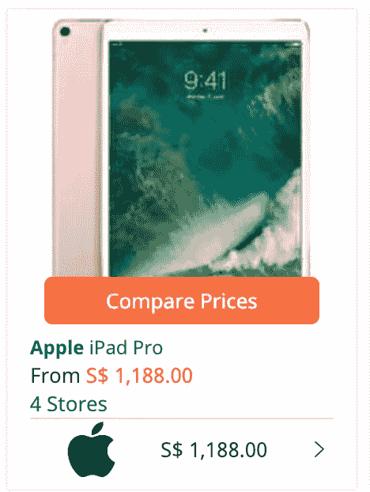
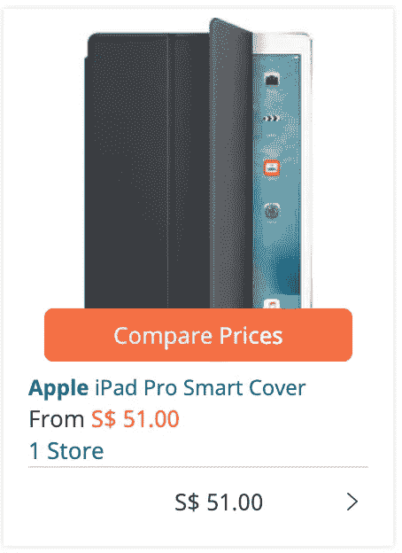
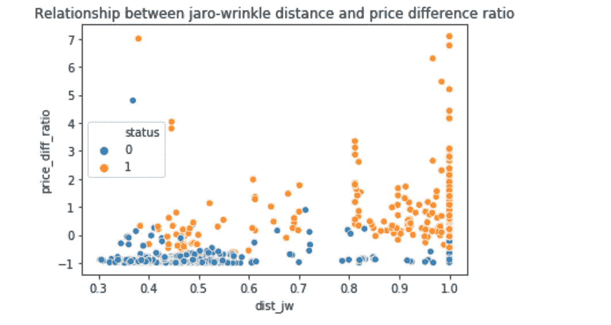
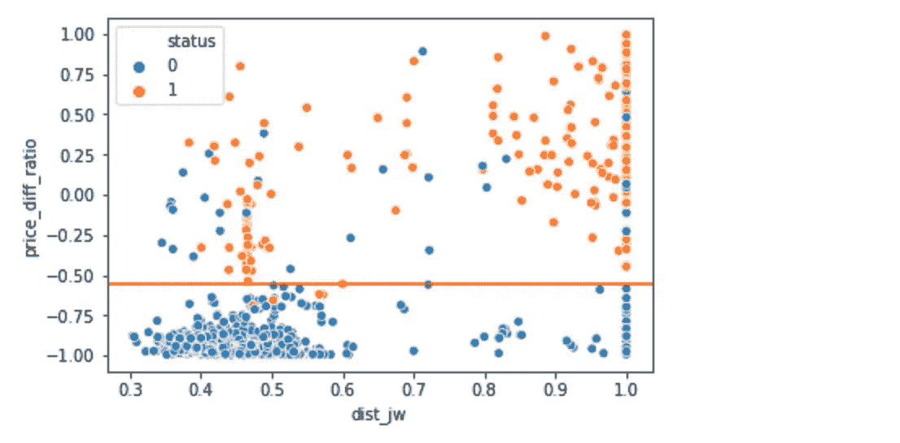
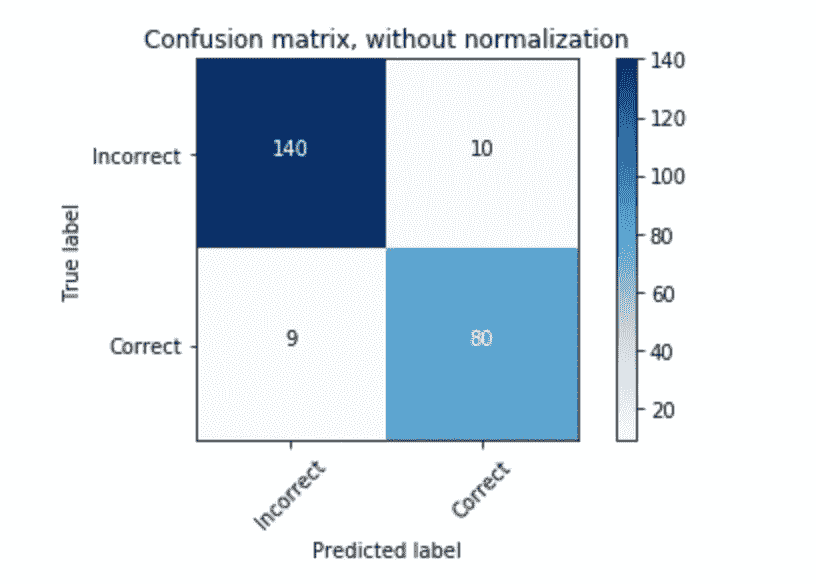
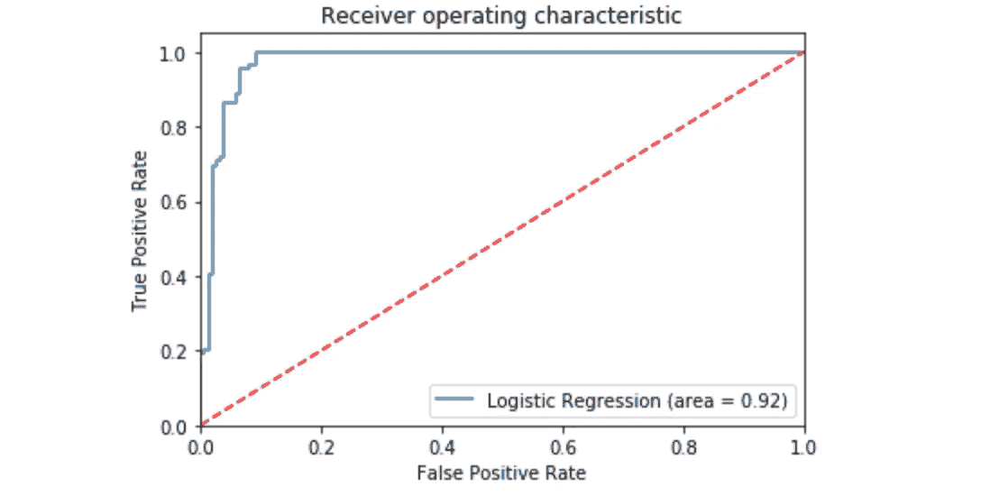
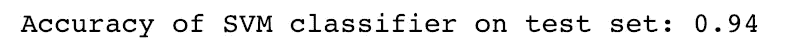
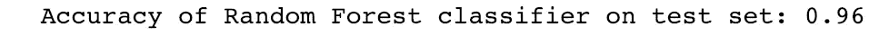

# 谁的年度科技 100 强产品价格最优惠？机器学习分析。

> 原文：<https://medium.com/hackernoon/who-has-the-best-prices-for-techs-top-100-products-of-the-year-a-machine-learning-analysis-885d9dd9400a>

如果你还没有阅读第一部分我朋友的帖子，请在这里阅读，我们将继续讨论项目的剩余部分。


# **延续分析**

我们想预测 iprice 的每个搜索结果是否都符合 100 个最酷的电子产品之一。

我们考虑包括的功能有:

`dist_jw`:Jaro-Winkler 距离

`price_diff_ratio` : ( `price` — `refer_price` ) / `refer_price`

`discount`:折扣百分比

# **Jaro-Wrinkler 距离**

> *“在计算机科学和统计学中，Jaro-Winkler 距离是用于测量两个序列之间的编辑距离的字符串度量。*
> 
> *非正式地说，两个单词之间的 Jaro 距离是将一个单词变为另一个单词所需的单字符换位的最小次数。*
> 
> *Jaro-Winkler 距离使用前缀标度，该标度对从开始就匹配设定前缀长度的字符串给予更有利的评级"*
> 
> *—来源:* [*维基百科*](https://en.wikipedia.org/wiki/Jaro%E2%80%93Winkler_distance) *。*

我们将钻研数学，这样我们就更容易完全理解了！

Jaro 距离定义为:


哇，这看起来很复杂…我更喜欢睡觉…不，我保证在这几个例子之后你会完全理解。

但是首先，我们需要理解这些术语的含义。

> **dj:** *Jaro 距离* **m:** *出现在* s1 *和* s2 中的匹配字符数。**t** *是换位次数的一半(比较 s1 的第 I 个字符和* s2 的第 I 个字符*除以*2*)* **| S1 |***是第一串* **|s2|** *是第二串的长度*

让我们用一个例子来解释数学。

如何计算**脸书**和**火书之间的 jaro 距离？**

```
matching characters       : Febook   -> 6 characters -> m = 6
no transposition needed   : t=0
length of the 1st string  : Facebook -> 8 characters -> |s1| = 8
length of the 2nd string  : Firebook -> 8 characters -> |s2| = 8dj = (1/3)*( (6/8) + (6/8) + ((6-0)/6)) )
dj ~= 0.83Jaro distance = 83%
```

知道了如何计算 Jaro 距离之后，就该明白如何计算 *Jaro-Winkler 距离了！*


***l:*** 字符串开头的常用前缀长度最多为 4 个字符。

**p** :常量比例因子，表示分数因具有共同前缀而向上调整了多少。通常我们使用 p=0.1。

继续前面的案例，比如《火书》和《脸书》

```
dj    : 0.83
prefix: character F -> 1 character -> *l*=1
p     : 0.1dw = 0.83 + 1 * 0.1 * (1-0.83)
dw = 0.847*Jaro-Winkler distance* = 84.7%
```

# **差价率**

创建这个功能的直觉是，我们认为如果产品的价格比*前 100 名最酷产品* ( **关键字**)的价格高或低很多，那么这个产品与我们想要找到的关键字不匹配。

例如，摘自我们的一个关键词:**苹果 Ipad Pro**



Product that **MATCH** our keyword (**Apple Ipad Pro**)



Product that **DO NOT** **MATCH** our keyword (**Apple Ipad Pro**)

`refer_price`苹果 Ipad Pro 的等于 1081 新币左右(使用汇率 1 美元= 1.37 新币)。那么，我们可以根据差价率=(51–1081)/1081 ~ =-0.95 得出结论。

换句话说--> 95%的价格差异`refer_price`和关键字的价格- >在这种情况下，产品与我们的关键字不匹配的可能性很高- > Apple Ipad Pro。

# **计算 *Jaro-Winkler 距离和价差比率***

```
for index,row in data.iterrows():
    data.loc[index,'dist_jw'] = L.jaro_winkler(row['name'], row['refer_name'])

data['price_diff_ratio'] = (data['price']-data['refer_price'])/data['refer_price']
```

# **可视化的 *Jaro-Winkler 距离和价格差异比率***

使用下面的代码，您应该能够重现我们的结果。

```
sns.scatterplot(data=data, x='dist_jw',y='price_diff_ratio', hue='status').set_title("Relationship between jaro-wrinkle distance and price difference ratio")
```



哇！似乎应该存在一个能够区分匹配或不匹配关键字的搜索产品的界限(**状态= 0 或 1** )。

使用下面的代码，我们能够找到区分 status =0 和 1 的最佳水平线，并将其可视化。

```
count_dict = {}
x = min(data['price_diff_ratio'])while x<2:
  temp_data = data
  temp_data['guess'] = [1 if price>=x else 0 for price in       data['price_diff_ratio'] ]
  correct = len(data[temp_data['status'] == temp_data['guess']])
  count_dict[x] = correct
  x = x+0.001boundary_const = [max(count_dict, key=lambda x: count_dict[x])][0]ax = sns.scatterplot(
    data=data[data['price_diff_ratio']<=1], 
    x='dist_jw',y='price_diff_ratio', hue='status')plt.axhline(y=boundary_const, color='r', linestyle='-')
plt.show()
```



从上图中，我们可以看到最好的水平状态分离线大约等于-0.55。

分类规则是:

1.  低于-0.55 将被归类为状态= 0。
2.  高于 0.55 将被归类为状态= 1。

基于以上分类规则，我们将能够获得大约 94%的准确率！我们不应该把这个数字看得太重，因为我们实际上应该只对训练数据应用这个规则，以避免数据泄漏问题。所以这个数字是为了我们后面对机器学习模型预测有个大概的概念。

这种观察给了我们直觉，让我们创建一个机器学习模型来找到最佳边界，这样我们就能够拥有预测能力！

# **为机器学习模型选择特征**

有几种方法来选择要包括在我们的模型中的特征，对于我们的例子，我们使用 ***p 值*** 来选择合适的特征。

什么是 p 值？

> 假设**零假设**为真，找到更多极值的概率。

如果您想了解更多关于 **p 值**的信息，请访问以下链接:

1.  [维基](https://en.wikipedia.org/wiki/P-value)
2.  [StatsDirect](https://www.statsdirect.com/help/basics/p_values.htm)
3.  [博客](http://blog.minitab.com/blog/adventures-in-statistics-2/how-to-correctly-interpret-p-values)

如果变量的 **p 值**小于显著值，则该变量具有统计显著性，反之亦然。我们选择 0.05 作为我们的显著性水平。

首先，我们对`dist_jw`、`price_diff_ratio`和`discount`变量运行 **logit** 模型。关于 **Logit 型号**的**细节**解释，请参考以下链接。

1.  [机器学习掌握](https://machinelearningmastery.com/logistic-regression-for-machine-learning/)
2.  [博客](/datadriveninvestor/machine-learning-model-logistic-regression-5fa4ffde5773) @ plt.figure()
    plot_confusion_matrix(confusion_mat, classes=['Incorrect', 'Correct'], title='Confusion matrix, without normalization')

    总之，239 个测试数据中有 220 个预测正确。没有特定变量具有更高的错误预测率。

    让我们进一步可视化 [ROC 曲线](https://www.medcalc.org/manual/roc-curves.php)。

    > 在受试者工作特征(ROC)曲线中，真阳性率(灵敏度)被绘制成不同截止点的假阳性率(100 特异性)的函数。
    > 
    > ROC 曲线上的每个点代表对应于特定决策阈值的灵敏度/特异性对。
    > 
    > 具有完美区分度(两个分布中没有重叠)的测试具有通过左上角的 ROC 曲线(100%灵敏度，100%特异性)。
    > 
    > 因此，ROC 曲线越靠近左上角，测试的总体准确性越高(Zweig & Campbell，1993)。
    > 
    > ——作者[https://www.medcalc.org/manual/roc-curves.php](https://www.medcalc.org/manual/roc-curves.php)

    ```
    logit_roc_auc = roc_auc_score(y_test, logreg.predict(X_test))
    fpr, tpr, thresholds = roc_curve(y_test, logreg.predict_proba(X_test)[:,1])
    plt.figure()
    plt.plot(fpr, tpr, label='Logistic Regression (area = %0.2f)' % logit_roc_auc)
    plt.plot([0, 1], [0, 1],'r--')
    plt.xlim([0.0, 1.0])
    plt.ylim([0.0, 1.05])
    plt.xlabel('False Positive Rate')
    plt.ylabel('True Positive Rate')
    plt.title('Receiver operating characteristic')
    plt.legend(loc="lower right")
    plt.savefig('Log_ROC')
    plt.show()
    ```

    

    我们可以观察到，对于逻辑回归，ROC 曲线的面积(0.92)接近于 1，这意味着逻辑回归模型的准确性很高！

    **支持向量机用于分类**

    ```
    clf = SVC(kernel='rbf')
    clf.fit(X_train, y_train)y_pred = clf.predict(X_test)
    print('Accuracy of SVM classifier on test set: {:.2f}'.format(clf.score(X_test, y_test)))
    ```

    

    用于分类的支持向量机以 2%的优势击败了我们的基准 92%!

    **随机森林进行分类**

    ```
    clf = RandomForestClassifier(random_state=0)
    clf.fit(X_train, y_train)y_pred = clf.predict(X_test)
    print('Accuracy of Random Forest classifier on test set: {:.2f}'.format(clf.score(X_test, y_test)))
    ```

    

    随机森林分类以 4%的优势击败了我们的基准 92%，是我们测试的三个模型中最好的机器学习模型。我们可以做到 **96%** 不需要任何机器学习模型的微调。**意思是如果我们能够创建一个好的特征，我们实际上不需要花费很多时间来微调我们的模型以达到理想的精度！**

    # **进一步改进**

    1.  包括更多变量，例如每个关键词的喜欢、评论和评级。
    2.  对每个关键字执行更多的字符串操作，为我们的分析和建模获得更多的搜索结果。

    ## 也阅读

    [](https://hackernoon.com/who-carries-techs-top-100-products-of-the-year-a-machine-learning-analysis-11415d4cd746) [## 谁拥有 Tech 年度 100 强产品？机器学习分析。

    ### 作为一名初级数据科学家，大多数时候训练数据都已经为我训练模型做好了准备(通过访问…

    hackernoon.com](https://hackernoon.com/who-carries-techs-top-100-products-of-the-year-a-machine-learning-analysis-11415d4cd746) 

    ## 编码愉快，欢迎在下面评论。

    如果你想让我们微调我们的机器学习模型，请在下面评论让我们知道！

    代码链接:[百强小工具](https://github.com/KeXin95/top100gadget)

    欢迎 [**联系我**](http://lowweihong.strikingly.com/) 也是:)

    请继续关注我的下一篇文章！