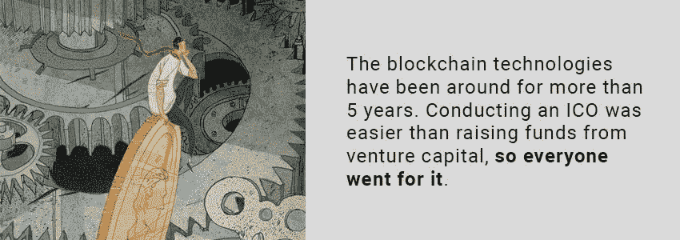
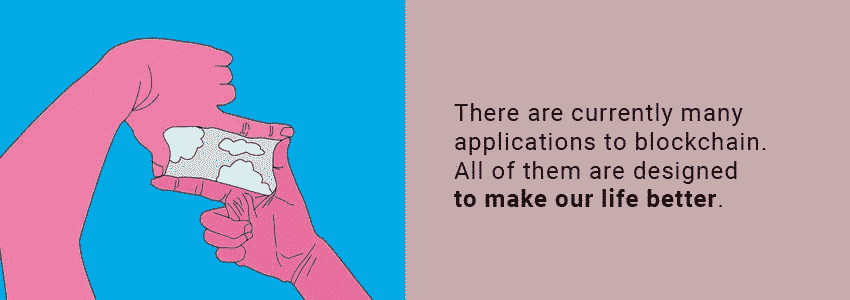

# 谁在做所有的艰苦工作:促进真正区块链采用的前 5 名项目

> 原文：<https://medium.com/hackernoon/who-is-doing-all-the-hard-work-the-top-5-projects-that-promote-real-blockchain-adoption-bb8730f990e4>

对于一项技术来说，采用意味着一切。如果没有人会使用它，任何项目还有什么价值呢？区块链技术现在已经存在五年多了(比特币是在 2009 年[发布的](https://en.wikipedia.org/wiki/Bitcoin))，过去的两年相当激烈，就像类固醇上的众筹。管理一个 ICO 比从风险资本中筹集资金更容易，所以每个人都去争取。

根据 [Coinmarketcap](https://coinmarketcap.com/all/views/all/) 上的硬币总数，在过去两年中，出现了 1700 多个项目。他们中的更多人没有进入 CMC，因为他们中的大多数人[没有通过](https://news.bitcoin.com/46-last-years-icos-failed-already/)。据统计，2 月份死亡项目的比例超过 46%，其中大部分在 [4 个月](https://www.coindesk.com/over-half-of-icos-fail-within-4-months-suggests-us-study/)内失败。但是这是否意味着他们中没有一个会交付一个工作产品，从而使我们看不到真实世界的区块链用例呢？一点也不！以下是区块链项目的列表，这些项目几乎肯定会成功，为区块链技术带来大规模应用。

# 奥米塞戈

OmiseGo 是支付提供商 Omise T1 的一个项目，目前每年处理超过 300 亿美元的 T2 交易。它的目标是“解除银行存款”，消除为支付某些东西而开立银行账户的需要。这个想法是，你不需要有一个银行账户来存储你的钱，你可以把它存储在区块链上。你所需要做的就是一部手机和当地商店的自动取款机来存款和取款。与此同时，Omise 希望创建一个[全球交易所](http://www.tristone-llc.com/omisego-the-global-standard-for-exchange-and-payments/)，它将允许任何种类的法定货币、加密货币、代币，甚至企业奖励积分使用区块链进行即时互换，并且在此过程中只需支付很少的费用。由 Visa 处理的每一笔交易，当商户接受时，都要支付 1% — 1.5%的费用。通过使用 OMG 网络，他们可以将成本削减到 0.5 甚至 0.1%(费用会[动态](/wespostdotcom/omisego-admits-to-no-control-over-fee-structure-200f77e13d38))，从而节省数百万甚至数十亿。这听起来很容易，但事实并非如此。

按照设计，OMG 将是一个[等离子体](/@argongroup/ethereum-plasma-explained-608720d3c60e)的实现——一个超快速以太坊第二层。在其全部潜力中，Plasma 可以实现每秒[百万次交易](https://www.ccn.com/vitalik-buterin-ethereum-will-eventually-achieve-1-million-transactions-per-second/)，但是当 OMG 项目开始时，还没有一个工作的 Plasma 平台，所以他们必须建立一个，帮助以太坊在这个过程中扩大规模。奥米塞格的团队与 Vitalik Buterin 和《闪电网络》的作者 Joseph Poon 合作。

此外，团队[从一开始就收购了](https://blog.omisego.network/strategy-vol-02-89a4d8476eed)几家交易所以获得流动性。这里的目标是激励桩，因为桩通过验证块来保护网络。他们收取所有费用作为报酬。量越多，大家的费用就越多。OmiseGo 已经有了自己的客户，他们将在发布后使用该网络，并且他们签署了 NDA 领导下的一些大型合作伙伴关系，因此他们的未来看起来很光明。Vitalik Buterin 曾经[说过](https://twitter.com/VitalikButerin/status/940429788673536000)OMG token 模型是他的最爱。这可能是因为网络的令牌具有真正的效用——没有它们，网络根本无法运行。

# 毫微；纤（10 的负九次方）

专门为支付而创建的加密货币的主要特征之一是其费用。你花在学费上的钱越少，你留给自己的钱就越多。正如我们在前面的例子中看到的，区块链有助于降低费用。但是有一种更便宜的技术——[DAG](https://www.forbes.com/sites/shermanlee/2018/01/22/explaining-directed-acylic-graph-dag-the-real-blockchain-3-0/#33db1e59180b)(有向无环图)。DAG 是可以同时处理的块序列或事务序列。有各种 DAG 货币——[NANO](https://nano.org/en)、 [Byteball](https://byteball.org/) 、 [Dagcoin](https://dagcoin.org/) 、 [IOTA](https://www.iota.org/) (我们将在文章的后面谈到这一个)——它们都有一个共同的特征；每个用户确认自己的交易，因此不需要矿工或伪造者的昂贵的采矿权，因此不需要支付费用。DAG 货币是没有感觉的。

其中一个是 NANO，原名 RaiBlocks。它有一个块格架构，所以每个用户都有自己的块，其中写有余额。当交易发生时，余额得到更新。每个用户都提供验证自己交易的计算能力，而且几乎不需要任何成本——Nano 每次交易只需要 [0.112 W](https://cryptodisrupt.com/nano-is-found-to-be-significantly-more-eco-friendly-than-bitcoin/) ，比比特币所需的(每次交易 950 kW)少 850 万倍，使整个网络变得环保。

关于纳米最有趣的是，它实际上被用于恶性通货膨胀的贫穷国家，比如委内瑞拉。委内瑞拉人每天都在[积极使用加密技术](https://cryptoinsider.21mil.com/heres-venezuelans-use-bitcoin-daily-lives/)，因为他们自己的货币玻利瓦尔每天都在贬值。

Reddit 上有一个故事，用户[向一位委内瑞拉 redditor 捐赠了](https://www.ccn.com/venezuelan-crypto-enthusiast-buys-102-kilos-of-food-from-nano-donations-amid-hyperinflation/) 230 纳米，他说 0.5 纳米相当于他一个月的工资。他用它从商人那里购买了 102 公斤的食物，在这个过程中支付了 29 纳。然后他与家人、朋友和邻居分享。这位名叫赫克托的用户在[的采访](https://cryptovest.com/news/interview-how-nano-community-and-brave-venezuelan-helped-save-people-from-starvation/)中解释说，1 纳米(2.6 美元)可以买到以下东西中的一种:2 公斤玉米粉、1 公斤肉、13 个鸡蛋、2 公斤大米、0.5 公斤奶粉、1 升食用油、100 片扑热息痛或对乙酰氨基酚、2-3 片抗生素、8 卷卫生纸、1 瓶 700 毫升洗发水或 2 支除臭剂。

根据赫克托的说法，纳米在委内瑞拉不像比特币那样受欢迎，但纳米社区在那里很活跃，正在发展，商人也接受它。对于这些贫穷的国家来说，零费用是一件好事，所以 NANO 帮助他们生活得稍微好一点。

# 社会公益项目

区块链行业的许多人都关心社会，这也是[社会公益项目](https://socialgood-foundation.com)的目的。SocialGood 项目鼓励参与并持有硬币。该系统的设计是这样的，每次你从授权商家那里购买社会公益生态系统中的东西，你都可以获得现金返还。持有越多，返现率越高。

SocialGood Project 是金融科技公司 [Ayumi Trust Group](https://socialgood-foundation.com/ayumitrustgroup/) (成立于 2005 年)的一个分拆项目，现在的口号是“加密货币让社会更美好”:

*   它在日本金融服务机构注册。
*   它在日本和美国提交了令牌生态系统专利，这是一项基于区块链的技术专利。
*   该团队已经从机构投资者那里筹集了 3000 万美元。
*   社会福利持有者的人数超过了 30，000 人。
*   它与世界一流的商业公司如宝马和奔驰有业务往来。
*   它的下一个目标是日本最大的富裕阶层平台，价值 90 亿美元。

它建立在 [ESG](https://www.unpri.org/pri/about-the-pri) 的原则之上，这是环境、社会和治理的首字母缩写，它目前正在吸引投资行业的注意。这是由前联合国秘书长[科菲·安南](https://en.m.wikipedia.org/wiki/Kofi_Annan)在其《负责任投资原则》中提出的在联合国环境规划署(UNEP)和联合国全球契约(UNGC)推动的 PRI 下，全球已有超过 [1，700](https://www.forbes.com/sites/georgkell/2018/07/11/the-remarkable-rise-of-esg/#e7238516951f) 家机构投资者和管理公司签署了 [ESG 投资](https://paxworld.com/sustainable-investing/what-is-esg/)。

全球最大的养老基金日本政府养老金投资基金(GPIF)也加入了 ESG。代表着同样的[原则](https://en.wikipedia.org/wiki/Principles_for_Responsible_Investment)，将环境、社会和治理因素融入投资流程和决策制定，如果吸引了同样的资金投资，社会公益有巨大的潜力变得非常大。

像亚马逊一样，它的商业模式依赖于将消费者与公司匹配起来，使用人工智能来找到消费者可能感兴趣的优惠。不同之处在于，社会公益生态系统是分散的，它允许那些无法在亚马逊上列出其服务的企业(如珠宝商、房地产经纪人、律师和理发师)参与生态系统市场，因此其参与者的数量可能会非常大。

# 极微小

每年我们身边都有越来越多的智能设备。现在我们有 12 亿人口，到 2020 年，这个数字将超过 T2 的 310 亿人口。

[亚马逊 Alexa](https://www.amazon.com/Amazon-Echo-And-Alexa-Devices/b?ie=UTF8&node=9818047011) 是最明显的例子，但还有很多。无人驾驶汽车、智能家居、智能作物系统——所有这一切都要归功于连接这些设备的[物联网](https://en.wikipedia.org/wiki/Internet_of_things)。但是所有这些设备必须有一个协议来统一它们。一个这样的候选是 IOTA。IOTA 是另一种 DAG 货币或协议(随你怎么称呼)。它也没有感觉，就像 NANO 一样，它是为物联网而构建的。

[IOTA 基金会](https://iotasupport.com/foundation.shtml)是可信物联网联盟的一部分，与[博世](https://www.ccn.com/bosch-bets-big-on-iota/)和思科合作，将 IOTA 与他们的设备集成。

汽车制造商可以通过使用它节省大量成本。对空中(OTA)车辆数据管理的行业预测表明，该技术可以在未来五年内为汽车制造商节省 350 亿美元，节省大量必须手动完成的软件更新。通过整合 IOTA，这项任务可以远程完成。IOTA 目前与大众和保时捷以及福特、通用、宝马和雷诺都有合作关系——几乎都包括在内！

智慧城市也可以通过使用它来建设。台北想要用 IOTA 来建造它。IOTA 参与的另一个智能城市项目是[+city exchange 项目](https://blog.iota.org/green-light-from-the-eu-commission-for-iota-and-the-european-smart-city-consortium-cityxchange-f7928aef33ac)，该项目获得了欧盟委员会的拨款，将把五个欧洲城市转变为智能城市。我们真的需要更多关于 IOTA 用例的证据吗？这是大规模的全球采用。

# POWR

能源市场发展非常迅速。太阳能、风能和天然气能源生产以及消费者需求都在增长。2015 年，全球市场价值 1.3 万亿美元，并且还在继续增长。

当前的问题是能源的非最优分配，这是区块链可以解决的，为能源市场提供了一个真正的用例。像[电力台账](https://powerledger.io/)这样的项目就是 P2P 能源交易的平台，大家可以根据需求买卖能源。

区块链技术代表了消除中间人的原则。就能源市场而言，原理是一样的。在能源供应链中，你允许生产商向消费者出售能源。例如，如果你的草坪上安装了太阳能电池板，并且这片草坪上总是阳光明媚，那么你可以将剩余的能源卖给邻居。它允许能源自由交易，为市场打开了全新的模式，消除了当前能源分配模式的低效率，减少了电力浪费。

POWR 自 2016 年开始运营，现在它每天都被用于世界各地的能源交易:在日本，在泰国，在北美，它运营着澳大利亚最大的能源平台之一。

能源市场现在很热，随着区块链的使用，它将进一步发展。IBM 副总裁 Stephen call ahan[声称](https://hackernoon.com/blockchain-in-the-energy-market-what-are-the-experts-saying-86e55f754a2a):“互联网为通信做了什么，区块链将为可信交易做什么，能源和公用事业行业也不例外。”

正如我们所看到的，区块链目前有几种应用，它们都是为了让我们的生活更美好。所有这些都在帮助人们通过采用它来省钱，甚至有所收获。不是每个项目都是骗局。当然，有一些欺诈性的 ico 只是梦想着带着偷来的钱消失在夕阳下。但那些成功交付产品的人将改变社会，并帮助每个人塑造一个更美好的未来。

## 关于作者:

基里尔·希洛夫——geek forge . io 和 Howtotoken.com 的创始人。采访全球 10，000 名顶尖专家，他们揭示了通往技术奇点的道路上最大的问题。加入我的**# 10k QA challenge:**[geek forge 公式](https://formula.geekforge.io/)。