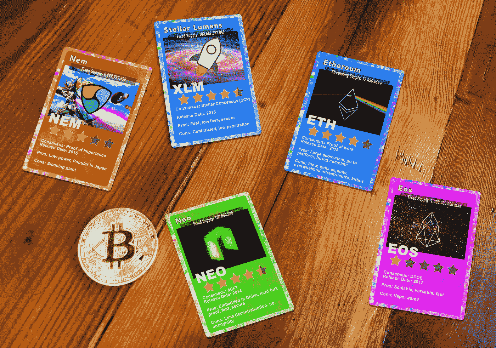
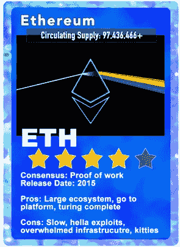
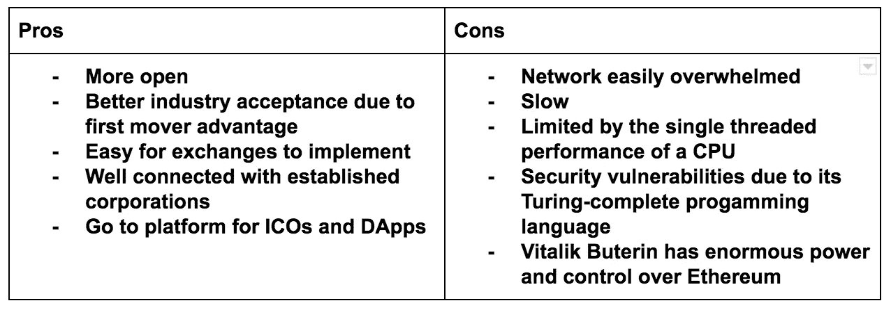
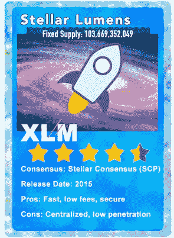
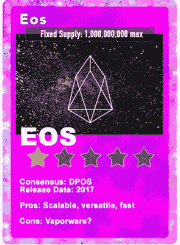
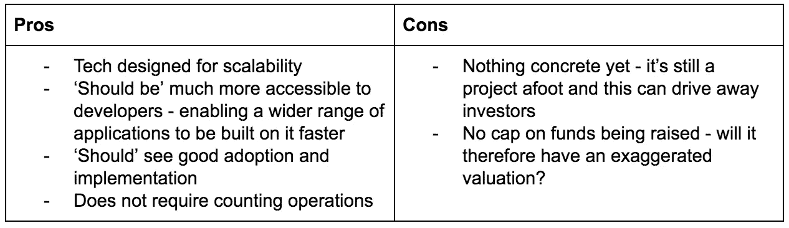
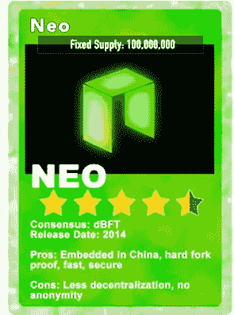
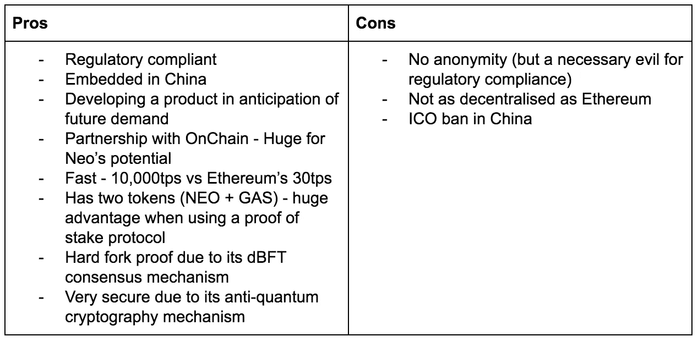
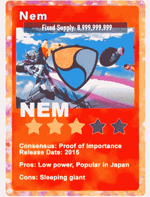
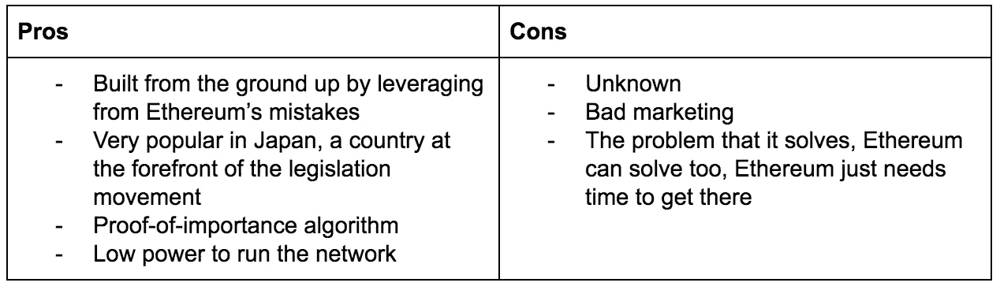

# 区块链下一个微软是谁？

> 原文：<https://medium.com/hackernoon/who-is-the-next-microsoft-in-blockchain-d81771539ccc>

## 生态系统正在竞相创造新的创业一代背后的经济动力

1983 年 11 月，微软花了两年时间发布了 Windows 1.0，20 年后，微软以超过 90%的市场份额统治了个人电脑市场。区块链生态系统正处于婴儿期，目前他们正在一决雌雄，但其中一个肯定会产生与微软类似的巨大影响——它甚至可能还不存在。今天，区块链仍在成长(它位于 Windows 1.0 之前的领地)。当然，它会成长，而且会很快，因为区块链对于资产就像互联网对于内容一样——有史以来第一次，你可以在没有中介的情况下，将价值从一个地方瞬间转移到世界的另一端。虽然今天区块链仅占全球 GDP 的很小一部分(0.025%或 200 亿美元)，但瑞银分析师估计，到 2027 年，区块链可能成为 3000 亿至 4000 亿美元的全球产业。因此，不管人们对比特币怎么说，区块链已经存在了。

## 一场公平的竞赛…

一个全新的区块链类别正在萌芽和发展——这些类别将越来越具有可扩展性、性能和内置治理，因此可以在没有任何恶意硬分叉的情况下做出决策。这些新一代的区块链已经将应用程序从平台上解耦，表现为通用平台。因此，你可以在它们的基础上建立一种货币，比如比特币，或者你可以在它们的基础上建立一个社交网络，一个乘车共享应用程序，一个股票交易所或一个身份管理系统。

> 然而，目前在区块链没有品牌忠诚度。所以这是一场军备竞赛——谁做得更好，谁就赢了。

以下所有平台在管理方式、提供的服务以及社区的规模和实力方面都有所不同。看看这将如何发展会很有趣。互联网将很快变得非常不同，这在很大程度上取决于目前正在展开的战斗。

# 竞争者

那么谁会参加比赛呢？分散平台的顶级竞争者是[以太坊](https://hackernoon.com/tagged/ethereum)、Stellar、EOS、NEO 和 NEM。以下是你需要知道的…

# 以太坊

**Vitalik Buterin —** 来自多伦多的联合创始人和程序员。同年，他与人合作创办了在线新闻网站《比特币杂志》

**Gavin Wood —** 联合创始人兼前首席技术官。他继续创立了奇偶技术。加文还帮助创建或建议:GridSingularity，区块链资本，Polychain 资本，Melonport

以太坊是第一个去中心化的平台，它为下一代铺平了道路。密码世界对以太坊过于兴奋，因为它开启了新的可能性领域。虽然以太坊有大量的支持者，但热情已经超过了技术的发展。把它想象成 AOL 或 Bebo:去种子。以太坊模仿了比特币的许多设计模式，如工作证明共识算法，因此继承了比特币的许多缺陷；它运行缓慢，耗电量惊人。一个名为 CryptoKitties 的应用程序最近已经让以太坊网络屈服了。与此同时，以太坊的矿工已经比塞浦路斯这样的小国用了更多的电。与比特币一样，以太坊也没有内置于区块链中的治理流程。这意味着以太坊社区没有一个好的方法在没有硬分叉的情况下增强他们的协议(或者将以太坊分成两个独立的区块链，一个有增强，一个没有)。从而以太坊和以太坊经典。这给 Vitalik Buterin 的观点留下了巨大的分量，这确实引出了以太坊到底有多分散的问题。

如果以太坊能够解决这些问题并快速升级，它可以保持一个体面的排名，但是它可能必须与更新的技术进行越来越多的竞争，并且它可能只会被用于像托管 ico 或特定智能合同这样的小领域。

# 主要的

杰德·麦卡勒(Jed McCaleb)很可能是唯一一个建立了两家大规模加密货币公司的人。2001 年共同创立 eDonkey(一家 p2p 文件共享公司)。创造了 Mt Gox。创立了 Ripple。
恒星团队吸引了著名的顾问，如*帕特里克·科利森*、 [***山姆·奥特曼***](https://medium.com/u/22acd7905c72)(Y combinator 总裁)和 [***【马特·莫楞威格***](https://medium.com/u/45af3b7db7a9)(WordPress 创始人)。

Stellar 比其他协议便宜得多，也快得多。在 Stellar 上进行 10 万笔交易只需花费 1 美分。它比以太坊更安全——它表达性强但有目的限制的智能合约系统限制了编写可利用代码的潜力。它的简单性使得它非常适合不需要图灵完全智能契约的全部通用性的应用程序(适用于绝大多数 ico 和更复杂的契约)。简而言之，它的高性能，安全和在网络上交易的成本是指数便宜。

恒星区块链上出现的第一个 ICO 是 Mobius . network。Mobius 是由 [David Gobaud](https://medium.com/u/1c8ade53428c) 共同创建的，它是应用程序开发人员的一种中间件，允许创建分散的应用程序，这些应用程序被称为“DApp”，以避免 GooglePlay 和 AppStore 支付通行费，也可以轻松链接到不同的区块链。他们把自己定义为区块链的标志。对于 Mobius 来说，Stellar 提供了一个非常实用的表达水平，与以太坊相比，具有显著更高的安全性和更低的攻击面，加上交易速度和成本非常有吸引力。它在短短两个小时内关闭了其令牌 ICO。

# 黎明的女神

该项目由一家名为 [BlockOne](http://www.block.one/) 的公司开发，由首席技术官**丹·拉里默**(Bitshare 和 Steemit 的联合创始人)和首席执行官 B **任丹·布鲁默**运营。
**布洛克·皮尔斯**是一名合伙人、风险投资家和企业家，他开创了游戏中数字货币的市场。

EOS 是一个区块链智能合同平台，承诺在解决当前区块链理工大学绩效中的一些关键挑战方面取得巨大进步，如用户体验和治理。这里的关键是“承诺”这个词，因为 EOS 仍在开发中，实际上还没有任何具体的东西。

它所承诺的是，通过实现大量的扩展技术，如委托利益证明(DPoS)、并行执行、部分评估和其他优化，实现比以太坊更大的性能提升。它希望成为去中心化应用(d app)领域的真正竞争者，降低开发人员和合作伙伴的准入门槛，并建立一个可以安全平稳地扩展到每秒数千笔交易的平台，同时提供良好的用户体验。为了减少延迟并最大限度地提高性能，它希望在块的生产中使用并行化。[白皮书](https://github.com/EOSIO/Documentation/blob/master/TechnicalWhitePaper.md#accounts)谈到了一种将块分成可以并行运行的线程的方法。有趣的是，加密货币交易所 Bitfinex 刚刚宣布了一个基于 EOS 的新交易所——EOSfinex。[公告](/bitfinex/announcing-eosfinex-69eea273369f)称其选择 EOS 的原因是其快速的交易流程、最低的费用和有吸引力的确认时间。

# 新的

**大洪飞** —创始人
**—核心开发者。由 OnChain 公司**支持。OnChain 的系统被称为 DNA(去中心化网络架构),旨在与中国企业和政府合作。NEO 充当 DNA 的基础。如果 OnChain 能够与中国的企业和政府整合，这将极大地刺激它的采用。****

**绰号“中国以太坊”,因为它是围绕提供一组以平台为中心的底层功能而构建的。2014 年在中国上映。正式名称为“蚂蚁股份”。**

**根据其白皮书，它致力于“使用区块链技术和数字身份来数字化资产，使用智能合同来自我管理数字资产，通过分布式网络实现‘智能经济’”多拗口啊！简而言之，它旨在通过提供一个分散的基础设施来推动智能合同，从而将世界经济体系数字化。NEO 正在从以太坊的错误中学习，因此 NEO 正在开发他们的平台，以满足未来的需求。与此同时，以太坊也在响应新的需求而发展。**

**NEO 嵌入了中国市场，这可能是巨大的，尤其是如果开发得当。嵌入中国将给他们带来巨大的优势。中国巨大的国内市场为科技企业提供了巨大的网络效应，这种效应以如此大的规模存在。中国的科技企业不仅擅长快速扩大规模，政府还保护其新生的科技行业免受外国竞争。然而，就其作为 ICO 平台的功能而言，它还有一些障碍需要克服；中国政府对 ICO 活动的禁令对其活动产生了重大影响，但预计今年在其他国家会有所增加。**

****

# **能母**

****

****Lon Wong**—[nem . io](https://nem.io/)基金会创始会长。他的 NEM 之旅始于 2013 年，当时他决定重新审视区块链科技，此前他在 2010 年接触了比特币采矿
**杰夫·麦克唐纳** —副总裁NEM 自 2015 年以来一直在市场上，在日本这个立法运动的前沿国家拥有大量追随者。所谓的“智能资产区块链”显然能够以每秒 4000 笔交易的速度运行。它能承受相当大的工作量。**

**NEM 不是开采的，而是收获的。当一个账户有 10，000 或更多的 NEM (XEM)时，这些钱自然会按照 NEM 算法归属。NEM 有自己的共识算法。它使用重要性证明。这意味着当用户试图发送硬币时，他的交易列表是根据优先级排列的，许多因素决定了网络上发生的每笔交易的重要性。这可能是用户拥有的硬币数量、用户试图移动的数量以及用户过去频繁交易的数量。您通过持股和交易获得的积分越多，您获得的积分就越多。XEM 用得越多，收获者得到的就越多。这是在 XEM 投资的一个激励因素，因为它将支付自己的费用。**

**有什么不同？其系统允许企业定制和区分其区块链技术——其目的是解决将区块链纳入现有网络的问题。这项壮举被认为既费钱又费时。它试图通过瞄准零售业来超越金融业的界限。它的智能资产系统可以被配置为允许忠诚度积分转化为客户可以使用的一种货币形式。它还提供了使用加密签名作为身份验证服务的能力。**

**有趣的是，NEM 一开始是另一个开源加密货币和支付网络平台 NXT 的分支，但在团队决定重建系统并重点关注规模和速度后，修复了自己的代码库；它从其他所有人的错误中吸取了教训。**

**它的主要合作伙伴之一是马来西亚数字经济公司(MDECC)，这是一家政府所有的机构，负责管理马来西亚的数字基础设施以及安全和技术相关法律。这对 NEM 来说是一个好的开始。**

****

**上述所有人都希望成为互联网区块链主导平台的一部分:去中心化应用、ico 和智能合约。**

**所有这些加密货币的问题在于准入门槛很低。每个月都有新的虚拟货币出现，其中许多都有自己专有的区块链版本。一个更好的版本随时可能出现，夺走微软的桂冠。然而，采用任何可能需要一些时间；区块链已经存在了十年，但可以说它只是在比特币价格飙升时才受到关注——在某种程度上，比特币对于区块链就像雅虎对于互联网一样。所以让我们拭目以待，看看这些球员会有什么表现。**