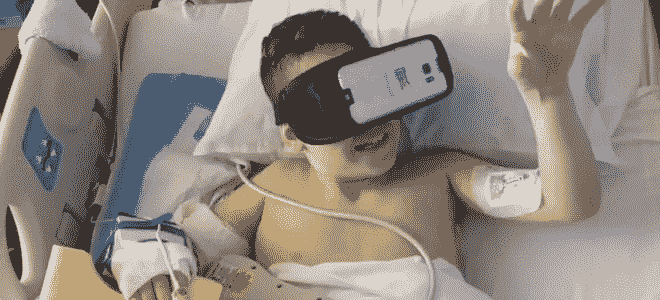
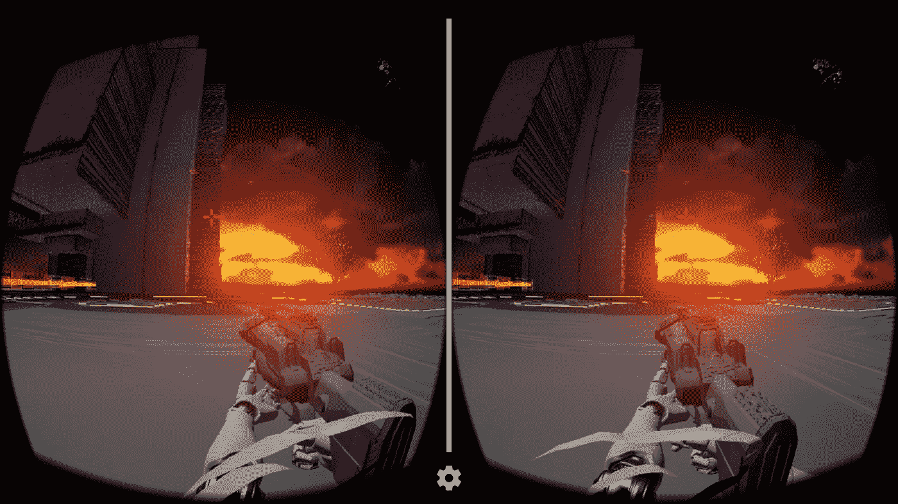
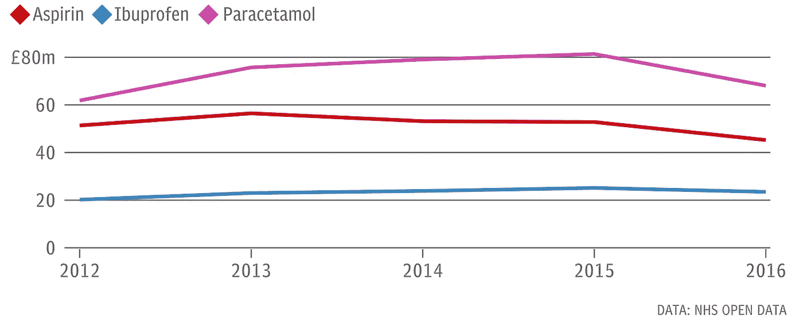
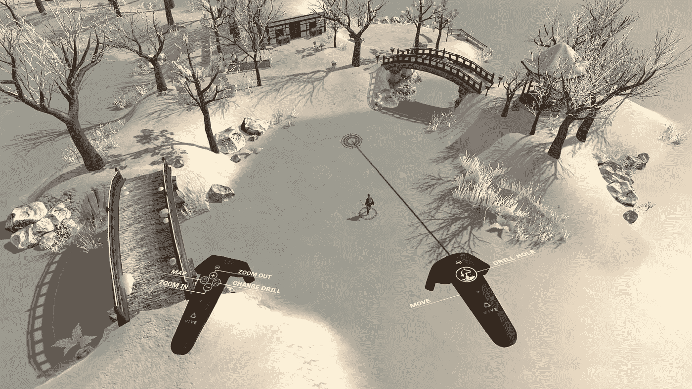
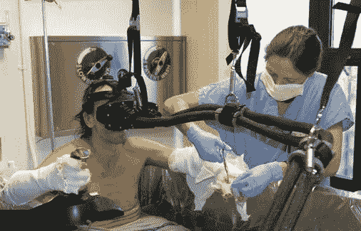
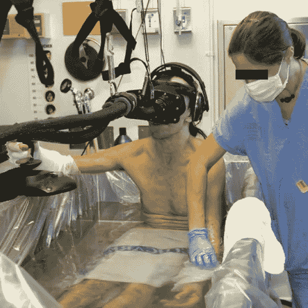
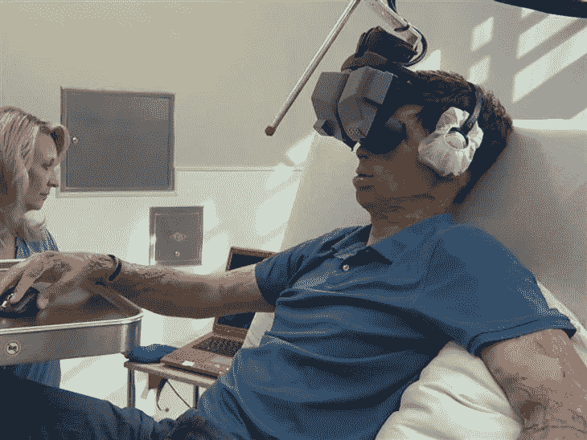

# 有了虚拟现实谁还需要止痛药？

> 原文：<https://medium.com/hackernoon/who-needs-painkillers-when-you-have-virtual-reality-9acd91fceb8b>

Photo by [JESHOOTS.COM](https://unsplash.com/photos/xGtHjC_QNJM?utm_source=unsplash&utm_medium=referral&utm_content=creditCopyText) on [Unsplash](https://unsplash.com/search/photos/virtual-reality?utm_source=unsplash&utm_medium=referral&utm_content=creditCopyText)

在大多数情况下，虚拟现实可以取代止痛药或用作镇静剂。

# 介绍

Image of Blain Baxter from [here](http://blainebaxterracing.com/news.html)

10 岁的布莱恩·巴克斯特在去年的一次卡丁车事故中伤了胳膊。在医院每天痛苦的换药让他如此焦虑，不得不服用镇静剂。不仅镇静剂要花钱，而且布莱恩在镇静剂之前仍然很焦虑。

在斯坦福 Lucile Packard 儿童医院住院两周之后，一个疼痛管理专家小组建议他尝试使用三星 Gear VR 玩游戏。这是如此有效的分散注意力，布莱恩不再需要镇静。

这是虚拟现实在医院中被用来取代镇静剂或止痛药的众多案例之一。在本文中，我们将对此进行更深入的探讨。首先，我们来学习一下 VR 的基础知识。

# VR 是如何工作的？

虚拟现实欺骗你的大脑，让它相信你是在一个 3D 世界里。虚拟现实使用许多不同的方式来实现这一点。VR 做到这一点的第一种方式是使用立体显示器。这是通过向每只眼睛显示世界的两个不同角度来模拟深度的。

Image from [here](https://www.androidauthority.com/virtual-reality-work-702049/)

看这张图片，你可以看到，武器的角度在每一边都略有不同。但是当你戴上耳机玩游戏的时候，一切看起来都很完美。

第二种方法是使用视差。视差意味着一个物体离你越远，它移动得越慢。

其他方式包括遮蔽世界或操纵视野。人类直视时的视野约为 180 度，但眼球运动时为 270 度。

人眼非常善于注意视觉缺陷，隧道视觉就是这种现象的一个例子。即使虚拟现实耳机有 180 度的 FOV，你仍然可以分辨出不同。Vive 和 Rift 都有 110 度的 FOV，Cardboard 有 90 度，GearVR 有 96 度，据传 Daydream 可能有多达 120 度。一般来说，这将极大地影响 VR 体验。

简而言之:虚拟现实有很多方式欺骗你的大脑，让它相信你在一个不同的世界。

这里需要注意的重要一点是，VR 欺骗你的大脑(你)相信你在一个不同的世界。这是非常重要的一点，我们将在本文中反复讨论。

# 对止痛药替代品的需求

NHS(英国国家健康服务)每年花费 1 . 6 亿英镑在非处方止痛药上。

Data from [NHS Open data](http://opendata.nhs.uk/)

当你意识到大多数人可以在当地商店以 0.35 英镑的价格买到这些止痛药时，这尤其令人震惊。国民保健制度正在发放免费药物，在英国任何人都很容易买到。

NHS 提供的其他止痛药，如阿片类药物，对患有慢性病的人效果不佳。使用阿片类止痛药数月甚至数年的人会对药物产生耐药性。这意味着他们需要更高的剂量来达到同样的效果，这导致医院花费更多的钱。罗森奎斯特博士表示，你也可以对常规止痛药产生耐受性。

更不用说阿片类止痛药，每年有 200 万美国人滥用或依赖它们。

止痛药在我们的社会中扮演着重要的角色，但大多数时候人们并不需要处方止痛药。在与一些医生交谈后，他们告诉我，他们主要为一些像轻微头痛这样的小病开止痛药。

# 虚拟现实作为止痛药的替代品

疼痛需要有意识的关注。虚拟现实让患者远离现实世界。它欺骗人们相信他们是在一个全新的世界。当他们的物质意识在另一个世界时，他们从物质身体感受到的痛苦减少了。

研究表明，当患者被虚拟现实分散注意力时，疼痛医疗程序中的疼痛评级会下降 40-50%。

虚拟现实的确切用途取决于对它的需求。如果有人正在经历一个小手术或一些牙科工作，一个三星 Gear VR 和任何游戏应该足以分散他们对疼痛的注意力。

Image from the game Ice Lakes on [Steam](https://store.steampowered.com/app/393430/Ice_Lakes/)

在简单的情况下，游戏本身并不重要。当使用虚拟现实来改变烧伤患者的敷料时，已经表明使用虚拟现实游戏将玩家置于冰冷的环境中有助于减少疼痛。

虚拟现实不是药物，但同时也不是安慰剂效应。安慰剂暗示患者“感觉更好了”,这是药物所没有的。用谷歌字典的话说:

> 安慰剂药物或治疗产生的有益效果，不能归因于安慰剂本身的特性，因此必须归因于患者对该治疗的信任。

医院可以用 VR 作为分散注意力的工具。在大多数情况下，这是一个非常有效的分散注意力的工具。虚拟现实旨在欺骗你的大脑，让它认为你在另一个世界。当你的大脑认为你在另一个世界时，你开始脱离你所在的真实世界。这种脱离是 VR 在现实世界中如此有效的原因。

当然，如果你正在治疗脸上有烧伤的烧伤患者，普通的 VR 头戴设备是不起作用的。你不会想冒险让 VR 头戴式耳机粘在他们的脸上，不得不撕开他们的皮肤才能摘下来。这是事情开始变得昂贵的地方，在某些情况下可能并不那么好。

VR 只有贴在脸上才有作用。如果你能移动你的头并让你的虚拟头移动。

Image from [here](https://www.wired.com/story/opioids-havent-solved-chronic-pain-maybe-virtual-reality-can/)

正因为如此，医院为烧伤患者使用特殊的虚拟现实系统。所用的确切系统取决于患者。以左边的虚拟现实系统为例。这种虚拟现实系统非常独特，可以让护士或医生完成他们的工作。但是，请注意，它仍然要连接到头部。

Image from [here](https://www.wired.com/story/opioids-havent-solved-chronic-pain-maybe-virtual-reality-can/)

在这种情况下，烧伤患者正在接受水处理，以软化疤痕组织并去除死皮。VR 系统和电子产品一样，不太会玩水。所以这个特别设计的系统是为面部烧伤不严重的烧伤患者设计的。

用于治疗烧伤患者的虚拟现实系统最早出现在 21 世纪初。华盛顿大学的研究员亨特·霍夫曼在 21 世纪初发起了第一项疼痛研究。当时，VR 头戴设备重 8 磅，连接到一台小冰箱大小的计算机上。这款 VR 头戴设备价格在 9 万左右。

虚拟现实将把玩家带入一个名为“冰雪世界”的游戏中，该游戏设计为冷蓝色和白色。当医生/护士清理他们的伤口时，烧伤病人经常会重温他们被烧伤的时刻。通过将玩家传送到一个美好、冰冷、清新的世界，患者报告说他们感到的疼痛只有平时的一半。

Image from [here](http://www.vrtherapynews.com/helping-you-with/virtual-reality-therapy-for-pain-management/)

在这种情况下，我们有一个面部烧伤的受害者。虚拟现实耳机的设计是为了让他们沉浸其中，而不是“粘在”他们的脸上。使用的耳机有涂层，不会造成太大的疼痛。

由于这仍是一项相对较新的技术，每款耳机的确切设计和布局都会有所变化。

在早些时候年轻的布莱尔的情况下，一个单一的 Gear VR 足以让他沉浸在另一个世界中，并防止布莱尔需要镇静剂。由于这仍是一项相对较新的技术，每款耳机的确切设计和布局都会有所变化。

# 结论

虚拟现实每天都在改变着人们的生活。技术有能力让世界变得更好。在医院中使用虚拟现实是一个例子，它并不算是相对新的东西，但仍在发挥作用。在这个领域有太多的工作要做，研究显示是积极的。我敦促你，如果你正在寻找一种方法来利用技术对世界产生积极的影响，这是你仍然可以的方法之一。

虚拟现实并不是一个新的课题，但是虚拟现实的应用每天都在扩展。本文简要介绍了虚拟现实技术在医院中的积极应用。

## 你喜欢这篇文章吗？在社交媒体上与我联系，讨论所有与计算机科学相关的事情😁

[推特](https://twitter.com/brandon_skerrit)|[insta gram](http://instagram.com/brandon.codes)|[LinkedIn](https://www.linkedin.com/in/brandonls/)

## 你想要更多的这种内容吗？

加入我的邮件列表，每个月我都会分享你可能没听说过的科技领域最改变世界的事情(别担心，我也讨厌垃圾邮件。没有广告，免费，永远)！👇👇

别忘了点击那个👏拍手声👏按钮，以示感谢！

我写这篇文章没有得到报酬。如果你想支持我，请在下面给我买杯咖啡什么的😁

 [## 用贝宝支付布兰登·斯凯里特。我

### 去 paypal.me/BrandonSkerritt 输入金额。既然是 PayPal，那就简单又安全。没有 PayPal…

www.paypal.me](https://www.paypal.me/brandonskerritt)  [## 通过 Monzo.me 即时支付 Brandon

### 点击链接向布兰登付款。你不需要创建一个账户，而且完全免费。

monzo.me](https://monzo.me/brandonskerritt) 

直到下一次，善待他人，善待自己，

-布兰登