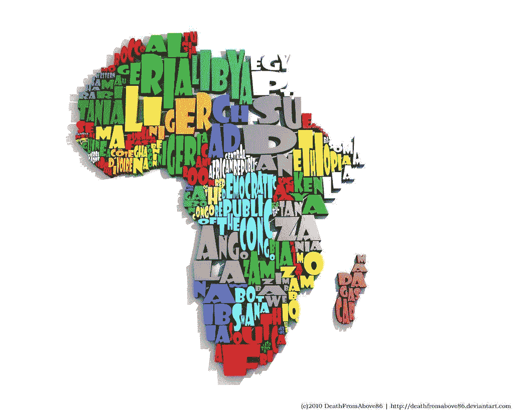
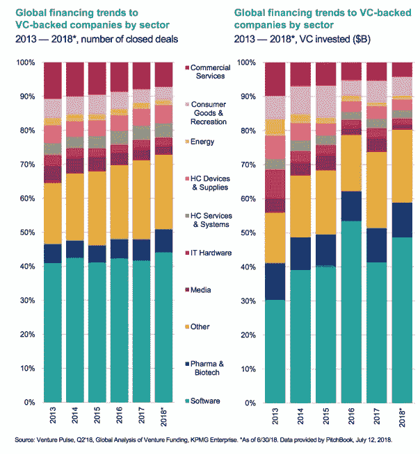
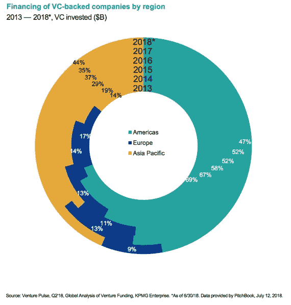
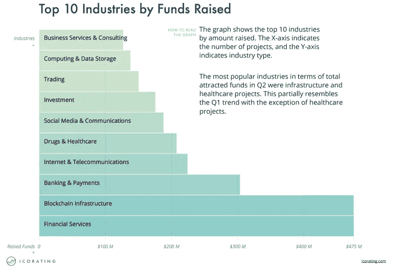
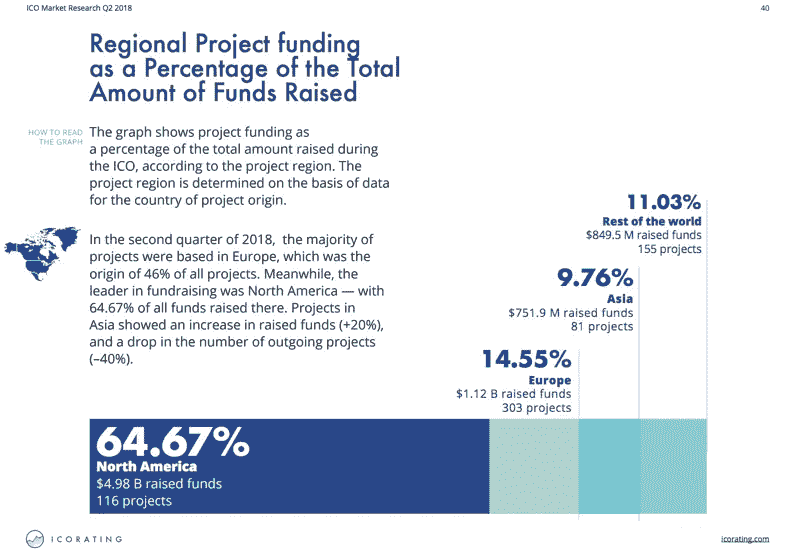

# 谁真正应该做 ICOs？

> 原文：<https://medium.com/hackernoon/who-really-should-be-doing-icos-4df43ef553fb>

## 仔细看看哪些行业获得了风险投资和 ICO 投资

区块链技术的头号用例可以说是首次公开募股(ICO)的概念。在 ICO 出现之前，几乎所有寻求规模化的初创公司都必须通过已有的融资模式来筹集资金，比如风投。

然后出现了一个叫以太坊的区块链和一个叫 ERC20 令牌的东西。基本上，任何具有编码专业知识的人都可以在以太坊网络上创建这些令牌。随着时间的推移和围绕加密货币的大肆宣传，不费吹灰之力就能筹集数百万美元变得如此容易。

# 如何筹集数百万美元的公式

> *ICO =*
> 
> *1。看起来很棒的登陆页面网站*
> 
> **+**
> 
> *2。一份* ***白皮书*** *由几页纸组成，高水平地承诺要搅乱一些事情。*

不需要商业模式，MVP 或原型。在很多情况下，项目背后甚至没有一个合适的团队。即使是 Kickstarter 筹集的资金少得多，也需要付出更大的努力才能运行。

# 为什么是 ICO？

对于许多创业公司来说，为他们的项目筹集大笔资金是一条容易的道路，因为 ICO 模型允许你绕过许多事情，例如:

*   不受监管的市场，几乎没有政府机构的监督
*   接触**散户**。许多司法管辖区只允许创业公司通过被归类为合格投资者的投资者获得资金。在美国，众筹可以让你获得 100 万美元，但如果你想像 EOS 那样筹集 40 亿美元，你该怎么做呢？
*   不需要 MVP 或原型
*   首先筹集资金，然后建立团队
*   不需要回应投资者或任何人的要求
*   跨境众包
*   快速致富

当然，有许多项目真正走上了用区块链技术构建革命性事物的道路。说 90%的 ICO 项目都会失败公平吗？ICO 项目的 ROI 无法准确计算，因为时间还不够。毕竟 ICO 是 2016 年才出现的。会比 VC 里的资助和你在那里得到的回报高吗？看看几年后的投资回报将会是一件有趣的事情。

# 合法的启动资金

看看这些年来的风险投资和他们的投资，并不是所有的初创公司都需要经历 ICO 模式。那些实际意图颠覆某些行业的创业公司可以通过传统方式获得资金。

以下是历年来获得风险投资支持的不同行业的分类:

当我们看这些数字时，几乎所有的 ico 用例都有能力获得资助。大部分都和构建软件 DAPPs 有关。

一些资金不足的行业可能会出现在**能源**、 **IT 硬件**和**媒体**行业。

# **按地区分列的供资**

根据你创业的地点，资金也可能是有限的。这张图表显示了全球资金流向:

大多数资金仍然流向美洲和亚太地区。使得欧洲成为一块较小的蛋糕。

# ICO 基金的去向

看看投资者将资金投入 ICO 项目的地方:

当将上述行业与风险投资资助不足的行业进行比较时，我们可以看到**能源**和 **IT 硬件**行业在更容易进入的 ICO 市场中的代表性仍然不足。**媒体**似乎在 ICO 市场获得了大量资金，尽管它们并没有走上风险投资的道路。

更进一步，看看接受 ICO 资助的地区:

北美是迄今为止 ICO 领域筹集资金最多的地区。这与美国在风险投资方面的投资是一致的。接下来是欧洲，那里的风投资金不足。亚洲似乎只占 9.76%的一小部分。与亚洲在风险投资基金方面的表现相比，他们获得了 44%的份额，这是一个相当明显的差异。非洲如此之小，甚至没有出现在这两张图表上。

# 谁应该做 ICO

为了公平竞争，如果我是一家适合以下领域的初创公司，我会考虑通过 ICO 途径为我的项目获得资金。传统路线可能会提供一些过去的障碍，ICO 路线会更好地服务。

同样，从投资者的角度来看，如果我正在寻找一些有可能造成破坏的 ICO 进行投资，我也会考虑这些因素。当然，应该说，任何 ICO 投资都是目前风险最高的投资之一。像往常一样，当你决定把辛苦赚来的钱投资到哪里时，要做好自己的研究。

如果我是北美一家合法的软件创业公司，我会坚持投资硅谷。

## 1.能源和 IT 硬件行业

一家专注于与**能源**和 **IT 硬件**相关的用例的初创公司，因为它们传统上从风投那里获得的资金较少。

## 2.非洲和南美洲地区

**北美**风投和 ICO 界资金雄厚。亚洲在风投界获得了大量资金，但在 ICO 界却没有。欧洲是一个风投资金流入较少的地区，但他们获得了 ICO 资金的公平份额。

非洲的一个大区域是一个很难获得资金的地区。同样，南美洲的情况也差不多。

因此，一个非洲或南美的初创企业很难获得资金，可能会发现通过 ICO 更容易获得资金。