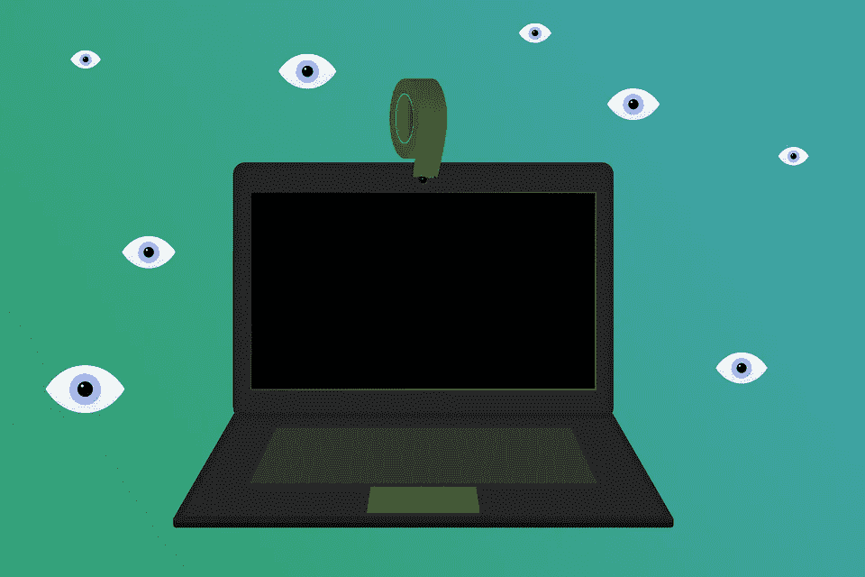
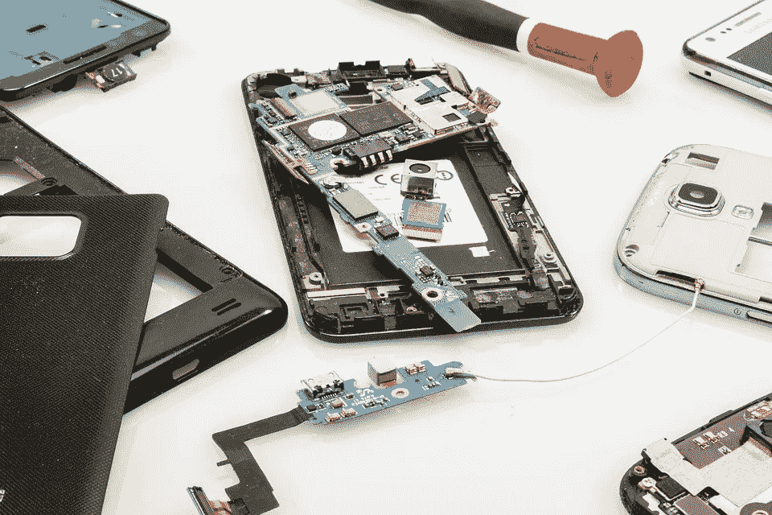
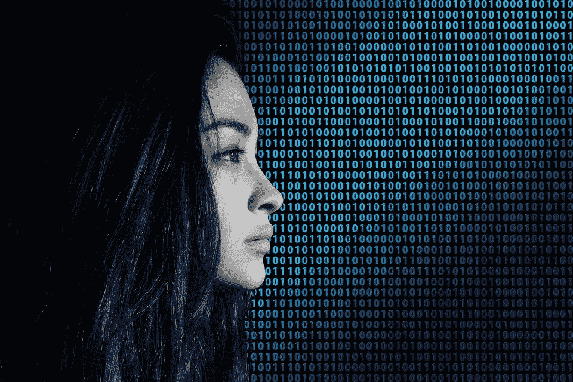

# 谁看着你？

> 原文：<https://medium.com/hackernoon/who-watches-you-26497f9d27da>

我们正处于一个数据隐私成为一个紧迫问题的时代，在这篇文章中，我将讨论一个我大约一年前思考过的问题，隐私问题(以及手机是如何逃脱的)。

如果你在谷歌上搜索*隐私导向*，你不会找到任何关于这篇文章的有意义的东西，所以让我们从:什么是隐私导向？

## 什么是隐私 led？

回想我在英特尔实感集团(一个非常令人兴奋的集团，你可以看到很多很酷的东西)工作的日子，我开始了解隐私 led 这个术语，我们和我们的客户都用它来描述摄像机上的小 led，表示摄像机正在工作，视频正在积极地传输到您的 PC。如今，你可以在每个网络摄像头和笔记本电脑上找到这种 led。

一旦我们进入无人机、机器人和其他设备(如今摄像头无处不在)，隐私 led 的需求就下降了。当它来到网络摄像头和 PC(笔记本电脑上的摄像头被认为是网络摄像头)时，似乎有围绕这个 led 的积极监管。这个规定没有延续到机器人和无人机上。

No photos please

## 为什么隐私 led 很重要？

这个名字本身就说明了这一点，如果有人正在拍摄你的视频，这个 led 表示你同意你的隐私消失。隐私指示灯表明，即使你拥有该设备，该设备也可以被**黑客攻击，失去对该设备的控制并不意味着失去对你隐私的控制。**

这变得更加重要，因为我们每天都在 [dataloop.ai](http://dataloop.ai) 中看到，不再是人而是机器在监视你，他们永远不会登机，永远不会受到摄像机数量的限制，永远不会忘记。

这些天来，脸书在用户数据处理方面受到了激烈的质疑，我相信我们在数据收集和资本化方面只是触及皮毛，不仅是脸书，而是整个科技界。

这种数据的一个很好的例子是一个[网站，提供许多没有改变密码的摄像机](https://www.csoonline.com/article/2844283/microsoft-subnet/peeping-into-73-000-unsecured-security-cameras-thanks-to-default-passwords.html)，也许你也在那里？

如果有一件事是肯定的，那么数据共享**简单性**是必需的，被跟踪的人应该清楚，如果由于某种原因他的设备被黑客攻击，他被跟踪。

看看这张著名的照片，马克·扎克伯格是如何处理他的隐私 led 设置的。

# 两个隐私域

我区分两个隐私领域，因为它们将被非常不同地对待，公共领域和私人领域。

尽管在许多情况下，界限是模糊的，但我相信监管者最终会将每一个案例都归为这一类。

## 个人领域

个人域是您的家庭或设备。这是一个你拥有数据收集权的地方(视频或语音捕捉的时髦说法)。

个人领域应该得到更多的保护，就像网络摄像头通知你他们正在活动一样。我希望监管机构确保每个个人设备都遵守这些规定，**在假设每个设备都可以被黑客攻击的情况下，语音和视频都是如此。**

## 奇怪的例外

为什么手机没有隐私 led？我的感觉是，既然手机是从数码相机开始的，它们已经逃脱了，在手持摄像设备上安装 led 就没有意义了——你选择通过点击一个按钮来曝光，但自从 2000 年手机已经升级为具有嵌入式摄像头的全功能黑客电脑以来，监管没有跟上变化，行业没有动力自己做这件事。

## 公共领域

在公共领域，隐私是死的，习惯它吧。

自 2016 年以来，地球上的摄像头数量超过了人类，并且呈指数级增长。我们正在进入一个到处都有摄像头的时代，它们足够智能，可以监控每个人，并且有足够的计算能力随时监控。所以就像妈妈说的，在公共场合要守规矩。

这可能会走得很远，例如在中国已经有一个大规模监控系统的计划，给每个人一个影响生活方方面面的公共行为评分，该计划(社会信用体系)于 2014 年启动，这些天将上线— [点击这里](https://en.wikipedia.org/wiki/Social_Credit_System)。

在欧盟，监管机构采取了不同的方法，新的 [GDPR](https://en.wikipedia.org/wiki/General_Data_Protection_Regulation) 法规将于 2018 年 5 月生效，以更好地保护个人数据。阿法克 GDPR 不处理隐私发光二极管。

# 隐私指示灯有多安全？

有点…

它非常依赖于制造商和操作系统，但在大多数情况下，下列覆盖之一将起作用:

*   相机设置
*   注册表黑客(Windows)
*   驱动程序设置
*   相机固件(相机本身的代码)黑客攻击。

值得一提的是，苹果 mackbooks 的 led 与电源相连，以上所有内容都无法覆盖隐私 led，但即使是苹果公司也对此事感到有些紧张。你可以说很多关于苹果的事情，但他们确实把用户体验放在首位，包括隐私。

# 摘要

隐私 led 应该在每个个人设备上充分发挥作用，包括视频和声音捕捉。

监管机构应该在我们的个人传感器上应用简单的数据隐私步骤，在个人设备上安装隐私 led，并确保它们是苹果风格的隐私 led。

至于除了你自己的设备和家之外的一切，习惯吧——你被监视着，在一些国家比其他国家更多。