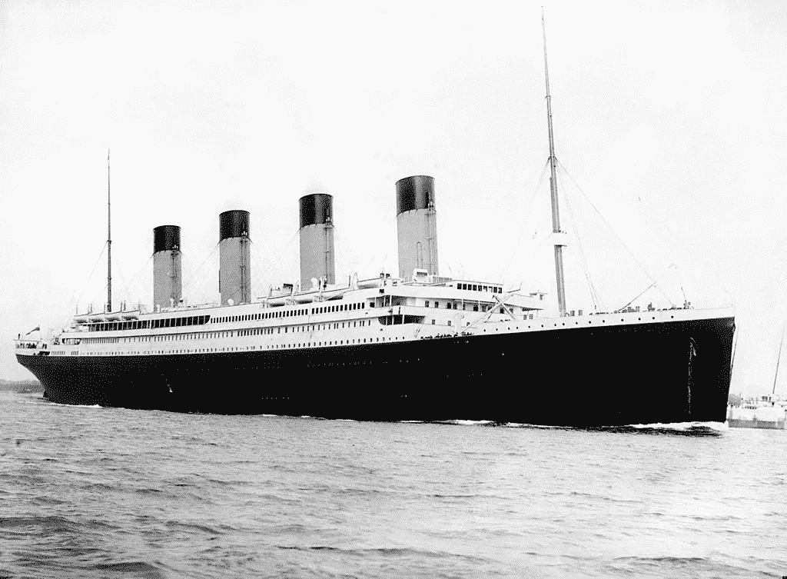
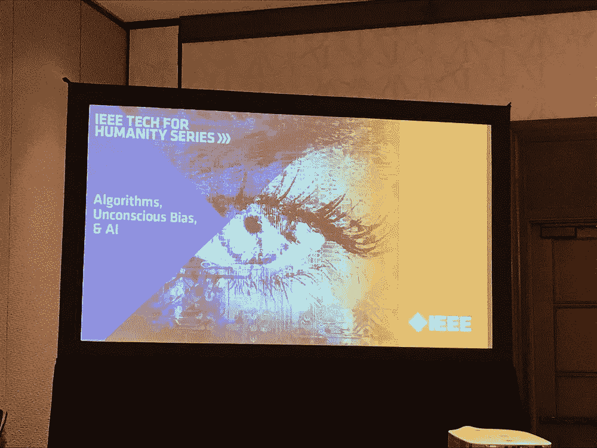
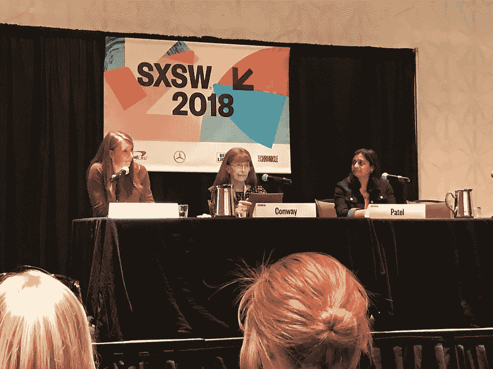
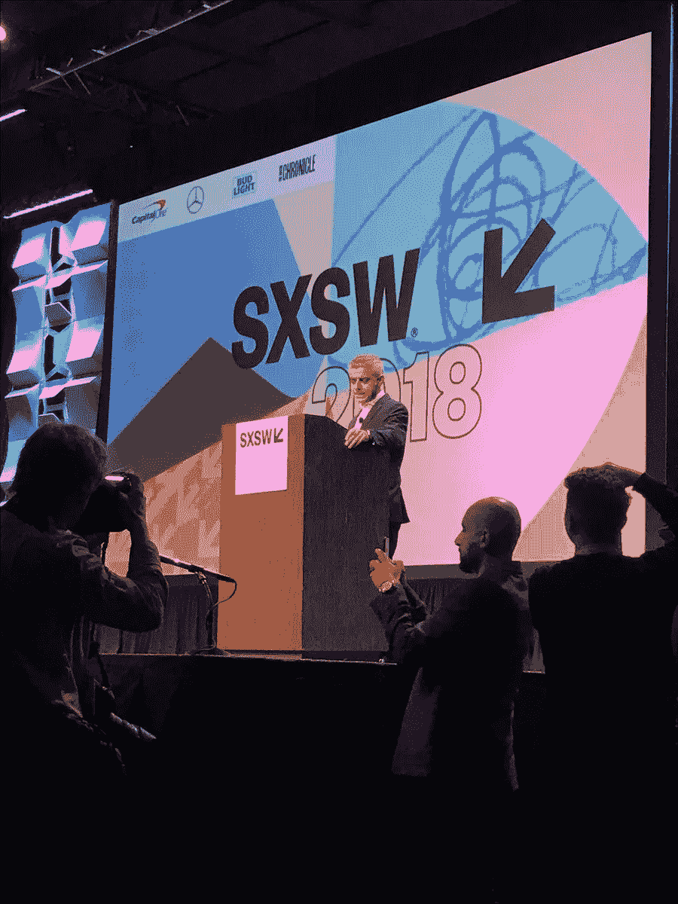
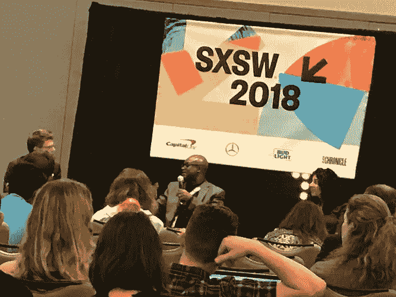
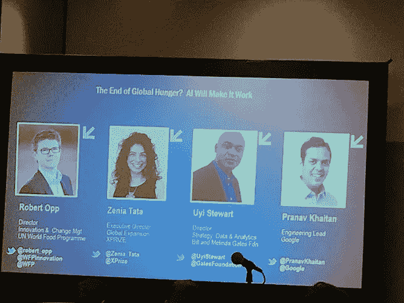
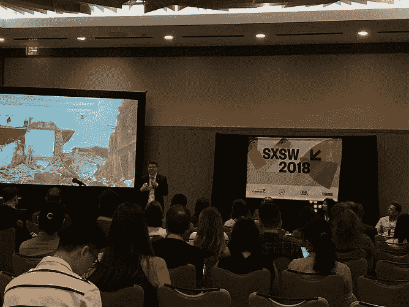
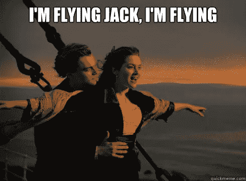

# 下一个 AI 泰坦尼克号沉没谁来负责？

> 原文：<https://medium.com/hackernoon/who-will-be-responsible-for-sinking-the-next-ai-titanic-37a6b801c843>

RMS *Titanic* departing [Southampton](https://en.wikipedia.org/wiki/Southampton) on 10 April 1912

BuzzZZzzzzZZZzzzzzword 滴:[人工智能(AI)](https://en.wikipedia.org/wiki/Artificial_intelligence) 。

今年我看到这个词在 [SXSW 互动](https://www.sxsw.com/festivals/interactive/)周围到处出现。但我认为最引人注目的是我们如何仍然试图理解人工智能，以及它如何帮助或伤害我们。

“人工智能泰坦尼克号”是一个在小组讨论中分享的**优秀**术语，它不是我杜撰的。唉，但愿如此。

美国计算机科学家、电气工程师、发明家和变性活动家琳·康维谈到了即将发生的人工智能泰坦尼克号。

“回到桥梁工程的时代，”她解释道。“公众知道是谁建造了这座桥，这是透明的。但是如果事情出了差错，也有一个明显的罪魁祸首。就人工智能目前的管理方式而言，我们几乎没有公开透明...我们将有一个人工智能泰坦尼克号…事情肯定会出错…这就是我们如何学习的…但是，我们需要小心。”

IEEE Tech for Humanity Series: Algorithms, Unconscious Bias + AI (Nita Patel and Lynn Conway)

我仍然在消化这个小组和我的笔记…这是一场关于我们都持有的无意识偏见的激烈讨论，但开发者和设计师对他们的社会影响负责更重要。

# 真的吗……谁来承担责任？

对于我所有的黑镜粉丝来说，人类的反乌托邦未来可能会比我们想象的更快到来，尤其是在我们目前与技术的关系中。

我讨厌戏剧化…但是剧中描绘的幻想世界很可能会在一夜之间迅速变成现实。我看到我的生活已经发生了多大的变化。

伦敦市长 [Sadiq Khan](https://en.wikipedia.org/wiki/Sadiq_Khan) 来到 SXSW 2018，分享了多个不同的、强有力的信息。

这里的一个关键要点是承担社会责任的主题。

> “例如，后果是——我们在大西洋两岸都经历过——人们担心选举会受到社交媒体的干扰。假新闻引起了人们的关注。有人担心社交媒体会被用来传播仇恨和分裂的信息。我认为科技公司和政治家有责任回应这些担忧。”— [萨迪克·汗](https://en.wikipedia.org/wiki/Sadiq_Khan)

Credit: I took this! #FrontRow

# 这一切都是悲观的吗？号码

我确实想留下一个更令人振奋的消息，关于那些利用人工智能的力量造福人类的人们。

我参加了一个关于人工智能正被积极用于解决和结束世界饥饿的小组会议。通过获得新的、新兴的技术和数据，人工智能准确帮助实地提供者工作的能力是巨大的。

小组讨论会由联合国世界粮食计划署创新和变革管理主任罗伯特·奥普主持。小组成员从他们的 XPRIZE、谷歌、盖茨基金会和联合国 WFP 背景提供了不同的观点。

> " 85%受饥饿影响的人也是最容易遭受灾难的人."

我了解到目前的食品援助项目是如何在非洲和亚洲展开的，但更重要的是，AI 是如何将一个运动工作者的努力扩大到大众的。

> "全球 1/3 的人营养不良."

作为一个谦逊而又对当前竞选工作者的障碍一无所知的人，很高兴看到这么多组织希望合作，共同创新，提出更好的解决方案。

聆听 10，000 英尺和 10 英尺高度的讨论很有启发性。

SXSW Session: The End of Global Hunger? AI Will Make it Work

# **但这仍然不能解决责任问题……**

我知道我们还在学习。

我知道我们仍在构建和发展与技术的关系。

我认为，从政府到科技公司，所有实体都需要从长远角度考虑它们更大的社会影响。当生计危在旦夕时，基于用户的技术-社会行为的设计需要有高度的社会责任感。你正在开发的东西可能会给你的银行账户增加美元，但当它崩溃时，可能会造成更大的伤害。

回到 Lynn 的参考资料，没有一个桥梁工程师在设计和建造他们的桥梁时不考虑交通流量、天气模式、材料属性…有一个更大的变量生态系统需要始终考虑。

当一座桥倒塌或失灵时，他们也拥有 T2 T3。在为人们设计技术产品时，我们需要提高和要求诚信。为了我们的社区。为了我们的人性。为了杰克·道森。

那么你的想法是什么？下面分享一下。这些是我对这件事的简单漫谈。